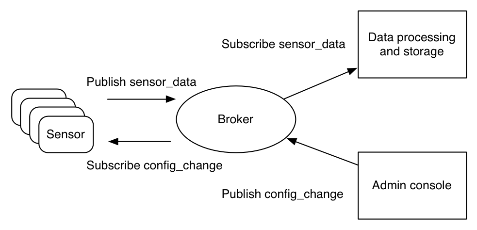

## MQTT
MQTT消息队列遥测传输（Message Queuing Telemetry Transport）是ISO 标准（ISO/IEC PRF 20922）下基于发布 (Publish)/订阅 (Subscribe)范式的消息协议，可视为“资料传递的桥梁”。它工作在 TCP/IP协议族上，是为硬件性能低下的远程设备以及网络状况糟糕的情况下而设计的发布/订阅型消息协议，为此，它需要一个消息中间件，以解决当前繁重的资料传输协议，如：HTTP。 

## MQTT与IoT
物联网 (IoT) 设备必须连接互联网。通过连接到互联网，设备能够相互协作，以及与后端服务协同工作。。MQTT是基于互联网的基础网络协议TCP/IP协议栈而构建的，当前已成为 IoT 通信的标准。

## 为什么IoT使用MQTT协议而不使用其他协议？

* MQTT 

MQTT是一种轻量级的、灵活的网络协议，这个轻量级协议可在严重受限的设备硬件和高延迟/带宽有限的网络上实现。它的灵活性使得为 IoT 设备和服务的多样化应用场景提供支持成为可能。

* HTTP 

HTTP是一种同步协议。客户端需要等待服务器响应。Web 浏览器具有这样的要求，但它的代价是牺牲了可伸缩性。在 IoT 领域，大量设备以及很可能不可靠或高延迟的网络使得同步通信成为问题。异步消息协议更适合 IoT 应用程序。传感器发送读数，让网络确定将其传送到目标设备和服务的最佳路线和时间。

HTTP 是单向的。客户端必须发起连接。在 IoT 应用程序中，设备或传感器通常是客户端，这意味着它们无法被动地接收来自网络的命令。

HTTP 是一种 1-1 协议。客户端发出请求，服务器进行响应。将消息传送到网络上的所有设备上，不但很困难，而且成本很高，而这是 IoT 应用程序中的一种常见使用情况。

HTTP 是一种有许多标头和规则的重量级协议。它不适合受限的网络。

* AMQP

AMQP（高级消息排队协议）致力于在企业应用程序中实现可靠性和互操作性。它拥有庞大的特性集，但不适合资源的 IoT 应用程序。

* XMPP

XMPP（Extensible Messaging and Presence Protocol，可扩展消息和状态协议）是一种对等即时消息 (IM) 协议。它高度依赖于支持 IM 用例的特性，比如存在状态和介质连接。与 MQTT 相比，它在设备和网络上需要的资源都要多得多。

## MQTT的订阅（subscirbe）和发布（publish）模式

MQTT 协议中定义了两种实体：消息代理（message broker）与客户端（client）。

消息代理是一个服务器，用于接收来自客户端的消息并转发至目标客户端。

客户端与代理交互来发送和接收消息。它可以是任何运行有 MQTT 库并通过网络连接至消息代理的设备。客户端分为发布客户端和接收客户端。

在IoT场景下，客户端可以是 IoT 传感器，或者是数据中心内处理 IoT 数据的应用程序。

- 信息的传输是通过主题（topic）管理的。发布者有需要分发的数据时，其向连接的消息代理发送携带有数据的控制消息。代理会向订阅此主题的客户端分发此数据。发布者不需要知道订阅者的数据和具体位置；同样，订阅者不需要配置发布者的相关信息。

- 如果消息代理接受到某个主题上的消息，且这个主题没有任何订阅，那么代理就会丢弃之，除非发布者将其标记为保留消息（retained message）。

- 当发布客户端首次与代理连接时，客户端可以设置一个默认消息。当代理发现发布者意外断开，其会向订阅者发送此预设的消息。

- 客户端仅与代理有直接的数据传输，但整个系统中可能有多个代理，其于当前订阅者的主题交换数据。

- MQTT 控制消息最小只有 2 字节的数据。最多可以承载 256 Mb 的数据。有 14 种预定义的消息类型用于：连接客户端与代理、断开连接、发布数据、确认数据接收、监督客户端与代理的连接。

- MQTT 基于 TCP 协议，用于数据传输。变体 MQTT-SN 用于在蓝牙上传输，基于 UDP。

- MQTT 协议使用普通文本发送连接认证书，且并不包含任何安全或认证相关的措施。但可以使用传输层安全来加密并保护发送的数据，以防止拦截、修改或伪造。

- MQTT 默认端口为 1883。加密的端口为 8883.

参考文献：

- [维基百科](https://zh.wikipedia.org/wiki/MQTT)

- [Getting to know MQTT](https://developer.ibm.com/articles/iot-mqtt-why-good-for-iot/)

