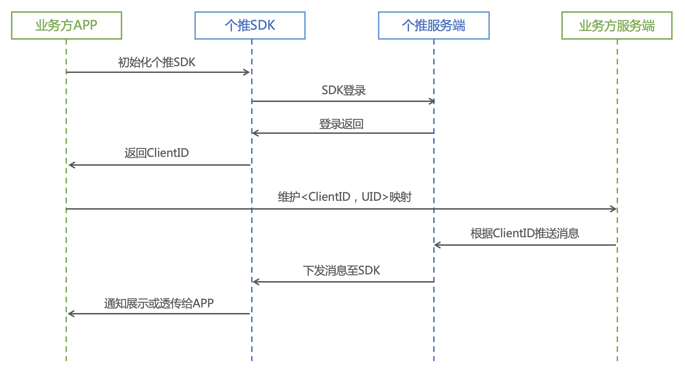

个推是商用级的移动应用消息推送云服务供应商，客户端SDK支持Android和iOS两大平台，开发者集成SDK后，可以通过个推强大的web端及丰富的API开放接口，发送推送消息、统计分析推送效果。

官网： https://www.getui.com/

文档： https://docs.getui.com/getui/start/product/


## 个推相关概念：


消息形式：

个推消息推送支持通知和透传两种形式。同时支持大图、大文本等富媒体展示，支持启动应用、打开第三方链接、打开应用内特定页面等后续操作等后续操作。

* 通知消息

指定通知标题和内容后，由个推SDK自动处理后、在系统通知栏中以通知栏消息的形式展示，同时响铃或震动提醒用户(响铃和震动受手机系统的设置状态影响)。

* 透传消息

即自定义消息，消息体格式客户可以自己定义，如纯文本、json串等。透传消息个推只传递数据，不做任何处理，客户端接收到透传消息后需要自己去做后续动作处理，如通知栏展示、弹框等。

推送目标：

* ClientID（简称CID）

个推业务中的对外用户标识，用于标识客户端身份，由APP获取并保存到开发者服务端，是个推SDK的唯一标识。

接入需要的要素：

* AppID

在个推开发者中心创建应用时生成，是您的应用与SDK通信的标识之一，每个应用都对应一个唯一的AppID。

* AppKey

预先分配的第三方应用对应的Key，是您的应用与SDK通信的标识之一。

* AppSecret

第三方客户端个推集成鉴权码，用于验证第三方合法性。在客户端集成SDK时需要提供。

## 个推推送流程



APP调用个推SDK初始化接口，获取推送标识ClientID（简称CID）；

APP将CID上传到服务端进行保存。通常需要将该CID与相应的用户ID进行关联，以便后续针对特定用户进行消息推送。

业务方服务端需要给指定CID的设备发送消息时，调用个推服务端消息推送接口，个推服务端寻找目标设备，将消息下发给相应的个推SDK，进而将消息进行展示或由APP自行处理。

## 开发接入过程：


* 1、权限控制：
在app模块的manifest文件中添加如下内容：

必选权限

```
<!-- 
    个推 SDK 权限配置开始 
    -->
    <!--（1）网络连接（必选）-->
    <uses-permission android:name="android.permission.INTERNET"/>
    <!--2）获取手机状态参数，并作为生成个推唯一标识的必要参数（必选）-->
    <uses-permission android:name="android.permission.READ_PHONE_STATE"/>
    <!-- （3）查看网络状态，sdk重连机制等需要使用（必选）-->
    <uses-permission android:name="android.permission.ACCESS_NETWORK_STATE"/>
    <!--（4）查看wifi连接状态（必选）-->
    <uses-permission android:name="android.permission.ACCESS_WIFI_STATE"/>
    <!--（5）震动权限（使用通知功能必选）-->
    <uses-permission android:name="android.permission.VIBRATE"/>
    <!--（6）获取任务信息，目的是防止sdk被频繁唤醒（必选）-->
    <uses-permission android:name="android.permission.GET_TASKS"/>
    <!-- （7）自定义权限，内部广播通信及为了防止小部分手机服务没法正常工作（必选）-->
    <uses-permission android:name="getui.permission.GetuiService.${applicationId}"/>
    <permission
        android:name="getui.permission.GetuiService.${applicationId}"
        android:protectionLevel="signature"/>
    <!--（8）兼容android12 alarm权限（必选）-->
    <uses-permission android:name="android.permission.SCHEDULE_EXACT_ALARM" />
    <!--（9）vivo角标设置（必选）-->
    <uses-permission android:name="com.vivo.notification.permission.BADGE_ICON" />
    <!-- 个推 SDK 权限配置结束 -->
```

* 2、个推SDK下载路径配置

在项目根目录 build.gradle 文件的 allprojects.repositories 块中，添加个推 maven 库地址 maven { url "https://mvn.getui.com/nexus/content/repositories/releases/"}，如下所示：
```gralle
buildscript {
    ......
    repositories {
        google()
        mavenCentral()
        ......
    }
    dependencies {
       ......
    }
}

allprojects {
    repositories {
        ......

        //个推依赖配置
        maven {url "https://mvn.getui.com/nexus/content/repositories/releases/"}
        ......

        google()
        mavenCentral()
    }
}
```

* 3、依赖项配置

配置 SDK 依赖及应用参数：

在 app/build.gradle 文件的 dependencies 块中引用个推 SDK 依赖 implementation 'com.getui:gtsdk:${version}'，

此处的 ${version} 为对应的 SDK 版本号，并在android.defaultConfig 下添加 manifestPlaceholders，配置个推相关的应用参数，

 如下所示：
```gradle
    ......

    android {
        defaultConfig {
            manifestPlaceholders = [
                  //从 3.1.2.0 版本开始，APPID 占位符从 GETUI_APP_ID 切换为 GETUI_APPID 
                  //后续所有产品的 APPID 均统一配置为 GETUI_APPID 占位符
                GETUI_APPID       : "your appid",
            ]        
        }
      ......
    }

    dependencies {
        implementation 'com.getui:gtsdk:3.2.10.0'  //个推SDK
        implementation 'com.getui:gtc:3.1.9.0'  //个推核心组件
    }  
```

AndroidManifest文件添加标签，适配 android11及以上:

queries标签对gradle版本有要求，建议升级到4.0.1及以上。或使用3.3.3 、3.4.3 、 3.5.4 、 3.6.4版本
```xml
</manifest>

//......
 <queries>
        <intent>
            <action android:name="com.getui.sdk.action" />
        </intent>
    </queries>
//......

</manifest>
```

* 4、设置通知图标

客户端必须配置 push_small.png 资源文件，若客户端无该文件，会导致通知栏消息无法展示。

设置通知栏及通知栏顶部图标：为了修改默认的通知图标以及通知栏顶部提示小图标，请务必在资源目录的 res/drawable-ldpi/、res/drawable-mdpi/、res/drawable-hdpi/、res/drawable-xhdpi/、res/drawable-xxhdpi/ 等各分辨率目录下，放置相应尺寸的文件名为 push.png 和 push_small.png 的图片（该图片内容为您应用自定义的图标文件），如图所示：
```
--xhdpi
push:   128*128
pushi_small:   48*48

--xxhdpi
push:  192*192
pushi_small:  72*72
```

* 5、配置推送服务Service

>为了让推送服务在部分主流机型上更稳定运行，从 2.9.5.0 版本开始，个推支持第三方应用配置使用自定义 Service 来作为推送服务运行的载体。

在项目源码中添加一个继承自 com.igexin.sdk.PushService 的自定义 Service：

```
package com.getui.demo.service;
public class DemoPushService extends com.igexin.sdk.PushService {
}
```

在 AndroidManifest.xml 中添加上述自定义 Service，（使用 maven 集成，android:process 属性必须为 pushservice。手动集成方式也请保证与其他组件进程名一致，建议复制本文档的默认配置即可），如下：

```
 <service
            android:name=".gtpush.YuYaIntentService"
            android:exported="false"
            android:label="PushService"
            android:process=":pushservice"/>
```

* 6.实现推送

***初始化 SDK***

调用个推初始化代码：com.igexin.sdk.PushManager.getInstance().initialize(Context context) 进行 SDK 的初始化。

我们建议开发者在 Application.onCreate() 和主 Activity.onCreate() 方法中初始化个推 SDK。多次调用 SDK 初始化并无影响。

为了保证 SDK 服务稳定，开发者需在 App《隐私政策》的 “与授权合作伙伴共享”条款中，将 个推的用户隐私政策 加入其中。并确保在 App 首次运行时通过明显方式提示终端用户阅读您的 App《隐私政策》，取得终端用户的合法授权后，再初始化 SDK ，详情可查看：个推合规指南 。

另外，为了保证推送通知更好的触达用户，降低用户对于通知开关设置的难度，我们建议在应用代码中引导用户前往通知页面打开允许应用通知开关，具体实现代码可以参考 Demo 工程。

***自定义接收推送服务事件***

在项目源码中添加一个继承自 com.igexin.sdk.GTIntentService 的类，用于接收 CID、透传消息以及其他推送服务事件。请参考下列代码实现各个事件回调方法：

```
package com.getui.demo;

import android.content.Context;
import android.util.Log;

import com.igexin.sdk.GTIntentService;
import com.igexin.sdk.message.GTCmdMessage;
import com.igexin.sdk.message.GTNotificationMessage;
import com.igexin.sdk.message.GTTransmitMessage;

/**
 * 继承 GTIntentService 接收来自个推的消息，所有消息在主线程中回调，如果注册了该服务，则务必要在 AndroidManifest 中声明，否则无法接受消息
 */
public class DemoIntentService extends GTIntentService {

    @Override
    public void onReceiveServicePid(Context context, int pid) {
    }

    // 处理透传消息
    @Override
    public void onReceiveMessageData(Context context, GTTransmitMessage msg) {
        // 透传消息的处理，详看 SDK demo
    }

    // 接收 cid
    @Override
    public void onReceiveClientId(Context context, String clientid) {
        Log.e(TAG, "onReceiveClientId -> " + "clientid = " + clientid);
    }

    // cid 离线上线通知
    @Override
    public void onReceiveOnlineState(Context context, boolean online) {
    }

    // 各种事件处理回执
    @Override
    public void onReceiveCommandResult(Context context, GTCmdMessage cmdMessage) {
    }

    // 通知到达，只有个推通道下发的通知会回调此方法
    @Override
    public void onNotificationMessageArrived(Context context, GTNotificationMessage msg) {
    }

    // 通知点击，只有个推通道下发的通知会回调此方法
    @Override
    public void onNotificationMessageClicked(Context context, GTNotificationMessage msg) {   
    }
}
```
