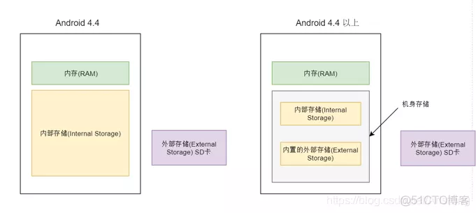

- [一、Android中内部存储，外部存储的概念](#一android中内部存储外部存储的概念)
  - [1.1 内部存储](#11-内部存储)
    - [1.1.1 内部存储定义](#111-内部存储定义)
    - [1.1.2 应用的内部存储---/data/data/packageName目录](#112-应用的内部存储---datadatapackagename目录)
      - [1.1.2.1 files目录](#1121-files目录)
      - [1.1.2.2 cache目录](#1122-cache目录)
      - [1.1.2.3 shared\_prefs目录](#1123-shared_prefs目录)
    - [1.1.2.4 databses目录](#1124-databses目录)
  - [1.2 外部存储](#12-外部存储)
    - [1.2.1 历史回溯](#121-历史回溯)
    - [1.2.1 外部存储的概念](#121-外部存储的概念)
    - [1.2.2 应用的外部存储](#122-应用的外部存储)
      - [1.2.2.1 files目录](#1221-files目录)
      - [1.2.2.2 cache目录](#1222-cache目录)
    - [1.2.3 外部存储的公有目录](#123-外部存储的公有目录)
- [二、Android调用内部存储和外部存储的方法](#二android调用内部存储和外部存储的方法)
  - [2.1 android如何调用应用的内部存储和外部存储](#21-android如何调用应用的内部存储和外部存储)
  - [2.1 android如何读写外部存储的公有目录](#21-android如何读写外部存储的公有目录)
    - [2.1.1 如何读取外部存储的媒体文件](#211-如何读取外部存储的媒体文件)
    - [2.1.2 如何写入媒体文件到外部存储中](#212-如何写入媒体文件到外部存储中)
    - [2.1.3 如何删除外部存储中的媒体文件](#213-如何删除外部存储中的媒体文件)
    - [2.1.4 如何读取外部存储中的其他文件](#214-如何读取外部存储中的其他文件)
    - [2.1.5 如何写入文件到外部存储中](#215-如何写入文件到外部存储中)
    - [2.1.6 如何删除外部存储中的其他文件](#216-如何删除外部存储中的其他文件)
- [三、android的分区适配历史版本问题](#三android的分区适配历史版本问题)


# 一、Android中内部存储，外部存储的概念

## 1.1 内部存储

### 1.1.1 内部存储定义

内部存储顾名思义就是手机自带的存储空间，一般情况下，系统和应用都是安装在内部存储空间中的。

在没有root的情况下，普通用户是无法查看内部存储中的文件的。

>非计算机专业的朋友提到的内存，我们应该理解为内部存储.但实际上它们是两个不一样的东西。内存（RAM）简单理解就是程序运行时临时的数据存储器，某个程序进程结束后，关于此程序的所有内存数据都会消失，而断电后整个内存里面的数据都会丢失。由于内存经常与CPU打交道，因此它的读写速度是相当快的，内存也是我们通常所说的随机存取存储器（Random Access Memory）和ROM(Read Only Memory)。

###  1.1.2 应用的内部存储---/data/data/packageName目录

对于开发者而言，我们熟悉的是/data/data/packageName这个目录。这个目录实际上是/data/user/current_user_id/package的一个链接，注意是current_user_id。
（android 6.0之前，/data/user/0/package目录。0是指当前用户，在手机没有支持多用户之前）

这个路径是应用的内部存储私有目录，保存到这个路径下的文件是应用的私有文件，其他应用不能访问这些文件（除非拥有 Root 访问权限），非常适合保存用户无需直接访问的内部应用数据。

当我们卸载应用后，保存在私有路径中的文件也会被删除。因此，我们不应该将那些希望应用卸载以后还保留的数据文件放在私有路径中。

主要有以下几个常用的目录：

#### 1.1.2.1 files目录

完整路径为：/data/data/package/files。用于保存应用创建的文件，可以通过Context对象获取其路径：

```
// java
String path = context.getFilesDir().getAbsolutePath();

// kotlin

val path = context.filesDir.absolutePath
```

#### 1.1.2.2 cache目录

完整路径为：/data/data/package/cache。用于保存应用的临时缓存文件，可以通过Context对象获取其路径：

```
// java
String path = context.getCacheDir().getAbsolutePath();

// kotlin
val path = context.cacheDir.absolutePath
```

#### 1.1.2.3 shared_prefs目录

完整路径为：/data/data/package/shared_prefs。用于保存SharedPreferences的数据文件。


### 1.1.2.4 databses目录

databses目录

完整路径为：/data/data/package/databses。用于保存Sqlite数据库文件。

## 1.2 外部存储

### 1.2.1 历史回溯

在很久很久以前，几乎所有的Android手机都可以插入一张micro SD卡，因为内部存储实在太小了，我第一款Android手机是SONY LT18i，内部存储只有1GB，最大支持32GB的SD卡。我们所说的外部存储，指的就是我们插入的那张SD卡。SD卡一般会被挂载到/storage/sdcard1，根据设备的不同，不一定叫sdcard1，比如在我的模拟器中，路径为：/storage/1106-3A09。

而现在，几乎没有Android手机再提供SD卡的插口。




### 1.2.1 外部存储的概念

现在，系统会将内部存储空间通过fuse技术挂载到/storage/emulated/0上，这个挂载点就是外部存储，没有SD卡一样可以拥有外部存储了，这个外部存储严格意义上叫做内置外部存储，和内部存储共享空间，它有如下好处：

* 永远在线，不可被用户移出

* 和内置存储共享空间，速度也快

### 1.2.2 应用的外部存储

应用的外部存储是指应用在外部存储空间的私有目录，严格来说叫做外部存储私有目录，

完整路径位于：/storage/emulated/0/Android/data/package中，同样拥有files文件夹和cache文件夹。

#### 1.2.2.1 files目录

完整路径为：/storage/emulated/0/Android/data/package/files。用于保存应用创建的文件，可以通过Context对象获取其路径：

```
// java
String path = context.getExternalFilesDir("").getAbsolutePath();

// kotlin

val path = context.getExternalFilesDir("")?.absolutePath ?: ""
```
getExternalFilesDir()需要一个字符串参数，如果我们传入空字符串，则获取到/storage/emulated/0/Android/data/package/files，如果我们传入"test"，则获取到：/storage/emulated/0/Android/data/package/files/test。

官方建议使用Evironment下定义好的名字

```
 public static final String[] STANDARD_DIRECTORIES = {
            DIRECTORY_MUSIC,
            DIRECTORY_PODCASTS,
            DIRECTORY_RINGTONES,
            DIRECTORY_ALARMS,
            DIRECTORY_NOTIFICATIONS,
            DIRECTORY_PICTURES,
            DIRECTORY_MOVIES,
            DIRECTORY_DOWNLOADS,
            DIRECTORY_DCIM,
            DIRECTORY_DOCUMENTS,
            DIRECTORY_AUDIOBOOKS,
            DIRECTORY_RECORDINGS,
    };
```


#### 1.2.2.2 cache目录

完整路径为：/storage/emulated/0/Android/data/package/cache。用于保存应用创建的临时文件，可以通过Context对象获取其路径：

```
// java
File file = context.getExternalCacheDir("");
String path = "";
if (file != null){
    path = file.getAbsolutePath();
}

// kotlin
val path = context.externalCacheDir?.absolutePath ?: ""
```

卸载应用后，外部存储私有路径中的文件同样会被清除。那…内部存储中的私有目录和外部存储中的私有目录有什么区别呢？官方文档的解释如下：

>尽管这些文件在技术上可被用户和其他应用访问（因为它们存储在外部存储上），但它们不能为应用之外的用户提供价值。可以使用此目录来存储您不想与其他应用共享的文件。

### 1.2.3 外部存储的公有目录

外部存储中，除了私有目录以外的目录，都是公有目录。程序保存在公有目录中的数据，在应用被删除后，仍然保留。

目前android系统api已经不再提供文件方式获取外部存储的公有目录，所有的外部存储都需要用MediaStorage来访问


# 二、Android调用内部存储和外部存储的方法


## 2.1 android如何调用应用的内部存储和外部存储


变化：目前android系统api已经不再提供文件方式获取外部存储的公有目录，所有的外部存储都需要用MediaStorage来访问

## 2.1 android如何读写外部存储的公有目录

在android 10 以前，通过申请write_external_storage的方式，可以读写外部存储目录。

android 10 以后，需要通过media storage将文件写入公共目录

例如：在android 10 以后采用下列代码，将无法写入

```
val file = File(Environment.getExternalStorageDirectory(), "MyAppDir")
if (!file.exists()) {
    Log.d("createDir", file.mkdir().toString())
}

```

### 2.1.1 如何读取外部存储的媒体文件

通过MediaStore来获取。如果我们没有获得存储空间权限，那么我们只能通过MediaStore获取到自己应用创建的图片；如果我们获取了存储空间权限，那么我们就可以获取到其它应用创建的图片了。

```
val cursor = contentResolver.query(
    MediaStore.Images.Media.EXTERNAL_CONTENT_URI,
    null,
    null,
    null,
    "${MediaStore.MediaColumns.DATE_ADDED} desc"
)
cursor?.also {
    while (it.moveToNext()) {
        val id = it.getLong(cursor.getColumnIndexOrThrow(MediaStore.MediaColumns._ID))
        val displayName =
        it.getString(cursor.getColumnIndex(MediaStore.MediaColumns.DISPLAY_NAME))
        val uri =
        ContentUris.withAppendedId(MediaStore.Images.Media.EXTERNAL_CONTENT_URI, id)
    }
}
cursor?.close()
```

显示图片的一个实例：

```
//是使用Glide
Glide.with(this).load(uri).into(ivPicture)

//如果没有使用Glide呢？可以这样来做，得到一个Bitmap：
val openFileDescriptor = contentResolver.openFileDescriptor(uri, "r")
openFileDescriptor?.apply {
    val bitmap = BitmapFactory.decodeFileDescriptor(fileDescriptor)
    ivPicture.setImageBitmap(bitmap)
}
openFileDescriptor?.close()
```

根据权限来设置获取文件的一个方法：

```
private fun queryImages(queryAll: Boolean = false): List<ImageBean> {
    var pathKey = ""
    var pathValue = ""
    if (!queryAll) {
        pathKey = if (Build.VERSION.SDK_INT < Build.VERSION_CODES.Q) {
            MediaStore.MediaColumns.DATA
        } else {
            MediaStore.MediaColumns.RELATIVE_PATH
        }
        // RELATIVE_PATH会在路径的最后自动添加/
        pathValue = getAppPicturePath()
    }
    val dataList = mutableListOf<ImageBean>()
    val cursor = contentResolver.query(
        MediaStore.Images.Media.EXTERNAL_CONTENT_URI,
        null,
        if (pathKey.isEmpty()) {
            null
        } else {
            "$pathKey LIKE ?"
        },
        if (pathValue.isEmpty()) {
            null
        } else {
            arrayOf("%$pathValue%")
        },
        "${MediaStore.MediaColumns.DATE_ADDED} desc"
    )
    cursor?.also {
        while (it.moveToNext()) {
            val id = it.getLong(cursor.getColumnIndexOrThrow(MediaStore.MediaColumns._ID))
            val displayName = it.getString(cursor.getColumnIndex(MediaStore.MediaColumns.DISPLAY_NAME))
            val uri = ContentUris.withAppendedId(MediaStore.Images.Media.EXTERNAL_CONTENT_URI, id)
            dataList.add(ImageBean(id, uri, displayName))
        }
    }
    cursor?.close()
    return dataList
}
```


### 2.1.2 如何写入媒体文件到外部存储中

使用MediaStore来将媒体文件保存

```
const val APP_FOLDER_NAME = "ExternalScopeTestApp"
val bitmap = BitmapFactory.decodeResource(resources, R.drawable.die)
val displayName = "${System.currentTimeMillis()}.jpg"
val mimeType = "image/jpeg"
val compressFormat = Bitmap.CompressFormat.JPEG
private fun saveBitmapToPicturePublicFolder(
    bitmap: Bitmap,
    displayName: String,
    mimeType: String,
    compressFormat: Bitmap.CompressFormat
) {
    val contentValues = ContentValues()
    contentValues.put(MediaStore.MediaColumns.DISPLAY_NAME, displayName)
    contentValues.put(MediaStore.MediaColumns.MIME_TYPE, mimeType)
    val path = getAppPicturePath()
    if (Build.VERSION.SDK_INT >= Build.VERSION_CODES.Q) {
        contentValues.put(MediaStore.MediaColumns.RELATIVE_PATH, path)
    } else {
        val fileDir = File(path)
        if (!fileDir.exists()){
            fileDir.mkdir()
        }
        contentValues.put(MediaStore.MediaColumns.DATA, path + displayName)
    }
    val uri =
    contentResolver.insert(MediaStore.Images.Media.EXTERNAL_CONTENT_URI, contentValues)
    uri?.also {
        val outputStream = contentResolver.openOutputStream(it)
        outputStream?.also { os ->
            bitmap.compress(compressFormat, 100, os)
            os.close()
            Toast.makeText(this, "添加图片成功", Toast.LENGTH_SHORT).show()
        }
    }
}
fun getAppPicturePath(): String {
    return if (Build.VERSION.SDK_INT < Build.VERSION_CODES.Q) {
        // full path
        "${Environment.getExternalStorageDirectory().absolutePath}/" +
                "${Environment.DIRECTORY_PICTURES}/$APP_FOLDER_NAME/"
    } else {
        // relative path
        "${Environment.DIRECTORY_PICTURES}/$APP_FOLDER_NAME/"
    }
}
```
首先我们创建了ContentValues对象，并往里面添加了三种信息：

DISPLAY_NAME：图片的名字，需要包含后缀名。在这里，我们使用的是当前的时间戳命名

MIME_TYPE：文件的mime类型。在这里，我们使用的是image/jpeg

RELATIVE_PATH、DATA：文件的存储路径。在Android 10中，新增了RELATIVE_PATH，它表示文件存储的相对路径，可选值其实就是Environment里面那堆，比如Pictures、Music等。但是注意看我们的getAppPicturePath()中的代码："${Environment.DIRECTORY_PICTURES}/$APP_FOLDER_NAME/"，后面还跟了一个$APP_FOLDER_NAME，表示在Pictures这个目录下面 ，还要创建一个名叫：ExternalScopeTestApp的文件夹，这是因为如果所有应用都将图片保存到Pictures的根目录，势必会非常混乱，因此我们针对自己的应用建立了二级文件夹，将图片都保存到自己的二级文件夹中。

DATA这个字段是Android 10以前使用的字段，在Android 10中已经废弃，但为了兼容老版本系统， 我们还是要用。这个字段需要文件的绝对路径。

ContentValues里面的值都设置完成后，我们就可以使用ContentResolver的insert()方法插入数据了，插入完成后会得到插入图片的Uri，接下来我们要根据这个Uri得到OutputStream对象，通过：contentResolver.openOutputStream(uri)就可得到，剩下的就是将Bitmap写入了。

我们发现，以前我们可以通过真实路径得到输出流，而现在只能通过Uri得到了。

如果我们不是将Bitmap保存到公有目录，而是网络上的图片呢？其实原理都是一样的，网络上的图片我们肯定是可以得到输入流的，输出流还是通过Uri获取，然后读取输入流写入输出流不就行了吗？

到此，保存图片就学习完了，保存音频、视频都类似。注意，这些操作都是不需要权限的。


### 2.1.3 如何删除外部存储中的媒体文件

```
companion object {
    const val REQUEST_DELETE_PERMISSION = 1
}
private var pendingDeleteImageUri: Uri? = null
private var pendingDeletePosition: Int = -1
private fun deleteImage(imageUri: Uri, adapterPosition: Int) {
    var row = 0
    try {
        // Android 10+中,如果删除的是其它应用的Uri,则需要用户授权
        // 会抛出RecoverableSecurityException异常
        row = contentResolver.delete(imageUri, null, null)
    } catch (securityException: SecurityException) {
        if (Build.VERSION.SDK_INT >= Build.VERSION_CODES.Q) {
            val recoverableSecurityException =
                securityException as? RecoverableSecurityException
                    ?: throw securityException
            pendingDeleteImageUri = imageUri
            pendingDeletePosition = adapterPosition
            // 我们可以使用IntentSender向用户发起授权
requestRemovePermission(recoverableSecurityException.userAction.actionIntent.intentSender)
        } else {
            throw securityException
        }
    }
    if (row > 0) {
        Toast.makeText(this, "删除成功", Toast.LENGTH_SHORT).show()
        pictureAdapter.deletePosition(adapterPosition)
    }
}
private fun requestRemovePermission(intentSender: IntentSender) {
    startIntentSenderForResult(intentSender, REQUEST_DELETE_PERMISSION, 
        null, 0, 0, 0, null)
}
private fun deletePendingImageUri(){
    pendingDeleteImageUri?.let {
        pendingDeleteImageUri = null
        deleteImage(it,pendingDeletePosition)
        pendingDeletePosition = -1
    }
}
override fun onActivityResult(requestCode: Int, resultCode: Int, data: Intent?) {
    super.onActivityResult(requestCode, resultCode, data)
    if (resultCode == Activity.RESULT_OK &&
        requestCode == REQUEST_DELETE_PERMISSION
    ) {
        // 执行之前的删除逻辑
        deletePendingImageUri()
    }
}
```

### 2.1.4 如何读取外部存储中的其他文件

拿PDF举例，显然，PDF不属于音频、视频、图片，因此我们不能使用MediaStore来获取。对于这种其它类型的文件，我们一般使用SAF（存储访问框架）让用户选择：

```
private fun selectPdfUseSAF() {
    val intent = Intent(Intent.ACTION_OPEN_DOCUMENT).apply {
        type = "application/pdf"
        // 我们需要使用ContentResolver.openFileDescriptor读取数据
        addCategory(Intent.CATEGORY_OPENABLE)
    }
    startActivityForResult(intent, REQUEST_OPEN_PDF)
}

override fun onActivityResult(requestCode: Int, resultCode: Int, data: Intent?) {
    super.onActivityResult(requestCode, resultCode, data)
    when (requestCode) {
        REQUEST_OPEN_PDF -> {
            if (resultCode == Activity.RESULT_OK) {
                data?.data?.also { documentUri ->
                    val fileDescriptor =
                        contentResolver.openFileDescriptor(documentUri, "r") ?: return
                    // 现在,我们可以使用PdfRenderer等类通过fileDescriptor读取pdf内容
                    Toast.makeText(this, "pdf读取成功", Toast.LENGTH_SHORT).show()
                }
            }
        }
    }
}
```

### 2.1.5 如何写入文件到外部存储中

使用SAF（存储访问框架）让用户去创建。其Intent Action为：ACTION_CREATE_DOCUMENT，我们可以使用Intent的putExtra()来指定文件的名字：intent.putExtra(Intent.EXTRA_TITLE, "Android.pdf")，有点类似于”另存为”功能。

拿下载app为例，在Android 10以前，只要获取到了File对象，就能得到输入流，而由于我们适配了Android 10中的分区存储，因此不能这样做了。MediaStore中提供了一种Downloads集合，专门用于执行文件下载操作。它的使用和添加图片是几乎一样的：

```
private fun downloadApkAndInstall(fileUrl: String, apkName: String) {
    if (Build.VERSION.SDK_INT < Build.VERSION_CODES.Q) {
        Toast.makeText(this, "请使用原始方式", Toast.LENGTH_SHORT).show()
        return
    }
    thread {
        try {
            val url = URL(fileUrl)
            val connection = url.openConnection() as HttpURLConnection
            connection.requestMethod = "GET"
            val inputStream = connection.inputStream
            val bis = BufferedInputStream(inputStream)
            val values = ContentValues()
            values.put(MediaStore.MediaColumns.DISPLAY_NAME, apkName)
            values.put(MediaStore.MediaColumns.RELATIVE_PATH, getAppDownloadPath())
            val uri = contentResolver.insert(MediaStore.Downloads.EXTERNAL_CONTENT_URI, values)
            uri?.also {
                val outputStream = contentResolver.openOutputStream(uri) ?: return@thread
                val bos = BufferedOutputStream(outputStream)
                val buffer = ByteArray(1024)
                var bytes = bis.read(buffer)
                while (bytes >= 0) {
                    bos.write(buffer, 0, bytes)
                    bos.flush()
                    bytes = bis.read(buffer)
                }
                bos.close()
                runOnUiThread {
                    installAPK(uri)
                }
            }
            bis.close()
        } catch (e: Exception) {
            e.printStackTrace()
        }
    }
}
private fun installAPK(uri: Uri) {
    val intent = Intent(Intent.ACTION_VIEW)
    intent.addFlags(Intent.FLAG_GRANT_READ_URI_PERMISSION)
    intent.setDataAndType(uri, "application/vnd.android.package-archive")
    startActivity(intent)
}
```

### 2.1.6 如何删除外部存储中的其他文件

通过SAF来删除，需要权限设置。

上面代码的详细示例参见：https://github.com/HurryYU/ScopedStorage

# 三、android的分区适配历史版本问题

Android 6.0 以前，应用要想保存图片到相册，只需要通过File对象打开IO流就可以保存；

Android 6.0 添加了运行时权限，需要先申请存储权限才可以保存图片；

Android 10 引入了分区存储，但不是强制的，可以通过清单配置android:requestLegacyExternalStorage="true"关闭分区存储；在targetSdkVersion = 29应用中，设置android:requestLegacyExternalStorage="true"，就可以不启动分区存储，让以前的文件读取正常使用。但是targetSdkVersion = 30中不行了，强制开启分区存储。

Android 11 强制开启分区存储，应用以 Android 11 为目标版本，系统会忽略 requestLegacyExternalStorage标记，访问共享存储空间都需要使用MediaStore进行访问。


