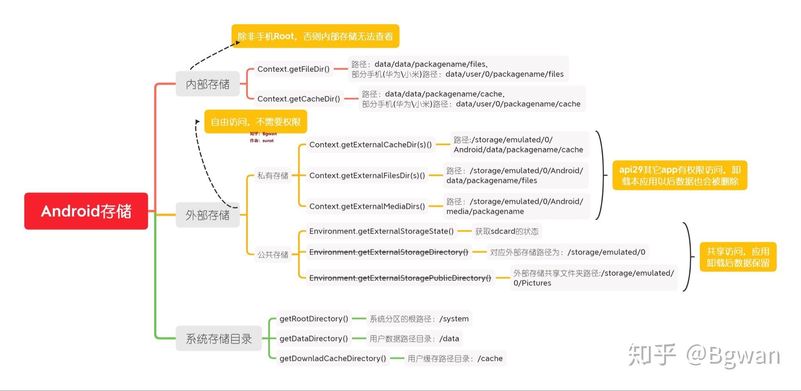

- [一、Android中内部存储，外部存储的概念](#一android中内部存储外部存储的概念)
  - [1.1 内部存储](#11-内部存储)
    - [1.1.1 内部存储定义](#111-内部存储定义)
    - [1.1.2 应用的内部存储---/data/data/packageName目录](#112-应用的内部存储---datadatapackagename目录)
      - [1.1.2.1 files目录](#1121-files目录)
      - [1.1.2.2 cache目录](#1122-cache目录)
      - [1.1.2.3 shared\_prefs目录](#1123-shared_prefs目录)
    - [1.1.2.4 databses目录](#1124-databses目录)
  - [1.2 外部存储](#12-外部存储)
    - [1.2.1 历史回溯](#121-历史回溯)
    - [1.2.1 外部存储的概念](#121-外部存储的概念)
    - [1.2.2 应用的外部存储](#122-应用的外部存储)
      - [1.2.2.1 files目录](#1221-files目录)
      - [1.2.2.2 cache目录](#1222-cache目录)
    - [1.2.3 外部存储的公有目录](#123-外部存储的公有目录)
- [二、Android调用内部存储和外部存储的方法](#二android调用内部存储和外部存储的方法)
- [三、文件的其他调用方法](#三文件的其他调用方法)


# 一、Android中内部存储，外部存储的概念

## 1.1 内部存储

### 1.1.1 内部存储定义

内部存储顾名思义就是手机自带的存储空间，一般情况下，系统和应用都是安装在内部存储空间中的。

在没有root的情况下，普通用户是无法查看内部存储中的文件的。

>非计算机专业的朋友提到的内存，我们应该理解为内部存储.但实际上它们是两个不一样的东西。内存（RAM）简单理解就是程序运行时临时的数据存储器，某个程序进程结束后，关于此程序的所有内存数据都会消失，而断电后整个内存里面的数据都会丢失。由于内存经常与CPU打交道，因此它的读写速度是相当快的，内存也是我们通常所说的随机存取存储器（Random Access Memory）和ROM(Read Only Memory)。

###  1.1.2 应用的内部存储---/data/data/packageName目录

对于开发者而言，我们熟悉的是/data/data/packageName这个目录。这个目录实际上是/data/user/current_user_id/package的一个链接，注意是current_user_id。
（android 6.0之前，/data/user/0/package目录。0是指当前用户，在手机没有支持多用户之前）

这个路径是应用的内部存储私有目录，保存到这个路径下的文件是应用的私有文件，其他应用不能访问这些文件（除非拥有 Root 访问权限），非常适合保存用户无需直接访问的内部应用数据。

当我们卸载应用后，保存在私有路径中的文件也会被删除。因此，我们不应该将那些希望应用卸载以后还保留的数据文件放在私有路径中。

主要有以下几个常用的目录：

#### 1.1.2.1 files目录

完整路径为：/data/data/package/files。用于保存应用创建的文件，可以通过Context对象获取其路径：

```
// java
String path = context.getFilesDir().getAbsolutePath();

// kotlin

val path = context.filesDir.absolutePath
```

#### 1.1.2.2 cache目录

完整路径为：/data/data/package/cache。用于保存应用的临时缓存文件，可以通过Context对象获取其路径：

```
// java
String path = context.getCacheDir().getAbsolutePath();

// kotlin
val path = context.cacheDir.absolutePath
```

#### 1.1.2.3 shared_prefs目录

完整路径为：/data/data/package/shared_prefs。用于保存SharedPreferences的数据文件。


### 1.1.2.4 databses目录

databses目录

完整路径为：/data/data/package/databses。用于保存Sqlite数据库文件。

## 1.2 外部存储

### 1.2.1 历史回溯

在很久很久以前，几乎所有的Android手机都可以插入一张micro SD卡，因为内部存储实在太小了，我第一款Android手机是SONY LT18i，内部存储只有1GB，最大支持32GB的SD卡。我们所说的外部存储，指的就是我们插入的那张SD卡。SD卡一般会被挂载到/storage/sdcard1，根据设备的不同，不一定叫sdcard1，比如在我的模拟器中，路径为：/storage/1106-3A09。

而现在，几乎没有Android手机再提供SD卡的插口。

### 1.2.1 外部存储的概念

现在，系统会将内部存储空间通过fuse技术挂载到/storage/emulated/0上，这个挂载点就是外部存储，没有SD卡一样可以拥有外部存储了，这个外部存储严格意义上叫做内置外部存储，和内部存储共享空间，它有如下好处：

* 永远在线，不可被用户移出

* 和内置存储共享空间，速度也快

### 1.2.2 应用的外部存储

应用的外部存储是指应用在外部存储空间的私有目录，严格来说叫做外部存储私有目录，

完整路径位于：/storage/emulated/0/Android/data/package中，同样拥有files文件夹和cache文件夹。

#### 1.2.2.1 files目录

完整路径为：/storage/emulated/0/Android/data/package/files。用于保存应用创建的文件，可以通过Context对象获取其路径：

```
// java
String path = context.getExternalFilesDir("").getAbsolutePath();

// kotlin

val path = context.getExternalFilesDir("")?.absolutePath ?: ""
```
getExternalFilesDir()需要一个字符串参数，如果我们传入空字符串，则获取到/storage/emulated/0/Android/data/package/files，如果我们传入"test"，则获取到：/storage/emulated/0/Android/data/package/files/test。

官方建议使用Evironment下定义好的名字

```
 public static final String[] STANDARD_DIRECTORIES = {
            DIRECTORY_MUSIC,
            DIRECTORY_PODCASTS,
            DIRECTORY_RINGTONES,
            DIRECTORY_ALARMS,
            DIRECTORY_NOTIFICATIONS,
            DIRECTORY_PICTURES,
            DIRECTORY_MOVIES,
            DIRECTORY_DOWNLOADS,
            DIRECTORY_DCIM,
            DIRECTORY_DOCUMENTS,
            DIRECTORY_AUDIOBOOKS,
            DIRECTORY_RECORDINGS,
    };
```


#### 1.2.2.2 cache目录

完整路径为：/storage/emulated/0/Android/data/package/cache。用于保存应用创建的临时文件，可以通过Context对象获取其路径：

```
// java
File file = context.getExternalCacheDir("");
String path = "";
if (file != null){
    path = file.getAbsolutePath();
}

// kotlin
val path = context.externalCacheDir?.absolutePath ?: ""
```

卸载应用后，外部存储私有路径中的文件同样会被清除。那…内部存储中的私有目录和外部存储中的私有目录有什么区别呢？官方文档的解释如下：

>尽管这些文件在技术上可被用户和其他应用访问（因为它们存储在外部存储上），但它们不能为应用之外的用户提供价值。可以使用此目录来存储您不想与其他应用共享的文件。

### 1.2.3 外部存储的公有目录

外部存储中，除了私有目录以外的目录，都是公有目录。程序保存在公有目录中的数据，在应用被删除后，仍然保留。


# 二、Android调用内部存储和外部存储的方法



# 三、文件的其他调用方法
