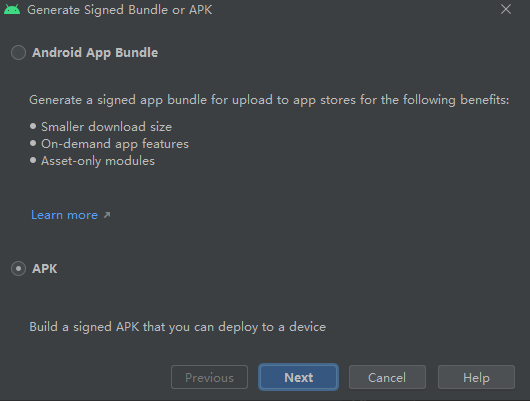
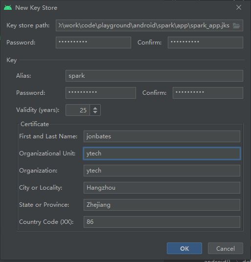
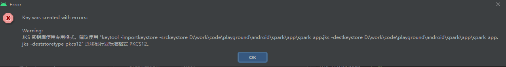
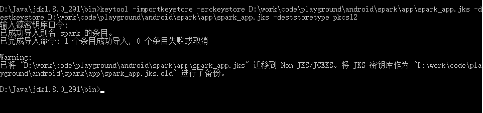
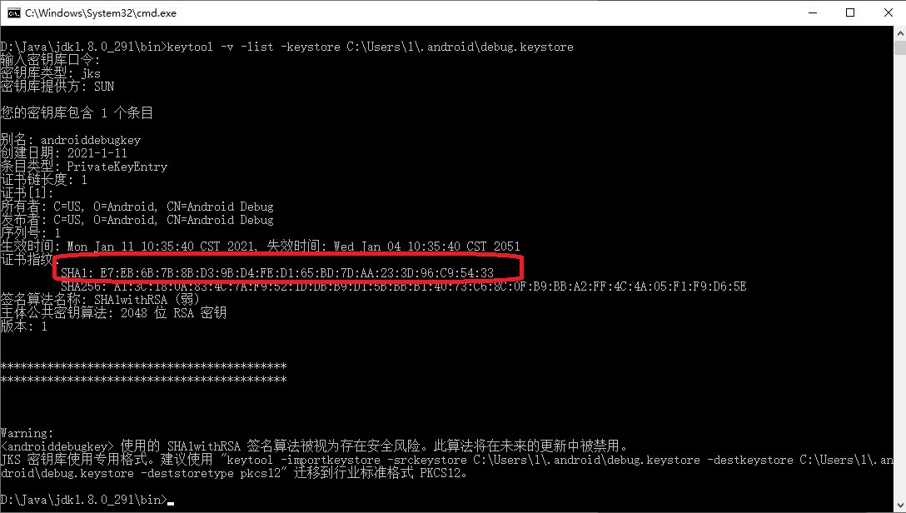
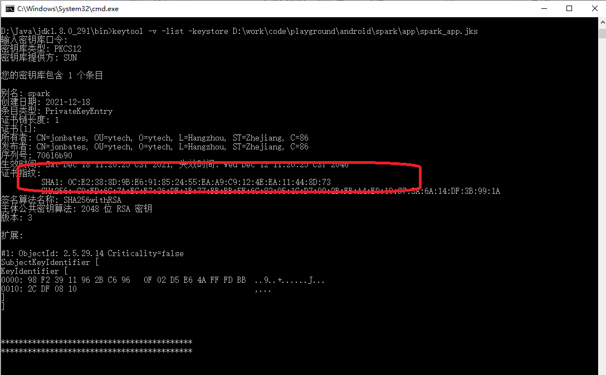

# 一、前言
 
Android的开发和发布过程中，我们会接触到“数字签名”这个概念。Android系统要求每一个Android应用程序必须要经过数字签名才能够安装到系统中，也就是说如果一个Android应用程序没有经过数字签名，是没有办法安装到系统中的！

# 二、什么是数字签名

## 2.1 数字签名的概念

在日常生活中，我们都有过签名的经历，比如：在签署一些协议或者合同的时候，往往需要签署自己的名字，甚至按一下指纹，这都是为了证明签名者的身份。 

在计算机领域，为确保应用程序和数据的真实性，往往也需要通过签名来证明应用和数据是真实的。数字签名就应运而生了。数字签名是签名的一个分支：基于密码学的签名方式，即通过加密算法对数据进行处理，保证数据真实性的一种方法。

## 2.2 数字签名的特性

数字签名有三大特性：

* 可认证性 

数字签名可以确定数据的发送方，即这些数据一定是从某一个确定的数据发送方发送过来的，通常可以通过权威机构发送的证书来确定发送人的资质。

* 不可抵赖性

唯一的签名证书和算法可以唯一确定数据发送方。

* 完整性

通过比较数据传输前后的hash值，可以确定数据是否完整。即便收到被第三者篡改的数据，接收者也可以确定数据不是来源于受信的发送者，而且数据肯定被动过。

## 2.3 数字签名的机制

数字签名的过程需要三种算法：

* 密钥生成算法：

数字签名采用的是非对称密钥生成算法，即会生成一对密钥：私钥和公钥。用私钥加密的数据，只能用对应的公钥解密。私钥是应该要保护起来，不会泄露给其他人；公钥是完全公开的，会随着加密数据一起在公开网络上传送。

* 签名算法：

给定私钥(private key)和数据(message)，可以生成一个签名(signature)。

* 签名验证算法：

给定数据(message)、公钥(public key)和签名(signature)，可以解密数据并验证数据的来源和完整性。

**发送数据前的准备工作**

数据发送前，发送方采用秘钥生成算法生成一对秘钥：私钥和公钥。私钥用来机密数据，公钥随同数据发送，或提前发送到接受方，用来校验数据。

**发送数据时签名**

发送方首先对待发送的数据明文进行Hash，通常可采用MD5或SHA算法，然后采用私钥对Hash值进行加密，得到签名。将数据明文和签名一同发送出去。为什么要先对原始数据进行Hash后再用私钥加密呢？因为原数据可能比较大，直接使用私钥加密将会非常耗时。

**接受数据后的校验**

接受方接收数据以后，会经过签名验证，其实就是比较两个Hash值：采用同样的Hash算法对数据明文进行解密，得到一个Hash值；采用公钥对签名进行解密后，得到原始的Hash值。如果两个Hash值相同，则说明数据没有被篡改而且来源可信：

如果用公钥解密成功，则说明公钥与签名的私钥是唯一配对的，即一定是某个私钥的签名，这就保障了来源不可抵赖。

如果数据被篡改，则接收到数据的Hash值与解密后的Hash值不会相同，这就保障了完整性。

接收到的公钥是可以由第三方权威机构(Certificate Authority)认证的，因此接收方可以验证来源是否可靠，这就可以保障来源的可认证性。

# 三、Android 数字签名介绍


## 3.1 Android数字签名（证书）的定义

Android 系统要求所有 APK 必须先使用证书进行数字签名，然后才能安装到设备上或进行更新。

数字证书的私钥则保存在程序开发者的手中。Android系统将数字证书用于在应用程序的作者和应用程序之间建立信任关系，但并不用于决定最终用户可以安装哪些应用程序。

数字证书并不需要权威的数字证书签名机构认证，它只是用于应用程序包自我认证的。


## 3.2 Android数字证书包含以下几个要点：

- （1）所有的应用程序都必须有数字证书，Android系统不会安装一个没有数字证书的应用程序。

- （2）Android程序包使用的数字证书可以是自签名的，不需要一个权威的数字证书机构签名认证。

- （3）如果要正式发布一个Android应用程序安装包，必须使用一个合适的私钥生成的数字证书来给程序签名，而不能使用如ant工具等生成的调试证书来发布。

- （4）数字证书包含应用程序所有者姓名，所在组织，国家，证书创建时间，证书有效期等信息。

- （5）Android使用标准的Java工具 Keytool and Jarsigner 来生成数字证书，并给应用程序包签名。

- （6）Android数字证书跟包名无关，多个不同包名的应用程序安装包可使用同一个数字证书对其进行签名。

- （7）Android系统不会覆盖安装运行包名相同，签名证书不同的两个安装包。


# 四、Android如何生成数字签名


## 4.1 密钥库、密钥和证书

* Java 密钥库

Java 密钥库（.jks 或 .keystore）是用作证书和私钥的存储库的二进制文件。

* 公钥证书

公钥证书（.der 或 .pem 文件，也称为数字证书或身份证书）包含公钥/私钥对中的公钥，以及可以标识持有对应私钥的所有者的一些其他元数据（例如名称和位置）。

* 应用签名密钥
 
用于为用户设备上安装的 APK 签名的密钥。作为 Android 安全更新模型的一部分，应用签名密钥在应用的整个生命周期内保持不变。应用签名密钥属于私钥，因此必须保密。不过，您可以与他人共享使用应用签名密钥生成的证书。

* 上传秘钥

在上传 App Bundle 或 APK 以通过 Google Play 为应用签名之前，您可以使用上传密钥为 App Bundle 或 APK 签名。您必须对上传密钥做好保密工作。不过，您可以与他人共享使用上传密钥生成的证书。您可以通过以下任一种方式生成上传密钥：

>如果要让 Google 在您选择加入计划时为您生成应用签名密钥，那么您用于为应用签名以进行发布的密钥将被指定为上传密钥。
>
如果您在将新应用或现有应用加入计划时向 Google 提供应用签名密钥，那么您可以在选择加入计划的过程中或之后生成新的上传密钥，以提高安全性。
>
如果您没有生成新的上传密钥，就会继续将您的应用签名密钥用作上传密钥来为每个版本签名。


## 4.2 为调试版本签名

### 4.2.1 调试证书

从 IDE 中运行或调试项目时，Android Studio 会自动使用由 Android SDK 工具生成的调试证书为您的应用签名。当我们首次在 Android Studio 中运行或调试项目时，IDE 会自动在 $HOME/.android/debug.keystore 中创建调试密钥库和证书，并设置密钥库和密钥密码。

```
Keystore name: “debug.keystore”
Keystore password: “android”   
Key alias: “androiddebugkey”   
Key password: “android”   
CN: “CN=Android Debug,O=Android,C=US”

```

由于调试证书由构建工具创建并且在设计上不安全，因此大多数应用商店（包括 Google Play 商店）都不接受使用调试证书为要发布的应用签名。

Android Studio 会自动将我们的调试签名信息存储在签名配置中，因此不必在每次调试时都输入此信息。签名配置是一种包含为应用签名所需全部信息的对象，这些信息包括密钥库位置、密钥库密码、密钥名称和密钥密码。

### 4.2.2 调试证书的有效期

针对调试用途为应用签名的自签名证书的有效期为 30 年，从其创建日期算起。当此证书到期后，您将遇到构建错误。

如需解决此问题，只需删除存储在以下某个位置的 debug.keystore 文件即可：

~/.android/（在 OS X 和 Linux 上）
C:\Documents and Settings\user\.android\（在 Windows XP 上）
C:\Users\user\.android\（在 Windows Vista 以及 Windows 7、8 和 10 上）
当您下次构建和运行应用的调试版本时，Android Studio 会重新生成新的密钥库和调试密钥。

## 4.3 为发布版本签名

### 4.3.1 生成上传密钥和密钥库

在菜单栏中，依次点击 Build > Generate Signed Bundle/APK。

在 Generate Signed Bundle or APK 对话框中，选择 Android App Bundle 或 APK，然后点击 Next。



在 Key store path 字段下，点击 Create new。

在 New Key Store 窗口中，为您的密钥库和密钥提供以下信息：

密钥库

* Key store path：选择创建密钥库的位置。

* Password：为您的密钥库创建并确认一个安全的密码。


密钥

* Alias：为您的密钥输入一个标识名。

* Password：为您的密钥创建并确认一个安全的密码。此密码应当与您为密钥库选择的密码不同。

* Validity (years)：以年为单位设置密钥的有效时长。密钥的有效期应至少为 25 年，以便您可以在应用的整个生命期内使用同一密钥为应用更新签名。

* Certificate：为证书输入一些关于您本人的信息。此信息不会显示在应用中，但会作为 APK 的一部分包含在您的证书中。

填写完表单后，请点击 OK。



### 4.3.2 用java命令行工具生成上传秘钥和秘钥库

当我们用上述的方法创建秘钥库时，我们会收到一个错误提示



使用提示的方法重新创建秘钥库

```
Microsoft Windows [版本 10.0.19042.1348]
(c) Microsoft Corporation。保留所有权利。

D:\Java\jdk1.8.0_291\bin>keytool -importkeystore -srckeystore D:\work\code\playground\android\spark\app\spark_app.jks -destkeystore D:\work\code\playground\android\spark\app\spark_app.jks -deststoretype pkcs12

```



### 4.3.3 使用密钥为应用签名

* 1 如果您目前没有打开 Generate Signed Bundle or APK 对话框，请依次点击 Build > Generate Signed Bundle/APK。


* 2 在 Generate Signed Bundle or APK 对话框中，选择 Android App Bundle 或 APK，然后点击 Next。

* 3 从下拉菜单中选择一个模块。

* 4 指定密钥库的路径、密钥的别名，然后输入二者的密码。如果您尚未准备好上传密钥库和密钥，请先生成上传密钥和密钥库，然后返回完成此步骤。

* 5 如果您要使用现有的应用签名密钥为 App Bundle 签名，并且想要以后再选择将应用加入 Play 应用签名计划，请选中 Export encrypted key 旁边的复选框，并指定一个路径以将签名密钥保存为加密的 *.pepk 文件。然后，您可以使用加密的应用签名密钥选择将现有应用加入 Play 应用签名计划。

* 6 点击 Next。

* 7 在下一个窗口中，为签名的应用选择一个目标文件夹，选择构建类型，然后选择产品变种（如果适用）。

* 8 如果要构建 APK 并为其签名，您需要选择希望应用支持的签名版本。如需了解详情，请阅读应用签名方案。

注意：对于尚未使用现有签名证书谱系发布的 APK，Google Play 支持 APK 签名方案 v3。

* 9 点击 Finish。

# 五、获取android签名秘钥中的hash码：

## 5.1 debug模式下：

```
D:\Java\jdk1.8.0_291\bin>keytool -v -list -keystore C:\Users\1\.android\debug.keystore

```
输入秘钥库口令： android

然后在列出的指纹证书中找到hash码




## 5.2 release模式下：

```
D:\Java\jdk1.8.0_291\bin>keytool -v -list -keystore D:\work\code\playground\android\spark\app\spark_app.jks

```
输入秘钥库口令： android

然后在列出的指纹证书中找到hash码




# 六、关于高版本JDK无法显示android应用的MD5值的问题：

高版本java 移除了 这些 Disable MD5 or MD2 signed jars

参见： https://www.java.com/en/jre-jdk-cryptoroadmap.html

解决办法：可以采用其他工具来查看android应用的MD5值


`
https://github.com/skylot/jadx  
`

//---jadx - Dex to Java decompiler

在github下载该程序后，可以查看apk的签名信息。


