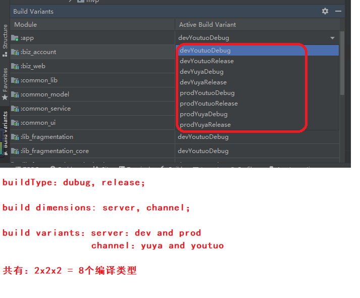

## 一、需求

在开发过程中，需要编译连接不同服务器的应用版本，如连接测试服务器和正式服务器的版本，以前的做法是，将测试服务器和正式服务器的连接地址写在代码里，每次编译连接不同服务器的应用时，手动去修改代码。

有没有一种简便的方法可以在代码不用修改的情况下，全自动编译出连接不同服务器的应用？答案是肯定的，采用Android的编译变体的方式，我们可以轻松实现这个需求。

## 二、编译build的变体

[android build的变体--官网](https://developer.android.com/studio/build?hl=zh-cn)

### step1： 修改模块的build.gradle文件，添加针对不同服务器的build变体，并在变体中定义网络地址变量。

在模块的build.gradle文件中，在android闭包中，添加一个flavor的维度：server，该维度下，定义两个变体：

dev：对应开发环境的各种网络地址配置；

prod：对应生产环境的各种网络地址配置：

```groovy

android {
    flavorDimensions "server"
    productFlavors {
        dev {
            dimension "server"
            buildConfigField "String", "BASE_URL", "\"http://47.114.170.65:9996/api\""
            buildConfigField "String", "BASE_MESSAGE_URL", "\"http://47.114.170.65:9997/api\""
            buildConfigField "String", "BASE_H5_URL", "\"http://47.114.170.65:9999\""
        }

        prod {
            dimension "server"
            buildConfigField "String", "BASE_URL", "\"http://parent.iyuya.com/api\""
            buildConfigField "String", "BASE_MESSAGE_URL", "\"http://message.iyuya.com/api\""
            buildConfigField "String", "BASE_H5_URL", "\"http://html5.iyuya.com\""
        }
    }
}

```

在上面的闭包中，我们定义好了不同环境下的网络地址变量。


### step2: 编译build变体

配置好变体后，可以看到在android studio的build variant中，已经生成好了不同的变体。我们只需要选择某一个变体，编译即可。



采用上面的配置变量的方式，会在该build变体的编译过程中，生成一个名为buildConfig的java文件，我们定义的变量中会作为该类的成员变量，我们在代码中直接读取即可。

### step3：在代码中读取网络地址变量。

采用上面的配置变量的方式，会在该build变体的编译过程中，生成一个名为buildConfig的java文件，我们定义的变量中会作为该类的成员变量，我们在代码中直接读取即可。

```kotlin

import com.yuya.parent.lib.BuildConfig

object Constants {
    const val BASE_URL = BuildConfig.BASE_URL
    const val BASE_MESSAGE_URL = BuildConfig.BASE_MESSAGE_URL
    const val BASE_H5_URL = BuildConfig.BASE_H5_URL
    const val BASE_MEDIA_URL = "http://pic.iyuya.com/"
}

```

## 三、重命名APK

首先在gradle中编写一个读取当前flavor编译类型的函数

```
def getCurrentFlavor() {
    Gradle gradle = getGradle()
    String  tskReqStr = gradle.getStartParameter().getTaskRequests().toString()

    Pattern pattern

    if( tskReqStr.contains( "assemble" ) )
        pattern = Pattern.compile("assemble(\\w+)(Release|Debug)")
    else
        pattern = Pattern.compile("generate(\\w+)(Release|Debug)")

    Matcher matcher = pattern.matcher( tskReqStr )

    if( matcher.find() )
        return matcher.group(1).toLowerCase()
    else
    {
        println "NO MATCH FOUND"
        return ""
    }
}

```


然后修改outputFileName的值：

```

  android.applicationVariants.all { variant ->
        variant.outputs.all {
            def date = new Date().format("yyyyMMdd" , TimeZone.getTimeZone("GMT+08"))
            def flavorName = getCurrentFlavor()
            if(variant.buildType.name == 'debug'){
                outputFileName = "parent_${flavorName}_v${versionName}_${date}.apk"
            }
            if(variant.buildType.name == 'release'){
                outputFileName = "parent_${flavorName}_v${versionName}_${date}_release.apk"
            }
        }
    }

```

