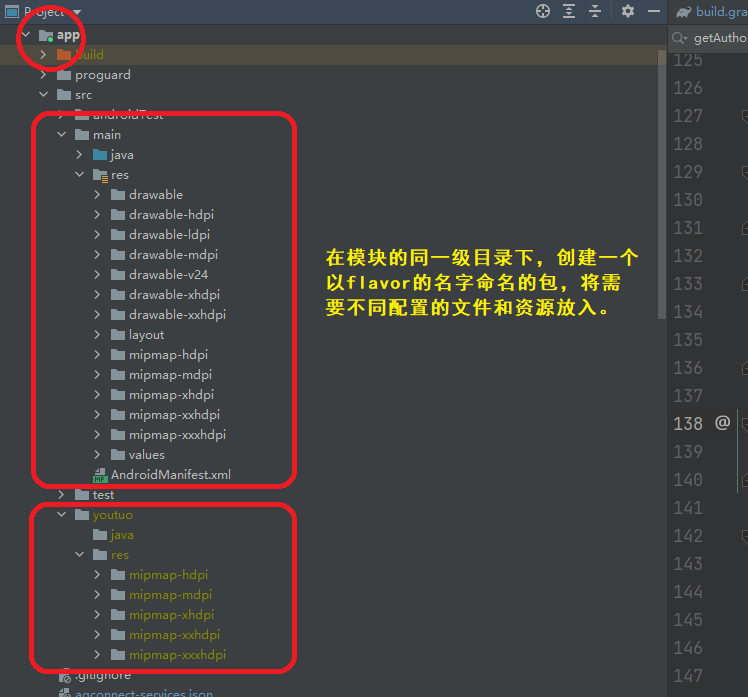

## 需求

将某个应用换一套皮肤、第三方账号、后台服务器，改个名字上线，并且以后的新功能同步进行更新。

## 配置过程

### step1：配置application id

在app模块的build.gradle文件中，创建风味维度flavor的dimensions

将applicationId， versionName，versionCode，app_name从默认的defaultConfig中抽取出来。 这四项和编译相关，直接将变量定义和配置在顶层的build.gradle文件中。

```
ext {
    android = [
            compileSdkVersion: 30,
            buildToolsVersion: "28.0.3",
            minSdkVersion    : 21,
            targetSdkVersion : 29,


            //育伢app
            applicationId_yuya    : "com.yuya.parent",
            appName_yuya          : "育伢",
            versionCode_yuya      : 381,
            versionName_yuya      : "3.8.1",

            //幼托App
            applicationId_youtuo    : "com.youtuo.parent",
            appName_youtuo          : "幼托宝贝",
            versionCode_youtuo      : 381,
            versionName_youtuo      : "3.8.1",
    ]

    version = [
            supportLibraryVersion   : "1.0.0",
            androidSupportSdkVersion: "28.0.0",
            rxLifecycle2SdkVersion  : "2.0.1",
            rxLifecycle3SdkVersion  : "3.0.0",
            espressoSdkVersion      : "2.2.2"
    ]

    dependencies = [
          
            //解析html
            "html-textview"                        :'com.zzhoujay.richtext:richtext:3.0.8',
            "html"                                 :'com.zzhoujay:html:1.0.1',
            //photo chooser
            //"picture-selector"                     : 'io.github.lucksiege:pictureselector:v2.7.0-rc02',
            "silicompressor"                       :'com.googlecode.mp4parser:isoparser:1.0.6',
            //新手引导层
            "NewbieGuide"                          :'com.github.huburt-Hu:NewbieGuide:v2.4.0',
            //角标
            "ShortcutBadger"                       :"me.leolin:ShortcutBadger:1.1.22@aar"
    ]
}

```

模块下的build.gradle文件如下：

```
  flavorDimensions "server","channel" 
    productFlavors {
        dev {
            dimension "server"
        }

        prod {
            dimension "server"
        }

        yuya {
            dimension "channel"
            applicationId rootProject.ext.android["applicationId_yuya"]
            versionCode rootProject.ext.android["versionCode_yuya"]
            versionName rootProject.ext.android["versionName_yuya"]

            resValue "string", "app_name", "\"${rootProject.ext.android["appName_yuya"]}\""

            manifestPlaceholders = [
                    //个推
                    GETUI_APP_ID : "0PrKxNCjaDAek1kl4wjQy7",
                    GETUI_APP_KEY : "5wKqkXcEG17nHQb6CVKbB7",
                    GETUI_APP_SECRET : "vusnofr4pi6P5xVjZJ42b4",
                    // 小米相关应用参数
                    XIAOMI_APP_ID  : "2882303761518972740",
                    XIAOMI_APP_KEY : "5481897293740",

                    // OPPO 相关应用参数
                    OPPO_APP_KEY   : "a62910afdc02421cbb9740a52dc78e8e",
                    OPPO_APP_SECRET: "b0481c207c0245fea5c0ceef4f9e9afd",

                    // VIVO 相关应用参数
                    VIVO_APP_ID    : "105462490",
                    VIVO_APP_KEY   : "19ca7dce760122ba8e4c1aad48eac134"
            ]
        }

        youtuo {
            dimension "channel"
            applicationId rootProject.ext.android["applicationId_youtuo"]
            versionCode rootProject.ext.android["versionCode_youtuo"]
            versionName rootProject.ext.android["versionName_youtuo"]

            resValue "string", "app_name", "\"${rootProject.ext.android["appName_youtuo"]}\""

            manifestPlaceholders = [
                    //个推
                    GETUI_APP_ID : "0PrKxNCjaDAek1kl4wjQy7",
                    GETUI_APP_KEY : "5wKqkXcEG17nHQb6CVKbB7",
                    GETUI_APP_SECRET : "vusnofr4pi6P5xVjZJ42b4",
                    // 小米相关应用参数
                    XIAOMI_APP_ID  : "2882303761518972740",
                    XIAOMI_APP_KEY : "5481897293740",

                    // OPPO 相关应用参数
                    OPPO_APP_KEY   : "a62910afdc02421cbb9740a52dc78e8e",
                    OPPO_APP_SECRET: "b0481c207c0245fea5c0ceef4f9e9afd",

                    // VIVO 相关应用参数
                    VIVO_APP_ID    : "105462490",
                    VIVO_APP_KEY   : "19ca7dce760122ba8e4c1aad48eac134"
            ]
            //签名文件
           // signingConfig signingConfigs.app1
        }
    }

```

配置完成后，defaultConfig的配置变成下面的样式：

```
   defaultConfig {
       // flavorDimensions "none"
        minSdkVersion rootProject.ext.android["minSdkVersion"]
        targetSdkVersion rootProject.ext.android["targetSdkVersion"]
        consumerProguardFiles proFiles(projectDir, 'proguard')
        kapt {
            arguments {
                arg("AROUTER_MODULE_NAME", project.getName())
            }
        }
        multiDexEnabled true


        testInstrumentationRunner "androidx.test.runner.AndroidJUnitRunner"
    }

```


### step2：配置华为应用的flavor

华为应用市场，需要AppGalleryConnect的插件设置

首先，在华为应用市场的官网中，为app设置项目，并将原来的app加入到项目中。如果已经设置好，则在项目中添加一个应用。

应用添加完成后，根据提示，下载配置文件到项目模块的根目录下，重新编译即可。


### step3：配置应用图标

在 main 的同级目录下创建以渠道名命名的文件夹，然后创建资源文件（路径要与 main 中的一致），然后打包的时候 gradle 就会自己替换或者合并资源。 替换图片和合并颜色的原理也相似。必须名称统一使用！



### step4: ContentProvider的配置

如果在应用中定义了content provider，则需要修改content provider 的authority的名称。因为android:authorities是不可以重复的，如果两个app中定义了相同的，则后者无法安装到手机中。

```xml

<!-- fileProvider 用于兼容7.0 添加可用权限的文件目录-->
        <provider
            android:name="android.support.v4.content.FileProvider"
            android:authorities="${applicationId}.fileprovider"
            android:exported="false"
            android:grantUriPermissions="true">
            <!--元数据-->
            <meta-data
                android:name="android.support.FILE_PROVIDER_PATHS"
                android:resource="@xml/file_provider_paths"/>
        </provider>

```

如果content provider 的authority是写在代码中的，则需要：

```java
  static String getAuthorities(@NonNull Context context) {
		return context.getApplicationInfo().packageName  + FILE_PROVIDER_AUTHORITY;
       // return context.getPackageName() + FILE_PROVIDER_AUTHORITY;
    }

```

