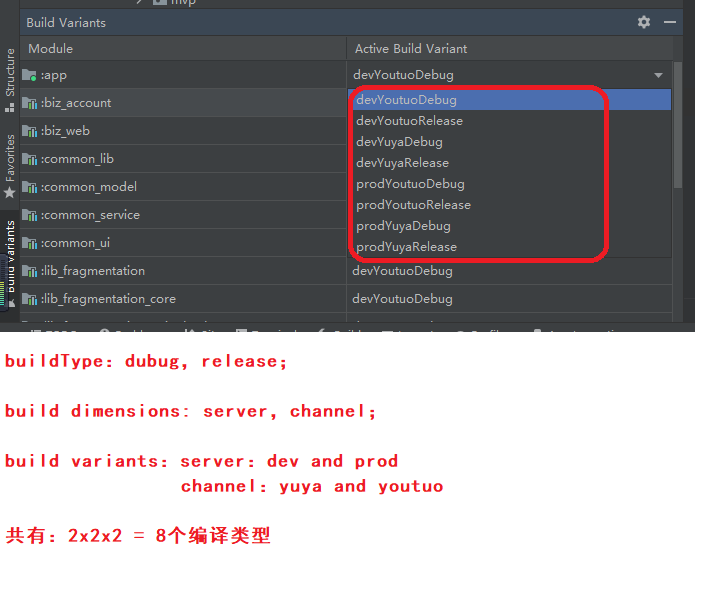

## 方法一、通过resValue设置变量，相当于向res目录下的文件中追加字段

```xml
productFlavors {
    dev {
        resValue "string", "app_name", "dev_myapp"
        resValue "bool", "isrRank", 'false'
    }
    stage {
        resValue "string", "app_name", "stage_myapp"
        resValue "bool", "isrRank", 'true'
    }
    prod {
        resValue "string", "app_name", "myapp"
        resValue "bool", "isrRank", 'true'
    }
}
```

利用 resValue 来定义资源的值，顾名思义 res 底下的内容应该都可以创建，最后用 R.xxx.xxx 来引用。
注意：这里是添加，不是覆盖，不能与res文件中已有的资源文件冲突。

resValue可以配置一些我们需要的不同的值，第一个参数是变量的类型，第二个参数key，第三个参数是变量的value。

具体的使用

value=context.getResources().getString(R.string.key)


## 方法二、设置manifestPlaceholders，相当于设置manifest.xml文件中的标签值

### step1：首先需要在manifest.xml中定义一个变量：

```

<application
    android:icon="@mipmap/ic_launcher"
    android:label="${k_appName}" // 这里取k_appName
>

```

### step2：在build.gradle中设置该变量的值：

```
android {
    ... ...
    defaultConfig{
        ... ...
        manifestPlaceholders = [k_appName : "哈啰"]   // 设置默认的k_appName
    }
    
    // 依据debug/release变动的话设置如下
    buildTypes {
        debug {
            manifestPlaceholders = [k_appName : "Debug哈啰"]
        }
    }
    
    
    // 依据flavors变动的话设置如下
    productFlavors {
        autoTest {
            manifestPlaceholders = [k_appName : "AT哈啰"]
        }
        
        appStore {
            // do nothing
        }
    }
}

```

## 方法三、设置buildConfigField的值，相当于设置BuildConfig文件的变量

### step1：修改模块的build.gradle文件，添加针对不同服务器的build变体，并在变体中变量。

在模块的build.gradle文件中，在android闭包中，添加一个flavor的维度：server，该维度下，定义两个变体：

dev：对应开发环境的各种网络地址配置；

prod：对应生产环境的各种网络地址配置：

```groovy

android {
    flavorDimensions "server"
    productFlavors {
        dev {
            dimension "server"
            buildConfigField "String", "BASE_URL", "\"http://47.114.170.65:9996/api\""
            buildConfigField "String", "BASE_MESSAGE_URL", "\"http://47.114.170.65:9997/api\""
            buildConfigField "String", "BASE_H5_URL", "\"http://47.114.170.65:9999\""
        }

        prod {
            dimension "server"
            buildConfigField "String", "BASE_URL", "\"http://parent.iyuya.com/api\""
            buildConfigField "String", "BASE_MESSAGE_URL", "\"http://message.iyuya.com/api\""
            buildConfigField "String", "BASE_H5_URL", "\"http://html5.iyuya.com\""
        }
    }
}

```

在上面的闭包中，我们定义好了不同环境下的网络地址变量。


### step2: 编译build变体

配置好变体后，可以看到在android studio的build variant中，已经生成好了不同的变体。我们只需要选择某一个变体，编译即可。



采用上面的配置变量的方式，会在该build变体的编译过程中，生成一个名为buildConfig的java文件，我们定义的变量中会作为该类的成员变量，我们在代码中直接读取即可。

### step3：在代码中读取网络地址变量。

采用上面的配置变量的方式，会在该build变体的编译过程中，生成一个名为buildConfig的java文件，我们定义的变量中会作为该类的成员变量，我们在代码中直接读取即可。

```kotlin

import com.yuya.parent.lib.BuildConfig

object Constants {
    const val BASE_URL = BuildConfig.BASE_URL
    const val BASE_MESSAGE_URL = BuildConfig.BASE_MESSAGE_URL
    const val BASE_H5_URL = BuildConfig.BASE_H5_URL
    const val BASE_MEDIA_URL = "http://pic.iyuya.com/"
}

```

## 方法四、直接在工程build.gradle文件中定义或者引用

### step1： 创建一个config.gradle文件，在里面定义变量

```
ext {
    android = [
            compileSdkVersion: 30,
            buildToolsVersion: "28.0.3",
            minSdkVersion    : 21,
            targetSdkVersion : 29,

            //育伢app
            applicationId_yuya    : "com.yuya.parent",
            appName_yuya          : "育伢",
            versionCode_yuya      : 381,
            versionName_yuya      : "3.8.1",
    ]

    version = [
            supportLibraryVersion   : "1.0.0",
            androidSupportSdkVersion: "28.0.0",
            rxLifecycle2SdkVersion  : "2.0.1",
            rxLifecycle3SdkVersion  : "3.0.0",
            espressoSdkVersion      : "2.2.2"
    ]

    dependencies = [
            
            // test
            "junit"                                : "junit:junit:4.12",
            "testRunner"                           : 'androidx.test:runner:1.1.0-alpha4',
            "androidJUnitRunner"                   : "android.support.test.runner.AndroidJUnitRunner",
            "espresso-core"                        : "androidx.test.espresso:espresso-core:3.1.0-alpha4",

            "multidex"                             : "com.android.support:multidex:1.0.3",

            "eventbus"                             : "org.greenrobot:eventbus:3.1.1",

            //角标
            "ShortcutBadger"                       :"me.leolin:ShortcutBadger:1.1.22@aar"
    ]
}

```

### step2： 在工程的build.gradle文件中，引用config.gradle文件

```
// Top-level build file where you can add configuration options common to all sub-projects/modules.

import java.util.regex.Matcher
import java.util.regex.Pattern

apply from: "config.gradle"


buildscript {
    ext.kotlin_version = '1.3.61'
    repositories {
        maven { url 'https://maven.aliyun.com/repository/google' }
        maven { url 'https://maven.aliyun.com/repository/public' }
        maven { url 'https://maven.aliyun.com/repository/gradle-plugin' }
        maven { url 'https://maven.aliyun.com/repository/jcenter' }
        maven { url 'https://maven.aliyun.com/repository/central' }

        maven { url "https://www.jitpack.io" }

        //个推相关
        maven { url "http://mvn.gt.getui.com/nexus/content/repositories/releases/" }
        maven { url 'https://developer.huawei.com/repo/' }

        google()
        mavenCentral()
    }
    dependencies {
        classpath 'com.android.tools.build:gradle:4.2.0'
        classpath "org.jetbrains.kotlin:kotlin-gradle-plugin:1.5.30"
        classpath 'com.huawei.agconnect:agcp:1.4.1.300'
        // NOTE: Do not place your application dependencies here; they belong
        // in the individual module build.gradle files
        classpath 'com.tencent.bugly:symtabfileuploader:latest.release'
    }
}


allprojects {
    repositories {

        flatDir {
            dirs 'libs'
        }
        maven { url 'https://maven.aliyun.com/repository/google' }
        maven { url 'https://maven.aliyun.com/repository/public' }
        maven { url 'https://maven.aliyun.com/repository/gradle-plugin' }
        maven { url 'https://maven.aliyun.com/repository/jcenter' }
        maven { url 'https://maven.aliyun.com/repository/central' }

        maven { url "https://www.jitpack.io" }

        maven { url "http://mvn.gt.getui.com/nexus/content/repositories/releases/" }
        maven { url 'https://developer.huawei.com/repo/' }

        google()
        mavenCentral()
    }


}

task clean(type: Delete) {
    delete rootProject.buildDir
}

```

### step3：在gradle文件中使用

```
    flavorDimensions "server","channel" // add this line
    productFlavors {
        dev {
            dimension "server"
        }

        prod {
            dimension "server"
        }

        yuya {
            dimension "channel"
            applicationId rootProject.ext.android["applicationId_yuya"]
            versionCode rootProject.ext.android["versionCode_yuya"]
            versionName rootProject.ext.android["versionName_yuya"]

            resValue "string", "app_name", "\"${rootProject.ext.android["appName_youtuo"]}\""

            manifestPlaceholders = [
                    //个推
                    GETUI_APP_ID : "0PrKxNCjaDAek1kl4wjQy7",
                    GETUI_APP_KEY : "5wKqkXcEG17nHQb6CVKbB7",
                    GETUI_APP_SECRET : "vusnofr4pi6P5xVjZJ42b4",
                    // 小米相关应用参数
                    XIAOMI_APP_ID  : "2882303761518972740",
                    XIAOMI_APP_KEY : "5481897293740",

                    // OPPO 相关应用参数
                    OPPO_APP_KEY   : "a62910afdc02421cbb9740a52dc78e8e",
                    OPPO_APP_SECRET: "b0481c207c0245fea5c0ceef4f9e9afd",

                    // VIVO 相关应用参数
                    VIVO_APP_ID    : "105462490",
                    VIVO_APP_KEY   : "19ca7dce760122ba8e4c1aad48eac134"
            ]
        }
```