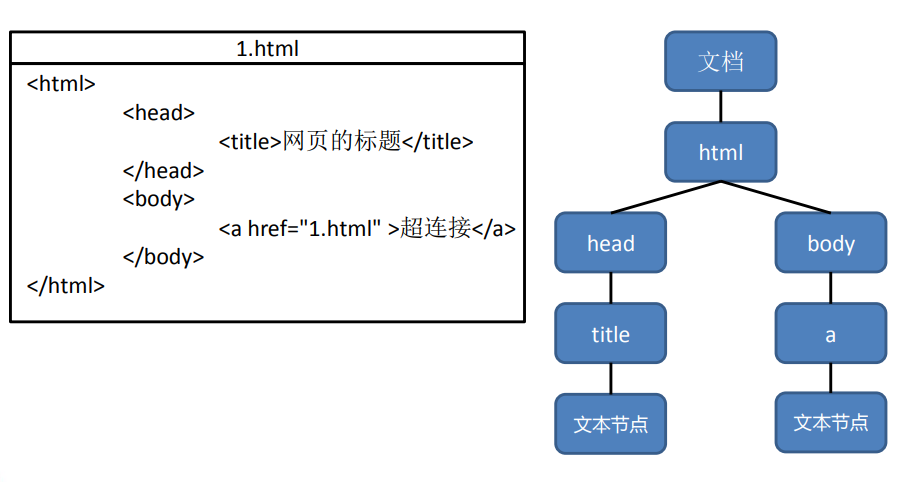

- [一、JavaScript简介](#一javascript简介)
  - [1.1 javascript历史](#11-javascript历史)
  - [1.2 JavaScript特点](#12-javascript特点)
  - [1.3 Javascript最新规范](#13-javascript最新规范)
- [二、JavaScript基本语法](#二javascript基本语法)
  - [2.1 JavaScript代码位置--script标签](#21-javascript代码位置--script标签)
  - [2.2 大小写敏感](#22-大小写敏感)
  - [2.3 注释](#23-注释)
  - [2.4 标识符](#24-标识符)
  - [2.5 关键字和保留字](#25-关键字和保留字)
  - [2.6 变量](#26-变量)
  - [2.7 常量](#27-常量)
  - [2.8 数据类型](#28-数据类型)
    - [2.8.1 数值型（Number）](#281-数值型number)
    - [2.8.2 BigInt 类型](#282-bigint-类型)
    - [2.8.3 字符串型（String）](#283-字符串型string)
    - [2.8.4 布尔类型（Boolean）](#284-布尔类型boolean)
    - [2.8.5 null值](#285-null值)
    - [2.8.6 undefined 值](#286-undefined-值)
    - [2.8.7 Object 类型和 Symbol 类型](#287-object-类型和-symbol-类型)
    - [2.8.8 typeof运算符](#288-typeof运算符)
  - [2.9 交互alert、prompt和confirm](#29-交互alertprompt和confirm)
    - [2.9.1 alert](#291-alert)
    - [2.9.2 prompt](#292-prompt)
  - [2.9.3 confirm](#293-confirm)
  - [2.10 类型转换](#210-类型转换)
    - [2.10.1 字符串转换](#2101-字符串转换)
    - [2.10.2 数字型转换](#2102-数字型转换)
    - [2.10.3 布尔型转换](#2103-布尔型转换)
  - [2.11 运算符](#211-运算符)
    - [2.11.1 算数运算符](#2111-算数运算符)
    - [2.11.2 逻辑操作符](#2112-逻辑操作符)
    - [2.11.3 赋值运算符](#2113-赋值运算符)
    - [2.11.4 关系运算符](#2114-关系运算符)
  - [2.12 语句](#212-语句)
    - [2.12.1 语句和代码块](#2121-语句和代码块)
    - [2.12.2 条件语句](#2122-条件语句)
      - [2.12.2.1 if...else语句](#21221-ifelse语句)
      - [2.12.2.2 switch...case语句](#21222-switchcase语句)
    - [2.12.3 循环语句](#2123-循环语句)
      - [2.12.3.1 while](#21231-while)
      - [2.12.3.2 do...while](#21232-dowhile)
      - [2.12.3.3 for](#21233-for)
    - [2.12.4 break和continue](#2124-break和continue)
    - [2.12.5 label](#2125-label)
- [三、函数](#三函数)
  - [3.1 函数声明](#31-函数声明)
  - [3.2 函数调用](#32-函数调用)
  - [3.3 局部变量](#33-局部变量)
  - [3.4 外部变量](#34-外部变量)
  - [3.5 全局变量](#35-全局变量)
  - [3.6 参数](#36-参数)
  - [3.7 参数默认值](#37-参数默认值)
  - [3.8 返回值](#38-返回值)
  - [3.9 函数表达式](#39-函数表达式)
    - [3.9.1 函数表达式定义](#391-函数表达式定义)
    - [3.9.2 函数是一个值](#392-函数是一个值)
    - [3.9.3 回调函数](#393-回调函数)
    - [3.9.4 函数表达式 vs 函数声明](#394-函数表达式-vs-函数声明)
  - [3.10 箭头函数](#310-箭头函数)
- [四、对象](#四对象)
  - [4.1 对象](#41-对象)
    - [4.1.1 对象定义](#411-对象定义)
    - [4.1.2 创建Object对象](#412-创建object对象)
  - [4.2 对象的属性](#42-对象的属性)
    - [4.2.1 对象属性的访问](#421-对象属性的访问)
    - [4.2.2 属性操作](#422-属性操作)
  - [4.3 对象的方法](#43-对象的方法)
    - [4.3.1 方法的定义](#431-方法的定义)
    - [4.3.2 方法中的this](#432-方法中的this)
  - [4.4 构造函数和new操作符](#44-构造函数和new操作符)
  - [4.5 引用数据类型和对象](#45-引用数据类型和对象)
  - [4.5 数组对象](#45-数组对象)
  - [4.7 map对象](#47-map对象)
  - [4.8 date对象](#48-date对象)
- [五、类](#五类)
  - [5.1 类定义](#51-类定义)
- [六、模块](#六模块)
  - [6.1 模块定义](#61-模块定义)
  - [6.2 export和import](#62-export和import)
- [七、DOM](#七dom)
  - [7.1 DOM基本概念](#71-dom基本概念)
  - [7.2 节点](#72-节点)
    - [7.2.1 节点概念](#721-节点概念)
    - [7.2.2 文档节点 document](#722-文档节点-document)
    - [7.2.3 元素节点 element](#723-元素节点-element)
    - [7.2.4 文本节点](#724-文本节点)
    - [7.2.5 属性节点](#725-属性节点)
    - [7.2.6 节点和属性获取](#726-节点和属性获取)
  - [7.3 如何访问DOM](#73-如何访问dom)
- [八、事件](#八事件)
  - [8.1 为事件绑定程序](#81-为事件绑定程序)
    - [8.1.1 通过HTML元素指定事件属性来绑定](#811-通过html元素指定事件属性来绑定)
    - [8.1.2 通过DOM对象指定的属性来绑定](#812-通过dom对象指定的属性来绑定)
    - [8.1.3 设置事件监听器](#813-设置事件监听器)
  - [8.2 事件处理中的this](#82-事件处理中的this)
  - [8.3 事件的触发](#83-事件的触发)
  - [8.4 事件的传播](#84-事件的传播)
- [九、BOM](#九bom)
  - [9.1 window对象](#91-window对象)
  - [9.2 系统对话框](#92-系统对话框)
  - [9.3 location对象](#93-location对象)
  - [9.4 navigator对象](#94-navigator对象)
  - [9.5 screen对象](#95-screen对象)
  - [9.6 history对象](#96-history对象)
  - [9.7 其他](#97-其他)
  
  
# 一、JavaScript简介

## 1.1 javascript历史

JavaScript诞生于1995年，它的出现主要是用于处理网页中的前端验证。所谓的前端验证，就是指检查用户输入的内容是否符合一定的规则。比如：用户名的长度，密码的长度，邮箱的格式等。

JavaScript是由网景公司发明，起初命名为LiveScript，后来由于SUN公司的介入更名为了JavaScript。 1996年微软公司在其最新的IE3浏览器中引入了自己对JavaScript的实现JScript。 于是在市面上存在两个版本的JavaScript，一个网景公司的JavaScript和微软的JScript。 为了确保不同的浏览器上运行的JavaScript标准一致，所以几个公司共同定制了JS的标准名命名为ECMAScript。

实际上，javascript由下面三个部分组成：


## 1.2 JavaScript特点

– 解释型语言

JavaScript是一门解释型语言，所谓解释型值语言不需要被编译为机器码在执行，而是直接执行。由于少了编译这一步骤，所以解释型语言开发起来尤为轻松，但是解释型语言运行较慢也是它的劣势。不过解释型语言中使用了JIT技术，使得运行速度得以改善。

– 类似于 C 和 Java 的语法结构

JavaScript的语法结构与C和Java很像，向for、if、while等语句和Java的基本上是一模一样的，所以有过C和Java基础的同学学习起来会轻松很多。不过JavaScript和与Java的关系也仅仅是看起来像而已

– 动态语言

JavaScript是一门动态语言，所谓的动态语言可以暂时理解为在语言中的一切内容都是不确定的。比如一个变量，这一时刻是个整型，下一时刻可能会变成字符串了。动态语言相比静态语言性能上要差一些，不过
由于JavaScript中应用的JIT技术，所以JS可能是运行速度最快的动态语言了。

– 基于原型的面向对象

Java也是一门面向对象的语言，但是与Java不同JavaScript是基于原型的面向对象。

## 1.3 Javascript最新规范

在下面的链接中可以看到ecma最新的ecmascript的规范：

 * [JavaScript最新规范](https://tc39.es/ecma262/)


# 二、JavaScript基本语法

## 2.1 JavaScript代码位置--script标签

我们几乎可以使用 `<script>` 标签将 JavaScript 程序插入到 HTML 文档的任何位置。

HTML 中的 Javascript 脚本代码必须位于 <script> 与 </script> 标签之间。Javascript 脚本代码可被放置在 HTML 页面的 `<body>` 和 `<head>`部分中。

```html
<!DOCTYPE html>
<html>
<head>

<script type="text/javascript">
    console.log("Hello World");
</script>

</head>

<body>

<h1>我的第一个页面</h1>
<p>我的第一个段落。</p>

<script>
window.alert(5 + 6);
</script>

</body>
</html>
```
><script> 标签有一些现在很少用到的特性（attribute），但是我们可以在老代码中找到它们：
>
>type 特性：<script type=…>
>在老的 HTML4 标准中，要求 script 标签有 type 特性。通常是 type="text/javascript"。这样的特性声明现在已经不再需要。而且，现代 HTML 标准已经完全改变了此特性的含义。现在，它可以用于 JavaScript 模块。但这是一个高阶话题，我们将在本教程的另一部分中探讨 JavaScript 模块。
>
>language 特性：<script language=…>
>这个特性是为了显示脚本使用的语言。这个特性现在已经没有任何意义，因为语言默认就是 JavaScript。不再需要使用它了。

* 外部脚本

如果你有大量的 JavaScript 代码，我们可以将它放入一个单独的文件。

脚本文件可以通过 src 特性（attribute）添加到 HTML 文件中。

```html
<!--/path/to/script.js 是脚本文件从网站根目录开始的绝对路径。
当然也可以提供当前页面的相对路径。
例如，src ="script.js"，就像 src="./script.js"，表示当前文件夹中的 "script.js" 文件。
-->

<script src="/path/to/script.js"></script>

<!--
  我们也可以提供一个完整的 URL 地址，例如：
-->

<script src="https://cdnjs.cloudflare.com/ajax/libs/lodash.js/4.17.11/lodash.js"></script>

<!--
  要附加多个脚本，请使用多个标签：
  -->

<script src="/js/script1.js"></script>
<script src="/js/script2.js"></script>
```

## 2.2 大小写敏感

JavaScript是严格区分大小写的，也就是abc和Abc会被解析器认为是两个不同的东西。所以在编写JavaScript教程时，一定要注意区分大小写。

## 2.3 注释

注释中的内容不会被解析器解析执行，但是会在源码中显示，我们一般会使用注释对程序中的内容进行解释。

JS中的注释和Java的的一致，分为两种：

– 单行注释：//注释内容

– 多行注释：/*注释内容*/


## 2.4 标识符

所谓标识符，就是指变量、函数、属性的名字，或函数的参数。

标识符可以是按照下列格式规则组合起来的一或多个字符：

– 第一个字符必须是一个字母、下划线（ _ ）或一个美元符号（ $ ）。

– 其他字符可以是字母、下划线、美元符号或数字。

按照惯例，ECMAScript 标识符采用驼峰命名法。但是要注意的是JavaScript中的标识符不能是关键字和保留字符。

## 2.5 关键字和保留字

* 关键字

break do instanceof typeof case else new var catch finally return void continue for switch while default if throw delete in try function this with debugger false true null

* 保留字符
class enum extends super const export import implements let private public yield interface package protected static


* 其他不建议使用的标识符

abstract double goto native static boolean enum implements package super byte export import private synchronize char extends int protected throws class final interface public transient const float long short volatile arguments encodeURI Infinity Number RegExp undefined isFinite Object String Boolean Error RangeError parseFloat SyntaxError Date eval JSON ReferenceError TypeError decodeURI EvalError Math URIError decodeURIComponent Function NaN isNaN parseInt Array encodeURICOmponent

## 2.6 变量

变量是数据的“命名存储”。我们可以使用变量来保存商品、访客和其他信息。

如果将变量想象成一个“数据”的盒子，盒子上有一个唯一的标注盒子名字的贴纸。这样我们能更轻松地掌握“变量”的概念。

例如，变量 message 可以被想象成一个标有 "message" 的盒子，盒子里面的值为 "Hello!".我们可以在盒子内放入任何值。并且，这个盒子的值，我们想改变多少次，就可以改变多少次：当值改变的时候，之前的数据就被从变量中删除了：


变量的声明：

使用let关键字声明一个变量。
```js
let message;
```

现在，我们可以通过赋值运算符 = 为变量添加一些数据：
```js
let message;

message = 'Hello'; // 将字符串 'Hello' 保存在名为 message 的变量中
```

现在这个字符串已经保存到与该变量相关联的内存区域了，我们可以通过使用该变量名称访问它：
```js
let message;
message = 'Hello!';

alert(message); // 显示变量内容
```

简洁一点，我们可以将变量定义和赋值合并成一行：

```js
let message = 'Hello!'; // 定义变量，并且赋值

alert(message); // Hello!
```

也可以在一行中声明多个变量：
```js
let user = 'John', age = 25, message = 'Hello';
```
看上去代码长度更短，但并不推荐这样。为了更好的可读性，请一行只声明一个变量。


在ecma6中废弃了var定义变量的方式。因为var方式定义的变量有以下的缺陷：

1、var没有块级作用域，定义后，其作用域为函数内部或者全局；

2、var允许重新声明；

3、var变量有提升的隐喻。即变量可以未声明先使用，其值为undefined；

因此，let方式定义的变量天然不具有上述的三个特则。

变量命名的规则：

1、变量名称必须仅包含字母、数字、符号 $ 和 _。

2、首字符必须非数字。

3、如果命名包括多个单词，通常采用驼峰命名方法。


## 2.7 常量

声明一个常数（不变）变量，可以使用 const 而非 let：

```js
const myBirthday = '18.04.1982';
```

使用 const 声明的变量称为“常量”。它们不能被修改，如果你尝试修改就会发现报错：
```js
const myBirthday = '18.04.1982';

myBirthday = '01.01.2001'; // 错误，不能对常量重新赋值
```

当程序员能确定这个变量永远不会改变的时候，就可以使用 const 来确保这种行为，并且清楚地向别人传递这一事实。

一个普遍的做法是将常量用作别名，以便记住那些在执行之前就已知的难以记住的值。使用大写字母和下划线来命名这些常量。

例如，让我们以所谓的“web”（十六进制）格式为颜色声明常量：

```js
const COLOR_RED = "#F00";
const COLOR_GREEN = "#0F0";
const COLOR_BLUE = "#00F";
const COLOR_ORANGE = "#FF7F00";

// ……当我们需要选择一个颜色
let color = COLOR_ORANGE;
alert(color); // #FF7F00
```

## 2.8 数据类型

在 JavaScript 中有8种基本的数据类型（译注：7 种原始类型和 1 种引用类型）。

我们可以将任何类型的值存入变量。例如，一个变量可以在前一刻是个字符串，下一刻就存储一个数字：

```js
// 没有错误
let message = "hello";
message = 123456;
```

允许这种操作的编程语言，例如 JavaScript，被称为“动态类型”（dynamically typed）的编程语言，意思是虽然编程语言中有不同的数据类型，但是你定义的变量并不会在定义后，被限制为某一数据类型。

### 2.8.1 数值型（Number）

Number 类型用来表示整数和浮点数，最常用的功能就是用来表示10进制的整数和浮点数。数字可以有很多操作，比如，乘法 *、除法 /、加法 +、减法 - 等等。


特殊数值：Infinity、-Infinity和NaN

Number表示的数字大小是有限的，范围是：± 1.7976931348623157e+308如果超过了这个范围，则会返回± Infinity（正无穷和负无穷）

NaN，即非数值（Not a Number）是一个特殊的数值，JS中当对数值进行计算时没有结果返回，则返回NaN。

0b 开头表示二进制，但是不是所有的浏览器都支持
0 开头表示八进制

0x 开头表示十六进制

其他类型的数据转换为数值类型：

- Number()可以用来转换任意类型的数据为数值类型；

- parseInt()将字符串转换为整数；

- 而parseFloat()将字符串转换为浮点数
		
使用typeof检查一个Number类型的数据时，会返回"number"

### 2.8.2 BigInt 类型

在 JavaScript 中，“number” 类型无法安全地表示大于 (2^53-1)（即 9007199254740991），或小于 -(2^53-1) 的整数。

更准确的说，“number” 类型可以存储更大的整数（最多 1.7976931348623157 * 10308），但超出安全整数范围 ±(253-1) 会出现精度问题，因为并非所有数字都适合固定的 64 位存储。因此，可能存储的是“近似值”。

例如，这两个数字（正好超出了安全整数范围）是相同的：
```
console.log(9007199254740991 + 1); // 9007199254740992
console.log(9007199254740991 + 2); // 9007199254740992
也就是说，所有大于 (253-1) 的奇数都不能用 “number” 类型存储。
```

在大多数情况下，±(253-1) 范围就足够了，但有时候我们需要整个范围非常大的整数，例如用于密码学或微秒精度的时间戳。

BigInt 类型是最近被添加到 JavaScript 语言中的，用于表示任意长度的整数。

可以通过将 n 附加到整数字段的末尾来创建 BigInt 值。

```
// 尾部的 "n" 表示这是一个 BigInt 类型
const bigInt = 1234567890123456789012345678901234567890n;
```

### 2.8.3 字符串型（String）

String用于表示一个字符序列，即字符串。JavaScript 中的字符串必须被括在引号里。

在 JavaScript 中，有三种包含字符串的方式。

```js
双引号："Hello".

单引号：'Hello'.

反引号：`Hello`.
```
双引号和单引号都是“简单”引用，在 JavaScript 中两者几乎没有什么差别。

反引号是 功能扩展 引号。它们允许我们通过将变量和表达式包装在 ${…} 中，来将它们嵌入到字符串中。例如：

```js
let name = "John";

// 嵌入一个变量
alert( `Hello, ${name}!` ); // Hello, John!

// 嵌入一个表达式
alert( `the result is ${1 + 2}` ); // the result is 3
```

${…} 内的表达式会被计算，计算结果会成为字符串的一部分。可以在 ${…} 内放置任何东西：诸如名为 name 的变量，或者诸如 1 + 2 的算数表达式，或者其他一些更复杂的。

需要注意的是，这仅仅在反引号内有效，其他引号不允许这种嵌入。


```
var carname="Volvo XC60";
var carname='Volvo XC60';

可以在字符串中使用引号，只要不匹配包围字符串的引号即可：
var answer="It's alright";
var answer="He is called 'Johnny'";
var answer='He is called "Johnny"';
```

字符串需要使用 ’或“ 括起来。可以在字符串中使用引号，只要不匹配包围字符串的引号即可：

转义字符：可以在字符串中使用转义字符，"\"
```js
var answer="He is called \"Johnny\"";

\'  ==> '
\"  ==> "
\n  ==> 换行
\t  ==> 制表符
\\  ==> \	
```

可以将其他数值转换为字符串，转换方式有三种方式：toString()、String()、拼串。

### 2.8.4 布尔类型（Boolean）

布尔型也被称为逻辑值类型或者真假值类型。布尔型只能够取真（true）和假（false）两种数值。除此以外，其他的值都不被支持。

```js
let nameFieldChecked = true; // yes, name field is checked
let ageFieldChecked = false; // no, age field is not checked
布尔值也可作为比较的结果：

let isGreater = 4 > 1;

alert( isGreater ); // true（比较的结果是 "yes"）
```

其他的数据类型也可以通过Boolean()函数转换为布尔类型。

|数据类型 |转换为true |转换为false|
| ---- | ---- | ---- |
|Boolean |true |false |
|String |任何非空字符串| “”（空字符串）|
|Number |任何非0数字 |0和NaN|
|Object |任何对象 |null|
|Undefined |n/a |undefined|

使用typeof检查一个布尔值时，会返回"boolean"	

### 2.8.5 null值
特殊的 null 值不属于上述任何一种类型。

它构成了一个独立的类型，只包含 null 值：
```js
let age = null;
```
相比较于其他编程语言，JavaScript 中的 null 不是一个“对不存在的 object 的引用”或者 “null 指针”。

JavaScript 中的 null 仅仅是一个代表“无”、“空”或“值未知”的特殊值。

上面的代码表示 age 是未知的。

### 2.8.6 undefined 值

特殊值 undefined 和 null 一样自成类型。

undefined 的含义是 未被赋值。

如果一个变量已被声明，但未被赋值，那么它的值就是 undefined：
```js
let age;

alert(age); // 弹出 "undefined"
从技术上讲，可以显式地将 undefined 赋值给变量：

let age = 100;

// 将值修改为 undefined
age = undefined;

alert(age); // "undefined"
```
……但是不建议这样做。通常，使用 null 将一个“空”或者“未知”的值写入变量中，而undefined则保留作为未进行初始化的事物的默认初始值。

### 2.8.7 Object 类型和 Symbol 类型

object 类型是一个特殊的类型。

其他所有的数据类型都被称为“原始类型”，因为它们的值只包含一个单独的内容（字符串、数字或者其他）。相反，object 则用于储存数据集合和更复杂的实体。

因为它非常重要，所以我们对其进行单独讲解。在充分学习了原始类型后，我们将会在 对象 一章中介绍 object。

symbol 类型用于创建对象的唯一标识符。我们在这里提到 symbol 类型是为了完整性，但我们要在学完 object 类型后再学习它。

### 2.8.8 typeof运算符
  
使用typeof操作符可以用来检查一个变量的数据类型。

使用方式：

typeof 数据，例如 typeof 123。

对 typeof x 的调用会以字符串的形式返回数据类型：

```
typeof undefined // "undefined"

typeof 0 // "number"

typeof 10n // "bigint"

typeof true // "boolean"

typeof "foo" // "string"

typeof Symbol("id") // "symbol"

typeof Math // "object"  (1)

typeof null // "object"  (2)

typeof alert // "function"  (3)
```
你可能还会遇到另一种语法：typeof(x)。它与 typeof x 相同。

简单点说：typeof 是一个操作符，不是一个函数。这里的括号不是 typeof 的一部分。它是数学运算分组的括号。

通常，这样的括号里包含的是一个数学表达式，例如 (2 + 2)，但这里它只包含一个参数 (x)。从语法上讲，它们允许在 typeof 运算符和其参数之间不打空格，有些人喜欢这样的风格。

有些人更喜欢用 typeof(x)，尽管 typeof x 语法更为常见。

## 2.9 交互alert、prompt和confirm

### 2.9.1 alert

这个我们前面已经看到过了。它会显示一条信息，并等待用户按下 “OK”。

例如：

```js
alert("Hello");
```
弹出的这个带有信息的小窗口被称为 模态窗。“modal” 意味着用户不能与页面的其他部分（例如点击其他按钮等）进行交互，直到他们处理完窗口。在上面示例这种情况下 —— 直到用户点击“确定”按钮。

### 2.9.2 prompt

prompt 函数接收两个参数：
```js
result = prompt(title, [default]);
```
浏览器会显示一个带有文本消息的模态窗口，还有 input 框和确定/取消按钮。

title:显示给用户的文本

default:可选的第二个参数，指定 input 框的初始值。

语法中的方括号 [...] 表示上述语法中 default 周围的方括号表示该参数是可选的，不是必需的。

访问者可以在提示输入栏中输入一些内容，然后按“确定”键。然后我们在 result 中获取该文本。或者他们可以按取消键或按 Esc 键取消输入，然后我们得到 null 作为 result。

prompt 将返回用户在 input 框内输入的文本，如果用户取消了输入，则返回 null。

举个例子：
```js
let age = prompt('How old are you?', 100);

alert(`You are ${age} years old!`); // You are 100 years old!
```

## 2.9.3 confirm

confirm 函数显示一个带有 question 以及确定和取消两个按钮的模态窗口。
```js
result = confirm(question);
```

confirm 函数显示一个带有 question 以及确定和取消两个按钮的模态窗口。

点击确定返回 true，点击取消返回 false。

例如：
```
let isBoss = confirm("Are you the boss?");

alert( isBoss ); // 如果“确定”按钮被按下，则显示 true
```

上述所有方法共有两个限制：

- 模态窗口的确切位置由浏览器决定。通常在页面中心。

- 窗口的确切外观也取决于浏览器。我们不能修改它。

这就是简单的代价。还有其他一些方式可以显示更漂亮的窗口，并与用户进行更丰富的交互，但如果“花里胡哨”不是非常重要，那使用本节讲的这些方法也挺好。

## 2.10 类型转换

### 2.10.1 字符串转换

当我们需要一个字符串形式的值时，就会进行字符串转换。

比如，alert(value) 将 value 转换为字符串类型，然后显示这个值。

我们也可以显式地调用 String(value) 来将 value 转换为字符串类型：
```js
let value = true;
alert(typeof value); // boolean

value = String(value); // 现在，值是一个字符串形式的 "true"
alert(typeof value); // string
```
字符串转换最明显。false 变成 "false"，null 变成 "null" 等。

### 2.10.2 数字型转换

在算术函数和表达式中，会自动进行 number 类型转换。

```js

//比如，当把除法 / 用于非 number 类型：
alert( "6" / "2" ); // 3, string 类型的值被自动转换成 number 类型后进行计算

//我们也可以使用 Number(value) 显式地将这个 value 转换为 number 类型。
let str = "123";
alert(typeof str); // string

let num = Number(str); // 变成 number 类型 123

alert(typeof num); // number

//当我们从 string 类型源（如文本表单）中读取一个值，但期望输入一个数字时，通常需要进行显式转换。
//如果该字符串不是一个有效的数字，转换的结果会是 NaN。例如：
let age = Number("an arbitrary string instead of a number");

alert(age); // NaN，转换失败
```

number 类型转换规则：

|值	|变成……|
| ---- | ---- |
|undefined|	NaN|
|null|	0|
|true 和 false	|1 and 0|
|string	|去掉首尾空格后的纯数字字符串中含有的数字。如果剩余字符串为空，则转换结果为 0。否则，将会从剩余字符串中“读取”数字。当类型转换出现 error 时返回 NaN。|

例子：

```js
alert( Number("   123   ") ); // 123
alert( Number("123z") );      // NaN（从字符串“读取”数字，读到 "z" 时出现错误）
alert( Number(true) );        // 1
alert( Number(false) );       // 0
```

请注意 null 和 undefined 在这有点不同：null 变成数字 0，undefined 变成 NaN。

大多数数学运算符也执行这种转换，我们将在下一节中进行介绍。

### 2.10.3 布尔型转换

布尔（boolean）类型转换是最简单的一个。

它发生在逻辑运算中（稍后我们将进行条件判断和其他类似的东西），但是也可以通过调用 Boolean(value) 显式地进行转换。

转换规则如下：

直观上为“空”的值（如 0、空字符串、null、undefined 和 NaN）将变为 false。
其他值变成 true。
比如：

```js
alert( Boolean(1) ); // true
alert( Boolean(0) ); // false

alert( Boolean("hello") ); // true
alert( Boolean("") ); // false
```
请注意：包含 0 的字符串 "0" 是 true
一些编程语言（比如 PHP）视 "0" 为 false。但在 JavaScript 中，非空的字符串总是 true。
```js
alert( Boolean("0") ); // true
alert( Boolean(" ") ); // 空格，也是 true（任何非空字符串都是 true）
```

## 2.11 运算符

JS中为我们定义了一套对数据进行运算的运算符。包括：算数运算符、位运算符、关系运算符等。


### 2.11.1 算数运算符

算数运算符就是进行算数操作的运算符。

|运算符 |说明 |运算符 |说明|
| ---- | ---- | ---- | ---- |
|+ |加法| ++|（前置）| 自增|
|- |减法 |++|（后置） |自增|
|* |乘法 |--|（前置） |自减|
|/ |除法 |-- |（后置） |自减|
|% |取模 |+ |符号不变|
|- |符号反转|  |  |

自增和自减
自增 ++ 自减 --
自增和自减分为前置运算和后置元素。
所谓的前置元素就是将元素符放到变量的前边，而后置将元素符放到变量的后边。

前置自增：++a 运算符在前置时，表达式值等于变量原值。

后置自减：a--  运算符在后置时，表达式值等于变量变更以后的值。

### 2.11.2 逻辑操作符

一般情况下使用逻辑运算符会返回一个布尔值。逻辑运算符主要有三个：非、与、或。在进行逻辑操作时如果操作数不是布尔类型则会将其转换布尔类型在进行计算。

非使用符号 ! 表示，与使用 && 表示，或使用 || 表示。

|运算符 |说明 |短路规则|
| ---- | ---- | ---- |
|! |逻辑非（NOT）| 无|
|&& |逻辑与（AND）| 若左值为假，则不运算右值|
|||| 逻辑或（OR）| 若左值为真，则不运算右值|

非

非运算符使用 ! 表示。非运算符可以应用于任意值，无论值是什么类型，这个运算符都会返回一个布尔值。非运算符会对原值取反，比如原值是true使用非运算符会返回false，原值为false使用非运算符会返回true。

与

与运算符使用 && 表示。与运算符可以应用于任何数据类型，且不一定返回布尔值。对于非布尔值运算，会先将非布尔值转换为布尔值。对布尔值做运算时，如果两个值都为true则返回true否则返回false。

非布尔值时：如果两个都为true，则返回第二个值，如果两个值中有false则返回靠前的false的值。

或

或运算符使用 || 表示。或运算符可以应用于任何数据类型，且不一定返回布尔值。对于非布尔值运算，会先将非布尔值转换为布尔值。对布尔值进行运算时，如果两个值都为false则返回false，
否则返回true。非布尔值时：如果两个都为false ，则返回第二个值，否则返回靠前true的值。

### 2.11.3 赋值运算符

简单的赋值操作符由等于号 （ = ） 表示，其作用就是把右侧的值赋给左侧的变量。如果在等于号左边添加加减乘除等运算符，就可以完成复合赋值操作。

+=、*=、-=、/=、%=

比如：a+=10和a=a+10是一样的。


### 2.11.4 关系运算符

小于（<） 、大于（>） 、小于等于（<=）和大于等于（>=）

这几个关系运算符用于对两个值进行比较，比较的规则与我们在数学课上所学的一样。这几个运算符都返回一个布尔值。用来表示两个值之间的关系是否成立。
```
– 5 > 10 false
– 5 < 10 true
– 5 <= 10 true
– 5 >= 10 false
```

相等

JS中使用==来判断两个值是否相等，如果相等则返回true。使用!=来表示两个值是否不相等，如果不等则返回true。null和undefined使用==判断时是相等的。

|表达式 |值 |表达式 |值|
|null == undefined |true |true == 1| true|
|“NaN” == NaN |false |true == 2| false|
|5 == NaN |false |undefined == 0 |false|
|NaN == NaN |false| null == 0| false|
|NaN != NaN |true| “5” == 5 |true|
|false == 0 |true|||

全等

除了==以外，JS中还提供了===表示全等，他和==基本一致，不过==在判断两个值时会进行自动的类型转换，而===不会。也就是说”55”==55会返回true，而”55”===55会返回
false；同样我们还有!==表示不全等，同样比较时不会自动转型。也就是说”55”!=55会返回false，而”55”!==55会返回true；

逗号

使用逗号可以在一条语句中执行多次操作。比如：var num1=1, num2=2, num3=3;使用逗号运算符分隔的语句会从左到右顺序依次执行。

条件运算符

条件运算符也称为三元运算符。通常运算符写为?:。这个运算符需要三个操作数，第一个操作数在?之前，第二个操作数在?和:之间，第三个操作数在:之后。

例如：x > 0 ? x : -x // 求x的绝对值

上边的例子，首先会执行x>0，如果返回true则执行冒号左边的代码，并将结果返回，这里就是返回x本身，如果返回false则执行冒号右边的代码，并将结果返回。


运算符的优先级

|优先级|运算符|
| ---- | ---- |
| 1| .、[]、 new|
| 2|()|
| 3|++、 --|
| 4|!、~、+(单目)、-(单目)、typeof、void、delete|
| 5|%、*、/|
| 6|+(双目)、-(双目)|
| 7|<< 、 >>、 >>>|
| 8|<、<=、>、>=|
| 9|==、!==、===|
| 10|&|
| 11|^|
| 12|||
| 13|&&|
| 14||||
| 15|?:|
| 16|=、+=、-=、*=、/=、%=、<<=、>>=、>>>=、&=、^=、|=|

## 2.12 语句

### 2.12.1 语句和代码块

语句

表达式和运算符等内容可以理解成是我们一门语言中的单词，短语。而语句（statement）就是我们这个语言中一句一句完整的话了。

语句是一个程序的基本单位，JS的程序就是由一条一条语句构成的，每一条语句使用;结尾。

JS中的语句默认是由上至下顺序执行的，但是我们也可以通过一些流程控制语句来控制语句的执行顺序。

代码块

代码块是在大括号 {} 中所写的语句，以此将多条语句的集合视为一条语句来使用。

我们一般使用代码块将需要一起执行的语句进行分组，需要注意的是，代码块结尾不需要加分号。

```js
{
var a = 123;
a++;
alert(a);
}
```
### 2.12.2 条件语句

条件语句是通过判断指定表达式的值来决定执行还是跳过某些语句。

#### 2.12.2.1 if...else语句

if...else语句是一种最基本的控制语句，它让JavaScript可以有条件的执行语句。

第一种形式:

```
if(expression)
statement
```

第二种形式:

if(expression)
statement
else
statement

除了if和else还可以使用 else if 来创建多个条件分支。

```js
if(age >= 18){
alert("您已经成年！");
}

if(age >= 18){
alert("您已经成年！");
}else{
alert("你还未成年！");
}

if(age < 18){
alert("你还未成年！");
}else if(age <= 30){
alert("您已经是个青年了！")
}else{
alert("你已经是个中年了！");
}
```

#### 2.12.2.2 switch...case语句

switch...case是另一种流程控制语句。switch语句更适用于多条分支使用同一条语句的情况。

语法：

```js
switch(语句){
case 表达式1:
语句...
case 表达式2:
语句...
default:
语句...
}
```

需要注意的是case语句只是标识的程序运行的起点，并不是终点，所以一旦符合case的条件程序会一直运行到结束。所以我们一般会在case中添加break作为语句的结束。

### 2.12.3 循环语句


和条件语句一样，循环语句也是基本的控制语句。循环中的语句只要满足一定的条件将会一直执行。


#### 2.12.3.1 while

while语句是一个最基本的循环语句。while语句也被称为while循环。

语法：

```
while(条件表达式){
语句...
}
```
和if一样while中的条件表达式将会被转换为布尔类型，只要该值为真，则代码块将会一直重复执行。代码块每执行一次，条件表达式将会重新计算。

#### 2.12.3.2 do...while

do...while和while非常类似，只不过它会在循环的尾部而不是顶部检查表达式的值。do...while循环会至少执行一次。

语法：

```
do{
语句...
}while(条件表达式);
```

相比于while，do...while的使用情况并不是很多。

#### 2.12.3.3 for

for语句也是循环控制语句，我们也称它为for循环。大部分循环都会有一个计数器用以控制循环执行的次数，计数器的三个关键操作是初始化、检测和更新。for语句就将这三步操作明确为了语法的一部分。

语法：

```js
for(初始化表达式 ; 条件表达式 ; 更新表达式){
语句...
}
```

### 2.12.4 break和continue

break 和 continue 语句用于在循环中精确地控制代码的执行。使用break语句会使程序立刻退出最近的循环，强制执行循环后边的语句。


使用continue语句会使程序跳过当次循环，继续执行下一次循环，并不会结束整个循环。continue只能在循环中使用，不能出现在其他的结构中。

break和continue语句只在循环和switch语句中使用。


### 2.12.5 label

使用 label 语句可以在代码中添加标签，以便将来使用。

语法：

```js
label: statement
```

例子：
```js
start: for (var i=0; i < count; i++) {
alert(i);
}
```

这个例子中定义的 start 标签可以在将来由 break 或 continue 语句引用。加标签的语句一般都要与 for 语句等循环语句配合使用。

# 三、函数

函数是程序的主要“构建模块”。函数使该段代码可以被调用很多次，而不需要写重复的代码。

我们已经看到了内建函数的示例，如 alert(message)、prompt(message, default) 和 confirm(question)。但我们也可以创建自己的函数。

## 3.1 函数声明

使用 函数声明 创建函数。

function 关键字首先出现，然后是 函数名，然后是括号之间的 参数 列表（用逗号分隔，在上述示例中为空，我们将在接下来的示例中看到），最后是花括号之间的代码（即“函数体”）。

```js
function name(parameter1, parameter2, ... parameterN) {
  ...body...
}
```

例如：

```js
function showMessage() {
  alert( 'Hello everyone!' );
}
```

* 函数命名

函数就是行为（action）。所以它们的名字通常是动词。它应该简短且尽可能准确地描述函数的作用。这样读代码的人就能清楚地知道这个函数的功能。

一种普遍的做法是用动词前缀来开始一个函数，这个前缀模糊地描述了这个行为。团队内部必须就前缀的含义达成一致。

例如，以 "show" 开头的函数通常会显示某些内容。

函数以 XX 开始……

```js
"get…" —— 返回一个值，
"calc…" —— 计算某些内容，
"create…" —— 创建某些内容，
"check…" —— 检查某些内容并返回 boolean 值，等。
这类名字的示例：

showMessage(..)     // 显示信息
getAge(..)          // 返回 age（gets it somehow）
calcSum(..)         // 计算求和并返回结果
createForm(..)      // 创建表单（通常会返回它）
checkPermission(..) // 检查权限并返回 true/false
```
有了前缀，只需瞥一眼函数名，就可以了解它的功能是什么，返回什么样的值。

## 3.2 函数调用

我们的新函数可以通过名称调用：showMessage()。

例如：
```
function showMessage() {
  alert( 'Hello everyone!' );
}

showMessage();
showMessage();
```
调用 showMessage() 执行函数的代码。这里我们会看到显示两次消息。

这个例子清楚地演示了函数的主要目的之一：避免代码重复。

如果我们需要更改消息或其显示方式，只需在一个地方修改代码：输出它的函数。

## 3.3 局部变量

在函数中声明的变量.只在该函数内部可见。

例如：
```js
function showMessage() {
  let message = "Hello, I'm JavaScript!"; // 局部变量

  alert( message );
}

showMessage(); // Hello, I'm JavaScript!

alert( message ); // <-- 错误！变量是函数的局部变量
```

## 3.4 外部变量

函数也可以访问外部变量，例如：
```js
let userName = 'John';

function showMessage() {
  let message = 'Hello, ' + userName;
  alert(message);
}

showMessage(); // Hello, John
```

**函数对外部变量拥有全部的访问权限。函数也可以修改外部变量。**

例如：
```js
let userName = 'John';

function showMessage() {
  userName = "Bob"; // (1) 改变外部变量

  let message = 'Hello, ' + userName;
  alert(message);
}

alert( userName ); // John 在函数调用之前

showMessage();

alert( userName ); // Bob，值被函数修改了
只有在没有局部变量的情况下才会使用外部变量。
```

如果在函数内部声明了同名变量，那么函数会 遮蔽 外部变量。例如，在下面的代码中，函数使用局部的 userName，而外部变量被忽略：
```js
let userName = 'John';

function showMessage() {
  let userName = "Bob"; // 声明一个局部变量

  let message = 'Hello, ' + userName; // Bob
  alert(message);
}

// 函数会创建并使用它自己的 userName
showMessage();

alert( userName ); // John，未被更改，函数没有访问外部变量。
```
## 3.5 全局变量

任何函数之外声明的变量，例如上述代码中的外部变量 userName，都被称为 全局 变量。

全局变量在任意函数中都是可见的（除非被局部变量遮蔽）。

减少全局变量的使用是一种很好的做法。现代的代码有很少甚至没有全局变量。大多数变量存在于它们的函数中。但是有时候，全局变量能够用于存储项目级别的数据。

## 3.6 参数

我们可以通过参数将任意数据传递给函数。当一个值被作为函数参数（parameter）传递时，它也被称为 参数（argument）。

在如下示例中，函数有两个参数：from 和 text。

```js
function showMessage(from, text) { // 参数：from 和 text
  alert(from + ': ' + text);
}

showMessage('Ann', 'Hello!'); // Ann: Hello! (*)
showMessage('Ann', "What's up?"); // Ann: What's up? (**)
```

当函数在 (*) 和 (**) 行中被调用时，给定值被复制到了局部变量 from 和 text。然后函数使用它们进行计算。

这里还有一个例子：我们有一个变量 from，并将它传递给函数。请注意：函数会修改 from，但在函数外部看不到更改，因为函数修改的是复制的变量值副本：
```js
function showMessage(from, text) {

  from = '*' + from + '*'; // 让 "from" 看起来更优雅

  alert( from + ': ' + text );
}

let from = "Ann";

showMessage(from, "Hello"); // *Ann*: Hello

// "from" 值相同，函数修改了一个局部的副本。
alert( from ); // Ann
```
换一种方式，我们把这些术语搞清楚：

参数（parameter）是函数声明中括号内列出的变量（它是函数声明时的术语）。

参数（argument）是调用函数时传递给函数的值（它是函数调用时的术语）。

我们声明函数时列出它们的参数（parameters），然后调用它们传递参数（arguments）。

在上面的例子中，我们可以说：“函数 showMessage 被声明，并且带有两个参数（parameters），随后它被调用，两个参数（arguments）分别为 from 和 "Hello"”。

## 3.7 参数默认值

如果一个函数被调用，但有参数（argument）未被提供，那么相应的值就会变成 undefined。

例如，之前提到的函数 showMessage(from, text) 可以只使用一个参数（argument）调用：
```
showMessage("Ann");
```

那不是错误，这样调用将输出 "*Ann*: undefined"。因为参数 text 的值未被传递，所以变成了 undefined。

我们可以使用 = 为函数声明中的参数指定所谓的“默认”（如果对应参数的值未被传递则使用）值：

```js
function showMessage(from, text = "no text given") {
  alert( from + ": " + text );
}

showMessage("Ann"); // Ann: no text given
```

现在如果 text 参数未被传递，它将会得到值 "no text given"。

这里 "no text given" 是一个字符串，但它可以是更复杂的表达式，并且只会在缺少参数时才会被计算和分配。所以，这也是可能的：

```
function showMessage(from, text = anotherFunction()) {
  // anotherFunction() 仅在没有给定 text 时执行
  // 其运行结果将成为 text 的值
}
```
默认参数的计算

在 JavaScript 中，每次函数在没带个别参数的情况下被调用，默认参数会被计算出来。

在上面的例子中，如果传递了参数 text，那么 anotherFunction() 就不会被调用。

如果没传递参数 text，那么 anotherFunction() 就会被调用。

在 JavaScript 老代码中的默认参数
几年前，JavaScript 不支持默认参数的语法。所以人们使用其他方式来设置默认参数。

如今，我们会在旧代码中看到它们。

例如，显式地检查 undefined：
```
function showMessage(from, text) {
  if (text === undefined) {
    text = 'no text given';
  }

  alert( from + ": " + text );
}
……或者使用 || 运算符：

function showMessage(from, text) {
  // 如果 text 的值为假值，则分配默认值
  // 这样赋值 text == "" 与 text 无值相同
  text = text || 'no text given';
  ...
}
```

后备的默认参数

有些时候，将参数默认值的设置放在函数执行（相较更后期）而不是函数声明时，也行得通。

我们可以通过将参数与 undefined 进行比较，来检查该参数是否在函数执行期间被传递进来：
```
function showMessage(text) {
  // ...

  if (text === undefined) { // 如果参数未被传递进来
    text = 'empty message';
  }

  alert(text);
}

showMessage(); // empty message
……或者我们可以使用 || 运算符：

function showMessage(text) {
  // 如果 text 为 undefined 或者为假值，那么将其赋值为 'empty'
  text = text || 'empty';
  ...
}
```

现代 JavaScript 引擎支持 空值合并运算符 ??，它在大多数假值（例如 0）应该被视为“正常值”时更具优势：

```js
function showCount(count) {
  // 如果 count 为 undefined 或 null，则提示 "unknown"
  alert(count ?? "unknown");
}

showCount(0); // 0
showCount(null); // unknown
showCount(); // unknown
```

## 3.8 返回值

函数可以将一个值返回到调用代码中作为结果。

最简单的例子是将两个值相加的函数：

```js
function sum(a, b) {
  return a + b;
}

let result = sum(1, 2);
alert( result ); // 3
```
指令 return 可以在函数的任意位置。当执行到达时，函数停止，并将值返回给调用代码（分配给上述代码中的 result）。

在一个函数中可能会出现很多次 return。例如：
```js
function checkAge(age) {
  if (age >= 18) {
    return true;
  } else {
    return confirm('Got a permission from the parents?');
  }
}

let age = prompt('How old are you?', 18);

if ( checkAge(age) ) {
  alert( 'Access granted' );
} else {
  alert( 'Access denied' );
}
```
只使用 return 但没有返回值也是可行的。但这会导致函数立即退出。

例如：
```
function showMovie(age) {
  if ( !checkAge(age) ) {
    return;
  }

  alert( "Showing you the movie" ); // (*)
  // ...
}
```
在上述代码中，如果 checkAge(age) 返回 false，那么 showMovie 将不会运行到 alert。

空值的 return 或没有 return 的函数返回值为 undefined

如果函数无返回值，它就会像返回 undefined 一样：
```
function doNothing() { /* 没有代码 */ }

alert( doNothing() === undefined ); // true
空值的 return 和 return undefined 等效：

function doNothing() {
  return;
}

alert( doNothing() === undefined ); // true
```

## 3.9 函数表达式


### 3.9.1 函数表达式定义

在 JavaScript 中，函数不是“神奇的语言结构”，而是一种特殊的值。另一种创建函数的语法称为 函数表达式。它允许我们在任何表达式的中间创建一个新函数。

我们在前面章节使用的语法称为 函数声明：
```js
function sayHi() {
  alert( "Hello" );
}
```
函数表达式的示例如下：


```js
let sayHi = function() {
  alert( "Hello" );
};
```

在这里我们可以看到变量 sayHi 得到了一个值，新函数

```js
function() { 
  alert("Hello"); 
}
```

由于函数创建发生在赋值表达式的上下文中（在 = 的右侧），因此这是一个 函数表达式。

请注意，**function 关键字后面没有函数名。函数表达式允许省略函数名。**

这里我们立即将它赋值给变量，所以上面的两个代码示例的含义是一样的：“创建一个函数并将其放入变量 sayHi 中”。


### 3.9.2 函数是一个值

重申一次：无论函数是如何创建的，函数都是一个值。上面的两个示例都在 sayHi 变量中存储了一个函数。

我们还可以用 alert 显示这个变量的值：
```js
function sayHi() {
  alert( "Hello" );
}

alert( sayHi ); // 显示函数代码
```
注意，最后一行代码并不会运行函数，因为 sayHi 后没有括号。在某些编程语言中，只要提到函数的名称都会导致函数的调用执行，但 JavaScript 可不是这样。

在 JavaScript 中，函数是一个值，所以我们可以把它当成值对待。上面代码显示了一段字符串值，即函数的源码。

的确，在某种意义上说一个函数是一个特殊值，我们可以像 sayHi() 这样调用它。

但它依然是一个值，所以我们可以像使用其他类型的值一样使用它。

我们可以复制函数到其他变量：
```js
function sayHi() {   // (1) 创建
  alert( "Hello" );
}

let func = sayHi;    // (2) 复制

func(); // Hello     // (3) 运行复制的值（正常运行）！
sayHi(); // Hello    //     这里也能运行（为什么不行呢）
```
解释一下上段代码发生的细节：

(1) 行声明创建了函数，并把它放入到变量 sayHi。

(2) 行将 sayHi 复制到了变量 func。请注意：sayHi 后面没有括号。如果有括号，func = sayHi() 会把 sayHi() 的调用结果写进func，而不是 sayHi 函数 本身。

现在函数可以通过 sayHi() 和 func() 两种方式进行调用。

我们也可以在第一行中使用函数表达式来声明 sayHi：
```js
let sayHi = function() { // (1) 创建
  alert( "Hello" );
};

let func = sayHi;
// ...
```
这两种声明的函数是一样的。

为什么这里末尾会有个分号？

你可能想知道，为什么函数表达式结尾有一个分号 ;，而函数声明没有：
```js
function sayHi() {
  // ...
}

let sayHi = function() {
  // ...
};
```
答案很简单：这里函数表达式是在赋值语句 let sayHi = ...; 中以 function(…) {…} 的形式创建的。建议在语句末尾加上分号 ;，它不是函数语法的一部分。

分号用于更简单的赋值，例如 let sayHi = 5;，它也用于函数赋值。

### 3.9.3 回调函数

让我们多举几个例子，看看如何将函数作为值来传递以及如何使用函数表达式。

我们写一个包含三个参数的函数 ask(question, yes, no)：

question
关于问题的文本
yes
当回答为 “Yes” 时，要运行的脚本
no
当回答为 “No” 时，要运行的脚本
函数需要提出 question（问题），并根据用户的回答，调用 yes() 或 no()：
```js
function ask(question, yes, no) {
  if (confirm(question)) yes()
  else no();
}

function showOk() {
  alert( "You agreed." );
}

function showCancel() {
  alert( "You canceled the execution." );
}

// 用法：函数 showOk 和 showCancel 被作为参数传入到 ask
ask("Do you agree?", showOk, showCancel);
```

在实际开发中，这样的函数是非常有用的。实际开发与上述示例最大的区别是，实际开发中的函数会通过更加复杂的方式与用户进行交互，而不是通过简单的 confirm。在浏览器中，这样的函数通常会绘制一个漂亮的提问窗口。但这是另外一件事了。

ask 的两个参数值 showOk 和 showCancel 可以被称为 回调函数 或简称 回调。

主要思想是我们传递一个函数，并期望在稍后必要时将其“回调”。在我们的例子中，showOk 是回答 “yes” 的回调，showCancel 是回答 “no” 的回调。

我们可以使用函数表达式来编写一个等价的、更简洁的函数：
```js
function ask(question, yes, no) {
  if (confirm(question)) yes()
  else no();
}

ask(
  "Do you agree?",
  function() { alert("You agreed."); },
  function() { alert("You canceled the execution."); }
);
```
这里直接在 ask(...) 调用内进行函数声明。这两个函数没有名字，所以叫 匿名函数。这样的函数在 ask 外无法访问（因为没有对它们分配变量），不过这正是我们想要的。

这样的代码在我们的脚本中非常常见，这正符合 JavaScript 语言的思想。

>一个函数是表示一个“行为”的值
>
>字符串或数字等常规值代表 数据。
>
>函数可以被视为一个 行为（action）。
>
>我们可以在变量之间传递它们，并在需要时运行。

### 3.9.4 函数表达式 vs 函数声明

让我们来总结一下函数声明和函数表达式之间的主要区别。

首先是语法：如何通过代码对它们进行区分。

函数声明：在主代码流中声明为单独的语句的函数：
```js
// 函数声明
function sum(a, b) {
  return a + b;
}
函数表达式：在一个表达式中或另一个语法结构中创建的函数。下面这个函数是在赋值表达式 = 右侧创建的：

// 函数表达式
let sum = function(a, b) {
  return a + b;
};
```
更细微的差别是，JavaScript 引擎会在 什么时候 创建函数。

函数表达式是在代码执行到达时被创建，并且仅从那一刻起可用。

一旦代码执行到赋值表达式 let sum = function… 的右侧，此时就会开始创建该函数，并且可以从现在开始使用（分配，调用等）。

函数声明则不同。

在函数声明被定义之前，它就可以被调用。

例如，一个全局函数声明对整个脚本来说都是可见的，无论它被写在这个脚本的哪个位置。

这是内部算法的原故。当 JavaScript 准备 运行脚本时，首先会在脚本中寻找全局函数声明，并创建这些函数。我们可以将其视为“初始化阶段”。

在处理完所有函数声明后，代码才被执行。所以运行时能够使用这些函数。

例如下面的代码会正常工作：
```
sayHi("John"); // Hello, John

function sayHi(name) {
  alert( `Hello, ${name}` );
}
```
函数声明 sayHi 是在 JavaScript 准备运行脚本时被创建的，在这个脚本的任何位置都可见。

……如果它是一个函数表达式，它就不会工作：
```
sayHi("John"); // error!

let sayHi = function(name) {  // (*) no magic any more
  alert( `Hello, ${name}` );
};
```
函数表达式在代码执行到它时才会被创建。只会发生在 (*) 行。为时已晚。

函数声明的另外一个特殊的功能是它们的块级作用域。

严格模式下，当一个函数声明在一个代码块内时，它在该代码块内的任何位置都是可见的。但在代码块外不可见。

例如，想象一下我们需要依赖于在代码运行过程中获得的变量 age 声明一个函数 welcome()。并且我们计划在之后的某个时间使用它。

如果我们使用函数声明，则以下代码无法像预期那样工作：
```
let age = prompt("What is your age?", 18);

// 有条件地声明一个函数
if (age < 18) {

  function welcome() {
    alert("Hello!");
  }

} else {

  function welcome() {
    alert("Greetings!");
  }

}

// ……稍后使用
welcome(); // Error: welcome is not defined
```

这是因为函数声明只在它所在的代码块中可见。

下面是另一个例子：

let age = 16; // 拿 16 作为例子

if (age < 18) {
  welcome();               // \   (运行)
                           //  |
  function welcome() {     //  |
    alert("Hello!");       //  |  函数声明在声明它的代码块内任意位置都可用
  }                        //  |
                           //  |
  welcome();               // /   (运行)

} else {

  function welcome() {
    alert("Greetings!");
  }
}

什么时候选择函数声明与函数表达式？
根据经验，当我们需要声明一个函数时，首先考虑函数声明语法。它能够为组织代码提供更多的灵活性。因为我们可以在声明这些函数之前调用这些函数。

这对代码可读性也更好，因为在代码中查找 function f(…) {…} 比 let f = function(…) {…} 更容易。函数声明更“醒目”。

……但是，如果由于某种原因而导致函数声明不适合我们（我们刚刚看过上面的例子），那么应该使用函数表达式。

## 3.10 箭头函数


创建函数还有另外一种非常简单的语法，并且这种方法通常比函数表达式更好。它被称为“箭头函数”，因为它看起来像这样：

```js
let func = (arg1, arg2, ..., argN) => expression;
```
这里创建了一个函数 func，它接受参数 arg1..argN，然后使用参数对右侧的 expression 求值并返回其结果。

换句话说，它是下面这段代码的更短的版本：
```js
let func = function(arg1, arg2, ..., argN) {
  return expression;
};
```

让我们来看一个具体的例子：
```js
let sum = (a, b) => a + b;

/* 这个箭头函数是下面这个函数的更短的版本：

let sum = function(a, b) {
  return a + b;
};
*/

alert( sum(1, 2) ); // 3
```

可以看到 (a, b) => a + b 表示一个函数接受两个名为 a 和 b 的参数。在执行时，它将对表达式 a + b 求值，并返回计算结果。

如果我们只有一个参数，还可以省略掉参数外的圆括号，使代码更短。

例如：
```
let double = n => n * 2;
// 差不多等同于：let double = function(n) { return n * 2 }

alert( double(3) ); // 6
```

如果没有参数，括号则是空的（但括号必须保留）：
```
let sayHi = () => alert("Hello!");

sayHi();
```
箭头函数可以像函数表达式一样使用。

例如，动态创建一个函数：
```
let age = prompt("What is your age?", 18);

let welcome = (age < 18) ?
  () => alert('Hello!') :
  () => alert("Greetings!");

welcome();
```
一开始，箭头函数可能看起来并不熟悉，也不容易读懂，但一旦我们看习惯了之后，这种情况很快就会改变。

箭头函数对于简单的单行行为（action）来说非常方便，尤其是当我们懒得打太多字的时候。

多行的箭头函数

到目前为止，我们看到的箭头函数非常简单。它们从 => 的左侧获取参数，计算并返回右侧表达式的计算结果。

有时我们需要更复杂一点的函数，比如带有多行的表达式或语句。在这种情况下，我们可以使用花括号将它们括起来。主要区别在于，用花括号括起来之后，需要包含 return 才能返回值（就像常规函数一样）。

就像这样：

```js
let sum = (a, b) => {  // 花括号表示开始一个多行函数
  let result = a + b;
  return result; // 如果我们使用了花括号，那么我们需要一个显式的 “return”
};

alert( sum(1, 2) ); // 3
```

# 四、对象


## 4.1 对象

### 4.1.1 对象定义

Object类型，我们也称为一个对象。是JavaScript中的引用数据类型。它是一种复合值，它将很多值聚合到一起，可以通过名字访问这些值。

对象也可以看做是属性的无序集合，每个属性都是一个名/值对。对象除了可以创建自有属性，还可以通过从一个名为原型的对象那里继承属性。

除了原始数据类型外，JS中的值都是对象。


`对象是具有一些特殊特性的关联数组，它们存储属性（键值对），其中：属性的键必须是字符串或者 symbol（通常是字符串）值可以是任何类型。`

### 4.1.2 创建Object对象

创建对象有两种方式：

第一种

```js
let person = new Object();
person.name = "孙悟空";
person.age = 18;
```

第二种

```
var person = {
name:"孙悟空",
age:18
};
```

## 4.2 对象的属性

### 4.2.1 对象属性的访问

访问属性的两种方式：

• 对象.属性名

```js
// 读取文件的属性：
alert( user.name ); // John
alert( user.age ); // 30
```

点操作符无法访问属性名是多个单词的属性，因此，需要用中括号的访问方式：

• 对象[‘属性名’]

```js
let user = {};

// 设置
user["likes birds"] = true;

// 读取
alert(user["likes birds"]); // true

// 删除
delete user["likes birds"];
```

### 4.2.2 属性操作

* 计算属性：

对象的属性名是计算出来的，成为计算属性

```js
//定义一个变量，其返回值为一个字符串
let fruit = prompt("Which fruit to buy?", "apple");

//定义一个类，其属性的名称是一个变量
let bag = {
  [fruit]: 5, // 属性名是从 fruit 变量中得到的
};

//如果 fruit="apple"，alert会打印一个5
alert( bag.apple ); // 5 
```

* 删除属性

```
delete obj.prop。
```

* 检查是否存在给定键的属性

```
"key" in obj。
```
例如：

```js
let user = { name: "John", age: 30 };

alert( "age" in user ); // true，user.age 存在
alert( "blabla" in user ); // false，user.blabla 不存在。
```

* 遍历对象的属性

```
for(let key in obj) 循环。
```
例如：

```js
let user = {
  name: "John",
  age: 30,
  isAdmin: true
};

for (let key in user) {
  // keys
  alert( key );  // name, age, isAdmin
  // 属性键的值
  alert( user[key] ); // John, 30, true
}
```

## 4.3 对象的方法

作为对象属性的函数被称为方法。

### 4.3.1 方法的定义

对象方法的定义有两种：

* 使用函数表达式创建函数，赋值给对象的属性

```js
let user = {
  name: "John",
  age: 30
};

user.sayHi = function() {
  alert("Hello!");
};

user.sayHi(); // Hello!
```
* 可以通过对象字面量自己申明方法

```js
// 这些对象作用一样
user = {
  sayHi: function() {
    alert("Hello");
  }
};

// 方法简写看起来更好，对吧？
let user = {
  sayHi() { // 与 "sayHi: function(){...}" 一样
    alert("Hello");
  }
};
```

### 4.3.2 方法中的this

通常，对象方法需要访问对象中存储的信息才能完成其工作。

例如，user.sayHi() 中的代码可能需要用到 user 的 name 属性。

为了访问该对象，方法中可以使用 this 关键字。

this 的值就是在点之前的这个对象，即调用该方法的对象。

```js
let user = {
  name: "John",
  age: 30,

  sayHi() {
    // "this" 指的是“当前的对象”
    alert(this.name);
  }

};

user.sayHi(); // John
```

**箭头函数有些特别：它们没有自己的 this。如果我们在这样的函数中引用 this，this 值取决于外部“正常的”函数。**

## 4.4 构造函数和new操作符

常规的 {...} 语法允许创建一个对象。但是我们经常需要创建很多类似的对象，例如多个用户或菜单项等。

这可以使用构造函数和 "new" 操作符来实现。

构造函数在技术上是常规函数。不过有两个约定：

* 它们的命名以大写字母开头。

* 它们只能由 "new" 操作符来执行。

```js
function User(name) {
  this.name = name;
  this.isAdmin = false;
}

let user = new User("Jack");

alert(user.name); // Jack
alert(user.isAdmin); // false
```


当一个函数被使用 new 操作符执行时，它按照以下步骤：

一个新的空对象被创建并分配给 this。

函数体执行。通常它会修改 this，为其添加新的属性。

返回 this 的值。

## 4.5 引用数据类型和对象

JS中的变量可能包含两种不同数据类型的值：原始数据类型和引用数据类型。原始数据类型的值是无法修改的，是不可变的。原始数据类型的比较是值的比较，也就是只要两个变量的值相等，我们就认为这两个变量相等。

引用数据类型

引用类型的值是保存在内存中的对象。当一个变量是一个对象时，实际上变量中保存的并不是对象本身，而是对象的引用。

当从一个变量向另一个变量复制引用类型的值时，会将对象的引用复制到变量中，并不是创建一个新的对象。这时，两个变量指向的是同一个对象。因此，改变其中一个变量会影响另一个。

栈和堆

JavaScript在运行时数据是保存到栈内存和堆内存当中的。简单来说栈内存用来保存变量和基本类型。堆内存用来保存对象。

我们在声明一个变量时实际上就是在栈内存中创建了一个空间用来保存变量。如果是基本类型则在栈内存中直接保存，如果是引用类型则会在堆内存中保存，变量中保存的实际上对象在堆内存中的地址。


## 4.5 数组对象

数组是一种用于表达有顺序关系的值的集合的语言结构。数组也是对象的一种。

创建数组：

```js
var array = [1,44,33];
```

数组内的各个值被称作元素。每一个元素都可以通过索引（下标）来快速读取。索引是从零开始的整数。

## 4.7 map对象

## 4.8 date对象

# 五、类

## 5.1 类定义

javascript中，类的定义如下：

```js
class MyClass {
  prop = value; // 属性

  constructor(...) { // 构造器
    // ...
  }

  method(...) {} // method

  get something(...) {} // getter 方法
  set something(...) {} // setter 方法

  [Symbol.iterator]() {} // 有计算名称（computed name）的方法（此处为 symbol）
  // ...
}
```

技术上讲，在 JavaScript 中，类是一种函数。

看看下面这段代码：
```js
class User {
  constructor(name) { this.name = name; }
  sayHi() { alert(this.name); }
}

// 佐证：User 是一个函数
alert(typeof User); // function
```


# 六、模块

## 6.1 模块定义

一个模块就是一个文件。一个脚本就是一个模块。模块可以相互加载，并可以使用特殊的指令 export 和 import 来交换功能，从另一个模块调用一个模块的函数：


## 6.2 export和import

export 关键字标记了可以从当前模块外部访问的变量和函数。

import 关键字允许从其他模块导入功能。

例如，我们有一个 sayHi.js 文件导出了一个函数：
```js
// 📁 sayHi.js
export function sayHi(user) {
  alert(`Hello, ${user}!`);
}
……然后另一个文件可能导入并使用了这个函数：

// 📁 main.js
import { sayHi } from './sayHi.js';

alert(sayHi); // function...
sayHi('John'); // Hello, John!
```


# 七、DOM


## 7.1 DOM基本概念

DOM，全称Document Object Model文档对象模型。JS中通过DOM来对HTML文档进行操作。只要理解了DOM就可以随心所欲的操作WEB页面。

* 文档

文档表示的就是整个的HTML网页文档

* 对象

对象表示将网页中的每一个部分都转换为了一个对象。

* 模型

使用模型来表示对象之间的关系，这样方便我们获取对象。


## 7.2 节点

### 7.2.1 节点概念

节点Node，是构成我们网页的最基本的组成部分，网页中的每一个部分都可以称为是一个节点。比如：html标签、属性、文本、注释、整个文档等都是一个节点。虽然都是节点，但是实际上他们的具体类型是不同的。比如：标签我们称为元素节点、属性称为属性节点、文本称为文本节点、文档称为文档节点。节点的类型不同，属性和方法也都不尽相同。

节点：Node——构成HTML文档最基本的单元。


常用节点分为四类：文档节点、元素节点、属性节点和文本节点。

### 7.2.2 文档节点 document

文档节点document，代表的是整个HTML文档，网页中的所有节点都是它的子节点。

document对象作为window对象的属性存在的，我们不用获取可以直接使用。

通过该对象我们可以在整个文档访问内查找节点对象，并可以通过该对象创建各种节点对象。

### 7.2.3 元素节点 element

HTML中的各种标签都是元素节点，这也是我们最常用的一个节点。

浏览器会将页面中所有的标签都转换为一个元素节点，我们可以通过document的方法来获取元素节点。

```js
document.getElementById();
//根据id属性值获取一个元素节点对象。
```

### 7.2.4 文本节点

文本节点表示的是HTML标签以外的文本内容，任意非HTML的文本都是文本节点。它包括可以字面解释的纯文本内容。文本节点一般是作为元素节点的子节点存在的。获取文本节点时，一般先要获取元素节点。在通过元素节点获取文本节点。

```
元素节点.firstChild;
```
获取元素节点的第一个子节点，一般为文本节点

### 7.2.5 属性节点

属性节点表示的是标签中的一个一个的属性，这里要注意的是属性节点并非是元素节点的子节点，而是元素节点的一部分。

可以通过元素节点来获取指定的属性节点。

```
元素节点.getAttributeNode("属性名");
```

注意：我们一般不使用属性节点。

### 7.2.6 节点和属性获取

* 通过document对象调用
  
getElementById()  通过id属性获取一个元素节点对象

getElementsByTagName() 通过标签名获取一组元素节点对象

getElementsByName() 通过name属性获取一组元素节点对象

* 获取元素节点的子节点
  
通过具体的元素节点调用

getElementsByTagName()
方法，返回当前节点的指定标签名后代节点

childNodes
属性，表示当前节点的所有子节点

firstChild
属性，表示当前节点的第一个子节点

lastChild
属性，表示当前节点的最后一个子节点

* 获取父节点和兄弟节点

通过具体的节点调用

parentNode
属性，表示当前节点的父节点

previousSibling
属性，表示当前节点的前一个兄弟节点

nextSibling
属性，表示当前节点的后一个兄弟节点

* 元素节点的属性

获取，元素对象.属性名
element.value
element.id
element.className

设置，元素对象.属性名=新的值
element.value = “hello”
element.id = “id01”
element.className = “newClass”

nodeValue
文本节点可以通过nodeValue属性获取和设置

innerHTML 文本节点的内容
元素节点通过该属性获取和设置标签内部的html代码

* 节点的修改

这里的修改我们主要指对元素节点的操作。

创建节点
document.createElement(标签名)

删除节点
父节点.removeChild(子节点)

替换节点
父节点.replaceChild(新节点 , 旧节点)

插入节点
父节点.appendChild(子节点)
父节点.insertBefore(新节点 , 旧节点)

## 7.3 如何访问DOM

在使用 DOM 时，不需要做任何其他特殊的操作。不同的浏览器都有对 DOM 不同的实现， 这些实现对当前的 DOM 标准而言，都会呈现出不同程度的一致性，每个 web 浏览器都会使用一些文档对象模型，从而使页面可以被脚本语言访问。

当您在创建一个脚本时 - 无论是使用内嵌 `<script>`元素或者使用在 web 页面脚本加载的方法— 您都可以使用 document或 window 元素的 API 来操作文档本身或获取文档的子类（web 页面中的各种元素）。

您的 DOM 编程代码可能会像下面例子一样非常简单，如使用 window对象的alert()函数显示一个警告信息，或者使用比较复杂的方法来创建一个新的内容，如下面内容较长的实例所示。

```html
<body onload="window.alert('welcome to my home page!');">
```


# 八、事件

事件就是文档或浏览器窗口中发生的一些特定的交互瞬间。JavaScript 与 HTML 之间的交互是通过事件实现的。对于 Web 应用来说，有下面这些代表性的事件：点击某个元素、将鼠标移动至某个元素上方、按下键盘上某个键，等等。

## 8.1 为事件绑定程序

我们可以通过两种方式为一个元素绑定事件处理程序：


### 8.1.1 通过HTML元素指定事件属性来绑定

通过HTML属性来绑定事件处理程序是最简单的方式。这种方式当我们点击按钮以后，onclick属性中对应的JS代码将会执行，也就是点击按钮以后，页面中会弹出两个提示框。这种方式我们直接将代码编写到了onclick属性中，可以编写多行js代码，当然也可以事先在外部定义好函数。这种方式的优点在于，设定步骤非常简单，并且能够确保事件处理程序会在载入时被设定。

如果在函数的最后return false则会取消元素的默认行为。

```html
<button onclick="alert('hello');alert('world')">按钮</button>
```

### 8.1.2 通过DOM对象指定的属性来绑定

但是其实上面的写法虽然简单，但却将JS和HTML的代码编写到了一起，并不推荐使用，我们更推荐如下的写法：这种写法将HTML代码和JS写在不同的位置，维护起来更加容易。

```js
var btn = document.getElementById('btn');
btn.onclick = function(){
alert("hello");
};
```

### 8.1.3 设置事件监听器

```
元素对象.addEventListener()
```
前边两种方式都可以绑定事件处理程序，但是它们都有一个缺点就是都只能绑定一个程序，而不能为一个事件绑定多个程序。是我们就可以使用addEventListener()来处理，这个方法需要两个参数：一个是事件字符串,一个是响应函数。但是要注意的是ie8以下的浏览器是不支持上边的方法的，需要使用attachEvent代替。也可以使用removeEventListener()和detachEvent()移除事件。

```js
btn.addEventListener('click' , function(){alert("hello");});
```

## 8.2 事件处理中的this

在事件处理程序内的 this 所引用的对象即是设定了该事件处理程序的元素。也就是事件是给那个对象绑定的this就是哪个对象。

事件对象

在DOM对象上的某个事件被触发时，会产生一个事件对象Event，这个对象中包含着所有事件有关的信息。包括导致事件的元素、事件的类型以及其他与特定事件相关的信息。例如，鼠标操作导致的事件对象中，会包含鼠标位置的信息，而键盘操作导致的事件对象中，会包含与按下的键有关的信息。所有浏览器都支持 event对象，但支持方式不同。


DOM标准的浏览器会将一个event对象传入到事件的处理程序当中。无论事件处理程序是什么都会传入一个event对象。

可以通过这种方式获取Event对象包含与创建它的特定事件有关的属性和方法。触发的事件类型不一样，可用的属性和方法也不一样。
```js
btn.onclick = function(event){
alert(event.type);
};
```
Event对象的通用属性/方法

|属性/方法 |类型 |读/写 |说明|
| ---- | ---- | ---- | ---- |
|bubbles |Boolean |只读| 事件是否冒泡|
|cancelable |Boolean |只读 |是否可以取消事件的默认行为|
|currentTarget |Element |只读 |当前正在处理的事件元素|
|defaultPrevented |Boolean |只读| 是否调用了preventDefault()|
|detail |Number |只读 |与事件相关的细节信息|
|eventPhase |Number |只读 |阶段 1:捕获 2:目标 3:冒泡|
|preventDefault()| Function |只读 |取消事件的默认行为|
|stopImmediatePropagation()| Function |只读 |取消事件的进一步捕获或冒泡|
|stopPropagation() |Function |只读 |取消事件的进一步捕获或冒泡|
|target |Element |只读 |事件的目标|
|trusted |Boolean |只读 |是否是浏览器内置事件|
|type |String| 只读 |被触发的事件的类型|


## 8.3 事件的触发

事件的发生主要是由用户操作引起的。比如mousemove这个事件就是由于用户移动鼠标引起的，在鼠标指针移动的过程中该事件会持续发生。当指定事件被触发时，浏览器就会调用对应的函数去响应事件，一般情况下事件m每触发一次，函数就会执行一次。因此设置鼠标移动的事件可能会影响到鼠标的移动速度。所以设置该类事件时一定要谨慎。

## 8.4 事件的传播

在网页中标签与标签之间是有嵌套关系的，比如这样一个页面：

```html
<html>
<body>
<div id="foo">
<button id="bar">sample</button>
</div>
</body>
</html>
```

如果这时用户点击了sample按钮，则会以该按钮作为事件目标触发一次点击事件。这时，事件的处理将会分为捕获阶段、目标阶段、事件冒泡这三个阶段。

事件的传播流程

捕获阶段
这一阶段会从window对象开始向下一直遍历到目标对象，如果发现有对象绑定了响应事件则做相应的处理。

目标阶段
这一阶段已经遍历结束，则会执行目标对象上绑定的响应函数。

事件冒泡阶段
这一阶段，事件的传播方式和捕获阶段正好相反，会从事件目标一直向上遍历，直至window对象结束，这时对象上绑定的响应函数也会执行。

取消事件传播
我们可以使用event对象的两个方法完成：
stopPropagation()
stopImmediatePropagation()
取消默认行为：
preventDefault()


# 九、BOM

ECMAScript无疑是JavaScript的核心，但是要想在浏览器中使用JavaScript，那么BOM（浏览器对象模型）才是真正的核心。BOM 提供了很多对象，用于访问浏览器的功能，这些
功能与任何网页内容无关。BOM将浏览器中的各个部分转换成了一个一个的对象，我们通过修改这些对象的属性，调用他们的方法，从而控制浏览器的各种行为。


## 9.1 window对象

window对象是BOM的核心，它表示一个浏览器的实例。在浏览器中我们可以通过window对象来访问操作浏览器，同时window也是作为全局对象存在的。

全局作用域：

window对象是浏览器中的全局对象，因此所有在全局作用域中声明的变量、对象、函数都会变成window对象的属性和方法。

窗口大小

浏览器中提供了四个属性用来确定窗口的大小：

网页窗口的大小

innerWidth
innerHeight

浏览器本身的尺寸
outerWidth
outerHeight

打开窗口
使用 window.open() 方法既可以导航到一个特定的 URL，也可以打开一个新的浏览器窗口。

这个方法需要四个参数：
需要加载的url地址
窗口的目标
一个特性的字符串
是否创建新的历史记录

超时调用

setTimeout()
超过一定时间以后执行指定函数
需要连个参数：
要执行的内容
超过的时间

取消超时调用
clearTimeout()

超时调用都是在全局作用域中执行的。

间歇调用
setInterval()
每隔一段时间执行指定代码
需要两个参数：
要执行的代码
间隔的时间

取消间隔调用：
– clearInterval()


## 9.2 系统对话框

浏览器通过 alert() 、 confirm() 和 prompt()方法可以调用系统对话框向用户显示消息。它们的外观由操作系统及（或）浏览器设置决定，而不是由 CSS 决定。

显示系统对话框时会导致程序终止，当关闭对话框程序会恢复执行。

alert

alert()接收一个字符串并显示给用户。调用alert()方法会向用户显示一个包含一个确认按钮的对话框。

```js
– alert("Hello World");
```

confirm

confirm和alert类似，只不过confirm弹出的对话框有一个确认和取消按钮。用户可以通过按钮来确认是否执行操作。

```js
– confirm('你确定吗？');
```

这个函数的执行会返回一个布尔值，如果选择确定则返回true，如果点击取消则返回false。

prompt

prompt会弹出一个带输入框的提示框，并可以将用户输入的内容返回。

它需要两个值作为参数：
显示的提示文字
文本框中的默认值

```js
prompt('你的年龄是？','18');
```

## 9.3 location对象

location对象提供了与当前窗口中加载的文档有关的信息，还提供了一些导航功能。

href属性： href属性可以获取或修改当前页面的完整的URL地址，使浏览器跳转到指定页面。

assign() 方法 所用和href一样，使浏览器跳转页面，新地址错误参数传递到assign ()方法中

replace()方法 功能一样，只不过使用replace方法跳转地址不会体现到历史记录中。

reload() 方法  用于强制刷新当前页面


## 9.4 navigator对象

navigator 对象包含了浏览器的版本、浏览器所支持的插件、浏览器所使用的语言等各种与浏览器相关的信息。

我们有时会使用navigator的userAgent属性来检查用户浏览器的版本。

## 9.5 screen对象

screen 对象基本上只用来表明客户端的能力，其中包括浏览器窗口外部的显示器的信息，如像素宽度和高度等。该对象作用不大，我们一般不太使用。

## 9.6 history对象

history 对象保存着用户上网的历史记录，从窗口被打开的那一刻算起。

## 9.7 其他
go()
使用 go() 方法可以在用户的历史记录中任意跳转，可以向后也可以向前。

back()
向后跳转

forward()
向前跳转

document
document对象也是window的一个属性，这个对象代表的是整个网页的文档对象。我们对网页的大部分操作都需要以document对象作为起点。


