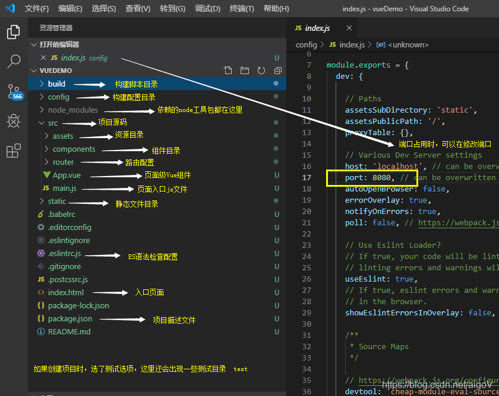

# vue开发第一个web项目


## 一、创建vue项目

创建一个vue工程，需要在命令行编写指令一步步完成。可以使用电脑自带的cmd命令行窗口，也可以装一个vscode（两个工具指令和步骤都一样）。使用它的终端窗口

选择菜单Terminal->New Terminal 打开一个新的命令行窗口（快捷键Ctrl+Shift+`)

选择你想要创建新项目的目录，然后执行命令

**vue init webpack vuedemo**

或者

**vue create vuedemo**

然后按照提示进行操作；

此过程会先进性一些配置，根据自己的情况进行配置

```xml
? Project name vuedemo
? Project description A Vue.js project
? Author fancyebai <lvsedehuanxiang@163.com>
? Vue build standalone
? Install vue-router? Yes
? Use ESLint to lint your code? Yes
? Pick an ESLint preset Standard
? Set up unit tests Yes
? Pick a test runner jest
? Setup e2e tests with Nightwatch? Yes
? Should we run `npm install` for you after the project has been created? (recommended) npm
```

* Project name ：你可以在这填写和修改初始的项目名称，注意我上面图片上的注意事项哈

* Project description ：  项目的自我介绍，你可以写：这是全球最np的Vue项目

* Author ：项目作者，你的小名-狗子
* 
* Vue build (Use arrow keys)

* Vue build standalone   这两个选它推荐的那个，好像是运行加编译的意思

* Install vue-router? (Y/n) ： 是否安装Vue路由，这是Vue的核心必须要，后面专门写一下这个路由。


* Use ESLint to lint your code? (Y/n) ：使用 ESLint 到你的代码？这是个代码风格管理工具，选一下。


* Pick an ESLint preset (Use arrow keys) ：选择一个预置ESLint，这个就是接在上面那个问题下的，意思让你选一个代码风格。


* Setup unit tests with Karma + Mocha? (Y/n) ：是否安装单元测试 

* Setup e2e tests with Nightwatch? (Y/n) ：是否安装e2e测试 

* Should we run `npm install` for you after the project has been created?：这个是问你，要不要项目创建后，自动为你执行 npm install命令，你不选的话，项目创建后，你需要进入[项目文件夹]手动执行npm install。（我这里选了自动install,之前我用cmd创建项目好像没问我这个，，）

安装过程会持续一段时间，如果最后出现Project initialization finished!，则说明安装成功

## 二、运行vue项目

切换到项目目录

cd vuedemo

执行命令

**npm run dev**

打开浏览器输入http://localhost:8080，如果出现vue的欢迎页面则说明成功

## 三、构建生产包

其他命令，npm run build用户构建生产包

## 四、运行生产包

打包后复制dist中所有文件，拷贝到tomcat中的webapps下,直接运行tomcat即可访问页面

## 五、一个vue项目的结构：



## PS：

使用vscode的过程中，我们可能会用到终端，

虽然系统自带有，但是还要另外打开，有点不方便，vscode中就有这个功能，

打开方法

使用快捷键： ctrl + ·     即可；注意那个点是键盘上 esc 下面的那个；

或者：

选择vscode的 “查看”，然后选择“集成终端” ，打开即可；


* 无法打开vue.ps1文件


原因：首次在计算机上启动 Windows PowerShell 时，现用执行策略很可能是 Restricted（默认设置）。Restricted 策略不允许任何脚本运行，防止执行不信任的脚本。

解决办法：

重新打开编辑器，以管理员身份运行vscode，输入命令

set-executionpolicy remotesigned
再次执行命令创建vue项目就可以啦。

**版本问题： **

需要删除node-modules，

然后运行 cnpm install

**如何退出vue的运行状态**
ctrl + c


