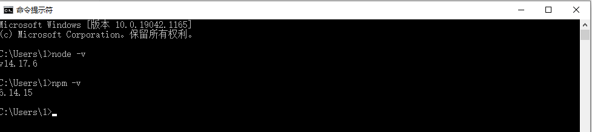
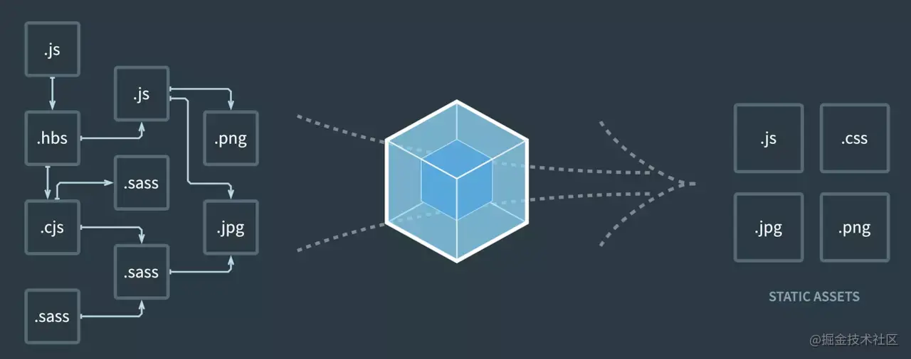
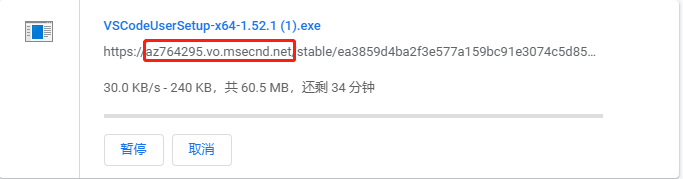
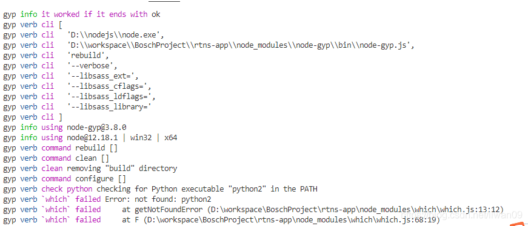
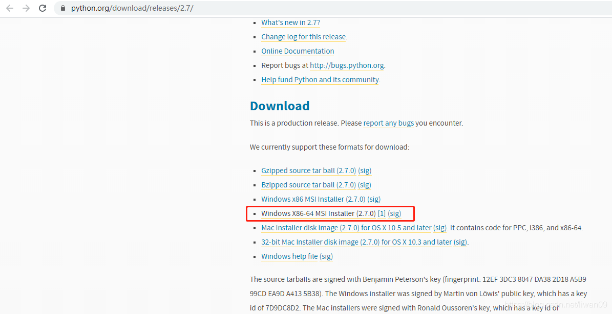
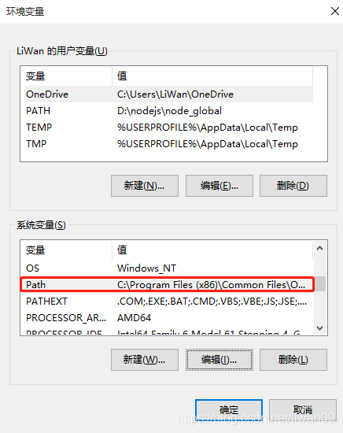

# 一、Vue开发环境基础

## 1.1 vue开发环境内容

vue.js所有的环境基础包括：

* Node.js ：这是基于Chrome的V8 JavaScript引擎构建的JavaScript运行时，(运行时：可以理解为运行环境)

* npm：这是node.js的包管理工具  *cnpm：npm的淘宝镜像*

* webpack：前端资源模块化管理和打包工具

* vue-cli：脚手架构建工具

## 二、安装node.js

## 2.1 node.js介绍

Node.js 是一个基于 Chrome V8 引擎的 JavaScript 运行环境，运行在服务端的JavaScript。Node.js 使用了一个事件驱动、非阻塞式 I/O 的模型，使其轻量又高效。

nodejs是一个很强大的js 运行环境，类似于jvm之于java。因此对js的支持非常好，催生了基于js的一系列应用开发。源于各js的应用的成长壮大，继而催生出了 npm。

NPM是基于node js环境的一个包管理器。试问 为什么单纯的 jsp/php里面没有NPM？因为没有一个类似于nodejs的强大的js运行环境的支撑。由于nodejs 催生了js的兴盛，又进而催生出NPM来打包管理这些基于js的应用。

随着前端开发的网页元素不断丰富和复杂化，催生出webpack 来进一步规划js应用的打包部署。前端目标页面资源，通过webpack来打包压缩出来。

可以看出vue.js 就是遵循的webpack 的方式来部署的，我们使用npm run build之后，会生成一个目标dist文件。这即是目标静态web资源，放在nginx下面即可通过网页访问。

**综上所述，vue.js 是通过 webpack来打包，而webpack 又基于 npm, npm需要nodejs环境。这就是为什么vue.js 还需要安装nodejs环境。**

将目标dist文件夹拷贝到一台未安装nodejs的 nginx服务器上，访问页面可以正常响应逻辑。这时跟nodejs没有任何关系，服务器又不是nodejs在担当，而是nginx。如果你用nodejs来部署服务器，则需要在目标机上安装nodejs.

简单的说：你既可以开发nodejs的服务程序，亦可以用基于nodejs的npm && webpack来打包 目标前端页面。vue.js 使用webpack来打包，故而需要nodejs环境。

>传统的JavaScript是运行在浏览器上的，浏览器的内核分为两个部分：javascript引擎和渲染引擎。
>
>渲染引擎: 渲染html&&css
>
>JavaScript引擎：运行 JavaScript，随着技术的发展， Chrome 使用的 JavaScript 引擎是 V8，它的速度非常快且性能好，同时由2009年5月Ryan Dahl开发的Node.js 诞生。

[使用vscode 创建第一个vue项目](https://www.jianshu.com/p/08e12cdeed82)

[Vue项目打包部署总结](https://segmentfault.com/a/1190000021530126)

## 2.2 彻底删除已安装的node.js

* step1： 清理npm的缓存

```
npm cache clean --force
```

* step2： 运行node.js的安装程序，删除nodejs

* step3： 重启系统；

* step4： 检查下面目录是否存在，如果存在，删除

```
C:\Program Files (x86)\Nodejs
C:\Program Files\Nodejs
C:\Users\{User}\AppData\Roaming\npm (or %appdata%\npm)
C:\Users\{User}\AppData\Roaming\npm-cache (or %appdata%\npm-cache)
C:\Users\{User}\.npmrc (and possibly check for that without the . prefix too)
C:\Users\{User}\AppData\Local\Temp\npm-*
```

* step5: 检查环境变量中是否存在nodejs

### 2.3 安装node.js环境

* Node.js 安装包及源码下载地址为：https://nodejs.org/en/download/。

下载后按照提示安装即可。

>安装过程中，不要选择安装node工具，否则后续会比较混乱；
>因为此时没有管理员权限，等安装好后，用管理员权限执行buildtools 即可：
>npm install --global --production windows-build-tools

* Node.js配置环境变量

计算机->属性->高级系统配置->环境变量->用户变量->编辑path,添加`global“目录如下：

PATH: D:\node\nodejs

总结：
不需要添加系统环境变量NODE_PATH，只需编辑用户环境变量



# 三、安装npm

## 3.1 npm介绍

npm 是 Node.js 官方提供的包管理工具，他已经成了 Node.js 包的标准发布平台，用于 Node.js 包的发布、传播、依赖控制。npm 提供了命令行工具，使你可以方便地下载、安装、升级、删除包，也可以作为开发者发布并维护包。

所谓的包通常是一些模块的集合，相当于提供了一些固定接口的函数库。包是在模块基础上更深一步的抽象。Node.js 的包类似于 C/C++ 的函数库或者 Java、.Net 的类库。它将某个独立的功能封装起来，用于发布、更新、依赖管理和版本控制。Node.js 根据 CommonJS 规范实现了包机制，开发了 npm 来解决包的发布和获取需求。

npm 之于 Node.js ，就像 pip 之于 Python， gem 之于 Ruby， pear 之于 PHP 。

## 3.2 npm安装

npm 不需要单独安装。在安装 Node 的时候，会连带一起安装 npm 。但是，Node 附带的 npm 可能不是最新版本，可以用下面的命令，更新到最新版本。

```shell
#linux
$ sudo npm install npm@latest -g

#Window系统
npm install npm -g
```
也就是使用 npm 安装自己。之所以可以这样，是因为 npm 本身与 Node 的其他模块没有区别。

然后，运行下面的命令，查看各种信息。

```
# 查看 npm 命令列表
$ npm help

# 查看各个命令的简单用法
$ npm -l

# 查看 npm 的版本
$ npm -v

# 查看 npm 的配置
$ npm config list -l
```
## 3.3 使用npm

### 3.3.1 初始化npm init

```
npm init
```

npm init用来初始化npm，执行后会在当前目录下生成一个package.json文件。


### 3.3.2 使用npm安装项目需要的依赖 npm install

```shell
npm install
```

运行npm install，会从当前目录中的package.json文件中读取依赖，下载依赖，并安装到node_modules目录下。

一个典型的json文件如下所示：
```json
{
  "name": "yuya",
  "version": "0.1.0",
  "private": true,
  "scripts": {
    "build": "vue-cli-service build",
    "serve": "vue-cli-service serve",
    "build:test": "vue-cli-service build --modern --mode test",
    "build:pro": "vue-cli-service build --modern --mode production"
  },
  "dependencies": {
    "axios": "^0.21.4",
    "core-js": "^3.6.5",
    "dayjs": "^1.11.2",
    "echarts": "^5.2.1",
    "element-ui": "^2.15.6",
    "js-cookie": "^3.0.1",
    "moment": "^2.29.1",
    "nprogress": "^0.2.0",
    "qiniu-js": "^3.3.3",
    "uglifyjs-webpack-plugin": "^2.2.0",
    "vue": "^2.6.11",
    "vue-pdf": "^4.3.0",
    "vue-router": "^3.2.0",
    "vuex": "^3.4.0"
  },
  "devDependencies": {
    "@vue/cli-plugin-babel": "^4.5.0",
    "@vue/cli-service": "^4.5.0",
    "compression-webpack-plugin": "^9.1.2",
    "node-sass": "^4.12.0",
    "sass-loader": "^8.0.2",
    "vue-template-compiler": "^2.6.11"
  }
}
```

### 3.3.3 设置环境变量npm set

npm set 用来设置环境变量

```
$ npm set init-author-name 'Your name'
$ npm set init-author-email 'Your email'
$ npm set init-author-url 'http://yourdomain.com'
$ npm set init-license 'MIT'
```
上面命令等于为 npm init 设置了默认值，以后执行 npm init 的时候，package.json 的作者姓名、邮件、主页、许可证字段就会自动写入预设的值。这些信息会存放在用户主目录的 ~/.npmrc文件，使得用户不用每个项目都输入。如果某个项目有不同的设置，可以针对该项目运行 npm config。


### 3.3.4 查看npm每个模块的具体信息

```
npm info
```
npm info 命令可以查看每个模块的具体信息。

```
$ npm info underscore
```
查看 underscore 模块的信息。上面命令返回一个 JavaScript 对象，包含了 underscore 模块的详细信息。这个对象的每个成员，都可以直接从 info 命令查询。

## 3.3.5 搜索npm模块
```
npm search
```

npm search 命令用于搜索 npm 仓库，它后面可以跟字符串，也可以跟正则表达式。

## 3.3.6 列出项目的所有依赖npm list

npm list 命令以树形结构列出当前项目安装的所有模块，以及它们依赖的模块。

## 3.3.7 运行项目脚本 npm run 

npm可以用于执行脚本。package.json 文件有一个 scripts 字段，可以用于指定脚本命令，供 npm 直接调用。

```json
{
  "name": "myproject",
  "devDependencies": {
    "jshint": "latest",
    "browserify": "latest",
    "mocha": "latest"
  },
  "scripts":
    "dev": "node build/dev-server.js",
    "build": "node build/build.js",
    "docs": "node build/docs.js",
    "build-docs": "npm run docs & git checkout gh-pages & xcopy /sy dist\\* . & git add . & git commit -m 'auto-pages' & git push & git checkout master",
    "build-publish": "rmdir /S /Q lib & npm run build &git add . & git commit -m auto-build & npm version patch & npm publish & git push",
    "lint": "eslint --ext .js,.vue src"
}
```
例如在这个 package.json 的文件夹下使用 npm run dev 就相当于运行了 node build/dev-server.js 这一段代码。使用 scripts 的目的就是为了把一些要执行的代码合并到一起，使用 npm run 来快速的运行，方便省事。
npm run 是 npm run-script 的缩写，一般都使用前者，但是后者可以更好的反应这个命令的本质。

>cnpm
>
>因为npm包管理器需要依赖包的服务器地址是国外的，资源下载及访问会很慢，所以我们需要安装淘宝的国内镜像来提高速度。
>
>安装淘宝的国内镜像的指令：
>
>```
>npm install -g cnpm --registry=http://registry.npm.taobao.org
>```
>
>安装完成后，使用cnpm即可完成依赖安装
>**cnpm install [依赖的name]**


# 三、安装webpack

Webpack 是一个前端资源加载和打包工具。所谓的模块就是在平时的前端开发中，用到一些静态资源，如JavaScript、CSS、图片等文件，webpack就将这些静态资源文件称之为模块。 webpack支持AMD和CommonJS，以及其他的一些模块系统，并且兼容多种JS书写规范，可以处理模块间的依赖关系，所以具有更强大的JS模块化的功能，它能对静态资源进行统一的管理以及打包发布。 作为一款 Grunt和Gulp的替代产品，Webpack受到大多数开发者的喜爱，因为它能够编译打包CSS，做CSS预处理，对JS的方言进行编译，打包图片，代码压缩等等。

WebPack可以看做是模块打包机：它做的事情是，分析你的项目结构，找到JavaScript模块以及其它的一些浏览器不能直接运行的拓展语言（Scss，TypeScript等），并将其打包为合适的格式以供浏览器使用。

Webpack 本质上是一个打包工具，它会根据代码的内容解析模块依赖，帮助我们把多个模块的代码打包。



webpack安装：

**npm install webpack webpack-cli -g**

# 四、安装vue-cli

Vue CLI 致力于将 Vue 生态中的工具基础标准化，它确保了各种构建工具能够基于智能的默认配置即可平稳衔接，这样你可以专注在撰写应用上，而不必花更多的时间去纠结配置的问题。也就是可以通过简单的命令行或者图形界面创建一个vue应用。

安装：

**npm install  vue-cli -g**
 

# 五、安装开发工具VSCode


## 5.1 vscode介绍

Visual Studio Code (简称 VS Code / VSC) 是一款免费开源的现代化轻量级代码编辑器，支持几乎所有主流的开发语言的语法高亮、智能代码补全、自定义热键、括号匹配、代码片段、代码对比 Diff、GIT 等特性，支持插件扩展，并针对网页开发和云端应用开发做了优化。软件跨平台支持 Win、Mac 以及 Linux。


## 5.2 安装vscode

首先，下载VS Code.https://code.visualstudio.com

然后将下载地址复制


将红色部分换成:vscode.cdn.azure.cn，可以得到国内的镜像地址，下载速度快。

## 5.3 安装插件

* Vetur

Vetur支持.vue文件的语法高亮显示，除了支持template模板以外，还支持大多数主流的前端开发脚本和插件，比如Sass和TypeScript。

安装：

点击左边的Extensions图标（快捷键Ctrl+Shift+X），输入vetur，找对对应版本然后点击install即可

* ESLint 

ESLint是一个用来识别 ECMAScript 并且按照规则给出报告的代码检测工具，使用它可以避免低级错误和统一代码的风格。如果每次在代码提交之前都进行一次eslint代码检查，就不会因为某个字段未定义为undefined或null这样的错误而导致服务崩溃，可以有效的控制项目代码的质量。

## 六、创建和运行第一个vue项目

* 进入终端

选择菜单Terminal->New Terminal 打开一个新的命令行窗口（快捷键Ctrl+Shift+`)

* 创建新的vue项目

选择你想要创建新项目的目录，然后执行命令

```
vue init webpack vuedemo
```
此过程会先进性一些配置，根据自己的情况进行配置

```
? Project name vuedemo
? Project description A Vue.js project
? Author fancyebai <lvsedehuanxiang@163.com>
? Vue build standalone
? Install vue-router? Yes
? Use ESLint to lint your code? Yes
? Pick an ESLint preset Standard
? Set up unit tests Yes
? Pick a test runner jest
? Setup e2e tests with Nightwatch? Yes
? Should we run `npm install` for you after the project has been created? (recommended) npm
```

安装过程会持续一段时间，如果最后出现Project initialization finished!，则说明安装成功

* 本地运行vue项目

```
npm run dev
```

切换到项目目录cd vuedemo

最后执行命令npm run dev

其他命令，npm run build用户构建生产包，npm run start

打开浏览器输入http://localhost:8080，如果出现vue的欢迎页面则说明成功


# 七、错误解决办法：

安装好vscode环境后，在项目中执行：

npm install

有时候会出现错误：提示python找不到



解决办法是：***安装python***

下载python   https://www.python.org/download/releases/2.7/ 



安装完成后在path中添加系统变量：




如果依然有错误：

```
npm ERR! gyp ERR! stack Error: `C:\Windows\Microsoft.NET\Framework\v4.0.30319\msbuild.exe` failed with exit code: 1
npm ERR! gyp ERR! stack     at ChildProcess.onExit (E:\work\gitee\yuya\frontend\yuya_admin_web\node_modules\node-gyp\lib\build.js:262:23)
npm ERR! gyp ERR! stack     at ChildProcess.emit (node:events:520:28)
npm ERR! gyp ERR! stack     at Process.ChildProcess._handle.onexit (node:internal/child_process:291:12)
npm ERR! gyp ERR! System Windows_NT 10.0.19042
npm ERR! gyp ERR! command "C:\\Program Files\\nodejs\\node.exe" "E:\\work\\gitee\\yuya\\frontend\\yuya_admin_web\\node_modules\\node-gyp\\bin\\node-gyp.js" "rebuild" "--verbose" "--libsass_ext=" "--libsass_cflags=" "--libsass_ldflags=" "--libsass_library="
npm ERR! gyp ERR! cwd E:\work\gitee\yuya\frontend\yuya_admin_web\node_modules\node-sass
```


运行npm的build tool 依赖：

***注意：需要在系统工具中找到cmd，右键->以管理员身份运行***

npm install --global --production windows-build-tools --save

如果依然有问题，提示saas错误，

则需要安装node -saas，首先运行node -v，检查node的版本，然后，根据node版本选择：


***npm install -g node-sass@6.0.1***


