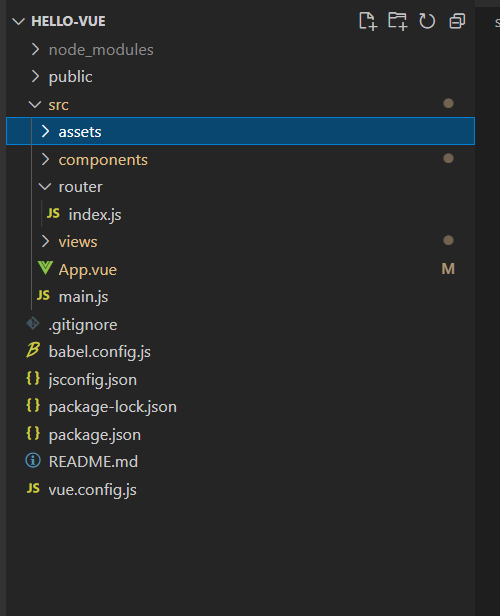

vue-cli3 项目目录结构

node_modules：依赖包

public:页面入口文件

src:项目核心文件（我们所写的代码都放在这个文件夹下）

.gitignore：git 上传需要忽略的文件配置

balel.config.js： 使用一些预设

package-lock.json：版本锁定文件

package.json：包管理文件

README.md：声明文档

vue.config.js：自己加 vue-cli3 的配置文件

src 文件夹

assets:静态资源（样式类文件，如 css，less，sass，以及一些外部 js 文件）

components:公共组件（多个组件同时用的可以放这里）

router：配置项目路由

views：视图

App.vue：根组件入口

main.js：入口文件（程序的主入口）

App.vue 根组件

一个 vue 页面通常由三部分组成:模板(template)、js(script)、样式(style)

其中模板只能包含一个父节点,顶层只能有一个 div

</router-view>是子路由视图，后面的路由页面都显示在此处

script：其下面可以包含数据(data)，生命周期(mounted)，方法(methods)等。

样式通过 style 标签包裹，默认是影响全局的。如需定义作用域只在该组件下起作用，需在标签上加 scoped，

main.js 主入口

main.js 主要是引入 vue 框架，根组件及路由设置，并且定义 vue 实例，图中的components:{App}就是引入的根组件 App.vue

router 路由配置

这里定义了路径为‘/’的路由，该路由对应的页面是 home 组件,当我们在浏览器访问时就渲染的组件。