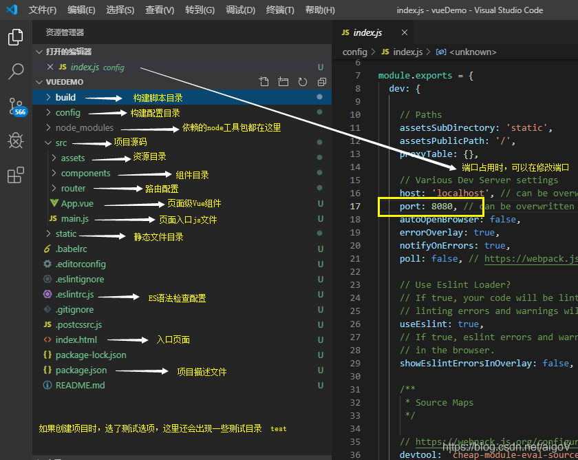

# vue 项目文件目录介绍


## 一、vue项目目录介绍



* **build目录**   

项目构建(webpack)相关代码


* **config目录**  

配置目录，包括端口号等

* **node_modules目录**  

npm 加载的项目依赖模块

* **src目录**

这里是我们要开发的目录，基本上要做的事情都在这个目录里。里面包含了几个目录及文件： 

 assets：放置一些图片

 components：放置一些组件

 views：页面(视图)组件 

 router.js：路由脚本文件 

 App.vue：项目入口文件
 
 main.js:：项目的核心文件

* **static目录**

静态资源目录，如图片、字体等

* **test目录**

初始测试目录，可删除

* **.xxxx 文件**

这些是一些配置文件，包括语法配置，git 配置等

* **index.html**

首页入口文件

* **package.json**

项目配置文件

* **README.md**

项目的说明文档，markdown 格式

## 二、build目录介绍

项目构建(webpack)相关代码

### 2.1 build.js 生产环境配置构建

```xml

// 此文件是 webpack 的基本项目配置文件
'use strict'
// 版本检查 node 的版本号  版本有要求 "engines": {"node": ">= 4.0.0","npm": ">= 3.0.0"}
// 立即执行
require('./check-versions')()

// process 是 node 中的 global 全局对象的属性，process 是 node 中的全局变量，env 设置环境变量
process.env.NODE_ENV = 'production'

// ora 是一个命令行转圈圈动画插件，好看用的
const ora = require('ora')
// rimraf 插件是用来执行 UNIX 命令 rm 和 -rf 的用来删除文件夹和文件，清空旧的文件
const rm = require('rimraf')
// node.js 路径模块 连接路径
const path = require('path')
// chalk 插件，用来在命令行中显示彩色文字
const chalk = require('chalk')
// 引入 webpack 模块使用内置插件和 webpack 方法
const webpack = require('webpack')
// 引入 config 目录下的 index.js 配置文件
const config = require('../config')
const webpackConfig = require('./webpack.prod.conf')

// 开启转圈圈动画
const spinner = ora('building for production...')
spinner.start()

// 调用 rm 方法，第一个参数的结果就是 绝对/工程名/dist/static，表示删除这个路径下面的所有文件
rm(path.join(config.build.assetsRoot, config.build.assetsSubDirectory), err => {
  // 如果删除的过程中出现错误，就抛出这个错误，同时程序终止
  if (err) throw err
  // 没有错误，就执行 webpack 编译
  webpack(webpackConfig, (err, stats) => { 
    // 这个回调函数是 webpack 编译过程中执行

    // 停止转圈圈动画
    spinner.stop()
    // 如果有错误就抛出错误
    if (err) throw err
    // process.stdout 用来控制标准输出，stats对象中保存着编译过程中的各种消息
    process.stdout.write(stats.toString({
      // 增加控制台颜色开关
      colors: true,
      // 不增加内置模块信息
      modules: false,
      // 不增加子级信息
      children: false, 
      // 允许较少的输出
      chunks: false,
      // 不将内置模块的信息加到包信息
      chunkModules: false
    }) + '\n\n')

    if (stats.hasErrors()) {
      console.log(chalk.red('  Build failed with errors.\n'))
      process.exit(1)
    }

    // 编译成功的消息
    console.log(chalk.cyan('  Build complete.\n'))
    console.log(chalk.yellow(
      '  Tip: built files are meant to be served over an HTTP server.\n' +
      '  Opening index.html over file:// won\'t work.\n'
    ))
  })
})


```
### 2.2 check-versions.js  版本检查，npm 等

```xml

'use strict'
// chalk 插件，用来在命令行中显示彩色文字
const chalk = require('chalk')
// semver 插件，是用来判断特定的版本号
const semver = require('semver')
// 导入 package.json 文件，要使用里面的 engines
// 要注意 require 是直接可以导入 json 文件的，并且 requrie 返回的就是 json 对象
const packageConfig = require('../package.json')
// shelljs 插件，作用是用来执行 Unix 系统命令
const shell = require('shelljs')

function exec (cmd) {
  return require('child_process').execSync(cmd).toString().trim()
}

// 检查 node 版本信息
const versionRequirements = [
  {
    name: 'node',
    currentVersion: semver.clean(process.version),
    versionRequirement: packageConfig.engines.node
  }
]

// 检查 npm 版本信息
if (shell.which('npm')) {
  versionRequirements.push({
    name: 'npm',
    currentVersion: exec('npm --version'),
    versionRequirement: packageConfig.engines.npm
  })
}


// 输出提示
module.exports = function () {
  const warnings = []

  for (let i = 0; i < versionRequirements.length; i++) {
    const mod = versionRequirements[i]

    if (!semver.satisfies(mod.currentVersion, mod.versionRequirement)) {
      warnings.push(mod.name + ': ' +
        chalk.red(mod.currentVersion) + ' should be ' +
        chalk.green(mod.versionRequirement)
      )
    }
  }

  if (warnings.length) {
    console.log('')
    console.log(chalk.yellow('To use this template, you must update following to modules:'))
    console.log()

    for (let i = 0; i < warnings.length; i++) {
      const warning = warnings[i]
      console.log('  ' + warning)
    }

    console.log()
    process.exit(1)
  }
}
```

### 2.3 utils 构建相关工具


```xml
'use strict'
// 引入nodejs路径模块
const path = require('path')
// 引入 config 目录下的 index.js 配置文件
const config = require('../config')
// 引入 extract-text-webpack-plugin 插件，用来将 css 提取到单独的 css 文件中
const ExtractTextPlugin = require('extract-text-webpack-plugin')
// 引入 package.json
const packageConfig = require('../package.json')


// exports 其实就是一个对象，用来导出方法的最终还是使用 module.exports，此处导出 assetsPath
exports.assetsPath = function (_path) {
  const assetsSubDirectory = process.env.NODE_ENV === 'production'
    ? config.build.assetsSubDirectory
    : config.dev.assetsSubDirectory

  // 返回一个相对根路径
  return path.posix.join(assetsSubDirectory, _path)
}

// 导出 cssLoaders 的相关配置
exports.cssLoaders = function (options) {
  options = options || {}
  
  // cssLoader 的基本配置
  const cssLoader = {
    loader: 'css-loader',
    options: {
      sourceMap: options.sourceMap
    }
  }

  // 为 css 自动生成兼容性前缀
  const postcssLoader = {
    loader: 'postcss-loader',
    options: {
      sourceMap: options.sourceMap
    }
  }

  // generate loader string to be used with extract text plugin
  function generateLoaders (loader, loaderOptions) {
    // 将上面的基础 cssLoader 配置、兼容性前缀配置、自适应配置放在一个数组里面
    const loaders = options.usePostCSS ? [cssLoader, postcssLoader] : [cssLoader]

    // 如果该函数传递了单独的 loader 就加到这个 loaders 数组里面，这个 loader 可能是 less,sass 之类的
    if (loader) {
      loaders.push({
        // 加载对应的 loader
        loader: loader + '-loader',
        // Object.assign 是 es6 的方法，主要用来合并对象的，浅拷贝
        options: Object.assign({}, loaderOptions, {
          sourceMap: options.sourceMap
        })
      })
    }

    // Extract CSS when that option is specified
    // (which is the case during production build)
    // extract 是自定义的属性，可以定义在 options 里面
    // 主要作用就是当配置为 true 就把文件单独提取，false表示不单独提取，这个可以在使用的时候单独配置
    // 用来返回最终读取和导入 loader，来处理对应类型的文件
    if (options.extract) {
      return ExtractTextPlugin.extract({
        use: loaders,
        fallback: 'vue-style-loader'
      })
    } else {
      return ['vue-style-loader'].concat(loaders)
    }
  }

  // https://vue-loader.vuejs.org/en/configurations/extract-css.html
  return {
    // css 对应 vue-style-loader 和 css-loader
    css: generateLoaders(),
    // postcss 对应 vue-style-loader 和 css-loade
    postcss: generateLoaders(),
    // less 对应 vue-style-loader 和 less-loader
    less: generateLoaders('less'),
    // sass 对应 vue-style-loader 和 sass-loader
    sass: generateLoaders('sass', { indentedSyntax: true }),
    // scss 对应 vue-style-loader 和 sass-loader
    scss: generateLoaders('sass'),
    // stylus 对应 vue-style-loader 和 stylus-loader
    stylus: generateLoaders('stylus'),
    // styl 对应 vue-style-loader 和 styl-loader
    styl: generateLoaders('stylus')
  }
}

// Generate loaders for standalone style files (outside of .vue)
// 下面这个主要处理 import 这种方式导入的文件类型的打包，上面的 exports.cssLoaders 是为这一步服务的
exports.styleLoaders = function (options) {
  const output = []
  // 下面就是生成的各种 css 文件的 loader 对象
  const loaders = exports.cssLoaders(options)

  for (const extension in loaders) {
    // 把每一种文件的 laoder 都提取出来
    const loader = loaders[extension]
    output.push({
      // 把最终的结果都 push 到 output 数组中
      test: new RegExp('\\.' + extension + '$'),
      use: loader
    })
  }

  return output
}

// node-notifier 是一个跨平台系统通知的页面，当遇到错误时，它能用系统原生的推送方式推送信息
exports.createNotifierCallback = () => {
  const notifier = require('node-notifier')

  return (severity, errors) => {
    if (severity !== 'error') return

    const error = errors[0]
    const filename = error.file && error.file.split('!').pop()

    notifier.notify({
      title: packageConfig.name,
      message: severity + ': ' + error.name,
      subtitle: filename || '',
      icon: path.join(__dirname, 'logo.png')
    })
  }
}

```

### 2.4 vue-loader.conf.js CSS 加载器配置

```xml


'use strict'
// 引入配置文件
const utils = require('./utils')
const config = require('../config')
// 判断是不是生产环境
const isProduction = process.env.NODE_ENV === 'production'
// 根据环境来获取相应的 productionSourceMap 或者 cssSourceMap
const sourceMapEnabled = isProduction
  ? config.build.productionSourceMap
  : config.dev.cssSourceMap

module.exports = {
  // 配置在 .vue 文件中的 css 相关处理规则
  loaders: utils.cssLoaders({
    sourceMap: sourceMapEnabled,
    extract: isProduction
  }),
  // 记录压缩的代码，用来找到源码位置
  cssSourceMap: sourceMapEnabled,
  // 是否缓存破坏
  cacheBusting: config.dev.cacheBusting,
  // transformToRequire 的作用是在模块编译的过程中，编译器可以将某些属性，比如 src 转换为 require 调用
  transformToRequire: {
    video: ['src', 'poster'],
    source: 'src',
    img: 'src',
    image: 'xlink:href'
  }
}

```


### 2.5 webpack.base.conf.js webpack 基础配置

```xml

'use strict'
// 引入配置文件
const path = require('path')
const utils = require('./utils')
const config = require('../config')
const vueLoaderConfig = require('./vue-loader.conf')

// 封装函数返回 dir 的和 .. 和其绝对路径用 \ 拼接的路径
function resolve (dir) {
  return path.join(__dirname, '..', dir)
}

const createLintingRule = () => ({
  test: /\.(js|vue)$/,
  loader: 'eslint-loader',
  enforce: 'pre',
  include: [resolve('src'), resolve('test')],
  options: {
    formatter: require('eslint-friendly-formatter'),
    emitWarning: !config.dev.showEslintErrorsInOverlay
  }
})

module.exports = {
  context: path.resolve(__dirname, '../'),
  entry: {
    // 入口文件 多入口在这里添加
    app: './src/main.js'
  },
  // 输出
  output: {
     // 文件路径
    path: config.build.assetsRoot,
    // 文件名
    filename: '[name].js',
    // 静态资源路径 根据环境来改变
    publicPath: process.env.NODE_ENV === 'production'
      ? config.build.assetsPublicPath
      : config.dev.assetsPublicPath
  },
  // 对模块进行解析
  resolve: {
    // 对模块的后缀进行解析 比如导入 index 没有写后缀名 那么会自动先匹配 .js > .vue > .json 后缀文件
    extensions: ['.js', '.vue', '.json'],
    // 别名，@ 代表 src 就是在这里配置的
    alias: {
      'vue$': 'vue/dist/vue.esm.js',
      '@': resolve('src'),
    }
  },
  // 解析不同的模块
  module: {
    rules: [
      ...(config.dev.useEslint ? [createLintingRule()] : []),
      {
        // 解析 .vue 后缀的文件
        test: /\.vue$/,
        // 用 vue-loader 去解析 .vue 后缀的文件
        loader: 'vue-loader',
        // 对解析文件的参数配置
        options: vueLoaderConfig
      },
      {
        // 解析后缀 .js 的文件
        test: /\.js$/,
        loader: 'babel-loader',
        // 解析的包含的文件路径
        include: [resolve('src'), resolve('test'), resolve('node_modules/webpack-dev-server/client')]
      },
      {
        test: /\.(png|jpe?g|gif|svg)(\?.*)?$/,
        loader: 'url-loader',
        options: {
          // 限制在 10000 以内
          limit: 10000,
          // 对输出的内容进行地址转换
          name: utils.assetsPath('img/[name].[hash:7].[ext]')
        }
      },
      {
        test: /\.(mp4|webm|ogg|mp3|wav|flac|aac)(\?.*)?$/,
        loader: 'url-loader',
        options: {
          limit: 10000,
          name: utils.assetsPath('media/[name].[hash:7].[ext]')
        }
      },
      {
        test: /\.(woff2?|eot|ttf|otf)(\?.*)?$/,
        loader: 'url-loader',
        options: {
          limit: 10000,
          name: utils.assetsPath('fonts/[name].[hash:7].[ext]')
        }
      }
    ]
  },
  node: {
    // 阻止 webpack 注入无用的 setImmediate polyfill
    // prevent webpack from injecting useless setImmediate polyfill because Vue
    // source contains it (although only uses it if it's native).
    setImmediate: false,
    // prevent webpack from injecting mocks to Node native modules
    // that does not make sense for the client
    dgram: 'empty',
    fs: 'empty',
    net: 'empty',
    tls: 'empty',
    child_process: 'empty'
  }
}

```

### 2.6 webpack.dev.conf.js webpack 开发环境配置

```xml

'use strict'
// 引入配置文件
const utils = require('./utils')
const webpack = require('webpack')
const config = require('../config')
const merge = require('webpack-merge')
const path = require('path')
const baseWebpackConfig = require('./webpack.base.conf')
// 拷贝资源的插件
const CopyWebpackPlugin = require('copy-webpack-plugin')
// 自动生成 html 的插件，能够把资源自动加载到 html 文件中
const HtmlWebpackPlugin = require('html-webpack-plugin')
// 把 webpack 的错误和日志收集起来，更友好展示错误日志的插件
const FriendlyErrorsPlugin = require('friendly-errors-webpack-plugin')
// 自动打开可用端口的包
const portfinder = require('portfinder')

// 当前环境的 host
const HOST = process.env.HOST
// 当前环境的 port
const PORT = process.env.PORT && Number(process.env.PORT)

// 开发环境的配置
const devWebpackConfig = merge(baseWebpackConfig, {
  module: {
    // loader 的配置，具体内容可以参考 utils 文件
    rules: utils.styleLoaders({ sourceMap: config.dev.cssSourceMap, usePostCSS: true })
  },
  // cheap-module-eval-source-map is faster for development
  devtool: config.dev.devtool,

  // these devServer options should be customized in /config/index.js
  devServer: {
    // 重新加载 server 时，控制台对一些错误以 warning 的方式提示
    clientLogLevel: 'warning',
    // 当使用 HTML5 History API 时，任意的 404 响应都可能需要被替代为 index.html
    historyApiFallback: {
      rewrites: [
        { from: /.*/, to: path.posix.join(config.dev.assetsPublicPath, 'index.html') },
      ],
    },
    // 启用 webpack 的模块热替换特性
    hot: true,
    // 告诉服务器从哪里提供内容
    contentBase: false, // since we use CopyWebpackPlugin.
    // 是否压缩
    compress: true,
    host: HOST || config.dev.host,
    port: PORT || config.dev.port,
    // 是否自动打开浏览器
    open: config.dev.autoOpenBrowser,
    // 编译出错时是否有提示
    overlay: config.dev.errorOverlay
      ? { warnings: false, errors: true }
      : false,
    // 静态内容的路径,此路径下的打包文件可在浏览器中访问
    publicPath: config.dev.assetsPublicPath,
    // 接口的代理
    proxy: config.dev.proxyTable,
    // 启用 quiet 后，除了初始启动信息之外的任何内容都不会被打印到控制台
    // 即来自 webpack 的错误或警告在控制台不可见
    quiet: true, // necessary for FriendlyErrorsPlugin
    // 监视文件的选项
    watchOptions: {
      poll: config.dev.poll,
    }
  },
  plugins: [
    // DefinePlugin 允许创建一个在编译时可以配置的全局常量。这里生成了一个当前环境的常量
    new webpack.DefinePlugin({
      'process.env': require('../config/dev.env')
    }),
    // 模块热替换插件，修改模块时不需要刷新页面
    new webpack.HotModuleReplacementPlugin(),
    // 当开启 HMR 的时候使用该插件会显示模块的相对路径
    new webpack.NamedModulesPlugin(), // HMR shows correct file names in console on update.
    // 在编译出现错误时，使用 NoEmitOnErrorsPlugin 来跳过输出阶段。这样可以确保输出资源不会包含错误。
    new webpack.NoEmitOnErrorsPlugin(),
    // https://github.com/ampedandwired/html-webpack-plugin
    new HtmlWebpackPlugin({
      filename: 'index.html',
      template: 'index.html',
      // 打包后 js 文件放在 body 的最后
      inject: true
    }),
    // copy custom static assets
    // 将 static 的内容拷贝到开发路径，忽略这个文件夹下 .XX 的文件
    new CopyWebpackPlugin([
      {
        from: path.resolve(__dirname, '../static'),
        to: config.dev.assetsSubDirectory,
        ignore: ['.*']
      }
    ])
  ]
})

// webpack 将运行由配置文件导出的函数，并且等待 promise 返回，便于需要异步地加载所需的配置变量。
module.exports = new Promise((resolve, reject) => {
  portfinder.basePort = process.env.PORT || config.dev.port
  portfinder.getPort((err, port) => {
    if (err) {
      reject(err)
    } else {
      // publish the new Port, necessary for e2e tests
      process.env.PORT = port
      // add port to devServer config
      devWebpackConfig.devServer.port = port

      // Add FriendlyErrorsPlugin
      // 出错友好处理插件
      devWebpackConfig.plugins.push(new FriendlyErrorsPlugin({
        compilationSuccessInfo: {
          messages: [`Your application is running here: http://${devWebpackConfig.devServer.host}:${port}`],
        },
        onErrors: config.dev.notifyOnErrors
        ? utils.createNotifierCallback()
        : undefined
      }))

      resolve(devWebpackConfig)
    }
  })
})

```

### 2.7 webpack.prod.conf.js webpack 生产环境配置

```xml

'use strict'
// 引入配置文件
const path = require('path')
const utils = require('./utils')
const webpack = require('webpack')
const config = require('../config')
const merge = require('webpack-merge')
const baseWebpackConfig = require('./webpack.base.conf')
// 导入 copy-webpack-plugin 用来复制
const CopyWebpackPlugin = require('copy-webpack-plugin')
// 导入 html-webpack-plugin 用来自动生成 html
const HtmlWebpackPlugin = require('html-webpack-plugin')
// 导入 extract-text-webpack-plugin 用来抽离 css 防止 css打包压缩到 js 中
const ExtractTextPlugin = require('extract-text-webpack-plugin')
// 导入 optimize-css-assets-webpack-plugin 用来压缩单独的 css 文件
const OptimizeCSSPlugin = require('optimize-css-assets-webpack-plugin')
// 导入 uglifyjs-webpack-plugin 用来压缩
const UglifyJsPlugin = require('uglifyjs-webpack-plugin')

// 区分环境
const env = process.env.NODE_ENV === 'testing'
  ? require('../config/test.env')
  : require('../config/prod.env')

const webpackConfig = merge(baseWebpackConfig, {
  module: {
    // 配置独立的css文件的解析规则
    rules: utils.styleLoaders({
      sourceMap: config.build.productionSourceMap,
      // 生成独立的文件
      extract: true,
      usePostCSS: true
    })
  },
  // 开发工具 用来调试
  devtool: config.build.productionSourceMap ? config.build.devtool : false,
  output: {
    // 打包后的文件放在 dist 目录下面
    path: config.build.assetsRoot,
    // 编译生成的 js 文件存放在根目录下的 js 目录下，如果 js 文件夹不存在就自动创建
    filename: utils.assetsPath('js/[name].[chunkhash].js'),
    // 用来打包 require.ensure 方法中引入的模块，如果该方法中没有引入任何模块，就不会生成 chunk 文件
    chunkFilename: utils.assetsPath('js/[id].[chunkhash].js')
  },
  plugins: [
    // http://vuejs.github.io/vue-loader/en/workflow/production.html
    // 自定义一个 plugin 生成当前环境下的一个变量
    new webpack.DefinePlugin({
      'process.env': env
    }),
    // 压缩
    new UglifyJsPlugin({
      uglifyOptions: {
        compress: {
          // 禁止压缩警告信息
          warnings: false
        }
      },
      // 是否开启 sourceMap 用来调试
      sourceMap: config.build.productionSourceMap,
      // 在系统的 CPU 有多于一个内核时自动启用 仅作用于生产构建
      parallel: true
    }),

    // 独立的 css 文件夹插件
    new ExtractTextPlugin({
      filename: utils.assetsPath('css/[name].[contenthash].css'),
      allChunks: true,
    }),

    // 压缩 css
    new OptimizeCSSPlugin({
      cssProcessorOptions: config.build.productionSourceMap
        ? { safe: true, map: { inline: false } }
        : { safe: true }
    }),

    new HtmlWebpackPlugin({
      filename: process.env.NODE_ENV === 'testing'
        ? 'index.html'
        : config.build.index,
      template: 'index.html',
      inject: true,
      minify: {
        removeComments: true,
        collapseWhitespace: true,
        removeAttributeQuotes: true
        // more options:
        // https://github.com/kangax/html-minifier#options-quick-reference
      },
      // necessary to consistently work with multiple chunks via CommonsChunkPlugin
      chunksSortMode: 'dependency'
    }),
    // keep module.id stable when vendor modules does not change
    // 将各模块的 id 变成 hash 值
    new webpack.HashedModuleIdsPlugin(),
    // enable scope hoisting
    new webpack.optimize.ModuleConcatenationPlugin(),
    // split vendor js into its own file
    new webpack.optimize.CommonsChunkPlugin({
      name: 'vendor',
      minChunks (module) {

        return (
          module.resource &&
          /\.js$/.test(module.resource) &&
          module.resource.indexOf(
            path.join(__dirname, '../node_modules')
          ) === 0
        )
      }
    }),

    new webpack.optimize.CommonsChunkPlugin({
      name: 'manifest',
      minChunks: Infinity
    }),
    
    // 抽取第三方库到 app.j
    new webpack.optimize.CommonsChunkPlugin({
      name: 'app',
      async: 'vendor-async',
      children: true,
      minChunks: 3
    }),

    // copy custom static assets
    // 复制自定义的静态资源到生产环境
    new CopyWebpackPlugin([
      {
        from: path.resolve(__dirname, '../static'),
        to: config.build.assetsSubDirectory,
        ignore: ['.*']
      }
    ])
  ]
})

// 压缩
if (config.build.productionGzip) {
  const CompressionWebpackPlugin = require('compression-webpack-plugin')

  webpackConfig.plugins.push(
    new CompressionWebpackPlugin({
      // 目标资源名称 [path]会被替换成原始资源的路径 [query]会被替换成查询字符串
      asset: '[path].gz[query]',
      // 按照zlib的算法
      algorithm: 'gzip',
      // 所有匹配该正则的资源都会被处理 默认值是全部资源
      test: new RegExp(
        '\\.(' +
        config.build.productionGzipExtensions.join('|') +
        ')$'
      ),
      // 只有大小大于该值得资源会被处理，单位是 bytes
      threshold: 10240,
      // 压缩率小于这个值得资源才会被处理 默认值是 .8
      minRatio: 0.8
    })
  )
}


// 打包文件分析工具
if (config.build.bundleAnalyzerReport) {
  const BundleAnalyzerPlugin = require('webpack-bundle-analyzer').BundleAnalyzerPlugin
  webpackConfig.plugins.push(new BundleAnalyzerPlugin())
}

// 导出
module.exports = webpackConfig

```

## 三、config目录

### 3.1 index.js 主要配置

```xml

'use strict'
// Template version: 1.3.1
// see http://vuejs-templates.github.io/webpack for documentation.
// 引入 node.js 的路径模块
const path = require('path')

module.exports = {
  dev: {

    // Paths
    assetsSubDirectory: 'static',
    assetsPublicPath: '/',
    // 建一个虚拟 api 服务器用来代理本机的请求，只能用于开发模式
    proxyTable: {},

    // 服务 host
    host: 'localhost',
    // 服务端口号
    port: 8080,
    // 自动打开浏览器浏览器
    autoOpenBrowser: false,
    errorOverlay: true,
    notifyOnErrors: true,
    poll: false, // https://webpack.js.org/configuration/dev-server/#devserver-watchoptions-

    // Use Eslint Loader?
    // If true, your code will be linted during bundling and
    // linting errors and warnings will be shown in the console.
    useEslint: true,
    // If true, eslint errors and warnings will also be shown in the error overlay
    // in the browser.
    showEslintErrorsInOverlay: false,

    /**
     * Source Maps
     */

    // https://webpack.js.org/configuration/devtool/#development
    devtool: 'cheap-module-eval-source-map',

    // If you have problems debugging vue-files in devtools,
    // set this to false - it *may* help
    // https://vue-loader.vuejs.org/en/options.html#cachebusting
    cacheBusting: true,

    cssSourceMap: true
  },

  build: {
    // 下面是相对路径的拼接，假如当前跟目录是 config，那么下面配置的 index 属性的属性值就是 dist/index.html
    index: path.resolve(__dirname, '../dist/index.html'),

    // 定义的是静态资源的根目录 也就是 dist 目录
    assetsRoot: path.resolve(__dirname, '../dist'),
    // 定义的是静态资源根目录的子目录 static，也就是 dist 目录下面的 static
    assetsSubDirectory: 'static',
    // 定义的是静态资源的公开路径，也就是真正的引用路径
    assetsPublicPath: '/',

    /**
     * Source Maps
     */
    productionSourceMap: true,
    // https://webpack.js.org/configuration/devtool/#production
    devtool: '#source-map',

    // Gzip off by default as many popular static hosts such as
    // Surge or Netlify already gzip all static assets for you.
    // Before setting to `true`, make sure to:
    // npm install --save-dev compression-webpack-plugin
    // 是否压缩代码
    productionGzip: false,
    // 定义要压缩哪些类型的文件
    productionGzipExtensions: ['js', 'css'],

    // Run the build command with an extra argument to
    // View the bundle analyzer report after build finishes:
    // `npm run build --report`
    // Set to `true` or `false` to always turn it on or off
    // 编译完成后的报告，可以通过设置值为 true 和 false 来开启或关闭
    bundleAnalyzerReport: process.env.npm_config_report
  }
}


```

### 3.2 dev.env.js	开发环境配置

```xml

'use strict'
// 配置文件合并模块
const merge = require('webpack-merge')
// 导入 prod.env.js 配置文件
const prodEnv = require('./prod.env')

module.exports = merge(prodEnv, {
  // 导出一个对象，NODE_ENV 是一个环境变量，指定 development 环境
  NODE_ENV: '"development"'
})


```


### 3.3 prod.env.js 生产环境配置

```xml

'use strict'
module.exports = {
  // 导出一个对象，NODE_ENV 是一个环境变量，指定 production 环境
  NODE_ENV: '"production"'
}

```

## 四、node_modules目录

node_modules 是安装 node 后用来存放用包管理工具下载安装的包的文件夹。比如 webpack 等这些工具。

## 五、src目录

### 51. assets：

放置静态资源，包括公共的 css 文件、 js 文件、iconfont 字体文件、img 图片文件 以及其他资源类文件。之所以强调是公共的 css 文件，是因为要在组件的 css 标签里加入 ‘scoped‘ 标记，将其作用范围限制在此组件以及调用它的父级组件中，避免污染全局样式；

### 5.2 components：

放置通用模块组件。项目里总会有一些复用的组件，例如弹出框、发送手机验证码、图片上传等，将它们作为通用组件，避免重复工作；

### 5.3 views：

放置主要页面的组件。例如登录页、用户信息页等。通常是这里的组件本身写入一些结构，再引入通用模块组件，形成完整的页面；


### 5.4 router：放置路由设置文件，指定路由对应的组件；

[Vue Router介绍](https://blog.csdn.net/Demo_Null/article/details/107443259)

### 5.5 App.vue：

入口组件，views 里的组件会被插入此组件中，此组件再插入 index.html 文件里，形成单页面应用；

```xml

<template>
  <div id="app">
    
    <!-- 显示的是当前路由地址对应的内容 -->
    <router-view/>
  </div>
</template>

<script>
export default {
  name: 'App'
}
</script>

<style>
#app {
  font-family: 'Avenir', Helvetica, Arial, sans-serif;
  -webkit-font-smoothing: antialiased;
  -moz-osx-font-smoothing: grayscale;
  text-align: center;
  color: #2c3e50;
  margin-top: 60px;
}
</style>


```


### 5.6 main.js：

入口 js 文件，影响全局，作用是引入全局使用的库、公共的样式和方法、设置路由等

```xml

// 引入 vue
import Vue from 'vue'
// 自动寻找名字为 App 的文件，如 app.vue app.js...
import App from './App'
// 引入 router
import router from './router'

Vue.config.productionTip = false

/* eslint-disable no-new */
new Vue({
  // 绑定
  el: '#app',
  // 路由
  router,
  // 组件
  components: { App },
  // 将 App 局部组件显示在页面上
  template: '<App/>'
})


```

## 六、 static 目录

src 目录下的 assets 目录和根目录下的 static 目录都是存放静态文件的，但是 assets 里的文件编译过程中会被 webpack 处理理解为模块依赖，只支持相对路径的形式。
 
assets 放可能会变动的文件；

static 里的文件不会被 webpack 解析，会直接被复制到最终的打包(默认是dist/static)下，必须使用绝对路径引用这些文件。static 放不会变动的文件。这是通过在 config.js 文件中的 build.assetsPublicPath 和 build.assetsSubDirectory 连接来设置的。任何放在 static/ 中文件需要以绝对路径的形式引用：/static/[filename]。如果更改 assetSubDirectory 的值为 assets，那么路径需改为 /assets/[filename]。

## 六、 .editorconfig;.eslintignore;.eslintrc.js;.gitignore;.postcssrc.js

配置文件；

## 七、package.json和package-lock.json

package.json 文件其实就是对项目或者模块包的描述，里面包含许多元信息。比如项目名称，项目版本，项目执行入口文件，项目贡献者等等。npm install 命令会根据这个文件下载所有依赖模块。

```java

{
  // 项目/模块名称，长度必须小于等于 214 个字符，不能以"."(点)或者"_"(下划线)开头，不能包含大写字母
  "name": "myvue",
  // 项目版本
  "version": "1.0.0",
  // 项目描述
  "description": "project",
  // 作者
  "author": "Demo_Null",
  // 是否私有，设置为 true 时，npm 拒绝发布
  "private": true,
  // 执行 npm 脚本命令简写，执行前面的简写就代表执行后面的命令
  "scripts": {
    "dev": "webpack-dev-server --inline --progress --config build/webpack.dev.conf.js",
    "start": "npm run dev",
    "unit": "jest --config test/unit/jest.conf.js --coverage",
    "e2e": "node test/e2e/runner.js",
    "test": "npm run unit && npm run e2e",
    "lint": "eslint --ext .js,.vue src test/unit test/e2e/specs",
    "build": "node build/build.js"
  },
  // 生产环境下，项目运行所需依赖
  "dependencies": {
    "vue": "^2.5.2",
    "vue-router": "^3.0.1"
  },
  // 开发环境下，项目所需依赖
  "devDependencies": {
    "autoprefixer": "^7.1.2",
    "babel-core": "^6.22.1",
    "babel-eslint": "^8.2.1",
    "babel-helper-vue-jsx-merge-props": "^2.0.3",
    "babel-jest": "^21.0.2",
    "babel-loader": "^7.1.1",
    "vue-style-loader": "^3.0.1",
    "vue-template-compiler": "^2.5.2",
    "webpack": "^3.6.0",
    "webpack-bundle-analyzer": "^2.9.0",
    "webpack-dev-server": "^2.9.1",
    "webpack-merge": "^4.1.0"
  },
  // 项目运行的平台
  "engines": {
    "node": ">= 6.0.0",
    "npm": ">= 3.0.0"
  },
  // 供浏览器使用的版本列表
  "browserslist": [
    "> 1%",
    "last 2 versions",
    "not ie <= 8"
  ]
}


```

## 八、dist目录

vue发布包，放在服务器目录下即可；


