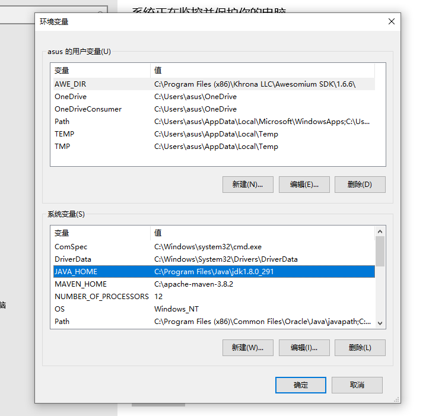

# 一、开发准备

## 在高德平台申请开发者账号

## 创建应用

不同开发者以前创建过的应用可以包名相同。

## 获取包名：

一般为：com.yuya.parent 或com.yuya.teacher

## 获取SHA1：

首次找到java安装目录：



在cmd命令行模式下到java的bin目录，


### debug模式的sha1
执行：
```shell
cd  c:\Program Files\Java\jdk1.8.0_291\bin
keytool -v -list -keystore C:\Users\asus\.android\debug.keystore
```

### release模式的sha1
执行：
```shell
cd  c:\Program Files\Java\jdk1.8.0_291\bin
keytool -v -list -keystore C:\work\gitee\yuya\android\teacher\yuya_android_teacher\app\yuya_teacher.jks
```
可以得到应用的sha1码，输入到高德开放平台的应用即可。

# 二、android端定位开发流程：

### 通过gradle添加依赖：

```garale
allprojects {
    repositories {
        jcenter() // 或者 mavenCentral()
    }
 }
```

```
android {
    defaultConfig {
        ndk {
            //设置支持的SO库架构（开发者可以根据需要，选择一个或多个平台的so）
            abiFilters "armeabi", "armeabi-v7a", "arm64-v8a", "x86","x86_64"
        }
    }
}

dependencies {
    compile fileTree(dir: 'libs', include: ['*.jar'])
    //3D地图so及jar
    compile 'com.amap.api:3dmap:latest.integration'
    //定位功能
    compile 'com.amap.api:location:latest.integration'
    //搜索功能
    compile 'com.amap.api:search:latest.integration'
}
```

### 添加Key

```xml
<application
         android:icon="@drawable/icon"
         android:label="@string/app_name" >
         <meta-data
            android:name="com.amap.api.v2.apikey"
            android:value="请输入您的用户Key"/>
            ……
</application>
```


在application标签中声明service组件：

```XML
<service android:name="com.amap.api.location.APSService"></service>
```

### 配置权限
```xml
<!--允许访问网络，必选权限-->
<uses-permission android:name="android.permission.INTERNET" />  

<!--允许获取精确位置，精准定位必选-->
<uses-permission android:name="android.permission.ACCESS_FINE_LOCATION" /> 
 
<!--允许获取粗略位置，粗略定位必选-->
<uses-permission android:name="android.permission.ACCESS_COARSE_LOCATION" /> 

<!--允许获取设备和运营商信息，用于问题排查和网络定位（无gps情况下的定位），若需网络定位功能则必选-->
<uses-permission android:name="android.permission.READ_PHONE_STATE" />    

<!--允许获取网络状态，用于网络定位（无gps情况下的定位），若需网络定位功能则必选-->
<uses-permission android:name="android.permission.ACCESS_NETWORK_STATE" /> 

<!--允许获取wifi网络信息，用于网络定位（无gps情况下的定位），若需网络定位功能则必选-->
<uses-permission android:name="android.permission.ACCESS_WIFI_STATE" /> 

<!--允许获取wifi状态改变，用于网络定位（无gps情况下的定位），若需网络定位功能则必选-->
<uses-permission android:name="android.permission.CHANGE_WIFI_STATE" /> 

<!--后台获取位置信息，若需后台定位则必选-->
<uses-permission android:name="android.permission.ACCESS_BACKGROUND_LOCATION" /> 

<!--用于申请调用A-GPS模块,卫星定位加速-->
<uses-permission android:name="android.permission.ACCESS_LOCATION_EXTRA_COMMANDS" /> 

<!--允许写设备缓存，用于问题排查-->
<uses-permission android:name="android.permission.WRITE_SETTINGS" />  

<!--允许写入扩展存储，用于写入缓存定位数据-->
<uses-permission android:name="android.permission.WRITE_EXTERNAL_STORAGE" /> 

<!--允许读设备等信息，用于问题排查-->
<uses-permission android:name="android.permission.READ_EXTERNAL_STORAGE" /> 
```

### 合规检测

2.在构造AMapLocationClient 之前必须进行合规检查，设置接口之前保证隐私政策合规，检查接口如下：

```Java
AMapLocationClient.updatePrivacyShow(context,true,true);
AMapLocationClient.updatePrivacyAgree(context,true);
```


### 创建LocationClient

构造AMapLocationClient调用时要捕获异常信息，具体方式可参考如下

```Java
try {
    mClient = new AMapLocationClient(context);
}catch (Exception e){
}

```
4.并在使用mClient的时候，请进行空指针判断，确保可以使用；

```java
Java
if (mClient != null){
// TODO
}
```

### 获取定位
```java
//可以通过类implement方式实现AMapLocationListener接口，也可以通过创造接口类对象的方法实现
//以下为后者的举例：
AMapLocationListener mAMapLocationListener = new AMapLocationListener(){
@Override
public void onLocationChanged(AMapLocation amapLocation) {
    
  }
}
```


