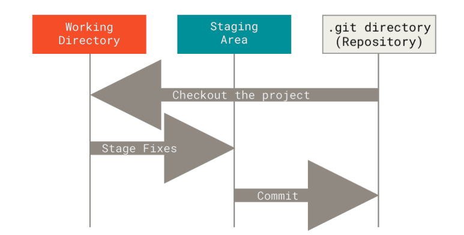

## Git介绍

### 一、Git是什么

Git是一款免费、开源的分布式版本控制系统，用于敏捷高效地处理任何或小或大的项目。

Git是一个开源的分布式版本控制系统，可以有效、高速的处理从很小到非常大的项目版本管理。

Git 是 Linus Torvalds 为了帮助管理 Linux 内核开发而开发的一个开放源码的版本控制软件。

官网地址为：https://git-scm.com/

### 二、Git特点

***优点：***

- 适合分布式开发，强调个体；
 
- 公共服务器压力和数据量都不会太大；
 
- 速度快、灵活；
 
- 任意两个开发者之间可以很容易的解决冲突；
 
- 离线工作。

***缺点：***

* 代码保密性差，一旦开发者把整个库克隆下来就可以完全公开所有代码和版本信息；

* 权限控制不友好；如果需要对开发者限制各种权限的建议使用SVN。

### 三、Git的三种状态

 Git 有三种状态，我们的文件可能处于其中之一： 

* 已修改（modified）

>已修改表示修改了文件，但还没保存到数据库中。

* 已暂存（staged）

>已暂存表示对一个已修改文件的当前版本做了标记，使之包含在下次提交的快照中。

* 已提交（committed）

> 已提交表示数据已经安全地保存在本地数据库中。

这会让我们的 Git 项目拥有三个阶段：工作区、暂存区以及 Git数据仓库。

***工作区：*** 就是你在电脑里能看到的目录。

***暂存区：*** 英文叫 stage 或 index。一般存放在 .git 目录下的 index 文件（.git/index）中，所以我们把暂存区有时也叫作索引（index）。

***版本库：***工作区有一个隐藏目录 .git，这个不算工作区，而是 Git 的版本库。

### 四、Git的工作流程

从远程仓库中克隆 Git 资源作为本地仓库；

从本地仓库中checkout代码然后进行代码修改；

在提交本地仓库前先将代码提交到暂存区；

提交修改，提交到本地仓库；本地仓库中保存修改的各个历史版本；

在需要和团队成员共享代码时，可以将修改代码push到远程仓库。

### 五、git代码服务器

