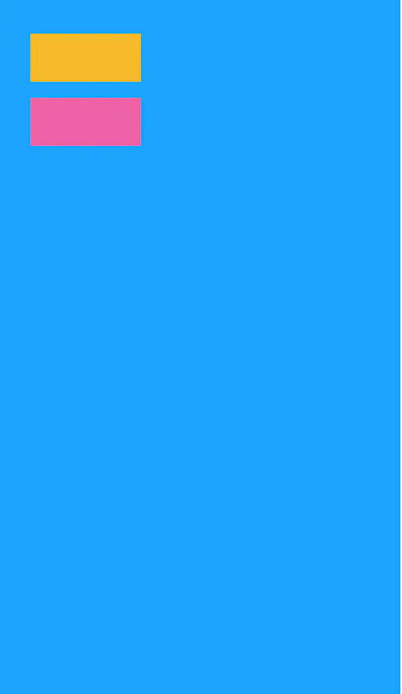
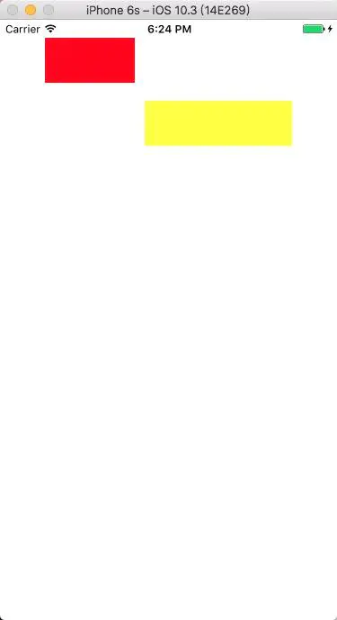

## VFL 语言


1.什么是 VFL 语言：
VFL（Visual Format Language），“可视化格式语言”,是苹果公司为了简化autolayout的编码而推出的抽象语言.


| 功能	 | 表达式  |
|:----------|:----------|
|水平方向   | H:    |
| 垂直方向   | V:    |
| Views    | [view]    |
|关系	    |	>=,==,<=    |
|SuperView    |  \|   |
| 空间，间隙   | -	-    |
| 优先级    | @value    |


例子1:

H:|-20-[_areaBtton(50)]-11-[_userPhoneNum]-20-|

分开讲解：

(1)H:|-20-  

水平方向的布局是 从屏幕左边起20开始

(2)-[_areaBtton(50)]  

是areaBtton设定areaBtton 的宽度是50 注意要用[]来讲控件装起来,对于水平方向 控件后面跟着"()"里面设立的值为宽度 如果是"V"(垂直方向)那么"(50)"是代表着高度为50

(3)-11-

表示距离下一个控件的的距离为11


(4)-20-| 

"|"表示屏幕右边表示上一个控件距离屏幕右边为20

(5)-[_userPhoneNum]- 

表示 下一个控件为 userPhoneNum

这里不指定宽度也是可以的,你可以在控件初始化的时候就给它设定大小,如果设置代码约束的时候不需要将其大小进行变化就可以省略,系统会将你设定的大小为布局后的大小但是这里 整体设立了距离屏幕右边的距离为20 所以这个userPhoneNum 会根据屏幕的宽度来进行拉伸.
例如 iphone 5的屏幕宽度为320 那么这个 userPhoneNum 的宽度就是 320 - 20 - 20 - 50 - 11 后剩下的宽度

例子2:

H:[wideView(>=60@700)]


wideView宽度大于等于60point，该约束条件优先级为700（优先级最大值为1000，优先级越高的约束条件越先被满足）

例子3:

V:|-20-[redBox(50)]-20-[yellowBox(==redBox)]`


垂直方向上，20 的位置开始有 redBox高度50，其下方20接一个高度等于redBox高度的yellowBox,然后直接离下面多少不用管,所以好像这个样子




## NSLayoutConstraint


iOS 里面 官方的 Demo

```c

/* Create an array of constraints using an ASCII art-like visual format string.
 */

+ (NSArray<__kindof NSLayoutConstraint *> *)constraintsWithVisualFormat:(NSString *)format 
        options:(NSLayoutFormatOptions)opts 
        metrics:(nullable NSDictionary<NSString *,id> *)metrics 
        views:(NSDictionary<NSString *, id> *)views;
```

具体说一下这几个参数


(1)format 就是填写刚刚咱们学习的 VFL 语言,注意,这里是需要将 VFL语言写成字符串传递进去,所以这一步很容易出错,错了也不会有报错提示,需要咱们平日里多加练习与锻炼才能很好的避免一些错误


(2)opts

```c
typedef NS_ENUM(NSInteger, NSLayoutRelation) {
NSLayoutRelationLessThanOrEqual = -1,          //小于等于
NSLayoutRelationEqual = 0,                     //等于
NSLayoutRelationGreaterThanOrEqual = 1,        //大于等于
};

typedef NS_ENUM(NSInteger, NSLayoutAttribute) {
NSLayoutAttributeLeft = 1,                     //左侧
NSLayoutAttributeRight,                        //右侧
NSLayoutAttributeTop,                          //上方
NSLayoutAttributeBottom,                       //下方
NSLayoutAttributeLeading,                      //首部
NSLayoutAttributeTrailing,                     //尾部
NSLayoutAttributeWidth,                        //宽度
NSLayoutAttributeHeight,                       //高度
NSLayoutAttributeCenterX,                      //X轴中心
NSLayoutAttributeCenterY,                      //Y轴中心
NSLayoutAttributeBaseline,                     //文本底标线
NSLayoutAttributeNotAnAttribute = 0            //没有属性
};
```

NSLayoutAttributeLeft/NSLayoutAttributeRight 和NSLayoutAttributeLeading/NSLayoutAttributeTrailing的区别是left/right永远是指左右，而leading/trailing在某些从右至左习惯的地区会变成，leading是右边，trailing是左边。


(3)metrics 表示使用到的度量数组,你可以把一些VFL 语言用的值定义在一个字典里面例如创建一个字典

NSDictionary *metres = @{@"leftArglin":@20}

然后在 VFL 语言里面所用到的距离左边位置的距离,可以用leftArglin 来代替,这样的话,改想要修改距离左边的距离,就致用修改字典里面的数值,而不用每个使用到左边距离的地方都意义修改,方便大家,当然这个值可以传 nil

(4)views：就是上面所加入到NSDictionary中的绑定的View,就是需要布局的 view 都需要写入一个字典里面来才可以.

好了,以上就是基本的语法以及准备的事项,那么现在就开始具体的代码吧


```c
#import "ViewController.h"

@interface ViewController ()
@property (nonatomic , strong)UIView *redView;
@property (nonatomic , strong)UIView *yellowView;

@end

@implementation ViewController

- (void)viewDidLoad {
    [super viewDidLoad];
    
    ///先将控件添加到视图上
    [self.view addSubview:self.redView];
    [self.view addSubview:self.yellowView];
    
    ///注意translatesAutoresizingMaskIntoConstraints 一定要设置为 NO
    self.redView.translatesAutoresizingMaskIntoConstraints = NO;
    self.yellowView.translatesAutoresizingMaskIntoConstraints = NO;
    
    ///创建第四个参数用到布局 views 的字典 注意 这个地方用 NSDictionaryOfVariableBindings
    NSDictionary *views  = NSDictionaryOfVariableBindings(_redView,_yellowView);
    
    ///创建第三个参数 所用到的 布局度量 metres 字典
    NSDictionary *metres = @{@"redViewnW":@100,@"leftArglin":@50,@"rightArglin":@50};
    
    ///现在开始创建约束
    
    ///水平方向的约束
    NSArray *HContrains = [NSLayoutConstraint constraintsWithVisualFormat:@"H:|-leftArglin-[_redView(redViewnW)]-11-[_yellowView]-rightArglin-|" options:0 metrics:metres views:views];
    
    ///垂直方向的约束
    NSArray *VContrains = [NSLayoutConstraint constraintsWithVisualFormat:@"V:|-20-[_redView(50)]-20-[_yellowView(==_redView)]" options:0 metrics:metres views:views];
    ///注意上面 如果V:|-20-[_redView(50)]-20-[_yellowView(==_redView)] 换成了V:|-20-[_redView(50)]-20-[_yellowView(==_redView)]-| 会把_yellowView拉着顶到父视图的下边,所以如果你写了这个-| 又和_yellowView 高度定死和 距离 _redView 20 起了冲突 所以会报约束异常
    
    ///添加约束
    [self.view addConstraints:HContrains];
    [self.view addConstraints:VContrains];
}

#pragma mark - 懒加载两个 view 均未设置大小
-(UIView *)redView
{
    if (!_redView) {
        _redView = [[UIView alloc]init];
        _redView.backgroundColor = [UIColor redColor];
    }
    return _redView;
}
-(UIView *)yellowView
{
    if (!_yellowView) {
        _yellowView = [[UIView alloc]init];
        _yellowView.backgroundColor = [UIColor yellowColor];
    }
    return _yellowView;
}

@end

```



附上截图一份


这里有别人总结的 VFL 使用规则 看起来简洁大方可以参考一下

使用规则:
|: 表示父视图
-:表示距离
V: :表示垂直
H: :表示水平

= :表示视图间距、宽度和高度必须大于或等于某个值
<= :表示视图间距、宽度和高度必须小宇或等于某个值
== :表示视图间距、宽度或者高度必须等于某个值
@ :>=、<=、== 限制 最大为 1000
|-[view]-|: 视图处在父视图的左右边缘内
|-[view] : 视图处在父视图的左边缘
|[view] : 视图和父视图左边对齐
-[view]- : 设置视图的宽度高度
|-30.0-[view]-30.0-|: 表示离父视图 左右间距 30
[view(200.0)] : 表示视图宽度为 200.0
|-[view(view1)]-[view1]-| :表示视图宽度一样，并且在父视图左右边缘内
V:|-[view(50.0)] : 视图高度为 50
V:|-(==padding)-[imageView]->=0-[button]-(==padding)-| : 表示离父视图的距离
为Padding,这两个视图间距必须大于或等于0并且距离底部父视图为 padding。
[wideView(>=60@700)] :视图的宽度为至少为60 不能超过 700
如果没有声明方向默认为 水平 V:

作者：wanna_dance
链接：https://www.jianshu.com/p/673ec228b2c1
来源：简书
著作权归作者所有。商业转载请联系作者获得授权，非商业转载请注明出处。


