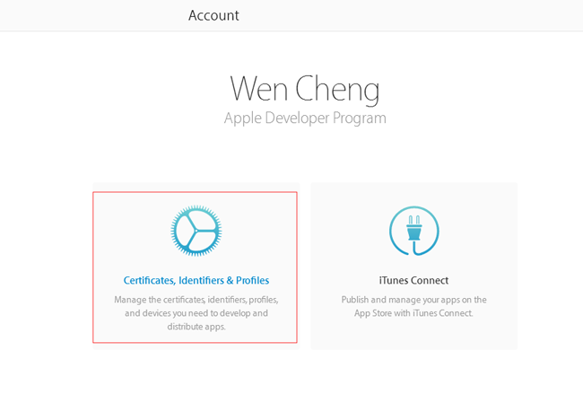
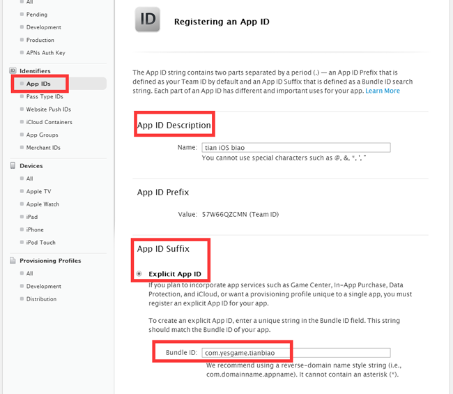
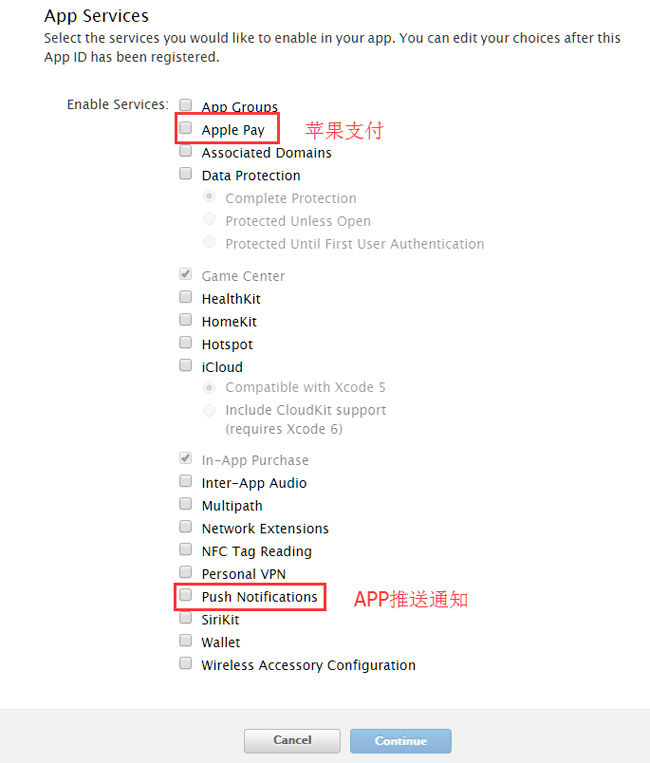
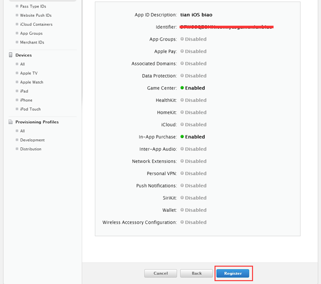

iOS App 发布就是将App的 .ipa文件上传到App Store中。将app发布到应用市场需要八个步骤：

## 一、申请iOS发布证书和描述文件

APP IDs在后面创建发布文件，创建APP时都要用到。

如果之前创建过了，就不用重新创建了，还是用那个appid。

首先登录苹果开发者中心https://developer.apple.com/account，进入证书页面。

### 1.1 点击证书、ID及配件文件，进入设置。

### 1.2 选择App IDs –>点击+创建一个新的App ID

其中有两项需要你自己填：

第一项Name，用来描述你的App ID，这个随便填，没有什么限制，最好是项目名称，这样方便自己辨识（不允许中文)。

 
第二项Bundle ID (App ID Suffix)，这是你App ID的后缀，需要仔细填写。用来标示我们的 app，使它有一个固定的身份，和你的程序直接相关。填写  Explicit App ID 的格式为：com.company.appName（要有两个点.）照着格式写，写个方便记的，后面很多地方要用到。

 

**像这串com.yesgame.tianbiao就是appid了，后面申请ios证书、打包ipa和在itunesconnect创建APP就是用这个格式的appid。**

**整个app上架流程就是靠这个appid关联在一起。**

 

第三项配置服务权限，默认会选择2项，不能修改，其它常用的苹果支付，APP推送通知，根据自己需要的服务选择上，然后点击Continue确认，下一步。

 

选择苹果支付和推送通知，还需要创建对应的iOS苹果支付证书和iOS推送证书。

 

一般没什么要求默认就好。

检查下没有错的话直接点击Register后点击Done完成App ID的创建。

## 2、申请发布证书

## 3、xcode配置iOS证书

## 4、配置xcode打包环境

## 5、打包并导出IPA包

选择product--archive

## 6、在iTunes Connect创建App

## 7、上传IPA到iTunes Connect

## 8、上传IPA成功后到iTunes Connect提交审核

