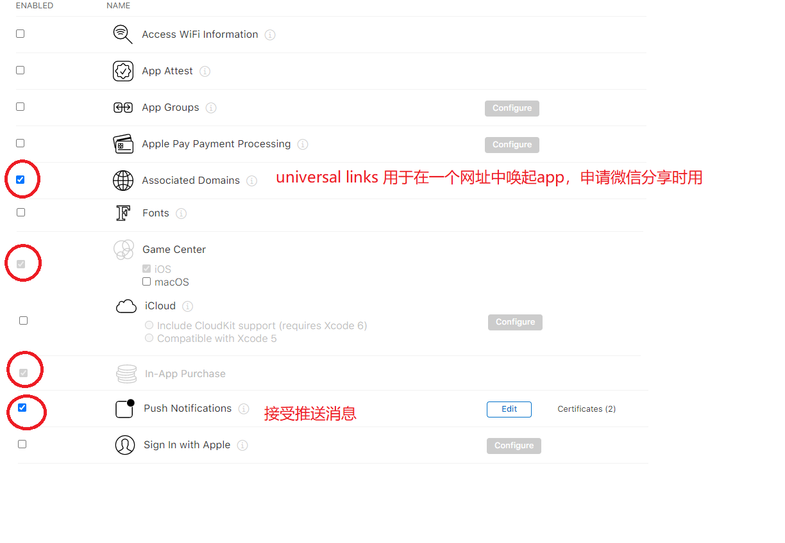
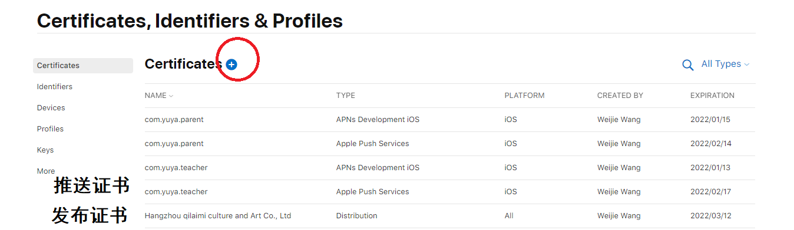

# ios产品发布的基本概念

苹果为了控制应用的开发与发布流程，制定了一套非常复杂的机制。这里面的关键词有：个人开发者账号，企业开发者账号，bundle ID，开发证书，发布证书（又叫“生产证书”），开发描述文件，发布描述文件，推送证书等…。初级开发者很难理解这中间的关系和作用。下文就对上述列出的关键内容和它们的关系做个详细介绍。

## 一、开发者账号 --- Apple ID

开发者账号其实就是apple id，只不过要成为开发者，需要去苹果开发者中心激活开发权限。

激活开发者账号分为三种，个人，公司和企业。这三种账号各自有些区别，下表是他们主要区别的对比：

| 账号类型  |支持applestroe上架   |  测试设备数量  | 申请费用  | 申请费用  |
| -------- | ------------       | ------------- | ------  | ------  |
|个人|	是|	100|	99$|	－|
|公司|	是	|100	|99$	|邓氏码|
|企业|	否	|不限	|299$	|邓氏码|

注：邓氏编码（D-U-N-S® Number）是一种实时动态的企业身份标识。它源自于一个独一无二的9位数字全球编码系统DUNS，相当于企业的身份识别码 （就像是个人的身份证），被广泛应用于企业识别、商业信息的组织及整理。可以帮助识别和迅速定位全球4亿家企业的信息。

所以如果应用需要上appstroe，就要创建个人或者公司类型的账号；

如果只想内部发布，就可以申请企业账号；

个人账号和公司账号的区别就是公司账号能邀请多个账号，他们可以和你共享资源协同开发此应用，而不需要总是问你要你的账号使用。

## 开发者账号添加团队成员

申请了一个公司或企业级的苹果开发者账号，可以添加团队成员协同开发。

团队成员有三种角色，分别是 Agent (代理)， Admin (管理员)，Member (成员)。

代理： 就是注册开发者账号的那一个，权限最高，续费和创建开发商证书只能使用该账号；

管理员： 管理分发证书、管理测试设备、管理应用配置等等，可以有多个；

成员: 没有管理权限，只能下载和请求数据，可以有多个。

## 二、 bundle ID  --- APP ID

bundle ID可以翻译成包ID,也可以叫APP ID 或应用ID,它是每一个ios应用的全球唯一标识。

无论代码怎么改，图标和应用名称怎么换，只要bundle id没变，ios系统就认为这是同一个应用。每开发一个新应用，首先都需要到member center->identifier->APP IDS去创建一个bundle id。

bundle id分为两种：

Explicit App ID（明确的APP ID），一般格式是：com.domainname.appname。这种id只能用在一个app上。每一个新应用都要创建一个。

Wildcard App ID(通配符APP ID), 一般格式是：com.domainname.*。这种id可以用在多个应用上，虽然方便，但是使用这种id的应用不能使用通知功能，所以并不常用。

yuyaparent的AppID

## 三、 iOS Certificates ---证书

ios certificates就是证书。它的作用就是证明你的mac具有开发或发布某个开发者账号下应用的权限。

证书分成两种，一种是开发证书，也叫Development certificate; 另一种是发布证书或叫生产证书，英文名叫Production certificate。

* development certificate

开发证书是证明你的mac具有开发和真机调试你的程序的东西。***每个证书关联着一个开发者账号***，也就是说，你只能使用这个证书开发这个账号底下的应用，它是通过bundle id来知道该应用是不是属于自己的账号。所以，每次为一个开发者帐号开发应用，就得需要这个账号创建的开发证书。

*Production certificate

生产证书是证明你的mac是否具有发布应用的权限。在archive到appstore的时候，必须有生产证书，否则时上传不成功的。

* 根证书

无论是开发证书还是生产证书，都必须从根证书上派生。根证书就是根mac产生的证书，member center上保存的那个证书就是根证书，它只能安装在创建它的那台mac上，其他的开发mac必须从那台根mac上导出证书使用。也就是所有的子证书都只能从根证书派生而来。

开发和产品证书的生成和获取

1 .生成开发和发布证书

(1).通过钥匙串获取证书请求文件Certificate Signing Request (CSR)文件。
选择“钥匙串访问”-“证书助理”-“从证书颁发机构请求证书…”,如下图：

填写邮件地址和常用名称，选择“存储到磁盘”,会生成一个CSR文件到本地磁盘。

登录开发者中心，选择Certificates, Indentifiers & Profiles可以获取开发和发布证书。
Certificates -> All -> +

选择下载，可以将cer文件下载到本地

## 四、iOS Provisioning Profiles ---描述文件

iOS Provisioning Profiles也叫描述文件，它用来标识某个设备是否具有安装某个应用的权限。描述文件分为开发描述文件和发布描述文件。其中发布描述文件又分为临时发布描述文件和正式发布描述文件。

* 开发描述文件(develop provisioning profile)

开发描述文件，创建它需要bundle ID + 开发证书 ＋ 测试设备(在devices中添加); 编译的时候必须三者对应，否则编译器会报错。

* 临时发布描述文件(distribution ad hoc)

临时发布描述文件是用来在有限设备上发布的。创建它需要bundle ID ＋发布证书＋发布设备，编译时也必须三者对应。

* 正式发布描述文件(distribution appstore/distribution ad house)

个人账号和企业账号创建的正式发布描述文件是不同的。因为个人账号是在appstrore上发布，所以创建的是distribution appstore描述文件，而企业账号只能内部发布，所以创建的叫distribution ad house描述文件。但是它们创建所需要的东西都是一样的：bundle ID + 发布证书。 因为他们是在不确定的设备上安装的，所以不需要选择设备。

***目前看描述文件和发布没有什么关系，因为yuya的描述文件已经过期很久了。***

## 五、证书的限制和过期

为什么要导出.p12文件?

当我们用大于三个mac设备开发应用时，想要申请新的证书，如果在我们的证书里，包含了2个发布证书，7个开发证书，可以发现再也申请不了开发证书和发布证书了。（一般在我们的证书界面中应该只有一个开发证书，一个发布证书，没必要生成那么多的证书，证书一般在过期之后才会重新添加。）会提示超过了最大数量，并且不能选择生产证书了。如下图：

解决办法：

1 .撤销(Revoke)已经生成的证书（不建议使用），然后重新生成一个新的证书。

注意:这种方法是可以的，但是会造成相应的Provisioning Profiles失效，这是小问题。但是又要重新申请证书甚至描述文件很浪费时间，所以不提倡这种做法。

2 . 导出.p12文件

每一个证书都可以生成一个.p12文件，这个文件是一个加密的文件，只要知道其密码，就可以供给所有的mac设备使用，使设备不需要在苹果开发者网站重新申请开发和发布证书，就能使用。

注意：一般.p12文件是给与别人使用的，本机必须已经有一个带秘钥的证书才可以生成.p12文件

打开钥匙串->我的证书，选择要导出的证书，右键选择导出“....”证书。如下图：

生成的p12文件，将p12文件，密码，和描述文件发给别人就可正常开发啦。

过期后如何更换证书和描述文件

企业证书的过期日期是3年，但对应的描述文件只有1年，只要有一个过期，应用就不能再使用了，所以在过期前必须要提前更换。

企业的开发证书最多可以创建6个，但发布证书最多只能创建2个，所以一般用一个管理员账号统一管理证书最好。当企业发布证书过期时，我们需要重新创建一个发布证书，然后编辑或重新生成对应App的发布描述文件；然后上线更新即可。更新完后把之前的证书Revoke，之前的描述文件Delete即可,尤其是证书，一定要在更新证书上线后Revoke, 因为一旦证书上被Revoke，应用就不能打开了（会有一定时间点延迟）。

企业证书的描述文件自创建起有效期为一年，当我们发现快要过期了只需要重新Edit，然后下载安装重新打包上线更新即可，当然也可以重新创建一个新的，一个App可以创建多个描述文件，创建安装好后把其他不用的都删除，避免打包时选择错了。

双重认证
苹果规定2018年3月份以后,打包上架App Store必须要双重认证,否则无法上传,有了双重认证，只能通过您信任的设备（如 iPhone、iPad 或 Mac）才能访问您的帐户。首次登录一台新设备时，您需要提供两种信息：您的密码和自动显示在您的受信任设备上的六位验证码。输入验证码后，您即确认您信任这台新设备。例如，如果您有一台 iPhone 并且要在新购买的 Mac 上首次登录您的帐户，您将收到提示信息，要求您输入密码和自动显示在您 iPhone 上的验证码。

任何 iCloud 和 iTunes 用户只要至少拥有一台装有最新版 iOS 或 macOS 的设备，都可以使用双重认证。具体操作见官方文档:Apple ID 的双重认证。

