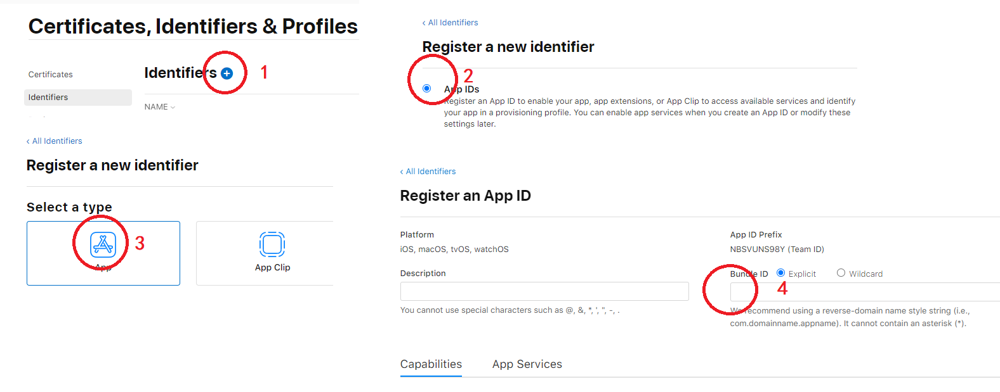
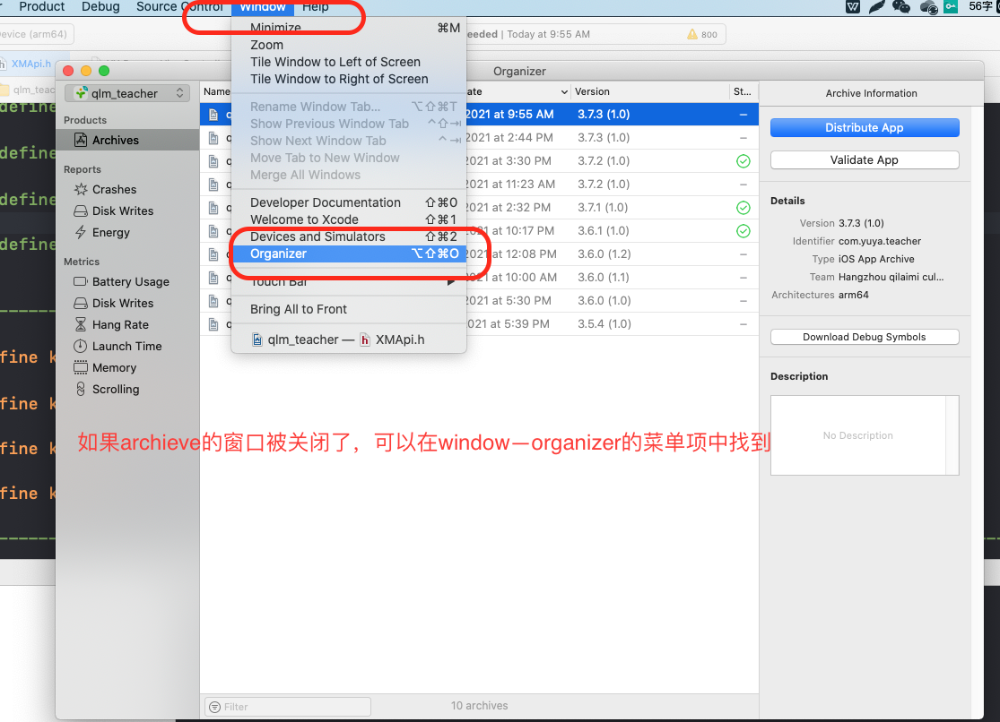

# ios产品发布的基本概念

苹果为了控制应用的开发与发布流程，制定了一套非常复杂的机制。初级开发者很难理解这中间的关系和作用。下文就对上述列出的关键内容以及产品的开发发布流程。

## 一、创建开发者账号，添加团队成员

### 1.1 开发者账号

开发者账号其实就是apple id，只不过要成为开发者，需要去苹果开发者中心激活开发权限。

激活开发者账号分为三种，个人，公司和企业。这三种账号各自有些区别，下表是他们主要区别的对比：

| 账号类型  |支持applestroe上架   |  测试设备数量  | 申请费用  | 申请费用  |
| -------- | ------------       | ------------- | ------  | ------  |
|个人|	是|	100|	99$|	－|
|公司|	是	|100	|99$	|邓氏码|
|企业|	否	|不限	|299$	|邓氏码|

注：邓氏编码（D-U-N-S® Number）是一种实时动态的企业身份标识。它源自于一个独一无二的9位数字全球编码系统DUNS，相当于企业的身份识别码 （就像是个人的身份证），被广泛应用于企业识别、商业信息的组织及整理。可以帮助识别和迅速定位全球4亿家企业的信息。

* 如果应用需要上appstroe，就要创建个人或者公司类型的账号；

* 如果只想内部发布，就可以申请企业账号；

* 个人账号和公司账号的区别就是公司账号能邀请多个账号，他们可以和你共享资源协同开发此应用，而不需要总是问你要你的账号使用。

**育伢开发者账号：  yuyaapp@163.com    WWJ520yll**

### 1.2 添加团队成员

申请了一个公司或企业级的苹果开发者账号，可以添加团队成员协同开发。

团队成员有三种角色，分别是 Agent (代理)， Admin (管理员)，Member (成员)。

代理： 就是注册开发者账号的那一个，权限最高，续费和创建开发商证书只能使用该账号；

管理员： 管理分发证书、管理测试设备、管理应用配置等等，可以有多个；

成员: 没有管理权限，只能下载和请求数据，可以有多个。

开发者账号可以到[App Store Connect](https://appstoreconnect.apple.com)上去添加团队成员。

## 二、 创建App ID（bundle ID）

### 2.1 App ID

bundle ID可以翻译成包ID,也可以叫APP ID 或应用ID,它是每一个ios应用的全球唯一标识。

无论代码怎么改，图标和应用名称怎么换，只要bundle id没变，ios系统就认为这是同一个应用。每开发一个新应用，首先都需要到member center->identifier->APP IDS去创建一个bundle id。

bundle id分为两种：

Explicit App ID（明确的APP ID），一般格式是：com.domainname.appname。这种id只能用在一个app上。每一个新应用都要创建一个。

Wildcard App ID(通配符APP ID), 一般格式是：com.domainname.*。这种id可以用在多个应用上，虽然方便，但是使用这种id的应用不能使用通知功能，所以并不常用。

### 2.2 创建App ID

进入developer.apple.com，在账户（account）中选择appID

下图列出了育伢的app id

创建一个app id的步骤如下：

yuyaparent的AppID

## 三、创建开发证书和产品证书 iOS Certificates 

### 3.1 根证书、开发证书和产品证书

ios certificates就是证书。它的作用就是证明你的mac具有开发或发布某个开发者账号下应用的权限。

证书分成两种：

* 开发证书（development certificate）--用于开发和测试

开发证书是证明你的mac具有开发和真机调试你的程序的东西。***每个证书关联着一个开发者账号***，也就是说，你只能使用这个证书开发这个账号下的应用，它是通过bundle id来知道该应用是不是属于自己的账号。所以，每次为一个开发者帐号开发应用，就得需要这个账号创建的开发证书。

* 发布证书或生产证书 （Production certificate）  --用于打包ipa上传app store

生产证书是证明你的mac是否具有发布应用的权限。在archive到appstore的时候，必须有生产证书，否则时上传不成功的。

* 根证书

无论是开发证书还是生产证书，都必须从根证书上派生。根证书就是根mac产生的证书，member center上保存的那个证书就是根证书，它只能安装在创建它的那台mac上，其他的开发mac必须从那台根mac上导出证书使用。也就是所有的子证书都只能从根证书派生而来。

### 3.2 开发和产品证书的生成和获取

#### 3.2.1 申请签名请求证书

创建证书之前需要现在Mac电脑上面申请certSigningRequest(CSR)文件，打开工具--钥匙串访问程序 - 证书助理 - 从证书颁发机构请求证书

(1).通过钥匙串获取证书请求文件Certificate Signing Request (CSR)文件。
选择“钥匙串访问”-“证书助理”-“从证书颁发机构请求证书…”,如下图：

填写邮件地址和常用名称，选择“存储到磁盘”,会生成一个CSR文件到本地磁盘。

注：钥匙串是一个已加密的容器，用以安全储存 Mac、App、服务器和网站的帐户名和密码，以及机密信息，如信用卡号或银行帐户 PIN 码。访问网站、电子邮件帐户、网络服务器或其他受密码保护的项目时，您可以选取将密码存储在钥匙串中，这样您无需每次都记住或输入密码。

#### 3.2.2 申请开发证书
登录开发者中心，选择Certificates, Indentifiers & Profiles可以获取开发和发布证书。
Certificates -> All -> +

点击+，开始申请开发者证书，选择app development，continue。。。

选择刚才创建的文件，继续

确定信息后，下载证书到本地

#### 3.2.3 申请发布证书

重复刚刚的步骤创建一个iOS Distribution证书（注意是iOS Distribution，不是Apple Distribution）

#### 3.2.4 导入开发证书和发布证书

双击刚刚下载的证书，导入到电脑，两个都要。

### 3.3 证书的限制

当我们用大于三个mac设备开发应用时，想要申请新的证书，如果在我们的证书里，包含了2个发布证书，7个开发证书，可以发现再也申请不了开发证书和发布证书了。（一般在我们的证书界面中应该只有一个开发证书，一个发布证书，没必要生成那么多的证书，证书一般在过期之后才会重新添加。）会提示超过了最大数量，并且不能选择生产证书了。如下图：

解决办法：

* 1 .撤销(Revoke)已经生成的证书（不建议使用），然后重新生成一个新的证书。

注意:这种方法是可以的，但是会造成相应的Provisioning Profiles失效，这是小问题。但是又要重新申请证书甚至描述文件很浪费时间，所以不提倡这种做法。

* 2 . 导出.p12文件

每一个证书都可以生成一个.p12文件，这个文件是一个加密的文件，只要知道其密码，就可以供给所有的mac设备使用，使设备不需要在苹果开发者网站重新申请开发和发布证书，就能使用。

注意：一般.p12文件是给与别人使用的，本机必须已经有一个带秘钥的证书才可以生成.p12文件

打开钥匙串->我的证书，选择要导出的证书，右键选择导出“....”证书。如下图：

生成的p12文件，将p12文件，密码，和描述文件发给别人就可正常开发啦。

### 3.4 证书的过期

ios的开发证书和发布证书是有期限的，如果到期之后，需要进行处理：

有些是有效日期到期，有些是被手动revoke了，都需要进行处理：

* 如果开发者账号是company（公司）类型或个人类型的，只要开发者membership没有过期，就不会对已上架的app产生影响，只需要重新生成一个distribution证书，在下次发布app时使用新的distribution证书。

* 如果你的开发者账号是enterprise类型（企业级）的，企业证书的有效日期是3年，但对应的描述文件有效日期只有1年，二者任何一个过期，所有使用该证书打包的app的用户都将无法启动该app，所以在过期前务必提前操作，生成新证书，打包出新的app，去替换所有用户已经安装的app。 企业证书的描述文件快过期时，可以重新Edit，然后下载安装重新打包上线更新，当然也可以重新创建一个新的，一个App可以创建多个描述文件，只是发布证书最多只能创建2个。

* 注意： 如果要操作revoke证书，一定要在更新证书上线之后再revoke旧证书，因为一旦证书被Revoke，应用就不能打开了（会有一定时间的延迟）。

* ios推送证书过期
* 
push 证书有效期为1年，过期会导致推送发送失败，需要删除过期的证书，重新生成推送证书，并更新所使用的推送平台（比如极光推送）的证书设置。 注意：网上有些教程说要重新打包提审是没必要的，按照以上步骤更新证书即可，不需要重新打包审核app。

* ios推送证书过期后，重新更换新证书以后，以前证书的设备还能收到推送

### 3.5 双重认证

苹果规定2018年3月份以后,打包上架App Store必须要双重认证,否则无法上传,有了双重认证，只能通过您信任的设备（如 iPhone、iPad 或 Mac）才能访问您的帐户。首次登录一台新设备时，您需要提供两种信息：您的密码和自动显示在您的受信任设备上的六位验证码。输入验证码后，您即确认您信任这台新设备。例如，如果您有一台 iPhone 并且要在新购买的 Mac 上首次登录您的帐户，您将收到提示信息，要求您输入密码和自动显示在您 iPhone 上的验证码。

任何 iCloud 和 iTunes 用户只要至少拥有一台装有最新版 iOS 或 macOS 的设备，都可以使用双重认证。具体操作见官方文档:Apple ID 的双重认证。

## 四、iOS Provisioning Profiles ---描述文件

### 4.1描述文件介绍

iOS Provisioning Profiles也叫描述文件，它用来标识某个设备是否具有安装某个应用的权限。

描述文件分为开发描述文件和发布描述文件。其中发布描述文件又分为临时发布描述文件和正式发布描述文件。

* 开发描述文件(develop provisioning profile)

开发描述文件，创建它需要bundle ID + 开发证书 ＋ 测试设备(在devices中添加); 编译的时候必须三者对应，否则编译器会报错。

* 临时发布描述文件(distribution ad hoc)

临时发布描述文件是用来在有限设备上发布的。创建它需要bundle ID ＋发布证书＋发布设备，编译时也必须三者对应。

* 正式发布描述文件(distribution appstore/distribution ad house)
* 

个人账号和企业账号创建的正式发布描述文件是不同的。因为个人账号是在appstrore上发布，所以创建的是distribution appstore描述文件，而企业账号只能内部发布，所以创建的叫distribution ad house描述文件。但是它们创建所需要的东西都是一样的：bundle ID + 发布证书。 因为他们是在不确定的设备上安装的，所以不需要选择设备。

***目前看描述文件和发布没有什么关系，因为yuya的描述文件已经过期很久了。***

### 4.2 描述文件的创建和安装
在[苹果开发者官网](https://developer.apple.com/account)上打开profile，点击上面的“+”。

选择描述文件的种类，点击下一步：

选择app id，然后点击下一步：

选择需要安装的设备，然后点击下一步：

完成后，可以下载描述文件

## 五、编译和发布app到appstore

应用程序打包，即通过选择发布方式，来决定应用能让哪些用户、通过何种安装方式下载安装

对于一个iOS应用，它的打包过程包括：

选择发布方式

选择证书和描述文件

编译 & 签名

导出ipa文件

上传到

首先打包ipa文件：

1.选择Any iOS Device，选择其他模拟器是不能Archive的
选择product--archive

2、打包成功后，首先ad-hoc，放到蒲公英测试

2-x：如果archive包的窗口被关闭了，可以在window-organizer的菜单中重新唤起

测试通过后，将app保存到appstore-connector上去

3、保存到appstore-connector上面去

4、登录appstore-connect，点击发布，可以发布产品

首先登录appstore-connect，点击我的app

点击app旁边的加号，输入一个新的版本名称，如3.7.3

选择构建版本，找到刚才上传到appstore-connect的构建包

然后，输入本次更新的内容后，点击提交审核即可

