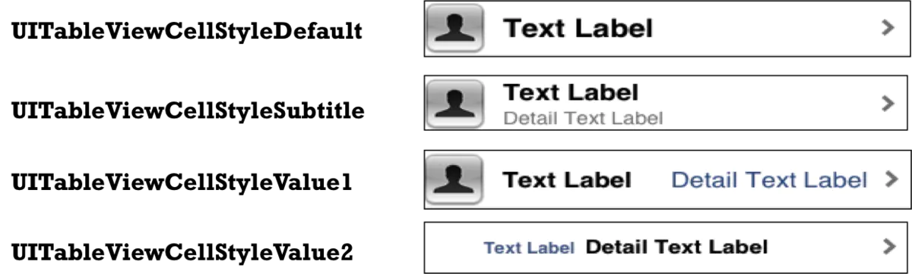

##


## 1、tableView层次结构


## 2、cell

cell结构


contentView下默认有3个子视图

2个是UILabel(textLabel、detailTextLabel)

1个UIImageView(imageView)

UITableViewCellStyle属性

用于决定使用contentView的哪些子视图，以及这些子视图在contentView中的位置



cell重用原理

```c
当滚动列表时，部分UITableViewCell会移出窗口，

UITableView会将窗口外的UITableViewCell放入一个对象池中，等待重用。

当UITableView要求dataSource返回UITableViewCell时，

dataSource会先查看这个对象池，

如果池中有未使用的UITableViewCell，

dataSource会用新的数据配置这个UITableViewCell，

然后返回给UITableView，

重新显示到窗口中，从而避免创建新对象


```


不同类型的Cell重用
解决方案：指定不同类型对应的重用标识来区分
UITableViewCell有个NSString *reuseIdentifier属性，
可以在初始化UITableViewCell的时候传入一个特定的字符串标识来设置reuseIdentifier(一般用UITableViewCell的类名)。
当UITableView要求dataSource返回UITableViewCell时，
先通过一个字符串标识到对象池中查找对应类型的UITableViewCell对象，
如果有，就重用，
如果没有，就传入这个字符串标识来初始化一个UITableViewCell对象


+ 注册Cell

```objc
  [self.tableView registerClass:[TagCell class] forCellReuseIdentifier:@"tgID"];
快速常见Cell : xib / storyboard
- (instancetype)initWithTableView:(UITableView *)tableView{
    static NSString *ideitifier = @"tgCell";
    TgCell *cell = [tableViewdequeueReusableCellWithIdentifier:ideitifier];
    if (!cell) {
// 1. xib  缓存池中没有通过 loadNibNamed...方法加载重写创建
//       cell = [[[NSBundle mainBundle] loadNibNamed:@"TgCell" owner:nil options:nil] lastObject]; 
// 2. storyboard      缓存池中没有通过 initWithStyle...方法加载重写创建
cell = [[TgCell alloc] initWithStyle:UITableViewCellStyleDefaultreuseIdentifier:ideitifier];
    }
    return cell;
}
iOS8 , 自动计算Cell高度

// 告诉tableView的真实高度是自动计算的，根据你的约束来计算
self.tableView.rowHeight = UITableViewAutomaticDimension;
// 告诉tableView所有cell的估计行高
self.tableView.estimatedRowHeight = 44
// 返回估算告诉,作用:在tablView显示时候,先根据估算高度得到整个tablView高,而不必知道每个cell的高度,从而达到高度方法的懒加载调用

## 3、常见属性


```c

// UITableView的两种样式
UITableViewStylePlain / UITableViewStyleGrouped

self.tableView.backgroundColor = [UIColor purpleColor];

// 设置索引条内部文字颜色
self.tableView.sectionIndexColor = [UIColor colorWithRed:1 green:1 blue:1 alpha:1];

// 设置索引条背景颜色
self.tableView.sectionIndexBackgroundColor = [UIColor colorWithRed:0 green:0 blue:0 alpha:1];

//1. 修改tableView的行高
self.tableView.rowHeight = 100;

// 2.组头组尾的高
self.tableView.sectionHeaderHeight = 55;
self.tableView.sectionFooterHeight = 22;

// 3.设置整个tablView的头部/尾部视图
self.tableView.tableHeaderView = [[UISwitch alloc] init];
self.tableView.tableFooterView = [UIButton buttonWithType:UIButtonTypeInfoDark];

 // 4.设置我们分割线颜色(clearColor相当于取消系统分割线)
self.tableView.separatorColor = [UIColor clearColor];

// 5.设置分割线样式
self.tableView.separatorStyle = UITableViewCellSeparatorStyleNone;


```
## 4、方法

```c

#pragma mark - 数据源方法
// 返回行数
- (NSInteger)tableView:(nonnull UITableView *)tableView numberOfRowsInSection:(NSInteger)section{
}

// 设置cell
- (UITableViewCell *)tableView:(nonnull UITableView *)tableView cellForRowAtIndexPath:(nonnull NSIndexPath *)indexPath{

}

#pragma mark - 代理方法
/**
 *  设置行高
 */
- (CGFloat)tableView:(nonnull UITableView *)tableView heightForRowAtIndexPath:(nonnull NSIndexPath *)indexPath{
    return 100;
}

 // 添加每组的组头
- (UIView *)tableView:(nonnull UITableView *)tableView viewForHeaderInSection:(NSInteger)section{
 }

// 返回每组的组尾
- (UIView *)tableView:(nonnull UITableView *)tableView viewForFooterInSection:(NSInteger)section{
 }

// 选中某行cell时会调用
- (void)tableView:(nonnull UITableView *)tableView didSelectRowAtIndexPath:(nonnull NSIndexPath *)indexPath{
    NSLog(@"选中didSelectRowAtIndexPath row = %ld", indexPath.row);
}

// 取消选中某行cell会调用 (当我选中第0行的时候，如果现在要改为选中第1行 - 》会先取消选中第0行，然后调用选中第1行的操作)
- (void)tableView:(nonnull UITableView *)tableView didDeselectRowAtIndexPath:(nonnull NSIndexPath *)indexPath{

    NSLog(@"取消选中 didDeselectRowAtIndexPath row = %ld ", indexPath.row);
}

// 设置UITableView的索引条，返回数组字符串集
- (nullable NSArray<NSString *> *)sectionIndexTitlesForTableView:(UITableView *)tableView;
 


```


