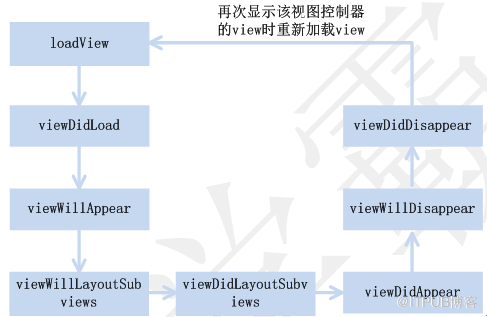

## UIViewController的生命周期


说到视图的生命周期一般都是指视图控制器的视图生命周期。在视图的声明周期中最主要的有8个方法，分别为

| 方法  | 功能  |
|:----------|:----------|
|loadView()   | 载入视图，通常这一步不需要去干涉。   |
| viewDidLoad()   | 载入完成，可以进行自定义数据以及动态创建其他控件   |
| viewWillAppear(_:)   | 视图将出现在屏幕之前，马上这个视图就会被展现在屏幕上了   |
| viewWillLayoutSubviews()    | 即将开始子视图位置布局   |
| viewDidLayoutSubviews()    | 用于通知视图的位置布局已经完成    |
| viewDidAppear(_:)  | 视图已在屏幕上渲染完成    |
| viewWillDisappear(_:)   |视图即将消失    |
| viewDidDisappear(_:)    |视图已经消失    |

uiviewcontroller的生命周期如下图：




完整的代码示例如下：

```swift

import UIKit
class ViewController: UIViewController {
    //载入完成
    override func viewDidLoad() {
        super.viewDidLoad()
        // Do any additional setup after loading the view, typically from a nib.
         print("viewDidLoad")
}
//轻拍按钮，移除视图控制器的视图
    @IBAction func removeView(_ sender: AnyObject) {
         view.removeFromSuperview()
}
//载入视图
    override func loadView() {
        super.loadView()
        print("LoadView")
}
//视图将出现在屏幕之前
    override func viewWillAppear(_ animated: Bool) {
        super.viewWillAppear(true)
        print("viewWillAppear")
}
//视图已在屏幕上渲染完成
    override func viewDidAppear(_ animated: Bool) {
        super.viewDidAppear(true)
        print("viewDidAppear")
}
//即将开始子视图位置布局
    override func viewWillLayoutSubviews() {
        super.viewWillLayoutSubviews()
        print("viewWillLayoutSubviews")
}
//视图的位置布局已经完成
    override func viewDidLayoutSubviews() {
        super.viewDidLayoutSubviews()
        print("viewDidLayoutSubviews")
}
//视图即将消失
    override func viewWillDisappear(_ animated: Bool) {
        super.viewWillDisappear(true)
        print("viewWillDisappear")
}
//视图已经消失
    override func viewDidDisappear(_ animated: Bool) {
        super.viewDidDisappear(true)
        print("viewDidDisappear")
    }
……
}


```


