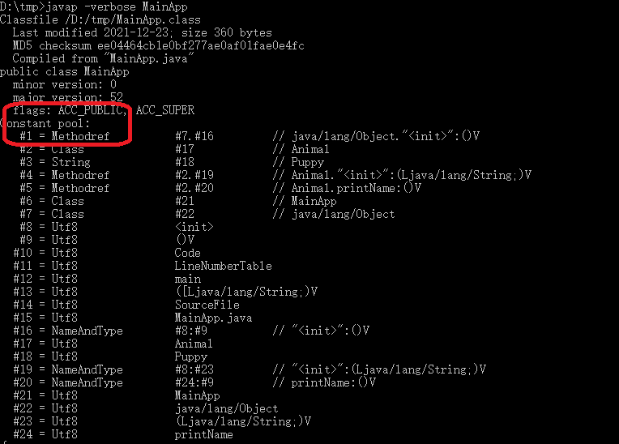

## 一、Java源程序

在记事本或java的IDE工具中创建java源文件MainApp.java

```java

public class MainApp {
    public static void main(String[] args) {
        Animal animal = new Animal("Puppy");
        animal.printName();
    }
}
 
class Animal {
    public String name;

    public Animal(String name) {
        this.name = name;
    }

    public void printName() {
        System.out.println("Animal [" + name + "]");
    }
} 


} 
```

## 二、编译

### 2.1 编译源文件

在命令行工具下执行(注意配置系统环境变量，路径使用绝对路径）

```dos

 javac ./MainApp.java

```
会在当前目录下生成MainApp.class文件。

### 2.2 编译后的字节码文件

编译后的字节码文件格式主要分为两部分：

* 常量池

常量池记录的是代码出现过的所有token(类名，成员变量名等等)以及符号引用（方法引用，成员变量引用等等）

* 方法字节码

方法字节码放的是类中各个方法的字节码。

执行

```dos

 javap -verbose MainApp

```
可以查看常量池：



执行


```dos

 javap -c MainApp

```
可以查看方法字节码：


## 三、运行

java类运行的过程大概可分为两个过程：

* 类的加载  


* 类的执行


需要说明的是：

JVM主要在程序第一次主动使用类的时候，才会去加载该类。也就是说，JVM并不是在一开始就把一个程序就所有的类都加载到内存中，而是到不得不用的时候才把它加载进来，而且只加载一次。

下面是程序运行的详细步骤：

- 1、在编译好java程序得到MainApp.class文件后，在命令行上执行 java AppMain，系统会启动一个jvm进程，jvm进程从classpath路径中找到一个名为AppMain.class的二进制文件，将MainApp的类信息加载到运行时数据区的方法区内，这个过程叫做MainApp类的加载。

* 2、JVM找到AppMain的主函数入口，开始执行main函数。


* 3、main函数的第一条命令是Animal  animal = new Animal("Puppy");就是让JVM创建一个Animal对象，但是这时候方法区中没有Animal类的信息，所以JVM马上加载Animal类，把Animal类的类型信息放到方法区中。

* 4、加载完Animal类之后，Java虚拟机做的第一件事情就是在堆区中为一个新的Animal实例分配内存, 然后调用构造函数初始化Animal实例，这个Animal实例持有着指向方法区的Animal类的类型信息（其中包含有方法表，java动态绑定的底层实现）的引用。

* 5、当使用animal.printName()的时候，JVM根据animal引用找到Animal对象，然后根据Animal对象持有的引用定位到方法区中Animal类的类型信息的方法表，获得printName()函数的字节码的地址。

* 6、开始运行printName()函数。


