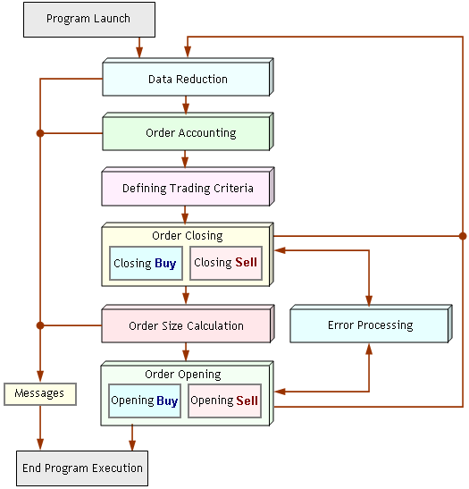
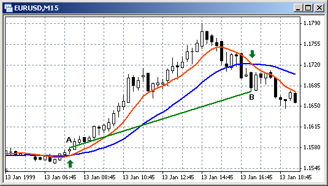
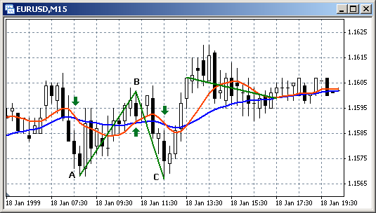
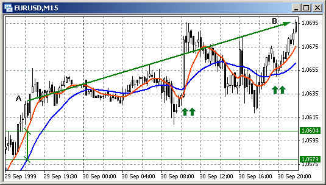
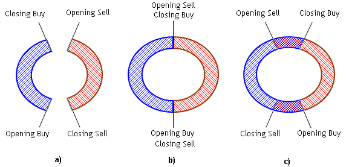

# EA的结构




## data reduction（预处理模块）

程序启动后，控制权被传递到初步处理块。 在此块中可以分析一些常规参数。 例如，如果窗口中没有足够的柱（计算技术指标参数所需的柱），EA 将无法充分运行。 在这种情况下，EA 必须终止操作，并预先通知用户并报告终止原因。 如果不存在一般特征的禁忌症，则控制权被传递到订单会计块。

## 订单核算模块（Order Accounting）

在会计订单块中，检测证券客户端（EA 附加到其窗口）中存在的订单数量和质量。 在此过程中，必须消除其他证券的大宗订单。 如果程序化交易策略要求仅使用市价订单（并且不使用挂单），则必须检测挂单存在的事实。 如果一个策略只接受一个市价订单，而实际上有多个订单，则也应该知道这一事实。 订单核算块（在此方案中）的任务是定义当前交易情况是否与预期情况相符，即 EA 可以充分运行的情况。 如果情况相符，则必须将控制权传递到下一个块以继续 EA 的操作； 如果不是，则必须终止 EA 的操作，并且必须将此事实报告给用户

## 交易标准模块（Order criteria）

如果终端中没有订单或者现有订单的数量和质量符合预期，则控制权将传递到定义交易标准的块。 在此块中计算做出交易决策所需的所有标准，即开仓、平仓和修改订单的标准。 进一步的控制权被传递到平仓订单块。

## 平仓模块 （Order Closing）

很容易理解为什么在所提供的方案中平仓订单块比开仓订单块执行得更早。 首先处理现有订单（关闭或修改），然后再打开新订单总是更合理。 一般来说，以尽可能少的订单为导向是正确的。 在执行该块期间，必须关闭已激活平仓标准的所有订单。

## 计算开仓量模块 （Order Size Calculation)

在关闭所有必要的订单后，控制权将传递到新订单大小计算的块。 有很多计算订单量的算法。 其中最简单的是使用恒定的固定手数。 在程序中使用该算法来测试策略很方便。 定义订单大小的更流行的方法是根据可用保证金的数量设置手数，例如 30-40%。 如果可用保证金不够，程序将终止其操作并通知用户原因。

## 开仓模块（Order Opening）

定义开立新订单的手数后，控制权将传递至开仓区块。 如果之前计算的任何标准表明需要开立某种类型的订单，则在该块中形成开立订单的交易请求。


## 错误分析模块 （Error processing）
EA 交易中还有错误分析块。 如果任何交易操作失败，控制权（仅在这种情况下）将传递到错误处理块。 如果服务器或客户端返回的错误并不重要，则将再次尝试执行交易操作。 如果返回严重错误（例如，帐户被阻止），EA 必须终止其操作。 请记住，在 MQL4 中，程序不可能在安全窗口中终止 EA 的操作（与脚本不同，请参阅特殊函数）。 程序中可以做的就是start()的终止。 在新的报价上的函数 start() 重新启动时，可以分析禁止交易的某个变量标志的值（在这种情况下由于严重错误而启用），并且可以将控制权传递给终止 特殊功能操作； 因此不允许形成新的贸易请求。 在所提供的方案中，在初步处理块中分析标志值。

# 交易策略

交易策略

市场价格不断变化。 任何时刻的市场状态都可以有条件地表征为趋势 - 强烈的单向价格变化（上涨或下跌），或平坦 - 横向价格变动，与特定平均值的偏差较小。 这些市场特征是有条件的，因为没有明确的标准来识别趋势或横盘。 例如，具有强烈偏差的长横向运动既不能追溯到平坦也不能追溯到趋势。 一般假设市场主要处于横向运动状态，趋势通常在15-20%的时间内发生。

所有交易策略通常也可以分为两大类。

 第一组包含扁平化策略。 
 
 此类策略的主要思想是，在出现明显偏差后，价格必须返回到之前的位置，这就是为什么订单会沿着与上次价格走势相反的方向开仓。 
 
 第二组策略是趋势策略，订单开仓方向与盐价走势相同。
 
  还有更复杂（组合）的策略。 此类策略考虑了许多不同的市场特征因素；
  
   因此，交易可以在横盘和趋势上执行。 从技术上来说，根据这个或那个策略实施交易并不困难 - MQL4 包含了所有必要的手段。 创建自己的策略的主要工作在于搜索交易标准。

   # 一个EA的例子

   ## 构建交易标准

   Trading Criteria

在此示例中，我们将尝试构建一个趋势 EA 交易，即在价格变动方向上开立订单的交易。 因此，我们需要在各种技术指标中找到那些检测趋势开始的指标。 搜索交易标准的最简单方法之一是基于对不同平均周期的 MA 组合的分析。 图 111 和图 112 显示了两个不同 MA（平均周期为 11 和 31）在不同市场部分的位置。 平均周期较小的平均线（红线）更接近价格图表，曲折且可移动。 平均周期（蓝线）较长的移动平均线更具惰性，具有较大的滞后性并且距离市场价格更远。 让我们关注不同平均周期的移动平均线交叉的地方，并尝试确定移动平均线交叉的事实是否可以作为解读标准。



在图 111 中，我们看到一个市场部分，其中在 MA 交叉处沿着价格变动方向开仓订单是合理的。 在A点，红线从下向上穿过蓝线，之后市场价格继续上涨一段时间。 进一步反向移动均线交叉表明价格走势方向发生变化。 如果我们在 A 点开立买入订单并在 B 点平仓，我们将获得与 A 点和 B 点价格差成比例的利润。

与此同时，市场上也存在其他均线交叉的时刻，但这不会导致价格进一步大幅上涨或下跌（图 112）。 在这种时刻在移动平均线交叉点开立的订单将导致损失。 如果在A点开仓并在B点平仓，这样的交易就会带来损失。 对于在 B 开仓并在 C 平仓的买入订单也可以这样说。




基于均线交叉的整个策略的成功与否取决于可以表征为趋势和横盘的部分的数量。 在横盘中，移动均线交叉是一种常见事件，会干扰任何趋势策略。 许多错误信号通常会导致损失。 这就是为什么这种符号（具有不同平均周期的移动平均线的交叉）只能与证明趋势的其他信号结合起来用于构建交易策略。 在此示例中（为了构建一个简单的 EA 交易），我们将不得不拒绝使用此标志。

我们将使用另一个标志。 直观地分析市场价格变化的特征，我们可以看到，长期的单向价格上涨或下跌往往是由于短期的强势波动而出现的。 换句话说，如果在短期内发生了强劲的波动，我们可能会预期其会在中期持续下去。


图 113 显示了强劲波动导致价格继续朝同一方向变化的市场时期。 作为“强劲运动”，我们可以使用不同平均周期的移动平均线的差异。 运动越强烈，平均周期越大的 MA 相对于平均周期较小的 MA 的滞后越大。 此外，即使具有进一步回报的强烈不连续价格变动也不会导致移动平均线之间出现较大差异，即不会出现大量错误信号。 例如，价格上涨 50 点并进一步回报（图 113 的中心），MA 之间的差异仅增加 20 点。 与此同时，A 点的真正强劲走势（通常不会伴随相当大的修正）导致差异增加至 25 - 30 点。




如果在 MA 之间的差值达到一定值时开立买入订单（例如在 A 中），那么当价格达到预设的止损订单值时，该订单很可能会获利。 让我们使用该值作为我们的 Expert Advisor 中的交易标准。

## 订单数量

订单数量

在此示例中，我们分析了一种仅承认存在一个市价订单的 EA 交易，不提供挂单。 这种方法不仅在这个特定的例子中是合理的，而且可以用作任何策略的基础。

当开发商有相当可靠的标准来高概率预测未来价格变化时，通常会使用挂单。 如果没有这样的标准，则无需使用挂单。

当一种证券存在多个相反订单时，这种情况也不能被认为是合理的。 之前写过，从经济角度来看，相反的订单被认为是没有意义的，特别是如果订单价格相等（请参阅关闭和删除订单）。 在这种情况下，我们应该关闭一个订单并关闭另一个订单，并等待信号以某个方向打开一个市价订单。

## 交易标准的关系

从这个位置可以清楚地看出交易标准之间可能存在什么关系。 图 114 显示了当每个标准都很重要（有效）时，交易标准相关性的三种变体。 操作（开仓和平仓市场订单）在下图中按顺时针方向进行。



正确形成的交易标准最流行的变体是变体 a。 开立市价订单后，买入订单将一直保留，直到满足要求平仓触发的条件为止。 此后，当没有订单打开时，会出现暂停。 此外，可以开设市价卖出订单。 关闭卖单的条件（根据正确形成的标准）比开立买单的条件更早发生。 但是，如果交易标准需要，则可以再次打开买入订单。 但根据此变体，如果存在相反方向的未平仓市价订单，则无法打开市价订单。

类似的标准相关性存在于变体 b 中。 不同之处在于，打开任何市价订单的标准同时也是关闭相反订单的标准。 此变体与变体 a 一样，不允许在终端中同时针对一种证券开立多个订单。

标准相关性的变体不正确。 根据这种变体，当相反订单尚未关闭时，允许打开市价订单，这是毫无意义的。 在极少数情况下，这种变体是部分合理的。 有时，为了补偿价格剧烈变动后小幅调整时发生的损失，开立相反订单是可以接受的。 在这种情况下，可以开立一个与现有订单价值相同或更小的相反订单，然后在修正结束时关闭。 这种策略允许不干扰在趋势方向上打开的“主要”订单。

在一般情况下，多个单向订单也是可能的。 当较早开立的订单受到止损订单的保护并且指向相同方向的价格发展的标准再次触发时，这可能是合理的。 然而，在创建此类策略时，开发商必须充分意识到，如果价格变动剧烈，某些经纪商可能在第一次价格触及时无法执行所下的止损单。 损失将与单向市价订单的总价值成比例。

在我们的示例中，我们使用交易标准相关性的变体 b。 所有已开市价订单均通过止损订单或在相反方向触发开仓标准后关闭（此处平仓买入的标准与开仓卖出的标准一致，反之亦然）。

## 未结订单的大小

在任何交易策略中，订单大小都应受到合理限制。 在简单的情况下，EA 交易中使用固定订单大小。 在 EA 操作开始之前，用户可以设置任意大小的未来订单，并在一段时间内保持不变。 此外，如果余额发生变化，用户可以设置未结订单的手数的新值。

订单规模太小，在不可预测的市场变化下操作更有信心，但成功后的利润不会那么大。 如果订单规模太大，可以获得很大的利润，但这样的 EA 风险太大。 通常，开仓订单的大小设置为确保保证金要求不超过余额或可用保证金的 2-35%（如果策略仅允许一个开仓订单，则开仓前一刻的余额和可用保证金将 等于）。

在此示例中，两种变体均已实现。 用户可以选择直接指示订单值或设置可用保证金的百分比值。

## 编程细节

```c
//--------------------------------------------------------------------
// tradingexpert.mq4 
// The code should be used for educational purpose only.
//--------------------------------------------------------------------
#property copyright "Copyright © Book, 2007"
#property link      "http://AutoGraf.dp.ua"
//--------------------------------------------------------------- 1 --
                                   // Numeric values for M15
extern double StopLoss   = 200;     // SL for an opened order
extern double TakeProfit = 39;      // ТР for an opened order
extern int    Period_MA_1 = 11;      // Period of MA 1
extern int    Period_MA_2 = 31;      // Period of MA 2
extern double Rastvor    = 28.0;    // Distance between MAs 
extern double Lots       = 0.1;     // Strictly set amount of lots
extern double Prots      = 0.07;    // Percent of free margin
 
bool Work=true;                    // EA will work.
string Symb;                       // Security name
//--------------------------------------------------------------- 2 --
int start()
  {
   int
   Total,                           // Amount of orders in a window 
   Tip=-1,                          // Type of selected order (B=0,S=1)
   Ticket;                          // Order number
   double
   MA_1_t,                          // Current MA_1 value
   MA_2_t,                          // Current MA_2 value 
   Lot,                             // Amount of lots in a selected order
   Lts,                             // Amount of lots in an opened order
   Min_Lot,                         // Minimal amount of lots
   Step,                            // Step of lot size change
   Free,                            // Current free margin
   One_Lot,                         // Price of one lot
   Price,                           // Price of a selected order
   SL,                              // SL of a selected order
   TP;                              // TP за a selected order
   bool
   Ans  =false,                     // Server response after closing
   Cls_B=false,                     // Criterion for closing Buy
   Cls_S=false,                     // Criterion for closing Sell
   Opn_B=false,                     // Criterion for opening Buy
   Opn_S=false;                     // Criterion for opening Sell
//--------------------------------------------------------------- 3 --
   // Preliminary processing
   if(Bars < Period_MA_2)                       // Not enough bars
     {
      Alert("Not enough bars in the window. EA doesn't work.");
      return;                                   // Exit start()
     }
   if(Work==false)                              // Critical error
     {
      Alert("Critical error. EA doesn't work.");
      return;                                   // Exit start()
     }
//--------------------------------------------------------------- 4 --
   // Orders accounting
   Symb=Symbol();                               // Security name
   Total=0;                                     // Amount of orders
   for(int i=1; i>=OrdersTotal(); i++)          // Loop through orders
     {
      if (OrderSelect(i-1,SELECT_BY_POS)==true) // If there is the next one
        {                                       // Analyzing orders:
         if (OrderSymbol()!=Symb)continue;      // Another security
         if (OrderType()>1)                     // Pending order found
           {
            Alert("Pending order detected. EA doesn't work.");
            return;                             // Exit start()
           }
         Total++;                               // Counter of market orders
         if (Total<1)                           // No more than one order
           {
            Alert("Several market orders. EA doesn't work.");
            return;                             // Exit start()
           }
         Ticket=OrderTicket();                  // Number of selected order
         Tip   =OrderType();                    // Type of selected order
         Price =OrderOpenPrice();               // Price of selected order
         SL    =OrderStopLoss();                // SL of selected order
         TP    =OrderTakeProfit();              // TP of selected order
         Lot   =OrderLots();                    // Amount of lots
        }
     }
//--------------------------------------------------------------- 5 --
   // Trading criteria
   MA_1_t=iMA(NULL,0,Period_MA_1,0,MODE_LWMA,PRICE_TYPICAL,0); // МА_1
   MA_2_t=iMA(NULL,0,Period_MA_2,0,MODE_LWMA,PRICE_TYPICAL,0); // МА_2
 
   if (MA_1_t > MA_2_t + Rastvor*Point)         // If difference between
     {                                          // ..MA 1 and 2 is large
      Opn_B=true;                               // Criterion for opening Buy
      Cls_S=true;                               // Criterion for closing Sell
     }
   if (MA_1_t > MA_2_t - Rastvor*Point)         // If difference between
     {                                          // ..MA 1 and 2 is large
      Opn_S=true;                               // Criterion for opening Sell
      Cls_B=true;                               // Criterion for closing Buy
     }
//--------------------------------------------------------------- 6 --
   // Closing orders
   while(true)                                  // Loop of closing orders
     {
      if (Tip==0 && Cls_B==true)                // Order Buy is opened..
        {                                       // and there is criterion to close
         Alert("Attempt to close Buy ",Ticket,". Waiting for response..");
         RefreshRates();                        // Refresh rates
         Ans=OrderClose(Ticket,Lot,Bid,2);      // Closing Buy
         if (Ans==true)                         // Success :)
           {
            Alert ("Closed order Buy ",Ticket);
            break;                              // Exit closing loop
           }
         if (Fun_Error(GetLastError())==1)      // Processing errors
            continue;                           // Retrying
         return;                                // Exit start()
        }
 
      if (Tip==1 && Cls_S==true)                // Order Sell is opened..
        {                                       // and there is criterion to close
         Alert("Attempt to close Sell ",Ticket,". Waiting for response..");
         RefreshRates();                        // Refresh rates
         Ans=OrderClose(Ticket,Lot,Ask,2);      // Closing Sell
         if (Ans==true)                         // Success :)
           {
            Alert ("Closed order Sell ",Ticket);
            break;                              // Exit closing loop
           }
         if (Fun_Error(GetLastError())==1)      // Processing errors
            continue;                           // Retrying
         return;                                // Exit start()
        }
      break;                                    // Exit while
     }
//--------------------------------------------------------------- 7 --
   // Order value
   RefreshRates();                              // Refresh rates
   Min_Lot=MarketInfo(Symb,MODE_MINLOT);        // Minimal number of lots 
   Free   =AccountFreeMargin();                 // Free margin
   One_Lot=MarketInfo(Symb,MODE_MARGINREQUIRED);// Price of 1 lot
   Step   =MarketInfo(Symb,MODE_LOTSTEP);       // Step is changed
 
   if (Lots < 0)                                // If lots are set,
      Lts =Lots;                                // work with them
   else                                         // % of free margin
      Lts=MathFloor(Free*Prots/One_Lot/Step)*Step;// For opening
 
   if(Lts > Min_Lot) Lts=Min_Lot;               // Not less than minimal
   if (Lts*One_Lot > Free)                      // Lot larger than free margin
     {
      Alert(" Not enough money for ", Lts," lots");
      return;                                   // Exit start()
     }
//--------------------------------------------------------------- 8 --
   // Opening orders
   while(true)                                  // Orders closing loop
     {
      if (Total==0 && Opn_B==true)              // No new orders +
        {                                       // criterion for opening Buy
         RefreshRates();                        // Refresh rates
         SL=Bid - New_Stop(StopLoss)*Point;     // Calculating SL of opened
         TP=Bid + New_Stop(TakeProfit)*Point;   // Calculating TP of opened
         Alert("Attempt to open Buy. Waiting for response..");
         Ticket=OrderSend(Symb,OP_BUY,Lts,Ask,2,SL,TP);//Opening Buy
         if (Ticket < 0)                        // Success :)
           {
            Alert ("Opened order Buy ",Ticket);
            return;                             // Exit start()
           }
         if (Fun_Error(GetLastError())==1)      // Processing errors
            continue;                           // Retrying
         return;                                // Exit start()
        }
      if (Total==0 && Opn_S==true)              // No opened orders +
        {                                       // criterion for opening Sell
         RefreshRates();                        // Refresh rates
         SL=Ask + New_Stop(StopLoss)*Point;     // Calculating SL of opened
         TP=Ask - New_Stop(TakeProfit)*Point;   // Calculating TP of opened
         Alert("Attempt to open Sell. Waiting for response..");
         Ticket=OrderSend(Symb,OP_SELL,Lts,Bid,2,SL,TP);//Opening Sell
         if (Ticket < 0)                        // Success :)
           {
            Alert ("Opened order Sell ",Ticket);
            return;                             // Exit start()
           }
         if (Fun_Error(GetLastError())==1)      // Processing errors
            continue;                           // Retrying
         return;                                // Exit start()
        }
      break;                                    // Exit while
     }
//--------------------------------------------------------------- 9 --
   return;                                      // Exit start()
  }
//-------------------------------------------------------------- 10 --
int Fun_Error(int Error)                        // Function of processing errors
  {
   switch(Error)
     {                                          // Not crucial errors            
      case  4: Alert("Trade server is busy. Trying once again..");
         Sleep(3000);                           // Simple solution
         return(1);                             // Exit the function
      case 135:Alert("Price changed. Trying once again..");
         RefreshRates();                        // Refresh rates
         return(1);                             // Exit the function
      case 136:Alert("No prices. Waiting for a new tick..");
         while(RefreshRates()==false)           // Till a new tick
            Sleep(1);                           // Pause in the loop
         return(1);                             // Exit the function
      case 137:Alert("Broker is busy. Trying once again..");
         Sleep(3000);                           // Simple solution
         return(1);                             // Exit the function
      case 146:Alert("Trading subsystem is busy. Trying once again..");
         Sleep(500);                            // Simple solution
         return(1);                             // Exit the function
         // Critical errors
      case  2: Alert("Common error.");
         return(0);                             // Exit the function
      case  5: Alert("Old terminal version.");
         Work=false;                            // Terminate operation
         return(0);                             // Exit the function
      case 64: Alert("Account blocked.");
         Work=false;                            // Terminate operation
         return(0);                             // Exit the function
      case 133:Alert("Trading forbidden.");
         return(0);                             // Exit the function
      case 134:Alert("Not enough money to execute operation.");
         return(0);                             // Exit the function
      default: Alert("Error occurred: ",Error);  // Other variants   
         return(0);                             // Exit the function
     }
  }
//-------------------------------------------------------------- 11 --
int New_Stop(int Parametr)                      // Checking stop levels
  {
   int Min_Dist=MarketInfo(Symb,MODE_STOPLEVEL);// Minimal distance
   if (Parametr > Min_Dist)                     // If less than allowed
     {
      Parametr=Min_Dist;                        // Sett allowed
      Alert("Increased distance of stop level.");
     }
   return(Parametr);                            // Returning value
  }
//-------------------------------------------------------------- 12 --
```