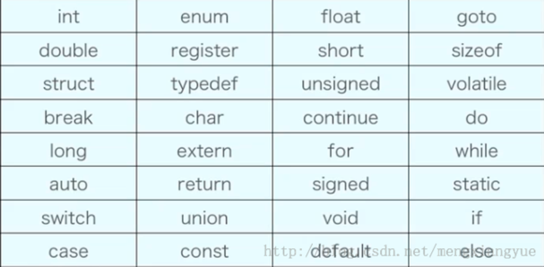

## 基本术语和用法


#import <Foundation/Foundation.h>


## import命令

用来引入头文件。与C语言中的#include相比，#import 能够保证头文件只被引入一次，也就是说，只有第一次引入有效，后续对同一文件的引入都会被忽略。


## Foundation 

是OC语言的基础框架，它提供了OC专有的基本数据类型（如字符串、数组、时间日期等），提供了多线程、网络连接、文件操作、本地数据存储等常用功能。Foundation.h 就像C语言中的 stdio.h，一般都需要引入。


## main() 

是程序的入口函数，这点和C语言一样。一个OC程序有且只能有一个 main() 函数。更多信息请查看《分析第一个C语言程序》。


## NSLog() 

是OC中的格式化输出函数，相当于C语言中的 printf() 的升级版，不仅可以用来输出C语言中的数据，还可以输出OC中的数据。

## @符号

没有实际含义，只是用来作为OC字符串的特有标志。在OC中，字符串前面都要加@，如果不加，就变成了C语言中的字符串，就要使用字符指针或字符数组来定义，这在后面会详细讲解。

```c

#import <Foundation/Foundation.h>

int main() {
    int a = 100;
    float b = 39.52;
    char *str1 = "Objective-C";  //C语言中的字符串
    NSString *str2 = @"http://c.biancheng.net";  //OC中的字符串
    NSLog(@"a: %d\nb: %f\nstr1: %s\n str2: %@\n", a, b, str1, str2);

    return 0;
}

```

## objective-c中类和对象的定义

OC中的类分为声明和实现两个部分。OC中对类的声明和实现通常是在不同文件中写的：

### 类的声明

类的声明部分写在.h文件中，h文件中的属性和方法，外界可以访问

类的声明：OC中用关键字@interface来声明一个类，用@end结束类的声明


e.g  student.h类声明

```c
#import <Foundation/Foundation.h>

//声明类Student
@interface Student : NSObject  //通过@interface关键字来声明类

//类所包含的变量
@property NSString *name;
@property int age;
@property float score;

//类所包含的函数
-(void)display;


@end  //使用@end关键字结束类的声明


```

### 类的实现


对类的实现写在.m文件中，在.m文件声明的属性或方法外界无法访问。

类的实现： OC中用关键字@implementation来实现类中的函数


```c

//实现在类中声明的函数

@implementation Student  //通过@implementation关键字来实现类中的函数

-(void)display{
    NSLog(@"%@的年龄是 %d，成绩是 %f", self.name, self.age, self.score);
}

@end  //使用@end关键字结束类中函数的实现


```

### 头文件


头文件有两种，OC中本来就有的头文件和自己创建的文件。

引入编程语言提供的头文件的写法是：
#import <文件名>

引入自己写的文件的写法是：
#import "文件名"

引入的文件必须是.h文件，引入.m文件会报错）
 
类在.h文件和.m文件中都可以引入头文件，区别是：在.h文件中引入头文件，.h和.m文件都可以使用这个文件中的资源；如果在.m文件引入头文件，.h文件不能使用该文件中的资源。
 
所以，在引入头文件的时候，需要考虑在.h文件中当声明类的时候，是否使用该头文件中包含的资源。如果使用，就在.h文件中引入；反之，在.m文件中引入即可。


### 成员变量和属性 

在类中，对于属性实际上有两种形式：成员变量和属性。它们都是变量。不同的是：成员变量外界不能调用，属性可以。


* 声明成员变量：
            
成员变量一般用来在类中方法和方法之间传递数据。它的语法和C语言相同，例如：
             
int i;
（在类声明部分，所有的变量是不能赋初值的，这是规定）
 
* 声明属性
 
声明属性：
            
在OC中，声明属性需要关键字来修饰：@property。例如，我们声明一个int型的age属性的编写方式为：

@property int age;


### 方法 

在OC语言中，类中可以包含两种方法：类方法和对象方法。
 
首先，我们拿一个例子来直观地感受一下两种方法的不同：例如：我们现在需要创建一个返回值类型为int型的方法，它有两个参数，第一个是float类型，另一个是字符串类型（OC中字符串类型用NSString，以后会讲）

通过比较，我们会发现，区别仅仅是在前面的符号，一个是“＋”号，一个是“－”号。
                     
“＋”“－”号的不同是区分它们的一个标志，两种创建类方法不同之处的重点是调用对象的不同：


* 类方法的创建：

+(int)personWithA1:(float)a1 andA2:(NSString*)a2; //a1,a2分别代表两个参数

//调用类方法
[Person personWithA1:2 andA2:@"类方法"];//调用对象是类名

* 对象方法的创建：

-(int)personWithA1:(float)a1 andA2:(NSString*)a2;

//调用对象方法
    Person * obj1=[[Person alloc]init];
    [obj1 personWithA1:1 andA2:@"对象方法"];//调用对象是类对象
    return 0;

             
所以，我们可以得出这样的结论：类方法要用类名调用；对象方法需要实例化对象调用。
                     
* 在类中创建方法的步骤：

首先要确定你要创建类方法还是对象方法，类方法，类方法用＋开头，对象方法用－开头。（拿类方法举例）

确定返回值类型（例如返回int类型）

确定这个方法有没有参数，如果有，我们就要在每个参数前，对这个参数进行说明（参数和后边参数说明之间至少有一个空格）；如果没有，直接给这个方法起一个名字就可以了。

例如：+(int)personWithName:(NSString*)name   andAge:(int)age  andSex:(BOOL)sex;
 
我们知道，类的实例化对象是要占用一定空间的，所以在某种特定情况下，我们如果只需要使用类中的这个方法，而不需要调用类中其他的成员，那么这个方法就选用类方法的方式创建。


### 类扩展

在类的.m文件中，我们看到可以向类中添加类扩展。下面我们就来学一下什么是类扩展。
                     
类扩展，就是给这个类添加私有属性或方法用的。在类扩展中声明的属性和方法外界是看不到的（这些属性或者方法只是在本类中使用）。下面我们来看一下类扩展的编写语法；


```c
@interface Person (){//这行是说给Person类添加一个类扩展。
//向类声明部分一样，可以添加成员变量
}

//添加属性，语法和在类声明中的属性一样。
//添加方法

@end//这是类扩展的结束语句
```
 
方法的实现

这里是对类声明部分或类扩展中声明的方法进行实现，也就是对方法具体功能的编写。
对于类声明中的方法和类扩展中的方法，举例说明：
 
```c                   
//对类声明中的类方法做实现
+(int)personWithA1:(float)a1 andA2:(NSString*)a2{
    NSLog(@"%f,%@",a1,a2);
    return 0;
}

//对类声明中的对象方法做实现
-(int)personWithA1:(float)a1 andA2:(NSString*)a2{
    NSLog(@"%f,%@",a1,a2);
    return 0;
}

//对类扩展中的对象方法做实现
-(void)display{
    NSLog(@"类扩展中声明的方法");
}
```
                     
通过对类结构的详细分析，相信大家对类又有了更进一步的认识。为了验证大家学习的效果，我们可以独立试着把以上这些程序段组合成一个完整的类。
 
注意： 如果有学习过Java或者C++的读者在学习OC的时候可能会问OC的类中有没有public、private、protected这个关键字修饰属性或方法呢？
在OC的类的定义中，同样有这几个关键字，并且苹果为他们每一个都配了一个“@”标示符（如@public）。在OC的类声明中，成员变量默认是受保护的，成员属性和方法不能用这几个关键字修饰。如果想变成私有，办法就是将属性或方法转移到类扩展中去。

### OC中的点语法

点语法是通过“类对象.属性”的方式来调用类中属性的一种方法（不唯一，KVC也可以，后边会提到）。
                     
通过点语法，我们可以轻易的获取某个类对象中某个属性的值，或者为这个属性赋值。前提是这个属性能被调用。
 
例如，在Person类中声明了一个字符串类型的name属性（不是成员变量），可以采用以下方式调用name属性：

```c

Person * person=[[Person alloc] init];//创建一个Person类的对象
person.name=@"ZhangSan";//调用person对象的name属性

```

#### 点语法的底层实现

点语法的底层实现
 
如果想弄清楚点语法的具体实现，就需要从类中创建属性的过程开始。
 
一个类创建属性，有两种方式。
 
方式一：
创建一个Person类，编写以下代码：
 
在Person.h文件中：

#import <Foundation/Foundation.h>
@interface Person : NSObject{
//编写习惯，一般声明成员变量的时候名字前面加“_”，同时也是为了和下边声明的name相对应。
NSString * _name;
}
@property NSString * name;
@end
在Person.m文件中：
#import "Person.h"
@implementation Person
@synthesize name=_name;
@end
首先我们在.h文件创建了一个_name成员变量，它是受保护的（也就是不能在外界调用）。
 
然后我们在第6行创建了一个name属性。通过这行代码，OC底层隐式地创建了两个方法：
 
一个是set方法，
-(void)setName:(NSString *)name;
 
一个是get方法：
-(NSString *)name;
（这两个方法虽然你看不见，但是它的确存在）
                     
在.m文件中，只有一行代码：
@synthesize name=_name;
 
它的作用有两个：
一：将我们在.h文件中声明的_name和name进行绑定（简单的理解，_name和name都是指name属性）。
 
二：对在.h文件声明的get方法和set方法做实现。具体地实现是这样的：
set方法：（用于给属性赋值）
 
-(void)setName:(NSString *)name{
    _name=name;
}
 
get方法：（用于获取属性的值）
-(NSString *)name{
    return _name;
}
 
通过前面的学习，在.h文件中的方法是可以被外界调用，所以这两个方法可以被本类的对象调用。
 
通过调用这两个方法，我们就能对name这个属性进行赋值和获取值的操作。所以我们也可以叫它“方法属性”。（也可以叫“属性方法”）
 
方式二：
在.h文件中：
#import <Foundation/Foundation.h>
@interface Person : NSObject
@property NSString * name;
@end
.m文件中没有代码
 
和前者对比，我们看到少了_name成员变量的声明和.m文件中的代码。但是，底层实现和前者是一样的，一个属性隐式生成带有“_”的成员变量，同时声明并实现了属性的set和get方法。
（注意：两种方式虽然这样说起来好像是一样。但是还是有区别的：使用前者创建的set和get方法，可以同时被改写；而后者在这个类中只能改写一个，如果改写两个方法，程序会报错，提示找不到_name（原因就是没有将_name和name进行绑定）。可见，隐式创建的毕竟是他人给实现，不靠谱啊）。
 
对点语法的理解
 
点语法，简单的理解，就是通过“.”的方式通过调用类中的set或get方法操作属性。
 
下面我们来看看点语法的具体应用。
 
people.name=@"ZhangSan";
 
解释：people是一个类的实例化对象，name是这个类提供的方法属性。而两者中间的点就是点语法中的点。而这行代码实现的功能是：给people这个对象所具有的name方法属性进行赋值。
 
这行代码通过点语法调用的是类中的set方法，所以它还可以写成：
[people setName:@"ZhangSan"];
 
同样，get方法也可以通过“.”的形式调用，例如，还是调用people对象的name属性。
NSString * theName=people.name;
 
这段代码实现的功能时将people对象的name属性赋值给theName字符串。我们把它转化一下：
NSString * theName=[people getName];
 
可能会有的疑惑：
                     
1、有读者可能要问了，怎么才能知道调用的是哪个方法呢？其实有这样一个规律可循：
      在没有等号的情况下，默认是get方法。
      在有等号的情况下，我们就要分两种情况：
      在等号左边是set方法。
      在等号右边是get方法。

 2、有读者可能有这个疑惑，对于两种创建方法属性的方式不知道选择哪个？
      一般在实际开发过程中，我们可能只对get方法重写的时候比较多：
      -(NSString *)name{
      //添加一些代码
           return _name;
      }
      大多数情况下，对于现在编程，我们选简单的那种；如果在编程过程中需要对set和get方法都进行重写，我们就在原有基础上改为第一种就可以了。


### self关键字

在使用OC语言创建一个类时，底层就为我们创建好了一个self，它的使用范围仅限于在本类中（在类的实现部分）。
                     
self代表当前方法的调用者。在OC的类中，实现部分全部都是方法（声明部分无法使用self），有类方法和对象方法。如果外界对象调用对象方法时，self就代表这个对象；同样，调用类方法时，self就代表这个类。
 
所以，这句话简单的理解，就是：如果self所在的这个方法是类方法，那么self就代表当前类；如果是对象方法，self就代表当前类的对象。
 
在self表示本类对象的时候，就具备类对象的所有功能，可以使用self来调用类中的属性，例如：
self.name=@"ZhangSan";
 
当self表示本类的时候，可以用来调用其他类方法。

### _语法

对于在类内部的属性调用，OC还提供了另外一种方式，就是我们之前看到的类似于“_name”的成员变量，由于我们声明的每个属性对应的都绑定着一个这样的成员变量，所以我们可以使用它来调用类中的属性。
 
而且使用_name还有另外一个好处，就是使用它调用这个属性的时候，不会调用这个属性的set或get方法。
 
可能你会问，既然它不会调用自己的get和set方法，用它干什么呢？
                                    
例如前面我们提到的，要对我们声明的属性进行重写它的get方法，方法的返回值就必须使用_name。
 
如果使用self.name会出现什么情况呢？
 
我们前面讲过self.name会调用它的set方法或get方法。这样就会出现get方法中调用get方法或者是set方法中调用set方法，如此不断重复下去，造成死循环，程序将崩溃。所以在这种地方，我们就只能使用_name的这种形式。
 
可能有朋友会产生疑惑，那究竟什么时候用_name，什么时候用self.name呢？
 
如果在编写过程中需要在类中调用本类的属性，如果这个地方必须调用get或set方法，那就必须使用self.name这种方式，如果在get或者set方法中，就必须使用_name的方式，如果不是上述的两种情况，使用哪个都可以。

### super关键字

在OC面向对象大环境下，不但提供有本类的self，还有父类的super关键字。
                     
super和self的使用规则一样，不同之处在于：super指父类方法的调用者。而self指当前方法的调用者。

### @property的常用修饰词

在编程过程中，可能需要对某个属性做一些特殊的设置，例如：将某个属性设置为可读，那么就可以防止工程中对这个属性进行更改。
 
常用的修饰词有：nonatomic、copy、strong、assign、weak、readwrite、readonly等。（这几个是经常使用的）。
 
如果@property后不对属性进行设置，该属性同样有它的默认的一些设置。下面向大家介绍一下几种属性的用法以及默认的情况：
 
* nonatomic和atomic
 
nonatomic：原名：非原子性，它涉及到多线程的相关知识。在这里我们只需要知道有nonatomic声明的属性，任何人任何地点任何时间都可以调用它（就是很多人可以同时使用它），所以它的缺点就是不安全，而优点就是效率高，访问速度快。
 
atomic(默认)：原子性。和nonatomic正好相反，他对属性的访问进行了限制，保护了声明属性的安全，缺点就是：访问效率低，速度慢。

 
* copy、strong和weak
 
copy：一般使用于字符串，它的特点如同它的中文翻译，将内容另外拷贝一份，保存在一个单独的存储空间中。
 
strong：叫做：强引用。

weak：弱引用
 
为了区分strong和weak以及copy之间的关系，我们来举一个生活中的例子：我们应该都放过风筝(如果不知道什么是风筝，你的童年太悲惨了)，在放风筝的时候我们手中必须有一根线牵引着风筝。
 
strong就代表你手中的线(一支风筝上可能有很多根线，也就是说可能有多个strong声明的属性用的同一块内存空间)，只要还有一个人牵着风筝，风筝就不回飞走，用OC的话来说就是，只要还有一个用strong声明的属性不被销毁，纳闷这块内存中的数据就不回丢失，该内存空间就不回释放。
 
而对于weak来说，就相当于旁边看放风筝的人，他们只能用手指着你手里的风筝，大喊着“风筝风筝”，他们只能和你一起欣赏风筝，而对于是不是继续放风筝的决定权在你，如果你不在放风筝了，那他们也只能“各回各家，各找各妈”。
 
用OC的语言来表达，就是说用weak声明的属性虽然也可以访问内存，但是要在这块内存没有释放之前，一旦这块内存被释放之后，weak声明的属性将失去作用。
 
对于copy来说，是最幸福的一件事了，你放着风筝被我看见了，我也想放，而且我也不差钱，我就买了一支一模一样的风筝和你一起放。你收起风筝不放了，我还可以放，copy就是这么任性。
 
从OC的角度解释copy，就是说带有copy声明的属性当指向一块内存空间时，它会完整的拷贝一份，然后用他自己的那一份，和被拷贝的内存空间没关系。
 
* assign、readonly和readwrite
 
assign我认为是其中最简单的，它应用于OC的基础数据类型（NSInteger、BOOL）和C语言中的基本数据类型(int,float,double,char)
 
readwrite（默认）：它代表这个属性即可以读，也可以写(可以调用它的get和set方法)
 
readonly：和readwrite不同，它代表这个属性只能读，不能进行写操作(只能调用get方法，不能调用set方法)
 

* setter 和 getter
 
getter=method:在声明的这个属性可读的前提下，使用它给这个属性设定get方法
 
setter=method:同get方法类似，在声明的属性可写的前提下，使用这个设置可以设定这个属性的set方法。
（这两个设置很少用，因为只是给get和set方法换个名字而已）
 
在@property的属性中，以上几个属性最常见，实际开发过程中基本上都能囊括。
 
对于以上的几个属性，如果你觉的自己虽然知道它的功能是什么，但是具体使用过程中总是很矛盾到底用哪个，下面帮大家总结一下：
 
对于基本数据类型，例如int，double，float，char，还有OC语言中的BOOL以及NSInteger来说，都用assign。
例如：@property (nonatomic,assign)int age;
 
对于OC中特有的字符串类型(NSString)来说，最常用的是copy。
例如：@property (nonatomic,copy)NSString * name;
 
对于OC中大量的类对象，一般用strong。
例如：@property (nonatomic,strong)Person * person;
 
在后面我们会提到协议，在涉及到协议中的delegate时，我们会用weak。
 
 对于前面提到的默认属性，可以不写，但是如果不是默认属性，就要写明你的意图，建议都写上。
 
对于原子性和非原子性，如果不涉及到多线程的情况下，为了运行效率的提高，一般写上nonatomic。
 
在默认情况下，由于每个属性都是可读可写的，所以我们可以自已自定义属性的set和get方法。
                     
@property使用修饰词的建议：
                     
在某些特殊情况下，如果该属性已经设置为可读了，那就不要再用getter这个属性，因为声明了也用不了，而且Xcode会给你提示冲突，setter也是一样。
 
在编程过程中，每个属性都有它默认的设置，但是为了程序的健壮，可读性更强，建议大家在声明属性的时候要把对属性的修饰写出来。

### 关键字和命名规范

关键字：



规范：
类名每个单词首字母大写
类中属性名第一个单词首字母小写，后边每个单词首字母大写
类中方法名第一个单词首字母小写，后边每个单词首字母大写，参数命名规则和属性相同。
 
同时还要注意的是，类名不能和属性名或者方法名相同。）

### 消息机制

在前段时间的OC学习中，总是不断地提到：调用一个类的方法，其实这种说法对于OC语言来说是不正确的。
 
对于OC来说，调用方法被称为:向这个类（类方法）或者类对象（对象方法）发送消息。那么，疑问就来了，为什么OC非要说是发送消息，而不是方法调用呢？这要从程序运行的底层去分析。
 
当程序编写完成，进入编译阶段时，例如［person say］，当它编译的时候就变成了：

objc_msgsend(person @selector(say));（简单了解一下）

对于这个底层代码的理解应该是，向person这个对象发送say的消息。所以OC称调用方法为向某个接受者发送某个消息。
 
在学习C语言的时候，大家可能都有这个编程经历，那就是C语言程序在编译的时候就去寻找函数的具体实现，如果这个函数没有实现，程序编译就不能通过。但是OC可以成功编译，运行时才会报错。
 
OC的动态特性
 
给大家介绍一下OC所具有的动态特性：动态类型、动态绑定、动态加载。学习它们，有助于深入了解OC程序编译运行的具体过程。通过下面的学习，相信大家会对OC有一个新的认识。
 
动态类型

在OC中提到动态类型，简单的理解，指的就是：id类型。它可以表示任何类的对象。当我们无法知道数据的具体类型时，我们就可以将数据直接存储到id类型的对象中。
 
但是需要说明的是id是动态类型绝不仅仅因为它能够存储任何类的对象。主要的原因是：由于id类型在程序编译时无法确定其中具体存储的对象类型，只有在程序通过编译到达运行阶段时，才能确定id类型对象所存储的具体对象的类型。
          
简单的总结上面所说，动态类型就是指id类型，而说它是动态类型是因为只有在程序运行时才能确定id对象中存储的具体类型。
 
动态绑定
 
动态绑定，是基于动态类型的，简单的理解就是：只有在程序运行时才能确定对象的具体属性和方法，进而进行绑定。
 
当程序中包含id动态类型时，编译过程无法确定id类型代表哪个类的对象，也就无法确定id类型调用的是哪个方法。在程序编译阶段，编译器会在你的工程文件中查找id对象调用方法的方法名是不是存在，如果存在，编译通过；反之，程序报错，提示你没有找到对象的方法。

（提示：对于id这种动态类型，它本身并不属于类对象，所以在程序中如果使用id对象通过点语法的方法调用属性，程序会报错。即使程序逻辑上是对的，但是首先要弄清楚的一点是：id不是类对象，没有属性，更不用说通过点语法来调用某个类对象的属性）。
 
下面，举一个例子来具体感受一下OC的动态类型和动态绑定：
1、    先独立创建一个OC工程，例如Demo；
2、    在工程中，创建一个类，例如Person类；
在Person.h文件中：

```c

#import <Foundation/Foundation.h>
@interface Person : NSObject
-(void)exercise;
@end
在Person.m文件中：
#import "Person.h"
@implementation Person
-(void)exercise{
    NSLog(@"I am running!!!");
}
@end
在main.m文件中：
#import <Foundation/Foundation.h>
#import "Person.h"
int main(int argc, const char * argv[]) {
    Person * person=[[Person alloc] init];
    id person1=[[NSObject alloc] init];
    [person1 exercise];
    [person exercise];
    return 0;
}
```

做完以上的工作，代码就编写完成了，下面亲身感受一下，这段代码中体现到的动态特性。
 
首先，先编译一下我们的工程（快捷键：“command+B”），发现程序并没有报错，编译成功。
 
下面，运行一下程序（快捷键：“command+R”），发现程序崩溃，反馈给一堆错误数据；（在初学一门语言时，出错是很正常的，我们要从不断的出错过程中，总结错误的原因，不断的积累，不断的提高调程序的能力）
 
从错误中看到：
'-[NSObject exercise]: unrecognized selector sent to instance 0x1006000a0'（提示我们没有找到这个方法的实现）
          
上边的例子中，我们可以看到，虽然编译没问题，但是一运行就报错。这充分体现出了OC的动态特征。
 
在编译时，由于OC无法确定id类型的person1具体指的是哪个类的对象。所以无法确定是否能像这个对象发送exercise消息，而在本工程中，的确含有这个方法，所以程序编译通过。
 
这些不确定只有等到程序运行阶段，确定了person1对象的类型以后，一切就都能知道了，所以在程序运行时，发现person1对象所属的类中并没有exercise的方法，程序报错。

（在程序运行时遇到id类型的对象，首先会判断它具体指的是哪个类，拿上边的例子来说，id具体指的是NSObject这个类，所以首先会去NSObject这个类中查找看看是否有exercise这个方法，如果没有，再去它的父类中去找（一层层往上找），但是我们这个例子中，NSObject类是一个基类，他没有父类，所以程序因为找不到这个方法报错）
          
动态加载
动态加载，简单的理解就是在需要时才会加载。
 
动态加载在实际编程过程中哪些情况体现出动态加载呢？例如，用类别这种方式给某个类添加一些方法之后，只有当程序运行过程中用到类别文件中的方法时才会加载。


### 类别Caategory

类别，别名：扩展类、类目。意思是：在现有类的基础上为该类增添一些新的方法(注意：只能是方法，不能添加属性)，如果类别中的方法和现有类中的方法相同，就覆盖原有方法。
 
类别的用途
 
简单的说，就是如果我们想在一个类中增加一些可供外界调用的方法，但是又不想影响它的子类，我们就要用类别。类别能够在原有类的基础上添加新的方法，而且还不会让子类继承。这也是类别的优点所在。
 
类别和类扩展的区别：
同：（类扩展和类别都可以为原有类添加新的方法）。
异：（通过类扩展添加的方法外界无法调用。而类别可以；类扩展能添加属性，而类别只能添加方法）。
 
类别的创建
 
1、首先，我们要创建一个工程，命名Demo1；
2、在Demo1工程中，创建一个Person类；
3、在Person类，我们声明几个本类应该具备的属性和方法。例如：每一个人都应该有姓名和年龄，每个人都会跑，代码如下；

Person.h文件中:

```c
#import <Foundation/Foundation.h>
@interface Person : NSObject
@property (nonatomic,copy)NSString * name;
@property (nonatomic,assign)int age;
-(void)run;
@end
```

Person.m文件中:

```c
#import "Person.h"
@implementation Person
-(void)run{
       NSLog(@"the person is running!");
}
@end
```
 
4、为Person类添加类别。

右键点击Demo1文件名，选择“New File”：

弹出新建文件菜单，选择：

点击“next”，进入下面菜单：


在这一步骤中，File Type选择类别，Class表示你要对哪个类做类别，填写完成后，直接next，然后默认创建.
可以看到，在Demo1中新增加了两个文件，文件名采用“类名+类别名”的方式，这样看起来更清楚，同时也是类别文件的显著特征(改变类别的名字并不会出错，只是没必要)。
 
类别框架分析
 
Person+NewFuntion.h文件：

```c
#import "Person.h"
@interface Person (NewFuntion)
//添加方法
@end

```

类别的创建和类的创建类似。不同的是：
 
1、在创建类的时候，我们会引入Foundation框架，而类别是引入原有类的头文件。
2、在创建类的时候，父类的地方被“(类别名)”替代了。
（创建类别的过程，就是为Person类添加一些方法，这些方法在NewFuntion文件中，所以实现了类别能够为某一个类添加方法而不会影响子类的功能）
 
Person+NewFuntion.m 文件：

```c
#import "Person+NewFuntion.h"
@implementation Person (NewFuntion)
//实现方法
@end

```
类别.m文件中在@implementation+原有类名的后面，还添加了一个“(类别名)”.

### OC中的协议--delegate

```c

#import <Foundation/Foundation.h>

@protocol ChildrenDelegate <NSObject>//协议声明

-(void)eat;

@end

@interface Children : NSObject

@property(nonatomic,weak)id<ChildrenDelegate>delegete;

@end   

```

@protocol是定义协议的关键字，告诉编译器，要开始声明协议了。
 
ChildrenDelegate是协议的名字，规范命名为：类名+Delegate。
 
<NSObject>是一个协议，其中提供了很多方法供我们使用，通过main.m中代码的解释我们会看到服从这个协议的好处。（协议用“<>”）
 
@end告诉编译器我的协议声明完了。
 
在协议中，有几个方法的修饰词供我们使用：

@required(表示以下方法必须实现)

@optional(表示以下方法可以不实现)

如果不使用任何关键字修饰，默认情况下是@required。
 
例如在这个协议中：

-(void)eat;

这个方法没有用关键字修饰，编译器默认情况下，认为它是必须实现的方法。
      
我们还可以向协议中添加带有@required和@optional关键字修饰的方法：

@required
-(void)takeCare;

这个方法用@required修饰，所以是协议实现方必须实现的方法。 
    
@optional
-(void)cook;

这个方法用@optional修饰，表明协议实现方可以选择是否实现这个协议。


delegate的创建

@property(nonatomic,weak)id<ChildrenDelegate>delegete;


之前讲过，协议是需要让其他人来帮你实现的，那么就产生了一个问题：怎么规定这个帮你实现方法的人是谁呢？
为了解决这个问题，需要声明这么一个属性来确定谁是代理实现方。

@property是定义属性的关键字。
 
nonatomic表明这个属性是非原子性的，加快了运行效率;weak是弱引用，是使用协议时用到的属性。
 
id：前面提到，可以表示任何数据类型，使用id 的原因是无法确定谁会成为这个代理的实现方。
 
<ChildrenDelegate>表明这个属性方法和这个协议相关联。
 
delegete：是代理属性名(代理属性名的命名也是有潜规则的，一般命名为delegate，表明这是一个代理属性。还有一个原因就是因为Foundation框架中的代理属性也是这么命名的，所以我们为了让自己变得专业，也要和专业开发人员学习。如果一个类中还需要一个代理，就命名为dataSource)，一般一个类最多也就有两个协议。
 
通过上面的工作，我们在Children这个文件中，定义了一个协议，并将这个协议和我们的类进行关联(由于我们在类中声明了和协议相关联的属性，所以使整个类都和协议产生了关联。

### 单例

OC中单例的定义

```c

#import <Foundation/Foundation.h>
@interface Car : NSObject
@property (nonatomic,assign)int driveHours;
+(instancetype)car;
@end


#import "Car.h"
static Car * car=nil;
@implementation Car
+(instancetype)car{
         if (car==nil) {
             car=[[Car alloc] init];
         }
         return car;
}
@end


```
单例的应用

```c

#import <Foundation/Foundation.h>
#import "Car.h"

@interface Person : NSObject

@property (nonatomic,copy)NSString * name;

@property (nonatomic,strong)Car * car;

-(void)displayWithDriveHours:(int)hours;
@end


#import "Person.h"

@implementation Person

-(instancetype)init{

if (self=[super init]) {
        self.car=[Car car];//创建对象的car属性实际上就是Car类的那个唯一的实例。
        self.name=nil;
    }
    return self;
}

-(void)displayWithDriveHours:(int)hours{
    self.car.driveHours+=hours;
}

@end


```


 


