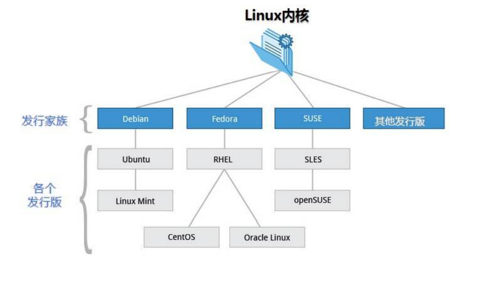
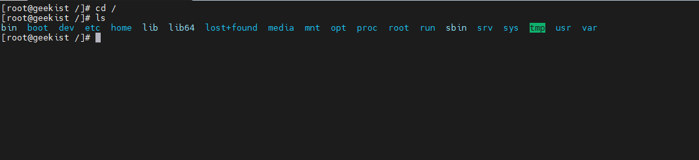
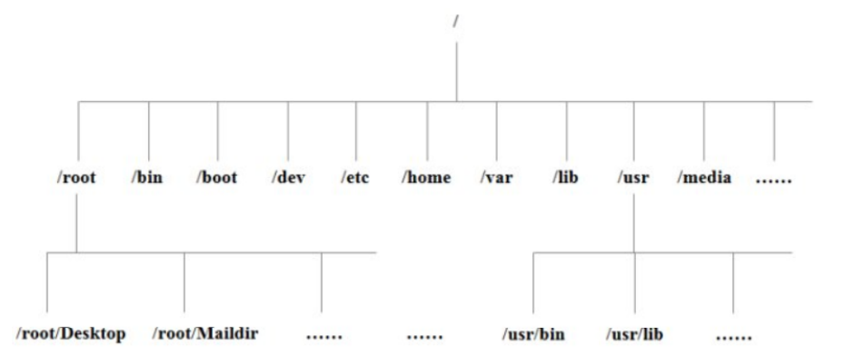
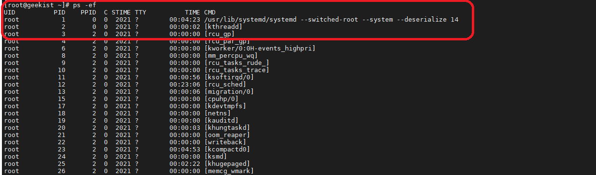

- [一、Linux操作系统介绍](#一linux操作系统介绍)
  - [1、Linux简介](#1linux简介)
  - [2.主要的Linux版本](#2主要的linux版本)
    - [Debian](#debian)
    - [Gentoo](#gentoo)
    - [Ubuntu](#ubuntu)
    - [Damn Vulnerable Linux](#damn-vulnerable-linux)
    - [红帽企业级Linux](#红帽企业级linux)
    - [CentOS](#centos)
    - [Fedora](#fedora)
    - [Kali Linux](#kali-linux)
    - [Arch Linux](#arch-linux)
    - [OpenSuse](#opensuse)
- [二、开机和关机](#二开机和关机)
  - [1、Linux开机流程：](#1linux开机流程)
  - [2、Linux关机命令：](#2linux关机命令)
    - [shutdown](#shutdown)
    - [halt](#halt)
    - [poweroff](#poweroff)
  - [3、Linux重启命令](#3linux重启命令)
    - [reboot 重启系统](#reboot-重启系统)
    - [查看系统版本号：](#查看系统版本号)
    - [查看Linux内核版本](#查看linux内核版本)
    - [查看CPU内核数：](#查看cpu内核数)
- [三、shell介绍](#三shell介绍)
  - [1、shell](#1shell)
  - [2、shell命令](#2shell命令)
  - [3、shell脚本](#3shell脚本)
  - [4、shell仿真器和基本操作](#4shell仿真器和基本操作)
    - [clear － 清空屏幕](#clear--清空屏幕)
    - [history － 显示历史列表内容](#history--显示历史列表内容)
  - [5、结束当前会话终端 --exit：](#5结束当前会话终端---exit)
- [四、Linux命令介绍](#四linux命令介绍)
  - [1、Linux命令](#1linux命令)
  - [2、Linux命令格式](#2linux命令格式)
  - [3、Linux命令相关的shell命令](#3linux命令相关的shell命令)
    - [type  --显示命令的类别](#type----显示命令的类别)
    - [find 在指定目录中搜索文件](#find-在指定目录中搜索文件)
    - [which 显示一个可执行程序的位置(只能找到bin目录下的命令）](#which-显示一个可执行程序的位置只能找到bin目录下的命令)
    - [whereis 查找二进制文件](#whereis-查找二进制文件)
    - [help 得到 shell 内部命令的帮助文档](#help-得到-shell-内部命令的帮助文档)
    - [command --help](#command---help)
    - [man－ 显示程序手册页](#man-显示程序手册页)
    - [apropos－ 显示适当的命](#apropos-显示适当的命)
    - [whatis－ 显示非常简洁的命令说明](#whatis-显示非常简洁的命令说明)
    - [info－ 显示程序 Info 条目](#info-显示程序-info-条目)
  - [4、用别名创建自己的命令以及如何删除别名](#4用别名创建自己的命令以及如何删除别名)
- [五、文件和目录及操作](#五文件和目录及操作)
  - [Linux目录结构](#linux目录结构)
  - [文件系统中跳转命令](#文件系统中跳转命令)
    - [pwd — 打印出当前工作目录名（print working directory）](#pwd--打印出当前工作目录名print-working-directory)
    - [cd — 更改目录 change directory 命令用于切换当前工作目录](#cd--更改目录-change-directory-命令用于切换当前工作目录)
  - [文件系统中查看命令](#文件系统中查看命令)
    - [ls — 列出目录内容 (list files)](#ls--列出目录内容-list-files)
    - [file --列出目录内容](#file---列出目录内容)
    - [less --浏览文件内容](#less---浏览文件内容)
  - [操作文件和目录的命令](#操作文件和目录的命令)
    - [cp — 复制文件和目录](#cp--复制文件和目录)
    - [mv — 移动/重命名文件和目录](#mv--移动重命名文件和目录)
    - [mkdir — 创建目录](#mkdir--创建目录)
    - [rm — 删除文件和目录](#rm--删除文件和目录)
  - [重定向命令](#重定向命令)
    - [重定向标准输出--- ">" 重定向符](#重定向标准输出-----重定向符)
    - [追加重定向标准输出--- ">>" 重定向符](#追加重定向标准输出-----重定向符)
    - [重定向错误输出---](#重定向错误输出---)
    - [重定向标准输出和错误输出到同一个文件](#重定向标准输出和错误输出到同一个文件)
    - [cat － 读取一个或多个文件，然后复制它们到标准输出](#cat--读取一个或多个文件然后复制它们到标准输出)
    - [利用cat命令和重定向符号>创建新文件](#利用cat命令和重定向符号创建新文件)
    - [管道操作符|竖杠将前一个命令的标准输出作为后一个命令的标准输入](#管道操作符竖杠将前一个命令的标准输出作为后一个命令的标准输入)
    - [sort － 排序文本行](#sort--排序文本行)
    - [uniq － 报道或省略重复行](#uniq--报道或省略重复行)
    - [grep － 打印匹配行](#grep--打印匹配行)
    - [wc － （word count）打印文件中换行符，字，和字节个数](#wc--word-count打印文件中换行符字和字节个数)
    - [head － 输出文件第一部分](#head--输出文件第一部分)
    - [tail - 输出文件最后一部分](#tail---输出文件最后一部分)
    - [tee － 从 Stdin 读取数据，并同时输出到 Stdout 和文件](#tee--从-stdin-读取数据并同时输出到-stdout-和文件)
  - [echo命令和参数展开](#echo命令和参数展开)
    - [echo -字符展开：将传递到echo的任何参数在屏幕上展开](#echo--字符展开将传递到echo的任何参数在屏幕上展开)
    - [echo * -路径名展开 展开当前工作目录下的文件名](#echo---路径名展开-展开当前工作目录下的文件名)
    - [echo ~ 波浪线展开 展开指定的home目录](#echo--波浪线展开-展开指定的home目录)
    - [echo $((expression)) 算数表达式展开](#echo-expression-算数表达式展开)
    - [echo 花括号展开](#echo-花括号展开)
    - [ehco 参数展开](#ehco-参数展开)
    - [双引号、单引号和转义字符](#双引号单引号和转义字符)
- [六、用户和权限](#六用户和权限)
  - [1、权限介绍](#1权限介绍)
  - [2、文件权限相关的命令：](#2文件权限相关的命令)
    - [id – 显示用户身份号](#id--显示用户身份号)
    - [umask -设置默认的文件权限掩码](#umask--设置默认的文件权限掩码)
    - [su -以另外一个用户的身份来运行shell](#su--以另外一个用户的身份来运行shell)
    - [sudo -以另外一个用户的身份来执行命令](#sudo--以另外一个用户的身份来执行命令)
    - [password -更改用户密码](#password--更改用户密码)
    - [chmod -更改文件模式](#chmod--更改文件模式)
    - [chgrp：更改文件属组： chgrp [-R] 属组名 文件名](#chgrp更改文件属组-chgrp--r-属组名-文件名)
    - [chown  更改文件或目录的所有者和用户组](#chown--更改文件或目录的所有者和用户组)
- [七、进程及操作](#七进程及操作)
  - [进程相关概念：](#进程相关概念)
    - [1.进程](#1进程)
    - [2.程序](#2程序)
    - [3、线程](#3线程)
    - [4.父子进程的关系](#4父子进程的关系)
    - [5、进程状态](#5进程状态)
  - [进程相关的shell命令](#进程相关的shell命令)
    - [ps(process status)命令用于显示当前进程的状态，类似于 windows 的任务管理器。](#psprocess-status命令用于显示当前进程的状态类似于-windows-的任务管理器)
    - [top – 动态查看进程](#top--动态查看进程)
    - [中断一个进程ctrl C](#中断一个进程ctrl-c)
    - [在后台运行一个进程 &](#在后台运行一个进程-)
    - [进程返回前台 fg%n](#进程返回前台-fgn)
    - [停止一个进程 ctrl Z](#停止一个进程-ctrl-z)
    - [kill – 给一个进程发送终止信号](#kill--给一个进程发送终止信号)
    - [killall – 给匹配特定程序或用户名的多个进程发送终止信号](#killall--给匹配特定程序或用户名的多个进程发送终止信号)
- [八、网络及操作](#八网络及操作)
  - [网络操作常用命令](#网络操作常用命令)
    - [ping - 发送 ICMP ECHO_REQUEST 软件包到网络主机](#ping---发送-icmp-echo_request-软件包到网络主机)
    - [traceroute - 打印到一台网络主机的路由数据包](#traceroute---打印到一台网络主机的路由数据包)
    - [netstat - 打印网络连接，路由表，接口统计数据，伪装连接，和多路广播成员](#netstat---打印网络连接路由表接口统计数据伪装连接和多路广播成员)
    - [ftp - 因特网文件传输程序](#ftp---因特网文件传输程序)
    - [wget - 非交互式网络下载器](#wget---非交互式网络下载器)
    - [ssh - OpenSSH SSH 客户端（远程登录程序）](#ssh---openssh-ssh-客户端远程登录程序)
- [九、shell环境及配置](#九shell环境及配置)
  - [如何建立 shell 环境？](#如何建立-shell-环境)
  - [启动文件实例：](#启动文件实例)
  - [查看shell环境变量--printenv](#查看shell环境变量--printenv)
- [十、常用工具](#十常用工具)
  - [1、软件包管理](#1软件包管理)
  - [2、上层和底层软件包工具](#2上层和底层软件包工具)
  - [3、常用的软件包命令](#3常用的软件包命令)
    - [yum命令](#yum命令)
    - [yum search  查找资源库中的软件包](#yum-search--查找资源库中的软件包)
    - [yum install 从资源库中下载并安装程序](#yum-install-从资源库中下载并安装程序)
    - [yum update 通过资源库来更新软件包](#yum-update-通过资源库来更新软件包)
    - [yum erase package_name 卸载软件](#yum-erase-package_name-卸载软件)
    - [rpm -i package_file 通过软件包文件来安装软件](#rpm--i-package_file-通过软件包文件来安装软件)
    - [rpm -qa 显示安装到系统中的所有软件包列表：](#rpm--qa-显示安装到系统中的所有软件包列表)
    - [rpm -q packagename 是否安装了制定的软件包](#rpm--q-packagename-是否安装了制定的软件包)
  - [2、归档和备份](#2归档和备份)
    - [tar命令介绍](#tar命令介绍)
  - [3、编译程序](#3编译程序)
  - [编译和链接](#编译和链接)
  - [解释](#解释)
  - [编译一个 C 语言](#编译一个-c-语言)
- [十一、编写shell程序](#十一编写shell程序)
  - [1、开始shell程序](#1开始shell程序)
    - [什么是shell脚本？](#什么是shell脚本)
    - [shell脚本格式](#shell脚本格式)
    - [使shell脚本可执行](#使shell脚本可执行)
    - [shell脚本的存放位置](#shell脚本的存放位置)
  - [2、常量、变量、函数、全局变量与局部变量](#2常量变量函数全局变量与局部变量)
    - [变量定义：](#变量定义)
    - [变量命名规范：](#变量命名规范)
    - [使用变量](#使用变量)
    - [花括号{}用来识别变量的边界](#花括号用来识别变量的边界)
    - [将命令的结果赋值给变量$()](#将命令的结果赋值给变量)
    - [删除变量unset](#删除变量unset)
    - [常量](#常量)
    - [shell函数](#shell函数)
    - [shell函数传参方法： function_name parm1 parm21](#shell函数传参方法-function_name-parm1-parm21)
  - [数据结构与运算符](#数据结构与运算符)
  - [选择与循环结构](#选择与循环结构)
  - [键盘输入、菜单、参数位置](#键盘输入菜单参数位置)

# 一、Linux操作系统介绍

## 1、Linux简介

Linux是基于Linux的操作系统是20世纪1991年推出的一个多用户、多任务的操作系统。它与UNIX完全兼容。Linux最初是由芬兰赫尔辛基大学计算机系学生Linus Torvalds在基于UNIX的基础上开发的一个操作系统的内核程序,Linux的设计是为了在Intel微处理器上更有效的运用。其后在理查德·斯托曼的建议下以GNU通用公共许可证发布，成为自由软件Unix变种。它的最大的特点在于他是一个源代码公开的自由及开放源码的操作系统，其内核源代码可以自由传播。
 
准确的说，Linux应该是符合UNIX规范的一个操作系统，Linix是基于源代码的方式进行开发的。Linux是一套免费使用和自由传播的类似UNIX的操作系统，这个系统是由全世界各地的成千上万的程序员设计和实现的。用户不用支付任何费用就可以获得它和它的源代码，并且可以根据自己的需要对它进行必要的修改，无偿对它使用，无约束地继续传播。

Linux以它的高效性和灵活性著称。它能够在PC计算机上实现全部的UNIX特性，具有多任务、多用户的能力。而且还包括了文本编辑器、高级语言编译器等应用软件。它还包括带有多个窗口管理器的X—Windows图形用户界面，如同我们使用Windows NT一样，允许我们使用窗口、图标和菜单对系统进行操作。它是一个功能强大、性能出众、稳定可靠的操作系统。

## 2.主要的Linux版本

由于众多发行版百花齐放，Linux的阵营日益壮大，每一款发行版都拥有一大批用户，开发者自愿为相关项目投入精力。Linux发行版可谓是形形色色，它们旨在满足每一种能想得到的需求。


###  Debian

Debian运行起来极其稳定，这使得它非常适合用于服务器。Debian平时维护三套正式的软件库和一套非免费软件库，这给另外几款发行版（比如Ubuntu和Kali等）带来了灵感。Debian这款操作系统派生出了多个Linux发行版。它有37500多个软件包，这方面唯一胜过Debian的其他发行版只有Gentoo。Debian使用apt或aptitude来安装和更新软件。

Debian这款操作系统无疑并不适合新手用户，而是适合系统管理员和高级用户。Debian支持如今的大多数架构（处理器）。

下载Debian ISO映像文件：http://dd.ma/BnNdplbF

### Gentoo

与Debian一样，Gentoo这款操作系统也包含数量众多的软件包。Gentoo并非以预编译的形式出现，而是每次需要针对每个系统进行编译。连Gentoo社区都觉得Gentoo安装和使用起来很困难；不过它被认为是最佳学习对象，可以进而了解Linux操作系统的内部运作原理。提到Gentoo总有人这么说："如果你要学用Linux发行版，那就学用该发行版吧；如果你学会了Gentoo，也就学会了Linux。"Gentoo使用portage来安装和更新软件。

Gentoo这款操作系统适合对Linux已经完全驾轻就熟的那些用户。

下载和安装Gentoo：http://dd.ma/Y0dT3sAQ

### Ubuntu

Ubuntu是Debian的一款衍生版，也是当今最受欢迎的免费操作系统。Ubuntu侧重于它在这个市场的应用，在服务器、云计算、甚至一些运行Ubuntu Linux的移动设备上很常见。作为Debian Gnu Linux的一款衍生版，Ubuntu的进程、外观和感觉大多数仍然与Debian一样。它使用apt软件管理工具来安装和更新软件。它也是如今市面上用起来最容易的发行版之一。Ubuntu使用基于apt的程序包管理器。

Ubuntu是新手用户肯定爱不释手的一款操作系统。

下载Ubuntu ISO映像文件：http://dd.ma/8ek7k9OR

### Damn Vulnerable Linux

当然，大多数人可能对这款发行版前所未闻，不过该发行版在本文中还是占有一席之地。那么，它有何过人之处呢？ Damn Vulnerable Linux恰如其名：其字面意思就是"该死的易受攻击的Linux"。Vulnerable Linux（DVL）根本不是一般意义上的优秀的Linux发行版。它有意捆绑了坏的、配置不当的、过时的、很容易被不法分子攻击的软件。

它的目的在于借机训练Linux管理员。还有什么比给Linux管理员一款坏的发行版去排解问题来得更管用的吗？面对Apache、MySQL、PHP、FTP和SSH等比较旧或破的版本，接受训练的管理员够有得忙了。

Damn Vulnerable Linux堪称旨在训练管理员的实验室。

下载Damn Vulnerable Linux（DVL）ISO映像文件：DVL_1.5_Infectious_Disease.iso

### 红帽企业级Linux

这是第一款面向商业市场的Linux发行版。它有服务器版本，支持众多处理器架构，包括x86和x86_64。红帽公司通过课程红帽认证系统管理员/红帽认证工程师（RHCSA/RHCE），对系统管理员进行培训和认证。就全球市场而言，总利润中80%来自支持，另外20%来自培训和认证，不过在印度不是这样。

在印度，红帽的利润中80%来自认证和培训，只有20%来自支持。而Fedora是个平台，而不是开发新产品或新应用程序的测试环境；一旦成为稳定版，就与红帽企业级Linux捆绑在一起，包括支持。红帽提供了非常多的稳定版应用程序，但是众所周知的缺点是，把太多旧程序包打包起来，支持成本确实相当高。不过，如果安全是关注的首要问题，那么红帽企业级Linux的确是款完美的发行版，它使用YUM程序包管理器。

红帽企业级Linux是系统管理员的第一选择，它有众多的程序包，还有非常到位的支持。

由于该发行版是商业化产品，所以不是免费的。不过，你可以下载用于教学用途的测试版。

下载红帽企业级Linux测试版DVD ISO映像文件：RedHat Enterprise Linux（测试版）

### CentOS

CentOS是一款企业级Linux发行版，它使用红帽企业级Linux中的免费源代码重新构建而成。这款重构版完全去掉了注册商标以及Binary程序包方面一个非常细微的变化。有些人不想支付一大笔钱，又能领略红帽企业级Linux；对他们来说，CentOS值得一试。此外，CentOS的外观和行为似乎与母发行版红帽企业级Linux如出一辙。 CentOS使用YUM来管理软件包。

非常稳定的程序包；谁要是想在桌面端测试一下服务器的运作原理，都应该试试这款操作系统。

下载CentOS 6.4 DVD ISO映像文件：http://dd.ma/BNbpqFB8

### Fedora

小巧的Fedora适合那些人：想尝试最先进的技术，等不及程序的稳定版出来。其实，Fedora就是红帽公司的一个测试平台；产品在成为企业级发行版之前，在该平台上进行开发和测试。Fedora是一款非常好的发行版，有庞大的用户论坛，软件库中还有为数不少的软件包。Fedora同样使用YUM来管理软件包。

下载Fedora 18（Spherical Cow）DVD ISO映像文件：http://dd.ma/CyBshk4Q

### Kali Linux

Kali Linux是Debian的一款衍生版。Kali旨在用于渗透测试。它大概在三个月前才发行。Kali的前身是Backtrack。用于Debian的所有Binary软件包都可以安装到Kali Linux上，而Kali的魅力或威力就来自于此。此外，支持Debian的用户论坛为Kali加分不少。Kali随带许多的渗透测试工具，无论是Wifi、数据库还是其他任何工具，都设计成立马可以使用。Kali使用APT来管理软件包。

毫无疑问，Kali Linux是一款渗透测试工具，或者是文明黑客（我不想谈论恶意黑客）青睐的操作系统。

下载Kali Linux DVD ISO映像文件：Kali Linux 6

### Arch Linux

Arch是一款采用滚动发行方式的操作系统：只要安装一次就够了；每当发行了某个新版本，就可以升级发行版，不需要重新安装。Pacman是Arch Linux的软件包管理器。Arch Linux既支持X86处理器架构，又支持X86_64架构，安装程序可以从光盘或U盘来运行。Arch旨在从开发者的角度而不是从用户的角度做到力求简单。Arch配置和安装起来超容易。它真是一款面向高手的发行版，让你可以了解Linux系统的每一个细枝末节。

下载Arch Linux ISO映像文件：http://dd.ma/kIkgJGD1

### OpenSuse

OpenSuse这款Linux发行版是免费的，并不供商业用途使用，仍然供个人使用。OpenSuse的真正竞争对手是红帽企业级Linux。它使用Yast来管理软件包。有了Yast，使用和管理服务器应用程序就非常容易。此外，Yast安装向导程序可以配置电子邮件服务器、LDAP服务器、文件服务器或Web服务器，没有任何不必要的麻烦。它随带snapper快照管理工具，因而可以恢复或使用旧版的文件、更新和配置。由于让滚动发行版本成为可能的Tumbleweed，可将已安装的操作系统更新到最新版本，不需要任何的新发行版。

SUSE在管理员当中的名气更大，因为它有Yast以及让系统管理员能够自动管理任务的其他此类应用程序，同样水准的其他发行版没有这项功能。

下载OpenSuse 12.3 DVD ISO映像文件：http://dd.ma/gSerotMi

# 二、开机和关机

## 1、Linux开机流程：

- 1、加载BIOS的硬件信息，获得第一个开机装置的代号。

- 2、读取第一个开机装置的MBR的boot loader（Lilo或者grub等）的开机信息。

- 3、加载kernel操作系统核心信息，kernel开始解压缩，并尝试驱动所有硬件装置。

- 4、kernel执行init程序并取得run—level的信息。

- 5、init执行/etc/rc.d/rc.sysinit文件。

- 6、启动核心的外挂模块（/etc/modprobe.conf）

- 7、init执行run-level的各个批次文件（Scripts）

- 8、init执行/etc/rc.d/rc.local文件。

- 9、执行/bin/login程序，并等待使用者登入。

- 10、登入之后开始以shell控管主机。

## 2、Linux关机命令：

我们可以使用以下三种命令来关机 Linux ：

### shutdown

Linux shutdown 命令可以用来进行关机程序，并且在关机以前传送讯息给所有使用者正在执行的程序，shutdown 也可以用来重开机。

语法：

```
shutdown [-t seconds] [-rkhncfF] time [message]

```
参数说明：

```
-t seconds : 设定在几秒钟之后进行关机程序。

-k : 并不会真的关机，只是将警告讯息传送给所有使用者。

-r : 关机后重新开机。

-h : 关机后停机。

-n : 不采用正常程序来关机，用强迫的方式杀掉所有执行中的程序后自行关机。

-c : 取消目前已经进行中的关机动作。

-f : 关机时，不做 fsck 动作(检查 Linux 档系统)。

-F : 关机时，强迫进行 fsck 动作。

time : 设定关机的时间。

message : 传送给所有使用者的警告讯息。

```
e.g:

```
立即关机
# shutdown -h now


指定 10 分钟后关机
# shutdown -h 10


重新启动计算机
# shutdown -r now

```

### halt

语法

```
halt [-n] [-w] [-d] [-f] [-i] [-p]
```

参数说明：

```
-n : 在关机前不做将记忆体资料写回硬盘的动作
-w : 并不会真的关机，只是把记录写到 /var/log/wtmp 文件里
-d : 不把记录写到 /var/log/wtmp 文件里（-n 这个参数包含了 -d） -f : 强迫关机，不呼叫 shutdown 这个指令
-i : 在关机之前先把所有网络相关的装置先停止
-p : 当关机的时候，顺便做关闭电源（poweroff）的动作
```
实例

```
关闭系统
# halt

关闭系统并关闭电源
# halt -p


关闭系统，但不留下纪录
# halt -d

```


### poweroff

poweroff 命令命令用于关闭计算器并切断电源。

语法

```
poweroff [-n] [-w] [-d] [-f] [-i] [-h]
```

参数说明：

```
-n : 在关机前不做将记忆体资料写回硬盘的动作
-w : 并不会真的关机，只是把记录写到 /var/log/wtmp 档案里
-d : 不把记录写到 /var/log/wtmp 文件里
-i : 在关机之前先把所有网络相关的装置先停止
-p : 关闭操作系统之前将系统中所有的硬件设置为备用模式。
```

实例

```
关闭系统
# poweroff
```

## 3、Linux重启命令

Linux reboot命令用于用来重新启动计算机。


### reboot 重启系统

语法

```
reboot [-n] [-w] [-d] [-f] [-i]
```


参数：
```
-n : 在重开机前不做将记忆体资料写回硬盘的动作
-w : 并不会真的重开机，只是把记录写到 /var/log/wtmp 档案里
-d : 不把记录写到 /var/log/wtmp 档案里（-n 这个参数包含了 -d）
-f : 强迫重开机，不呼叫 shutdown 这个指令
-i : 在重开机之前先把所有网络相关的装置先停止
```

实例

```
重新启动
# reboot
```

### 查看系统版本号：

```
[root@geekist local]# lsb_release -a
LSB Version:    :core-4.1-amd64:core-4.1-noarch
Distributor ID: AlibabaCloud
Description:    Alibaba Cloud Linux release 3 (Soaring Falcon)
Release:        3
Codename:       SoaringFalcon
[root@geekist local]#
```

### 查看Linux内核版本

uname -a

```
[root@geekist local]# uname -r
5.10.23-5.al8.x86_64

```

### 查看CPU内核数：

```
grep ^processor /proc/cpuinfo | wc -l
```


linux x86、x86_64、AMD64的区别：
* x86：是指intel的开发的一种32位指令集，从386开始时代开始的，一直沿用至今，是一种cisc指令集，所有intel早期的cpu，amd早期的cpu都支持这种指令集，ntel官方文档里面称为“IA-32”

* x84_64和AMD64：x86 CPU开始迈向64位的时候，有2选择：1、向下兼容x86。2、完全重新设计指令集，不兼容x86。AMD抢跑了，比Intel率先制造出了商用的兼容x86的CPU，AMD称之为AMD64，抢了64位PC的第一桶金，得到了用户的认同。而Intel选择了设计一种不兼容x86的全新64为指令集，称之为IA-64（这玩意似乎就是安腾），但是比amd晚了一步，而且IA-64也挺惨淡的，因为是全新设计的CPU，没有编译器，也不支持windows（微软把intel给忽悠了，承诺了会出安腾版windows server版，但是迟迟拿不出东西）。。。后来不得不在时机落后的情况下也开始支持AMD64的指令集，但是换了个名字，叫x86_64，表示是x86指令集的64扩展，大概是不愿意承认这玩意是AMD设计出来的。

也就是说实际上，x86_64,x64,AMD64基本上是同一个东西，我们现在用的intel/amd的桌面级CPU基本上都是x86_64，与之相对的arm,ppc等都不是x86_64。

x86、x86_64主要的区别就是32位和64位的问题，x86中只有8个32位通用寄存器，eax,ebx,ecx，edx, ebp, esp, esi, edi。x86_64把这8个通用寄存器扩展成了64位的，并且比x86增加了若干个寄存器（好像增加了8个，变成了总共16个通用寄存器）。同样的MMX的寄存器的位数和数量也进行了扩展。此外cpu扩展到64位后也能支持更多的内存了，等等许多好处。


# 三、shell介绍

## 1、shell

shell是外壳的意思，就是操作系统的外壳。。总结来说，Shell是一个命令解释器，它通过接受用户输入的Shell命令来启动、暂停、停止程序的运行或对计算机进行控制。

shell 是一个应用程序，它连接了用户和 Linux 内核，让用户能够更加高效、安全、低成本地使用 Linux 内核，这就是 Shell 的本质。

shell 本身并不是内核的一部分，它只是站在内核的基础上编写的一个应用程序。

## 2、shell命令 

我们可以通过shell命令来操作和控制操作系统，比如Linux中的Shell命令就包括ls、cd、pwd等等

## 3、shell脚本

shell脚本就是由Shell命令组成的执行文件，将一些命令整合到一个文件中，进行处理业务逻辑，脚本不用编译即可运行。它通过解释器解释运行，所以速度相对来说比较慢。

shell脚本中最重要的就是对shell命令的使用与组合，再使用shell脚本支持的一些语言特性，完成想要的功能。


## 4、shell仿真器和基本操作

Linux系统启动后，会启动终端仿真器，仿真器启动成功后，屏幕上会显示提示符：

```
[me@linuxbox ~]$
```
它表明shell 准备好了去接受输入。

提示符通常包括你的用户名@主机名，紧接着当前工作目录和一个美元符号。

如果提示符的最后一个字符是“#”, 而不是“$”, 那么这个终端会话就有超级用户权限。 这意味着，我们或者是
以 root 用户的身份登录，或者是我们选择的终端仿真器提供超级用户（管理员）权限。

### clear － 清空屏幕


### history － 显示历史列表内容

## 5、结束当前会话终端 --exit：

我们可以通过关闭终端仿真器窗口，或者是在 shell 提示符下输入 exit 命令来终止一个终端会话：

```
[me@linuxbox ~]$ exit

```

# 四、Linux命令介绍


## 1、Linux命令

命令可以是下面四种形式之一：

1. 是一个可执行程序，就像我们所看到的位于目录/usr/bin 中的文件一样。 属于这一类的程序，可以编译成二进制文件，诸如用 C 和 C++语言写成的程序, 也可以是由脚本语言写成的程序，比如说 shell，perl，python，ruby，等等。


2. 是一个内建于 shell 自身的命令。bash 支持若干命令，内部叫做 shell 内部命令 (builtins)。例如，cd 命令，就是一个 shell 内部命令。


3. 是一个 shell 函数。这些是小规模的 shell 脚本，它们混合到环境变量中。 在后续的章节里，我们将讨论配置环境变量以及书写 shell 函数。但是现在， 仅仅意识到它们的存在就可以了。


4. 是一个命令别名。我们可以定义自己的命令，建立在其它命令之上。

所以大多数命令看起来像这样：


## 2、Linux命令格式

大多数命令名经常会带有一个或多个用来更正命令行为的选项， 更进一步，选项后面会带有一个或多个参数，这些参数是命令作用的对象。

```
command -options arguments
```

大多数命令使用的选项，是由一个中划线加上一个字符组成，例如，“-l”，但是许多命令，包括来自于 GNU项目的命令，也支持长选项，长选项由两个中划线加上一个字组成。当然，许多命令也允许把多个短选项串在一起使用。下面这个例子，ls 命令有两个选项， “l” 选项产生长格式输出，“t”选项按文件修改时间的先后来排序。

## 3、Linux命令相关的shell命令

### type  --显示命令的类别

type 命令是 shell 内部命令，它会显示命令的类别，给出一个特定的命令名（做为参数）。 它像这样工作：
```
type command
```
"command"是你要检测的命令名

用法：
```
[me@linuxbox ~]$ type type
type is a shell builtins

[me@linuxbox ~]$ type ls
ls is aliased to `ls --color=tty`

[me@linuxbox ~]$ type cp
cp is /bin/cp
```

我们看到这三个不同命令的检测结果。注意，ls 命令（在 Fedora 系统中）的检查结果，ls 命令实际上 是 ls 命令加上选项"--color=tty"的别名。现在我们知道为什么 ls 的输出结果是有颜色的！

### find 在指定目录中搜索文件

ind 是 Linux 中强大的搜索命令，不仅可以按照文件名搜索文件，还可以按照权限、大小、时间、inode 号等来搜索文件。但是 find 命令是直接在硬盘中进行搜索的，如果指定的搜索范围过大，find命令就会消耗较大的系统资源，导致服务器压力过大。所以，在使用 find 命令搜索时，不要指定过大的搜索范围。

格式：

```
[root@localhost ~]#find 搜索路径 [选项] 搜索内容

```

常用的选项：

```
-mount, -xdev : 只检查和指定目录在同一个文件系统下的文件，避免列出其它文件系统中的文件

-amin n : 在过去 n 分钟内被读取过

-anewer file : 比文件 file 更晚被读取过的文件

-atime n : 在过去 n 天内被读取过的文件

-cmin n : 在过去 n 分钟内被修改过

-cnewer file :比文件 file 更新的文件

-ctime n : 在过去 n 天内创建的文件

-mtime n : 在过去 n 天内修改过的文件

-empty : 空的文件-gid n or -group name : gid 是 n 或是 group 名称是 name

-ipath p, -path p : 路径名称符合 p 的文件，ipath 会忽略大小写

-name name, -iname name : 文件名称符合 name 的文件。iname 会忽略大小写

-size n : 文件大小 是 n 单位，b 代表 512 位元组的区块，c 表示字元数，k 表示 kilo bytes，w 是二个位元组。

-type c : 文件类型是 c 的文件。

d: 目录

c: 字型装置文件

b: 区块装置文件

p: 具名贮列

f: 一般文件

l: 符号连结

s: socket

-pid n : process id 是 n 的文件

```

例子：

```
在当前目录中查找文件：

find test.c

在主目录下查找文件：

find /home -name test

使用名称和忽略案例查找文件：

find /home -iname test

使用名称查找目录：
find -type f -name "*.php"

查找权限为777的文件

find -type f -perm 0777 -print

查找没有777权限的文件

find / -type f ! -perm 777

查找具有644权限的SGID文件

find / perm 2644

查找具有551权限的文件

find / -perm 2664

查找SUID文件
 find / -perm /u=s

查找SGID文件

find / -perm /u=s

查找只读文件

find / -perm /u=r

查找可执行文件

find / -perm /a=x

查找所有777权限的和用户，并用chmod命令将权限设置为644
find / -type -perm 777 -print -exec chmod 755 {} \;

查找并删除单个文件

find -type f -name "test.c" -exec rm -f {} \;

查找并删除多个文件：

find -type f -name "*.txt" -exec rm -f {} \;

查找所有空文件：

find / tmp -type f -empty

查找所有空目录：

find / tmp -type d -empty

查找所有隐藏文件

find /tmp -type f -name ".*"

查找root/目录下名为test.c的所有单个文件：

find / -user root -name test.c

查找~目录下属于用户neil的所有文件：

find ~ -user neil

查找/home目录下属于Group Developer的所有文件

find /home -group developer

查找~目录下的用户neil的所有txt文件

find ~ -user neil -iname "*.c"

查找50天后台修改的所有文件

find /-user root -name test.c

查找最近50天访问的文件

find / -atime 50

查找40-100天修改的文件件

find / -mtime +50 -mtime -100

在过去1小时内更新的所有文件

find / -cmin -60

查找所有50MB的文件

find / -size 50M

查找大小在50MB到100MB之间的文件
find / -size +50M -size -100M

查找并删除100M的文件
find / -size + 100M -exec rm -rf {} \;

查找大小超过10M的所有MP3文件，并删除

find / -type f -name *.mpe -size + 10M -exec rm {} \;

```

### which 显示一个可执行程序的位置(只能找到bin目录下的命令）

```
[me@linuxbox ~]$ which cd
/usr/bin/which: no cd in
(/opt/jre1.6.0_03/bin:/usr/lib/qt-3.3/bin:/usr/kerberos/bin:/opt/jre1
.6.0_03/bin:/usr/lib/ccache:/usr/local/bin:/usr/bin:/bin:/home/me/bin)

```

### whereis 查找二进制文件

whereis定位可执行文件、源代码文件、帮助文件在文件系统中的位置.只能用于程序名的搜索，而且只搜索二进制文件（参数-b）、man说明文件（参数-m）和源代码文件（参数-s）。如果省略参数，则返回所有信息。

和find相比，whereis查找的速度非常快，这是因为linux系统会将 系统内的所有文件都记录在一个数据库文件中，当使用whereis和下面即将介绍的locate时，会从数据库中查找数据，而不是像find命令那样，通 过遍历硬盘来查找，效率自然会很高。 

但是该数据库文件并不是实时更新，默认情况下时一星期更新一次，因此，我们在用whereis和locate 查找文件时，有时会找到已经被删除的数据，或者刚刚建立文件，却无法查找到，原因就是因为数据库文件没有被更新。 

命令格式：

```

whereis [-bmsu] [BMS 目录名 -f ] 文件名

```

命令参数：

-b   定位可执行文件。

-m   定位帮助文件。

-s   定位源代码文件。

-u   搜索默认路径下除可执行文件、源代码文件、帮助文件以外的其它文件。

-B   指定搜索可执行文件的路径。

-M   指定搜索帮助文件的路径。

-S   指定搜索源代码文件的路径。

使用实例：


```
[root@localhost ~]# whereis tomcat

tomcat:

[root@localhost ~]# whereis svn

svn: /usr/bin/svn /usr/local/svn /usr/share/man/man1/svn.1.gz

说明：

tomcat没安装，找不出来，svn安装找出了很多相关文件

实例2：只将二进制文件 查找出来 

命令：

whereis -b svn

输出： 

[root@localhost ~]# whereis -b svn

svn: /usr/bin/svn /usr/local/svn

[root@localhost ~]# whereis -m svn

svn: /usr/share/man/man1/svn.1.gz

[root@localhost ~]# whereis -s svn

svn:

[root@localhost ~]#

说明：

whereis -m svn 查出说明文档路径，whereis -s svn 找source源文件。

```

### help 得到 shell 内部命令的帮助文档

```
[me@linuxbox ~]$ help cd
cd: cd [-L|-P] [dir]
Change ...

```

### command --help

```
[me@linuxbox ~]$ mkdir --help
Usage: mkdir [OPTION] DIRECTORY...
Create ...
```

### man－ 显示程序手册页

```
[me@linuxbox ~]$ man ls

```

### apropos－ 显示适当的命

基于某个关键字的匹配项。虽然很粗糙但有时很有用。 下面是一个以"floppy"为关键词来搜索参考手册的例子：

```
[me@linuxbox ~]$ apropos floppy
create_floppy_devices (8) - udev callout to create all possible
...

```
### whatis－ 显示非常简洁的命令说明

### info－ 显示程序 Info 条目

## 4、用别名创建自己的命令以及如何删除别名

```
alias name='string'
```

在命令"alias"之后，输入“name”，紧接着（没有空格）是一个等号，等号之后是 一串用引号引起的字符串，字符串的内容要赋值给 name。我们定义了别名之后， 这个命令别名可以使用在任何地方。

```
[me@linuxbox ~]$ alias foo='cd /usr; ls; cd -'

```

```
[me@linuxbox ~]$ alias 3ks='echo hello world'

```

删除别名：

```
[me@linuxbox ~]$ unalias foo
[me@linuxbox ~]$ type foo
bash: type: foo: not found

```

# 五、文件和目录及操作

## Linux目录结构

类似于 Windows，一个“类 Unix” 的操作系统，比如说 Linux，以分层目录结构来组织所有文件。 这就意味着
所有文件组成了一棵树型目录（有时候在其它系统中叫做文件夹）， 这个目录树可能包含文件和其它的目录。文
件系统中的第一级目录称为根目录。 根目录包含文件和子目录，子目录包含更多的文件和子目录，依此类推。



树状目录结构



* **/** 根目录，万物起源。

* **/bin** bin是Binary的缩写, 包含系统启动和运行所必须的二进制程序。

* **/boot** 包含 Linux 内核，最初的 RMA 磁盘映像（系统启动时，由驱动程序所需），和启动加载程序。

* **/dev** dev是Device(设备)的缩写, 存放的是Linux的外部设备，在Linux中访问设备的方式和访问文件的方式是相同的。

* **/etc**  这个目录用来存放所有的系统管理所需要的配置文件和子目录。

* **/home** 用户的主目录，在Linux中，每个用户都有一个自己的目录，一般该目录名是以用户的账号命名的。 普通用户登录后，处于/home/用户名；root用户登录后，处于/root目录下；

* **/lib** 这个目录里存放着系统最基本的动态连接共享库，其作用类似于Windows里的DLL文件。

* **/lost+found** 这个目录一般情况下是空的，当系统非法关机后，这里就存放了一些文件。

* **/media：** linux系统会自动识别一些设备，例如U盘、光驱等等，当识别后，linux会把识别的设备挂载到这个目录下。

* **/mnt** 系统提供该目录是为了让用户临时挂载别的文件系统的，我们可以将光驱挂载在/mnt/上，然后进入该目录就可以查看光驱里的内容了。

* **/opt** 用来安装“可选的”软件。这个主要用来存储可能 安装在系统中的商业软件产品。比如你安装一个ORACLE数据库则就可以放到这个目录下。默认是空的。

* **/proc**  这个目录是一个虚拟的目录，它是系统内存的映射，我们可以通过直接访问这个目录来获取系统信息。

* **/root** 该目录为系统管理员，也称作超级权限者的用户主目录。

* **/run** 是一个临时文件系统，存储系统启动以来的信息。当系统重启时，这个目录下的文件应该被删掉或清除。

* **/sbin** s就是Super User的意思，这里存放的是系统管理员使用的系统管理程序。

* **/srv** 该目录存放一些服务启动之后需要提取的数据。

* **/sys** 这是linux2.6内核的一个很大的变化。该目录下安装了2.6内核中新出现的一个文件系统sysfs 。

* **/tmp** 这个目录是用来存放一些临时文件的。

* **/usr** 这是一个非常重要的目录，用户的很多应用程序和文件都放在这个目录下，类似于windows下的program files目录。

* **/usr/bin** 系统用户使用的应用程序。

* **/usr/sbin** 超级用户使用的比较高级的管理程序和系统守护程序。

* **/usr/src** 内核源代码默认的放置目录。

* **/var** 这个目录中存放着在不断扩充着的东西，我们习惯将那些经常被修改的目录放在这个目录下。包括各种日志文件。

用户可以使用的目录：

* home 用户目录，

* root 系统管理员可以使用的目录

* tmp 临时文件目录

* usr 用户可以使用的目录，我们安装的软件一般在usr/local/bin目录下

* opt 安装额外软件的目录

* var 扩充目录

## 文件系统中跳转命令

### pwd — 打印出当前工作目录名（print working directory）

用法：

```
# pwd
/root/test           #输出结果
```

### cd — 更改目录 change directory 命令用于切换当前工作目录

其中 dirName 表示法可为绝对路径或相对路径。若目录名称省略，则变换至使用者的 home 目录 (也就是刚 login 时所在的目录)。

另外，~ 也表示为 home 目录 的意思， . 则是表示目前所在的目录， .. 则表示目前目录位置的上一层目录。

语法

```
cd [dirName]
dirName：要切换的目标目录。
```

实例:

```
跳到 /usr/bin/ :
cd /usr/bin

跳到自己的 home 目录 :
cd ~

跳到目前目录的上上两层 :
cd ../..

```

## 文件系统中查看命令

### ls — 列出目录内容 (list files)


语法：

```
 ls [-alrtAFR] [name...]
```

参数 :

```
-a 显示所有文件及目录 (. 开头的隐藏文件也会列出)

-l 除文件名称外，亦将文件型态、权限、拥有者、文件大小等资讯详细列出

-r 将文件以相反次序显示(原定依英文字母次序)

-t 将文件依建立时间之先后次序列出

-A 同 -a ，但不列出 "." (目前目录) 及 ".." (父目录)

-F 在列出的文件名称后加一符号；例如可执行档则加 "*", 目录则加 "/"

-R 若目录下有文件，则以下之文件亦皆依序列出

```

用法：

```
ls -ltr s*
将 /bin 目录以下所有目录及文件详细资料列出 :

ls -lR /bin
列出目前工作目录下所有文件及目录；目录于名称后加 "/", 可执行档于名称后加 "*" :

ls -AF
```

### file --列出目录内容

格式：

```
file filename
```

当调用 file 命令后，file 命令会打印出文件内容的简单描述。例如：

```
[me@linuxbox ~]$ file picture.jpg
picture.jpg: JPEG image data, JFIF standard 1.01
```

### less --浏览文件内容

格式：

```
less filename
```

例如：

```
[me@linuxbox ~]$ less /etc/passwd
```

如果文件内容多于一页，那么我们可以上下滚动文件。按下“q”键， 退出 less 程序。


## 操作文件和目录的命令

### cp — 复制文件和目录

cp 命令，复制文件或者目录。它有两种使用方法：

```
cp item1 item2
复制单个文件或目录"item1"到文件或目录"item2"，
```

```
cp item... directory
复制多个项目（文件或目录）到一个目录下。
```

```
-a, --archive 复制文件和目录，以及它们的属性，包括所有权和权限。 通常，复本具有用户所操作文件的默认属性。

-i, --interactive 在重写已存在文件之前，提示用户确认。如果这个选项不指定， cp 命令会默认重写文件。

-r, --recursive 递归地复制目录及目录中的内容。当复制目录时， 需要这个选项（或者-a 选项）。

-u, --update 当把文件从一个目录复制到另一个目录时，仅复制 目标目录中不存在的文件，或者是文件内容新于目标目录中已经存在的文件。

-v, --verbose 显示翔实的命令操作信息
```

### mv — 移动/重命名文件和目录

mv 命令可以执行文件移动和文件命名任务，这依赖于你怎样使用它。任何一种 情况下，完成操作之后，原来的
文件名不再存在。mv 使用方法与 cp 很相像：

```
mv item1 item2
把文件或目录 “item1” 移动或重命名为 “item2”, 或者：
```

```
mv item... directory
把一个或多个条目从一个目录移动到另一个目录中。
```

```
-i --interactive 在重写一个已经存在的文件之前，提示用户确认信息。 如果不指定这个选项，mv命令会默认重写文件内容。

-u --update 当把文件从一个目录移动另一个目录时，只是移动不存在的文件， 或者文件内容新于目标目录相对应文件的内容。

-v --verbose 当操作 mv 命令时，显示翔实的操作信息。
```

mv 实例

```
mv file1 file2 移动 file1 到 file2。如果 file2 存在，它的内容会被 file1 的内容重写。 如果 file2 不存在，则创建 file2。 每种情况下，file1 不再存在。

mv -i file1 file2 除了如果 file2 存在的话，在 file2 被重写之前，用户会得到 提示信息外，这个和上面的选项一样。

mv file1 file2 dir1 移动 file1 和 file2 到目录 dir1 中。dir1 必须已经存在。

mv dir1 dir2 如果目录 dir2 不存在，创建目录 dir2，并且移动目录 dir1 的内容到 目录 dir2中，同时删除目录 dir1。如果目录 dir2 存在，移动目录 dir1（及它的内容）到目录dir2。
```

### mkdir — 创建目录

格式：

```
mkdir directory...
```

注意表示法: 在描述一个命令时（如上所示），当有三个圆点跟在一个命令的参数后面， 这意味着那个参数可以重复，就像这样：

实例：

```
mkdir dir1
会创建一个名为"dir1"的目录，而
mkdir dir1 dir2 dir3
会创建三个目录，名为 dir1, dir2, dir3。
```

### rm — 删除文件和目录

```
rm item...
"item"代表一个或多个文件或目录。
```

```
-i, --interactive 在删除已存在的文件前，提示用户确认信息。 如果不指定这个选项，rm 会默默地删除文件

-r, --recursive 递归地删除文件，这意味着，如果要删除一个目录，而此目录 又包含子目录，那么子目录也会被删除。要删除一个目录，必须指定这个选项。

-f, --force 忽视不存在的文件，不显示提示信息。这选项颠覆了“--interactive”选项。

-v, --verbose 在执行 rm 命令时，显示翔实的操作信息。
```

```
rm file1 默默地删除文件

rm -i file1 除了在删除文件之前，提示用户确认信息之外，和上面的命令作用一样。

rm -r file1 dir1 删除文件 file1, 目录 dir1，及 dir1 中的内容。

rm -rf file1 dir1 同上，除了如果文件 file1，或目录 dir1 不存在的话，rm 仍会继续执行。

```

小贴士

>无论什么时候，rm 命令用到通配符（除了仔细检查输入的内容外！）， 用 ls 命令来测试通配符。这会让你看到要删除的文件列表。然后按下上箭头按键，重新调用 刚刚执行的命令，用 rm 替换 ls。

## 重定向命令

I/O 重定向 "I/O"代表输入/输出， 通过这个工具，你可以重定向命令的输入输出，命令的输入来自文件，而输出也存到文件。 也可把多个命令连接起来组成一个强大的命令管道。

与 Unix 主题“任何东西都是一个文件”保持一致，程序，比方说 ls，实际上把他们的运行结果 输送到一个叫做标准输出的特殊文件（经常用 stdout 表示），而它们的状态信息则送到另一个 叫做标准错误的文件（stderr）。默认情况下，标准输出和标准错误都连接到屏幕，而不是 保存到磁盘文件。除此之外，许多程序从一个叫做标准输入（stdin）的设备得到输入，默认情况下， 标准输入连接到键盘。

I/O 重定向允许我们可以更改输出走向和输入来向。一般地，输出送到屏幕，输入来自键盘， 但是通过 I/O 重定向，我们可以改变输入输出方向。

### 重定向标准输出--- ">" 重定向符

I/O 重定向允许我们来重定义标准输出送到哪里。重定向标准输出到另一个文件除了屏幕，我们使用 ">" 重定向符，其后跟着文件名。为什么我们要这样做呢？因为有时候把一个命令的运行结果存储到 一个文件很有用处。例如，我们可以告诉 shell 把 ls 命令的运行结果输送到文件 ls-output.txt 中去， 由文件代替屏幕。

```
[me@linuxbox ~]$ ls -l /usr/bin > ls-output.txt

```
>简单地使用重定向符，没有命令在它之前，这会删除一个已存在文件的内容或是 创建一个新的空文件。

### 追加重定向标准输出--- ">>" 重定向符

使用方法同上，只是将标准输出内容追加到了文件中。

### 重定向错误输出---

重定向标准错误缺乏专用的重定向操作符。

重定向标准错误，我们必须参考它的文件描述符。 一个程序可以在几个编号的文件流中的任一个上产生输出。然而我们必须把这些文件流的前三个看作标准输入，输出和错误，shell内部参考它们为文件描述符0，1和2，各自地。shell 提供一种表示法来重定向文件---使用文件描述符。

因为标准错误和文件描述符2一样，我们用这种 表示法来重定向标准错误：

```
[me@linuxbox ~]$ ls -l /bin/usr 2> ls-error.txt
```

`文件描述符"2"，紧挨着放在重定向操作符之前，来执行重定向标准错误到文件 ls-error.txt 任务。`

### 重定向标准输出和错误输出到同一个文件

可能有这种情况，我们希望捕捉一个命令的所有输出到一个文件。为了完成这个，我们 必须同时重定向标准输出和标准错误。有两种方法来完成任务。

第一个，传统的方法， 在旧版本 shell 中也有效：

```
[me@linuxbox ~]$ ls -l /bin/usr > ls-output.txt 2>&1
```


使用这种方法，我们完成两个重定向。首先重定向标准输出到文件 ls-output.txt，然后 重定向文件描述符2（标准错误）到文件描述符1（标准输出）使用表示法2>&1。

注意重定向的顺序安排非常重要。标准错误的重定向必须总是出现在标准输出 重定向之后，要不然它不起作用。上面的例子

```
>ls-output.txt 2>&1
```


重定向标准错误到文件 ls-output.txt，但是如果命令顺序改为：

```
2>&1 >ls-output.txt
```

则标准错误定向到屏幕。

现在的 bash 版本提供了第二种方法，更精简合理的方法来执行这种联合的重定向。

```
[me@linuxbox ~]$ ls -l /bin/usr &> ls-output.txt
```

在这个例子里面，我们使用单单一个表示法 &> 来重定向标准输出和错误到文件 ls-output.txt。


### cat － 读取一个或多个文件，然后复制它们到标准输出

格式：

```
cat [file]

```

cat 经常被用来显示简短的文本文件。

因为 cat 可以 接受不只一个文件作为参数，所以它也可以用来把文件连接在一起。比方说我们下载了一个大型文件，这个文件被分离成多个部分（USENET 中的多媒体文件经常以这种方式分离），我们想把它们连起来。
我们能用这个命令把它们连接起来：

```
cat movie.mpeg.0* > movie.mpeg
```

* 不带参数的cat命令，等待键盘输入，并输出到屏幕终端。

输入cat，然后输入任意字符，回车或ctrl+d，告诉cat到达了文件的尾部，则cat命令会将输入重复输出到终端。

### 利用cat命令和重定向符号>创建新文件

格式：

```
cat >test.txt

```

### 管道操作符|竖杠将前一个命令的标准输出作为后一个命令的标准输入

格式：

```
command1 | command2
```

例子：

```
[me@linuxbox ~]$ ls -l /usr/bin | less
```
使用这项技术，我们可以方便地检测会产生标准输出的任一命令的运行结果。


管道线经常用来对数据完成复杂的操作。有可能会把几个命令放在一起组成一个管道线。 通常，以这种方式使用的命令被称为过滤器。过滤器接受输入，以某种方式改变它，然后 输出它。第一个我们想试验的过滤器是sort。想象一下，我们想把目录/bin 和/usr/bin 中 的可执行程序都联合在一起，再把它们排序，然后浏览执行结果：

```
[me@linuxbox ~]$ ls /bin /usr/bin | sort | less
```

因为我们指定了两个目录（/bin 和/usr/bin），ls 命令的输出结果由有序列表组成， 各自针对一个目录。通过在管道线中包含 sort，我们改变输出数据，从而产生一个 有序列表。

### sort － 排序文本行

用来对命令输出排序

### uniq － 报道或省略重复行

命令的输出结果中，来删除任何重复行。如果我们想看到 重复的数据列表，让 uniq 命令带上"-d"选项

### grep － 打印匹配行

用来找到文件中的匹配文本。

格式：

```
grep pattern [file...]
```
当 grep 遇到一个文件中的匹配"模式"，它会打印出包含这个类型的行。grep 能够匹配的模式可以 很复杂，但是现在我们把注意力集中在简单文本匹配上面。后面我们将会研究高级模式，叫做正则表达式。


### wc － （word count）打印文件中换行符，字，和字节个数

wc（字计数）命令是用来显示文件所包含的行，字和字节数。例如：


### head － 输出文件第一部分

默认打印文件的前10行

格式：

```
head -n 5 filename
```

### tail - 输出文件最后一部分

默认打印文件的前10行

格式：

```
tail -n 5 filename
```

### tee － 从 Stdin 读取数据，并同时输出到 Stdout 和文件

为了和我们的管道隐喻保持一致，Linux 提供了一个叫做 tee 的命令，这个命令制造了 一个"tee"，安装到我们的管道上。tee 程序从标准输入读入数据，并且同时复制数据 到标准输出（允许数据继续随着管道线流动）和一个或多个文件。当在某个中间处理 阶段来捕捉一个管道线的内容时，这很有帮助。这里，我们重复执行一个先前的例子， 这次包含 tee 命令，在 grep 过滤管道线的内容之前，来捕捉整个目录列表到文件 ls.txt：

```
[me@linuxbox ~]$ ls /usr/bin | tee ls.txt | grep zip
bunzip2
bzip2
....
```
## echo命令和参数展开

### echo -字符展开：将传递到echo的任何参数在屏幕上展开

格式：

```
echo text
```
### echo * -路径名展开 展开当前工作目录下的文件名

```
[me@linuxbox ~]$ echo *
Desktop Documents ls-output.txt Music Pictures Public Templates Video

```

### echo ~ 波浪线展开 展开指定的home目录

```

[me@linuxbox ~]$ echo ~
/home/me

```

### echo $((expression)) 算数表达式展开

```
[me@linuxbox ~]$ echo $((2 + 2))

4

```

### echo 花括号展开

花括号展开模式可能包含一个开头部分叫做报头，一个结尾部分叫做附言。花括号表达式本身可 能包含一个由逗号分开的字符串列表，或者一系列整数，或者单个的字符串。这种模式不能 嵌入空白字符。这个例题使用了一系列整数：

```
[me@linuxbox ~]$ echo Front-{A,B,C}-Back
Front-A-Back Front-B-Back Front-C-Back

[me@linuxbox ~]$ echo Number_{1..5}
Number_1 Number_2 Number_3 Number_4 Number_5

[me@linuxbox ~]$ echo {Z..A}
Z Y X W V U T S R Q P O N M L K J I H G F E D C B A
```

### ehco 参数展开

```
me@linuxbox ~]$ echo $USER
me

echo this is $10000
this is 0000
```

### 双引号、单引号和转义字符

我们将要看一下引用的第一种类型，双引号。如果你把文本放在双引号中， shell 使用的特殊字符，除了 $，\ (反斜杠），和 `（倒引号）之外， 则失去它们的特殊含义，被当作普通字符来看待。这意味着单词分割，路径名展开， 波浪线展开，和花括号展开都被禁止，然而参数展开，算术展开，和命令替换 仍然执行。使用双引号，我们可以处理包含空格的文件名。比方说我们是不幸的 名为 two words.txt 文件的受害者。如果我们试图在命令行中使用这个 文件，单词分割机制会导致这个文件名被看作两个独自的参数，而不是所期望 的单个参数。


有时候我们只想引用单个字符。我们可以在字符之前加上一个反斜杠，在这个上下文中叫做转义字符。 经常在双引号中使用转义字符，来有选择地阻止展开。

# 六、用户和权限

## 1、权限介绍

Linux系统是一种典型的多用户系统，不同的用户处于不同的地位，拥有不同的权限。为了保护系统的安全性，Linux系统对不同的用户访问同一文件（包括目录文件）的权限做了不同的规定。

在Linux中我们可以使用 ll 或者 ls –l 命令来显示一个文件的属性以及文件所属的用户和组。


在Linux中第一个字符代表这个文件是目录、文件或链接文件等等：

当为[ d ]则是目录

当为[ - ]则是文件；

若是[ l ]则表示为链接文档 ( link file )；

若是[ b ]则表示为装置文件里面的可供储存的接口设备 ( 可随机存取装置 )；

若是[ c ]则表示为装置文件里面的串行端口设备，例如键盘、鼠标 ( 一次性读取装置 )。


接下来的字符中，以三个为一组，且均为『rwx』 的三个参数的组合。

其中，[ r ]代表可读(read)、[ w ]代表可写(write)、[ x ]代表可执行(execute)。

要注意的是，这三个权限的位置不会改变，如果没有权限，就会出现减号[ - ]而已。


从左至右用0-9这些数字来表示。

第0位确定文件类型，第1-3位确定属主（该文件的所有者）拥有该文件的权限。第4-6位确定属组（所有者的同组用户）拥有该文件的权限，第7-9位确定其他用户拥有该文件的权限。

其中：

第1、4、7位表示读权限，如果用"r"字符表示，则有读权限，如果用"-"字符表示，则没有读权限；

第2、5、8位表示写权限，如果用"w"字符表示，则有写权限，如果用"-"字符表示没有写权限；

第3、6、9位表示可执行权限，如果用"x"字符表示，则有执行权限，如果用"-"字符表示，则没有执行权限。

对于文件来说，它都有一个特定的所有者，也就是对该文件具有所有权的用户。

同时，在Linux系统中，用户是按组分类的，一个用户属于一个或多个组。

文件所有者以外的用户又可以分为文件所有者的同组用户和其他用户。

因此，Linux系统按文件所有者、文件所有者同组用户和其他用户来规定了不同的文件访问权限。

在以上实例中，boot 文件是一个目录文件，属主和属组都为 root。

## 2、文件权限相关的命令：

### id – 显示用户身份号

### umask -设置默认的文件权限掩码

该命令用不到，可以不用了解。

### su -以另外一个用户的身份来运行shell

su 命令用来以另一个用户的身份来启动 shell。

格式：
```
su [-[l]] [user]

```

如果包含"-l"选项，那么会为指定用户启动一个需要登录的 shell。这意味着会加载此用户的 shell 环境， 并且工作目录会更改到这个用户的家目录。

例如：

```
su -l geekist

```

如果不指定用户，那么就假定是 超级用户。注意（不可思议地），选项"-l"可以缩写为"-"，这是经常用到的形式。启动超级用户的 shell
```
[me@linuxbox ~]$ su -
Password:
[root@linuxbox ~]#
```

按下回车符之后，shell 提示我们输入超级用户的密码。如果密码输入正确，出现一个新的 shell 提示符， 这表明这个 shell 具有超级用户特权（提示符的末尾字符是"#"而不是"$"），并且当前工作目录是超级用户的家目录 （通常是/root）。一旦进入一个新的 shell，我们能执行超级用户所使用的命令。当工作完成后， 输入"exit"，则返回到原来的 shell:
```
[root@linuxbox ~]# exit
[me@linuxbox ~]$
```
以这样的方式使用 su 命令，也可以只执行单个命令，而不是启动一个新的可交互的 shell：
```
su -c 'command'
```
使用这种模式，命令传递到一个新 shell 中执行。把命令用单引号引起来很重要，因为我们不想 命令在我们的 shell 中展开，但需要在新 shell 中展开。

```
[me@linuxbox ~]$ su -c 'ls -l /root/*'
Password:
-rw------- 1 root root 754 2007-08-11 03:19 /root/anaconda-ks.cfg
/root/Mail:
total 0
[me@linuxbox ~]
```

### sudo -以另外一个用户的身份来执行命令

sudo能实现把有限的管理操作授权给某普通用户,并且还能限定其仅能够在某些主机上执行此类命令,普通用户的这些操作过程还会被记录在日志中,以便日后审计,而且不需要管理员的帐号密码,只需在需要执行的命令前加上sudo就行了.

### password -更改用户密码

passwd [user]

### chmod -更改文件模式

语法：

```
chmod permission fileName
```

更改文件或目录的模式（权限），可以利用 chmod 命令。注意只有文件的所有者或者超级用户才能更改文件或目录的模式。chmod 命令支持两种不同的方法来改变文件模式：八进制数字表示法，或符号表示法。

通过使用3个八进制数字，我们能够设置文件所有者，用户组，和其他人的权限：

Linux文件属性有两种设置方法，一种是数字，一种是符号。

Linux文件的基本权限就有九个，分别是owner/group/others三种身份各有自己的read/write/execute权限。

先复习一下刚刚上面提到的数据：文件的权限字符为：『-rwxrwxrwx』， 这九个权限是三个三个一组的！其中，我们可以使用数字来代表各个权限，各权限的分数对照表如下：

每种身份(owner/group/others)各自的三个权限(r/w/x)分数是需要累加的，

```
例如当权限为： [-rwxrwx---] 

分数则是：

owner = rwx = 4+2+1 = 7

group = rwx = 4+2+1 = 7

others= --- = 0+0+0 = 0

chmod 770 foo.txt
```

符号表示法（略）

### chgrp：更改文件属组： chgrp [-R] 属组名 文件名

在旧版 Unix 系统中，chown 命令只能更改文件所有权，而不是用户组所有权。为了达到目的， 使用一个独立的
命令，chgrp 来完成。除了限制多一点之外，chgrp 命令与 chown 命令使用起来很相似。


### chown  更改文件或目录的所有者和用户组

chown 命令被用来更改文件或目录的所有者和用户组。使用这个命令需要超级用户权限。

```
chown [owner][:[group]] file...
```

例子：

```
chown bob 把文件所有者从当前属主更改为用户 bob。


chown bob:users 把文件所有者改为用户 bob，文件用户组改为用户组 users。


chown :admins 把文件用户组改为组 admins，文件所有者不变。


chown bob: 文件所有者改为用户 bob，文件用户组改为，用户 bob 登录系统时，所属的用户组。
```
# 七、进程及操作

## 进程相关概念：

### 1.进程

狭义定义：进程是正在运行的程序的实例

广义定义：进程是一个具有一定独立功能的程序关于某个数据集合的一次运行活动。它是操作系统动态执行的基本单元，在传统的操作系统中，进程既是基本的分配单元，也是基本的执行单元。

进程是由进程控制块、程序段、数据段三部分组成

### 2.程序

程序是指令和数据的有序集合，其本身没有任何运行的含义，是一个静态的概念。而进程是程序在处理机上的一次执行过程，它是一个动态的概念。

进程和程序区别 
  
程序是静态概念，本身作为一种软件资源长期保存；而进程是程序的执行过程，它是动态概念，有一定的生命期，是动态产生和消亡的。    

程序和进程无一一对应关系。一个程序可以由多个时程公用；另一一方面，一个进程在活动中有可顺序地执行若干个程序  

### 3、线程

进程和线程关系

通常在一个进程中可以包含若干个线程，它们可以利用进程所拥有的资源，在引入线程的操作系统中，

`通常都是把进程作为分配资源的基本单位，而把线程作为独立运行和独立调度的基本单位`

由于线程比进程更小，基本上不拥有系统资源，故对它的调度所付出的开销就会小得多，能更高效的提高系统内多个程序间并发执行的程度。

常用进程常在缓存中，不常用的在内存中。

### 4.父子进程的关系  

子进程是由一个进程所产生的进程，产生这个子进程的进程称为父进程    

在linux系统中，使用系统调用fork创建进程。fork复制的内容包括父进程的数据和堆栈段以及父进程的进程环境。      

父进程终止子进程自然终止。


### 5、进程状态

task_struct中的state描述进程的当前状态。进程的状态一共有5种，而进程必然处于其中一种状态：

　　1）TASK_RUNNING（运行）——进程是可执行的，它或者正在执行，或者在运行队列中等待执行。这是进程在用户空间中执行唯一可能的状态；也可以应用到内核空间中正在执行的进程。

　　2）TASK_INTERRUPTIBLE（可中断）——进程正在睡眠（也就是说它被阻塞）等待某些条件的达成。一旦这些条件达成，内核就会把进程状态设置为运行，处于此状态的进程也会因为接收到信号而提前被唤醒并投入运行。

　　3）TASK_UNINTERRUPTIBLE（不可中断）——除了不会因为接收到信号而被唤醒从而投入运行外，这个状态与可打断状态相同。这个状态通常在进程必须在等待时不受干扰或等待事件很快就会发生时出现。由于处于此状态的任务对信号不作响应，所以较之可中断状态，使用得较少。

　　4）TASK_ZOMBIE（僵死）——该进程已经结束了，但是其父进程还没有调用wait4()系统调用。为了父进程能够获知它的消息，子进程的进程描述符仍然被保留着。一旦父进程调用了wait4()，进程描述符就会被释放。

　　5）TASK_STOPPED（停止）——进程停止执行，进程没有投入运行也不能投入运行。通常这种状态发生在接收到SIGSTOP，SIGTSTP，SIGTTIN，SIGTTOU等信号的时候。此外，在调试期间接收到任何信号，都会使进程进入这种状态。

　　需要调整进程的状态，最好使用set_task_state(task, state)函数，在必要的时候，它会设置内存屏障来强制其他处理器作重新排序（SMP）。

　　进程的各个状态之间的转化构成了进程的整个生命周期

## 进程相关的shell命令

### ps(process status)命令用于显示当前进程的状态，类似于 windows 的任务管理器。

```
ps命令有一些参数： 
 -e : 显示所有进程
 
 -f : 全格式 

 -h : 不显示标题 

 -l : 长格式 

 -w : 宽输出 

 a  ：显示终端上的所有进程，包括其他用户的进程。
 
 r  ：只显示正在运行的进程。 

 u  ：以用户为主的格式来显示程序状况。 

 x  ：显示所有程序，不以终端机来区分。
```
例子：

```
# ps -ef | grep rabbitmq_server-3.6.1/
root      8684  6682  0 16:41 pts/3    00:00:00 grep --color=auto rabbitmq_server-3.6.1/

```
例如：列出当前所有正在运行的进程：

```

# ps -ef

```




`UID`： 说明该程序被谁拥有（用户ID）

`PID`：就是指该程序的 ID（进程ID）

`PPID`： 就是指该程序父级程序的 ID（父进程号）

`C`： 指的是 CPU 占用率

`STIME`： 程序的启动时间

`TTY`： 指该进程在哪个终端运行，若与终端无关，则显示？若为pts等，表示由网络连接主机进程

`TIME` : 表示进程执行起到现在总的CPU占用时间

`CMD`： 启动这个进程的命令，它其实就是一个启动进程的命令


ps命令返回的进程状态：

R 运行。这意味着，进程正在运行或准备运行。

S 正在睡眠。 进程没有运行，而是，正在等待一个事件， 比如说，一个按键或者网络数据包。

D 不可中断睡眠。进程正在等待 I/O，比方说，一个磁盘驱动器的 I/O。

T 已停止. 已经指示进程停止运行。稍后介绍更多。

Z 一个死进程或“僵尸”进程。这是一个已经终止的子进程，但是它的父进程还没有清空它。（父进程没有把子进程从进程表中删除）

< 一个高优先级进程。这可能会授予一个进程更多重要的资源，给它更多的 CPU 时间。 进程的这种属性叫做 niceness。具有高优先级的进程据说是不好的（less nice）， 因为它占用了比较多的 CPU 时间，这样就给其它进程留下很少时间。

N 低优先级进程。 一个低优先级进程（一个“好”进程）只有当其它高优先级进程执行之后，才会得到处理器时间。


### top – 动态查看进程

```
[me@linuxbox ~]$ top
```

top 程序连续显示系统进程更新的信息（默认情况下，每三分钟更新一次），"top"这个名字 来源于这个事实，top 程序是用来查看系统中“顶端”进程的。top 显示结果由两部分组成： 最上面是系统概要，下面是进程列表，以 CPU 的使用率排序。

### 中断一个进程ctrl C

在一个终端中，输入 Ctrl-c，中断一个程序。这意味着，我们礼貌地要求终止这个程序。 输入 Ctrl-c 之后，shell 提示符返回。

### 在后台运行一个进程 &

如果我们想让 shell 提示符返回，却不终止当前程序。为达到这个目的，我们把 这个程序放到后台执
行。把终端看作是一个有前台（表层放置可见的事物，像 shell 提示符） 和后台（表层之下放置隐藏的事物）（的设备）。启动一个程序，让它立即在后台 运行，我们在程序命令之后，加上"&"字符：

```
[me@linuxbox ~]$ xlogo &
[1] 28236
[me@linuxbox ~]$

```

### 进程返回前台 fg%n

在后台运行的进程对一切来自键盘的输入都免疫，也不能用 Ctrl-c 来中断它。使用 fg 命令，让一个进程返回前台执行：

```
[me@linuxbox ~]$ jobs
[1]+ Running xlogo &
[me@linuxbox ~]$ fg %1
xlogo
```
fg 命令之后，跟随着一个百分号和工作序号（叫做 jobspec）。如果我们只有一个后台任务，那么 jobspec 是可有可无的。输入 Ctrl-c 来终止 xlogo 程序。

### 停止一个进程 ctrl Z


 输入 Ctrl-z，可以停止一个前台进程。让我们试一下。在命令提示符下，执行 xlogo 命令， 然后输入 Ctrl-z:

```
[me@linuxbox ~]$ xlogo
[1]+ Stopped xlogo
[me@linuxbox ~]$
```
停止 xlogo 程序之后，通过调整 xlogo 的窗口大小，我们可以证实这个程序已经停止了。 它看起来像死掉了一样。使用 fg 命令，可以恢复程序到前台运行，或者用 bg 命令把程序移到后台。


### kill – 给一个进程发送终止信号


kill 命令被用来给程序发送信号。

信号是操作系统与程序之间进行通信，所采用的几种方式中的一种。我们已经看到 信号，在使用 Ctrl-c 和 Ctrl-z 的过程中。当终端接受了其中一个按键组合后，它会给在前端运行 的程序发送一个信号。在使用 Ctrl-c 的情况下，会发送一个叫做 INT（中断）的信号；当使用 Ctrl-z 时，则发送一个叫做 TSTP（终端停止）的信号。程序，反过来，倾听信号的到来，当程序 接到信号之后，则做出响应。一个程序能够倾听和响应信号，这个事实允许一个程序做些事情， 比如，当程序接到一个终止信号时，它可以保存所做的工作。

语法格式：

```
kill [-signal] PID...

```
如果在命令行中没有指定信号，那么默认情况下，发送 TERM（终止）信号。PID也可以用 jobspec（例如，“％1”）来代替 PID。


kill信号：

```
1 HUP 挂起。这是美好往昔的痕迹，那时候终端机通过电话线和调制解调器连接到远端的计算机。
这个信号被用来告诉程序，控制的终端机已经“挂起”。 通过关闭一个终端会话，可以说明这个信号的作用。发送这个信号到终端机上的前台程序，程序会终止。

许多守护进程也使用这个信号，来重新初始化。这意味着，当发送这个信号到一个守护进程后， 这个进程会重新启动，并且重新读取它的配置文件。Apache 网络服务器守护进程就是一个例子。

2 INT 中断。实现和 Ctrl-c 一样的功能，由终端发送。通常，它会终止一个程序。

9 KILL 杀死。这个信号很特别。鉴于进程可能会选择不同的方式，来处理发送给它的信号，其中也包含忽略信号，这样呢，从不发送 Kill 信号到目标进程。而是内核立即终止这个进程。当一个进程以这种方式终止的时候，它没有机会去做些“清理”工作，或者是保存劳动成果。 因为这个原因，把 KILL信号看作杀手锏，当其它终止信号失败后，再使用它。

15 TERM 终止。这是 kill 命令发送的默认信号。如果程序仍然“活着”，可以接受信号，那么这个信号终止。

18 CONT 继续。在停止一段时间后，进程恢复运行。

19 STOP 停止。这个信号导致进程停止运行，而没有终止。像 KILL 信号，它不被 发送到目标进
程，因此它不能被忽略。
```
* kill pid 命令中不指定信号

如果在命令行中没有指定信号，那么默认情况下，发送 TERM（终止）信号。PID也可以用 jobspec（例如，“％1”）来代替 PID。

* kill -15 pid

系统会发送一个SIGTERM的信号给对应的程序。当程序接收到该signal后，会先释放自己的资源，然后再停止。但是也有程序可以在接受到信号量后，做一些其他的事情，并且这些事情是可以配置的。如果程序正在等待IO，可能就不会立马做出相应。

总结：当程序接收到TERM信号的时候，可能立刻停止程序，可能释放资源后再停止程序，可能继续运行程序，也就是说，SIGTERM多半是会被阻塞的，需要自行停止运行并退出。

* kill  -9 pid

系统会发送SIGKILL信号，该信号不能被捕获也不能被忽略，表示强制杀死该进程，进程被终止，需要立即退出

生产中彻底杀死一个进程的例子：

```
#到程序所在的目录下
cd /var/yuya/yychildren/yychildren-console/target/

#查找给程序的pid，如果找到，先用kill -15 pid命令关闭进程
RESOURCE_NAME=yychildren-console.jar
tpid=`ps -ef|grep $RESOURCE_NAME|grep -v grep|grep -v kill|awk '{print $2}'`
if [ ${tpid} ]; then
kill -15 $tpid
fi

#5秒钟后再次检查，如果该进程id依然存在，用kill -9 pid命令再次杀掉进程
sleep 5
tpid=`ps -ef|grep $RESOURCE_NAME|grep -v grep|grep -v kill|awk '{print $2}'`
if [ ${tpid} ]; then
kill -9 $tpid
else
fi

#再次检查，如果进程id依然存在，强制杀掉该进程文件
tpid=`ps -ef|grep $RESOURCE_NAME|grep -v grep|grep -v kill|awk '{print $2}'`
if [ ${tpid} ]; then
else
fi
rm -f tpid
```

### killall – 给匹配特定程序或用户名的多个进程发送终止信号

```
killall [-u user] [-signal] name...

```

# 八、网络及操作

## 网络操作常用命令

### ping - 发送 ICMP ECHO_REQUEST 软件包到网络主机

ping 命令发送一个特殊的网络数据包，叫做 IMCP ECHO_REQUEST，到一台指定的主机。大多数接收这个包的网络设备将会回复它，来允许网络连接验证。

```
[me@linuxbox ~]$ ping linuxcommand.org
PING linuxcommand.org (66.35.250.210) 56(84) bytes of data.
64 bytes from vhost.sourceforge.net (66.35.250.210): icmp\_seq=1
ttl=43 time=107 ms
64 bytes from vhost.sourceforge.net (66.35.250.210): icmp\_seq=2
ttl=43 time=108 ms
64 bytes from vhost.sourceforge.net (66.35.250.210): icmp\_seq=3
ttl=43 time=106 ms
64 bytes from vhost.sourceforge.net (66.35.250.210): icmp\_seq=4
ttl=43 time=106 ms
64 bytes from vhost.sourceforge.net (66.35.250.210): icmp\_seq=5
ttl=43 time=105 ms
```

按下 ctrl c 终止ping命令


### traceroute - 打印到一台网络主机的路由数据包

如果没有traceroute命令，可以先安装该命令：


```
yum install traceroute
```
语法：

```
[me@linuxbox ~]$ traceroute slashdot.org
```
输出结果：

```
traceroute to slashdot.org (216.34.181.45), 30 hops max, 40 bytepackets
1 ipcop.localdomain (192.168.1.1) 1.066 ms 1.366 ms 1.720 ms
2 * * *
3 ge-4-13-ur01.rockville.md.bad.comcast.net (68.87.130.9) 14.622ms 14.885 ms 15.169 ms
4 po-30-ur02.rockville.md.bad.comcast.net (68.87.129.154) 17.634ms 17.626 ms 17.899 ms
5 po-60-ur03.rockville.md.bad.comcast.net (68.87.129.158) 15.992ms 15.983 ms 16.256 ms
6 po-30-ar01.howardcounty.md.bad.comcast.net (68.87.136.5) 22.835

```

### netstat - 打印网络连接，路由表，接口统计数据，伪装连接，和多路广播成员

### ftp - 因特网文件传输程序

### wget - 非交互式网络下载器

### ssh - OpenSSH SSH 客户端（远程登录程序）


# 九、shell环境及配置

## 如何建立 shell 环境？
当我们登录系统后，启动 bash 程序，并且会读取一系列称为启动文件的配置脚本， 这些文件定义了默认的可供所有用户共享的 shell 环境。然后是读取更多位于我们自己家目录中 的启动文件，这些启动文件定义了用户个人的 shell 环境。精确的启动顺序依赖于要运行的 shell 会话 类型。有两种 shell 会话类型：一个是登录 shell 会话，另一个是非登录 shell 会话。

登录 shell 会话会提示用户输入用户名和密码；例如，我们启动一个虚拟控制台会话。


当我们在 GUI 模式下 运行终端会话时，非登录 shell 会话会出现。

## 启动文件实例：

```
# .bash_profile
# Get the aliases and functions
if [ -f ~/.bashrc ]; then
. ~/.bashrc
fi
# User specific environment and startup programs
PATH=$PATH:$HOME/bin
export PATH
```
## 查看shell环境变量--printenv


# 十、常用工具

## 1、软件包管理

软件包管理是指系统中一种安装和维护软件的方法。我们将查看一些用于包管理的命令行工具。，大多数发行版分别属于两大包管理技术阵营： Debian的".deb"，和红帽的".rpm"。也有一些重要的例外，比方说 Gentoo， Slackware，和 Foresight，但大多数会使用这两个基本系统中的一个。


Linux 系统中几乎所有的软件都可以在互联网上找到。其中大多数软件由发行商以 包文件的形式提供，剩下的则以源码形式存在，可以手动安装。


在包管理系统中软件的基本单元是包文件。包文件是一个构成软件包的文件压缩集合。一个软件包 可能由大量程序以及支持这些程序的数据文件组成。除了安装文件之外，软件包文件也包括 关于这个包的元数据，如软件包及其内容的文本说明。另外，许多软件包还包括预安装和安装后脚本， 这些脚本用来在软件安装之前和之后执行配置任务。

软件包文件是由软件包维护者创建的，他通常是（但不总是）一名软件发行商的雇员。软件维护者 从上游提供商（程序作者）那里得到软件源码，然后编辑源码，创建软件包元数据以及所需要的 安装脚本。通常，软件包维护者要把所做的修改应用到最初的源码当中，来提高此软件与 Linux 发行版其它部分的融合性。

大多数软件包是由发行商和感兴趣 的第三方创建的。系统发行版的用户可以在一个中心资源库中得到这些软件包，这个资源库可能 包含了成千上万个软件包，每一个软件包都是专门为这个系统发行版建立和维护的。

## 2、上层和底层软件包工具


软件包管理系统通常由两种工具类型组成：

底层工具用来处理这些任务，比方说安装和删除软件包文件。 

上层工具，完成元数据搜索和依赖解析。

在这一章中，我们将看一下由 Debian 风格的系统 （比如说 Ubuntu，还有许多其它系统）提供的工具，还有那些由 Red Hat 产品使用的工具。虽然所有基于 Red Hat 风格的发行版都依赖于相同的底层程序（rpm）, 但是它们却使用不同的上层工具。我们将研究上层程序 yum 供我们讨论，Fedora, Red Hat 企业版，和 CentOs 都是使用 yum。

## 3、常用的软件包命令

### yum命令

yum命令 是在Fedora和RedHat以及SUSE中基于rpm的软件包管理器，它可以使系统管理人员交互和自动化地更新与管理RPM软件包，能够从指定的服务器自动下载RPM包并且安装，可以自动处理依赖性关系，并且一次安装所有依赖的软体包，无须繁琐地一次次下载、安装。

yum提供了查找、安装、删除某一个、一组甚至全部软件包的命令，而且命令简洁而又好记。

语法

```
yum(选项)(参数)

```

选项

```
-h：显示帮助信息；

-y：对所有的提问都回答“yes”；

-c：指定配置文件；

-q：安静模式；

-v：详细模式；

-d：设置调试等级（0-10）；

-e：设置错误等级（0-10）；

-R：设置yum处理一个命令的最大等待时间；

-C：完全从缓存中运行，而不去下载或者更新任何头文件。

```

参数

```
install：安装rpm软件包；

update：更新rpm软件包；

check-update：检查是否有可用的更新rpm软件包；

remove：删除指定的rpm软件包；

list：显示软件包的信息；

search：检查软件包的信息；

info：显示指定的rpm软件包的描述信息和概要信息；

clean：清理yum过期的缓存；


shell：进入yum的shell提示符；

resolvedep：显示rpm软件包的依赖关系；

localinstall：安装本地的rpm软件包；

localupdate：显示本地rpm软件包进行更新；

deplist：显示rpm软件包的所有依赖关系。

```

实例:

安装：
```
yum install              #全部安装

yum install package1     #安装指定的安装包package1

yum groupinsall group1   #安装程序组group1

```

更新和升级

```
yum update               #全部更新

yum update package1      #更新指定程序包package1

yum check-update         #检查可更新的程序

yum upgrade package1     #升级指定程序包package1

yum groupupdate group1   #升级程序组group1
```

查找和显示

```
# 检查 MySQL 是否已安装
yum list installed | grep mysql
yum list installed mysql*

yum info package1      #显示安装包信息package1
yum list               #显示所有已经安装和可以安装的程序包
yum list package1      #显示指定程序包安装情况package1
yum groupinfo group1   #显示程序组group1信息yum search string 根据关键字string查找安装包

```

删除程序

```
yum remove &#124; erase package1   #删除程序包package1
yum groupremove group1             #删除程序组group1
yum deplist package1               #查看程序package1依赖情况

```

清除缓存
```
yum clean packages       # 清除缓存目录下的软件包
yum clean headers        # 清除缓存目录下的 headers
yum clean oldheaders     # 清除缓存目录下旧的 headers

```
更多实例

```
# yum
/etc/yum.repos.d/       # yum 源配置文件
vi /etc/yum.repos.d/nginx.repo # 举个栗子: nginx yum源
[nginx]
name=nginx repo
baseurl=http://nginx.org/packages/centos/6/$basearch/
gpgcheck=0
enabled=1

# yum mirror
mv /etc/yum.repos.d/CentOS-Base.repo /etc/yum.repos.d/CentOS-Base.repo.bak
wget https://mirror.tuna.tsinghua.edu.cn/help/centos/
yum makecache

# 添加中文语言支持
LANG=C # 原始语言
LANG=zh_CN.utf8 # 切换到中文
yum groupinstall "Chinese Support" # 添加中文语言支持
```


### yum search  查找资源库中的软件包

```
yum search emacs

```
### yum install 从资源库中下载并安装程序

```
yum install package_name

```

### yum update 通过资源库来更新软件包

```
yum update

```


### yum erase package_name 卸载软件

```
yum erase package_name

```


### rpm -i package_file 通过软件包文件来安装软件

```
rpm -i package_file

```

### rpm -qa 显示安装到系统中的所有软件包列表：

```
rpm -qa

```

### rpm -q packagename 是否安装了制定的软件包

```
rpm -q nginx

```

## 2、归档和备份


### tar命令介绍

tar 本质上只是一个打包命令，可以将多个文件或者文件夹打包到一个 tar 文件中，结合其他的压缩程序再将打包后的档案文件压缩。所以看到 .tar.gz, .tar.bz2, .tar.xz 等等文件其实是 tar 文件之后进行 Gzip, Bzip2, XZ 压缩之后的文件。

命令格式：

```
tar [-] A --catenate --concatenate | c --create | d --diff --compare |
     --delete | r --append | t --list | --test-label | u --update | x
     --extract --get [options] [pathname ...]
```

tar 命令常用参数

```
-c      创建 archive
-x      解压文件
-f ARCHIVE      使用该 ARCHIVE
-v      输出 verbose 日志
-t      测试压缩文件内容
-z, --gzip, --gunzip,  gzip 格式
-j  支持 bzip2 格式

```


常见的压缩和解压用法

* 打包

将/folder目录下所有文件打包成为filenaem.tar文件。

```
tar -cvf filename.tar /folder    
```

* 反打包

解压filename.tar文件到当前目录下。

```
tar -xvf filename.tar            # 解压包
```

* 压缩

将/folder目录下所有文件打包并压缩

```
tar -zcvf filename.tar.gz /folder # gzip 压缩
```

* 解压缩

在当前目录下解压缩包

```
tar -zxvf filename.tar.gz         # 当前目录下解压文件
```

其他的压缩方式

```
压缩解压 bzip2 / bz2

tar -jcvf filename.tar.bz2 /folder # bzip2 压缩

tar -jxvf filename.tar.bz2 -C /path # 解压

压缩解压 tar.xz

tar -Jcvf filename.tar.xz /folder  # xz 压缩

tar -Jxvf filename.tar.xz          # 解压

```


解释

```
-c 表示创建
-x 表示解压
-t 表示查看压缩包内容

  注意 c/x/t 三个参数不能同时使用

-v 表示打印出日志
-j 表示 bzip2 压缩方法
-J 表示 xz 压缩方法
-z 表示 gzip 压缩方法
-f ARCHIVE 后面接文件，-f 后面需要直接接压缩包名

经过上面的解释，可以习惯上可以记忆成 压缩格式 (z/j/J) + 压缩 / 解压 / 查看 (c/x/t) + v + f 文件名
```
## 3、编译程序

## 编译和链接

编译就是把源码（一个由程序员编写的人类可读的程序描述）翻译成计算机处理器的母语的过程。用高级语言编写的程序，经过另一个称为编译器的程序的处理，会转换成机器语言。一些编译器把 高级指令翻译
成汇编语言，然后使用一个汇编器完成翻译成机器语言的最后阶段。

一个称为链接的过程经常与编译结合在一起。有许多程序执行的常见任务。以打开文件为例。许多程序执行这个任务， 但是让每个程序实现它自己的打开文件功能，是很浪费资源的。更有意义的是，拥有单独的一段知道如何打开文件的程序， 并允许所有需要它的程序共享它。对常见任务提供支持由所谓的库完成。这些库包含多个程序，每个程序执行 一些可以由多个程序共享的常见任务。如果我们看一下 /lib 和 /usr/lib 目录，我们可以看到许多库定居在那里。 一个叫做链接器的程序用来在编译器的输出结果和要编译的程序所需的库之间建立连接。这个过程的最终结果是 一个可执行程序文件，准备使用。

## 解释

有些程序比如 shell 脚本就不需要编译。它们直接执行。 这些程序是用所谓的脚本或解释型语言编写的。近年来，这些语言变得越来越流行，包括 Perl， Python，PHP，Ruby，和许多其它语言。

脚本语言由一个叫做解释器的特殊程序执行。一个解释器输入程序文件，读取并执行程序中包含的每一条指令。

通常来说，解释型程序执行起来要比编译程序慢很多。这是因为每次解释型程序执行时，程序中每一条源码指令都需要翻译， 而一个编译程序，一条源码指令只翻译一次，翻译后的指令会永久地记录到最终的执行文件中。

那么为什么解释型程序这样流行呢？对于许多编程任务来说，原因是“足够快”，但是真正的优势是一般来说开发解释型程序 要比编译程序快速且容易。通常程序开发需要经历一个不断重复的写码，编译，测试周期。随着程序变得越来越大， 编译阶段会变得相当耗时。解释型语言删除了编译步骤，这样就加快了程序开发。


## 编译一个 C 语言

让我们编译一些东西。在我们行动之前，然而我们需要一些工具，像编译器，链接器，还有 make。 在 Linux 环境中，普遍使用的 C 编译器叫做 gcc（GNU C 编译器），最初由 Richard Stallman 写出来的。 大多数 Linux系统发行版默认不安装 gcc。我们可以这样查看该编译器是否存在：

```
[me@linuxbox ~]$ which gcc
/usr/bin/gcc
```

源代码中包含makefile文件，我们通常在该目录下执行make既可以将程序编译成二进制文件使用。

# 十一、编写shell程序

## 1、开始shell程序

### 什么是shell脚本？

一个 shell 脚本就是一个包含一系列命令的文件。shell读取这个文件，然后执行文件中的所有命
令，就好像这些命令已经直接被输入到了命令行中一样。

### shell脚本格式

* 文件头

```
#!/bin/bash
```
以`#！`为开头的字符序列是一种特殊的结构“shebang”，用来告诉操作系统将执行此脚本所用的解释器的名字。每个shell脚本都应该把这一行作为他的第一行。


* shell语句

即shell命令

* 注释

以#开头的语句称为注释，注释也可以出现在命令行的末尾。

### 使shell脚本可执行

要使shell脚本可以执行，需要给shell脚本文件增加可执行的权限。

```
chmod 755 hello_world.sh
# 755代表文件可执行的最小权限：4+2+1  4+0+1  4+0+1
```

### shell脚本的存放位置

在当前目录下可以执行脚本
```
[me@linuxbox ~]$ ./hello_world
Hello World!

[me@linuxbox ~]$ hello_world
bash: hello_world: command not found
```
如果想让脚本在任意位置都可以执行，需要将脚本放到系统的目录之下

系统目录如下：
```
[me@linuxbox ~]$ echo $PATH
/home/me/bin:/usr/local/sbin:/usr/local/bin:/usr/sbin:/usr/bin:/sbin:
/bin:/usr/games
```
```
[me@linuxbox ~]$ mkdir bin
[me@linuxbox ~]$ mv hello_world bin
[me@linuxbox ~]$ hello_world
Hello World!
```

如果这个 PATH 变量不包含这个目录，我们能够轻松地添加它，通过在我们的.bashrc 文件中包含下面 这一行文本：
```
export PATH=~/bin:"$PATH"
```
## 2、常量、变量、函数、全局变量与局部变量

### 变量定义：

shell支持以下三种定义变量的方式：

```
variable=value
variable='value'
variable="value"
```
其中：

* variable 是变量名，value 是赋给变量的值。

***赋值号的前后不能有空格！！！***

* 如果 value 不包含任何空白符（例如空格、Tab缩进等），那么可以不使用引号；

*如果 value 包含了空白符，那么就必须使用引号包围起来。使用单引号和使用双引号也是有区别的，单引号不解析变量和转义等符号，原样赋值，双引号会解析变量和转义符号。

### 变量命名规范：
Shell 变量的命名规范和大部分编程语言都一样：

* 变量名由数字、字母、下划线组成；

* 必须以字母或者下划线开头；

* 不能使用 Shell 里的关键字（通过 help 命令可以查看保留关键字）。

例如：
```
url=http://c.biancheng.net
echo $url
name='C语言中文网'
echo $name
author="严长生"
echo $author
```

### 使用变量

使用一个定义过的变量，只要在变量名前面加美元符号$即可，如：

```
author="严长生"
echo $author
echo ${author}
```
### 花括号{}用来识别变量的边界

变量名外面的花括号{ }是可选的，加不加都行，加花括号是为了帮助解释器识别变量的边界，比如下面这种情况：

```
skill="Java"
echo "I am good at ${skill}Script"
```
如果不给 skill 变量加花括号，写成echo "I am good at $skillScript"，解释器就会把 $skillScript 当成一个变量（其值为空），代码执行结果就不是我们期望的样子了。

推荐给所有变量加上花括号{ }，这是个良好的编程习惯。

### 将命令的结果赋值给变量$()

Shell 也支持将命令的执行结果赋值给变量，常见的有以下两种方式：

```
variable=`command`
variable=$(command)
```
第一种方式把命令用反引号包围起来，反引号和单引号非常相似，容易产生混淆，所以不推荐使用这种方式；第二种方式把命令用$()包围起来，区分更加明显，所以推荐使用这种方式。

### 删除变量unset
语法：
```
unset variable_name
```
变量被删除后不能再次使用；unset 命令不能删除只读变量。
```
#!/bin/sh
myUrl="http://see.xidian.edu.cn/cpp/u/xitong/"
unset myUrl
echo $myUrl
```
上面的脚本没有任何输出。

### 常量

shell 不能辨别变量和常量；它们大多数情况下 是为了方便程序员。一个常用惯例是指定
大写字母来表示常量，小写字母表示真正的变量。

另外，定义变量时用 readonly前缀可以将变量设置为只读。

### shell函数

在Shell中可以通过下面的两种语法来定义函数，分别如下：

```
function_name ()
{
    statement1
    statement2
    ....
    statementn
}
```

```
function function_name()
{
   statement1
   statement2
   ....
   statementn
}
```

### shell函数传参方法： function_name parm1 parm21

```
#!/usr/bin/env bash
# encoding: utf-8.0

function test_func()
{
    echo "output from inside-function:test_func"
    echo 'input parameter1: '$1
    echo 'input parameter2: '$2
}
echo "here is main function"
echo "now inside function: test_func"
test_func hello world 
```
执行结果：

```
here is main function
now inside function: test_func
input parameter1: hello
 input parameter2:  world

```


## 数据结构与运算符

## 选择与循环结构

## 键盘输入、菜单、参数位置


