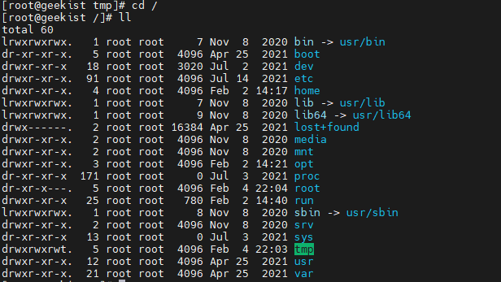
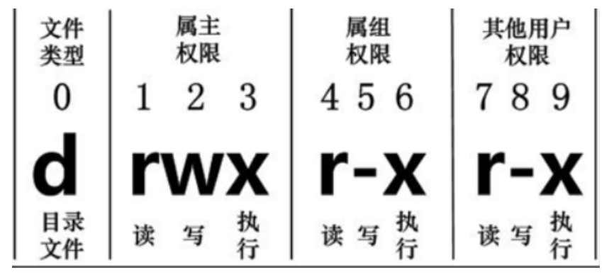

# 常见Linux命令

## 目录管理

* ls 列出目录

>-a ：全部的文件，连同隐藏文件( 开头为 . 的文件) 一起列出来(常用)
>
>-l ：长数据串列出，包含文件的属性与权限等等数据；(常用)

* cd 切换目录（change directory)

* pwd 显示目前所在目录(print working directory)

>-P ：显示出确实的路径，而非使用连结 (link) 路径。

* mkdir 创建目录

>-m ：配置文件的权限喔！直接配置，不需要看默认权限 (umask) 的脸色～
>
>-p ：帮助你直接将所需要的目录(包含上一级目录)递归创建起来！

* rmdir 删除一个空目录（如果目录中有文件或子目录，则无效）

> -p, --parents  remove DIRECTORY and its ancestors; e.g., 'rmdir -p a/b/c' is similar to 'rmdir a/b/c a/b a'

* cp 复制文件或目录  cp source dest

>-a：相当於 -pdr 的意思，至於 pdr 请参考下列说明；(常用)
>
>-p：连同文件的属性一起复制过去，而非使用默认属性(备份常用)；
>
>-d：若来源档为连结档的属性(link file)，则复制连结档属性而非文件本身；
>
>-r：递归持续复制，用於目录的复制行为；(常用)
>
>-f：为强制(force)的意思，若目标文件已经存在且无法开启，则移除后再尝试一次；
>
>-i：若目标档(destination)已经存在时，在覆盖时会先询问动作的进行(常用)
>
>-l：进行硬式连结(hard link)的连结档创建，而非复制文件本身。
>
>-s：复制成为符号连结档 (symbolic link)，亦即『捷径』文件；
>
>-u：若 destination 比 source 旧才升级 destination ！

* rm 移除文件或文件夹

>-f ：就是 force 的意思，忽略不存在的文件，不会出现警告信息；
>
>-i ：互动模式，在删除前会询问使用者是否动作
>
>-r ：递归删除啊！最常用在目录的删除了！这是非常危险的选项！！！
>

* mv 移动文件

>-f ：force 强制的意思，如果目标文件已经存在，不会询问而直接覆盖；
>
>-i ：若目标文件 (destination) 已经存在时，就会询问是否覆盖！
>
>-u ：若目标文件已经存在，且 source 比较新，才会升级 (update)

## 文件权限和属性

Linux系统是一种典型的多用户系统，不同的用户处于不同的地位，拥有不同的权限。为了保护系统的安全性，Linux系统对不同的用户访问同一文件（包括目录文件）的权限做了不同的规定。

在Linux中我们可以使用 ll 或者 ls –l 命令来显示一个文件的属性以及文件所属的用户和组。

在Linux中第一个字符代表这个文件是目录、文件或链接文件等等：

当为[ d ]则是目录

当为[ - ]则是文件；

若是[ l ]则表示为链接文档 ( link file )；

若是[ b ]则表示为装置文件里面的可供储存的接口设备 ( 可随机存取装置 )；

若是[ c ]则表示为装置文件里面的串行端口设备，例如键盘、鼠标 ( 一次性读取装置 )。

接下来的字符中，以三个为一组，且均为『rwx』 的三个参数的组合。

其中，[ r ]代表可读(read)、[ w ]代表可写(write)、[ x ]代表可执行(execute)。

要注意的是，这三个权限的位置不会改变，如果没有权限，就会出现减号[ - ]而已。

从左至右用0-9这些数字来表示。

第0位确定文件类型，第1-3位确定属主（该文件的所有者）拥有该文件的权限。第4-6位确定属组（所有者的同组用户）拥有该文件的权限，第7-9位确定其他用户拥有该文件的权限。

其中：

第1、4、7位表示读权限，如果用"r"字符表示，则有读权限，如果用"-"字符表示，则没有读权限；

第2、5、8位表示写权限，如果用"w"字符表示，则有写权限，如果用"-"字符表示没有写权限；

第3、6、9位表示可执行权限，如果用"x"字符表示，则有执行权限，如果用"-"字符表示，则没有执行权限。

对于文件来说，它都有一个特定的所有者，也就是对该文件具有所有权的用户。

同时，在Linux系统中，用户是按组分类的，一个用户属于一个或多个组。

文件所有者以外的用户又可以分为文件所有者的同组用户和其他用户。

因此，Linux系统按文件所有者、文件所有者同组用户和其他用户来规定了不同的文件访问权限。

在以上实例中，boot 文件是一个目录文件，属主和属组都为 root。

## 文件权限相关的命令：

* chgrp：更改文件属组： chgrp [-R] 属组名 文件名

-R：递归更改文件属组，就是在更改某个目录文件的属组时，如果加上-R的参数，那么该目录下的所有文件的属组都会更改。

* chown：更改文件属主，也可以同时更改文件属组

* chmod：更改文件9个属性

Linux文件属性有两种设置方法，一种是数字，一种是符号。

Linux文件的基本权限就有九个，分别是owner/group/others三种身份各有自己的read/write/execute权限。

先复习一下刚刚上面提到的数据：文件的权限字符为：『-rwxrwxrwx』， 这九个权限是三个三个一组的！其中，我们可以使用数字来代表各个权限，各权限的分数对照表如下：

每种身份(owner/group/others)各自的三个权限(r/w/x)分数是需要累加的，例如当权限为： [-rwxrwx---] 分数则是：
owner = rwx = 4+2+1 = 7

group = rwx = 4+2+1 = 7

others= --- = 0+0+0 = 0

