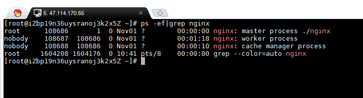

Linux ps （英文全拼：process status）命令用于显示当前进程的状态，类似于 windows 的任务管理器。

语法

ps [options] [--help]

参数：

ps 的参数非常多, 在此仅列出几个常用的参数并大略介绍含义

-A 列出所有的进程

-w 显示加宽可以显示较多的资讯

-au 显示较详细的资讯

-aux 显示所有包含其他使用者的行程


-e 显示所有进程。

-f 全格式。

-h 不显示标题。

-l 长格式。

-w 宽输出。

a 显示终端上的所有进程，包括其他用户的进程。

r 只显示正在运行的进程

x 显示没有控制终端的进程。


au(x) 输出格式 :

USER PID %CPU %MEM VSZ RSS TTY STAT START TIME COMMAND

USER: 行程拥有者

PID: pid

%CPU: 占用的 CPU 使用率

%MEM: 占用的记忆体使用率

VSZ: 占用的虚拟记忆体大小

RSS: 占用的记忆体大小

TTY: 终端的次要装置号码 (minor device number of tty)

STAT: 该行程的状态:

D: 无法中断的休眠状态 (通常 IO 的进程)

R: 正在执行中

S: 静止状态

T: 暂停执行

Z: 不存在但暂时无法消除

W: 没有足够的记忆体分页可分配

<: 高优先序的行程

N: 低优先序的行程

L: 有记忆体分页分配并锁在记忆体内 (实时系统或捱A I/O)

START: 行程开始时间

TIME: 执行的时间

COMMAND:所执行的指令



```
ps -ef | grep 进程关键字 //查找指定进程格式：

# ps -ef | grep php //例如显示 php 的进程：

# ps -A  //显示进程信息：

# ps -u root //显示root进程用户信息

# ps -ef //显示所有命令，连带命令行

```
