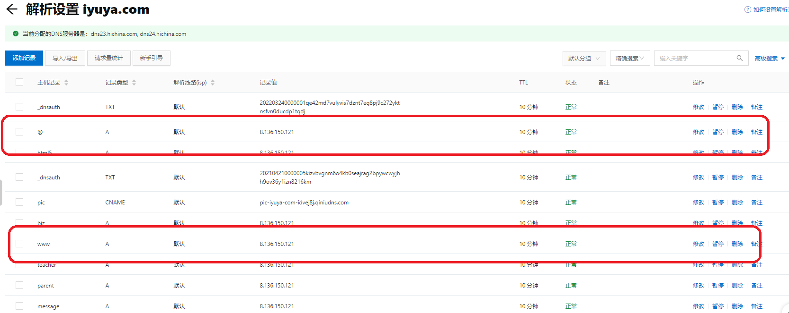
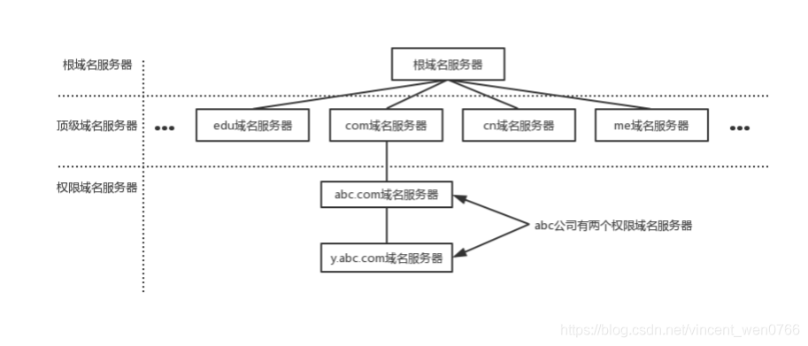
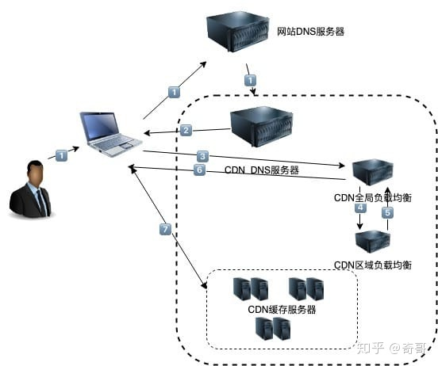
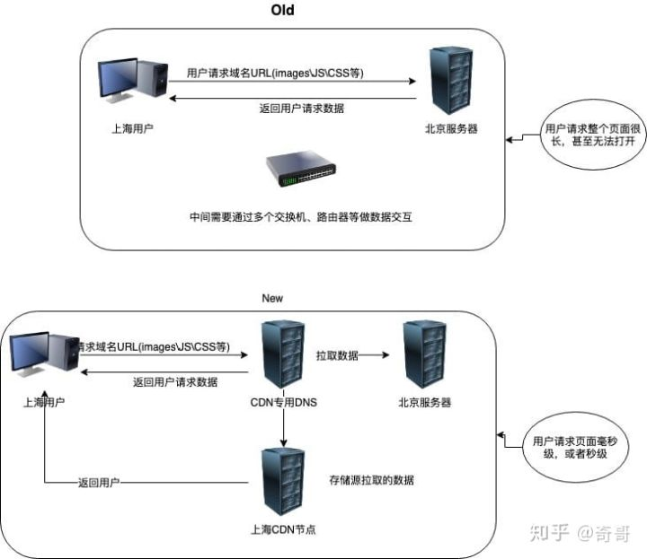
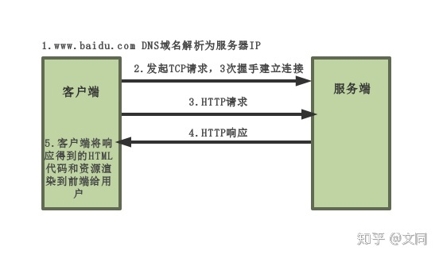

# 一、域名

## 1、域名定义

网域名称（英语：Domain Name，简称：Domain），简称域名、网域，是由一串用点分隔的字符组成的互联网上某一台计算机或计算机组的名称，用于在数据传输时标识计算机的电子方位。

IP地址是因特网主机的作为路由寻址用的数字体标识，但是他不容易记忆，因而产生了域名这一种字符型标识，它比IP地址更容易记忆。这也是域名的一个重要功能——为数字化的互联网资源提供易于记忆的名称。

例如，wikipedia.org是一个域名，和IP地址208.80.152.2相对应。人们可以直接访问wikipedia.org来代替IP地址，然后域名系统（DNS）就会将它转化成便于机器识别的IP地址。这样，人们只需要记忆wikipedia.org这一串带有特殊含义的字符，而不需要记忆没有含义的数字。

另外，域名具有唯一性，在资源更改IP地址时，只需要进行更新IP地址与恒定域名的映射关系就行了，对用户来说是无感知的。使用原来的域名同样可以访问到新的IP地址。

比如我们常见的http://www.baidu.com ，这就是一个标准的域名，无论百度公司在提供网站服务的机器如何变化，这个域名是不变的。

## 2、域名层次

域名语法
域名由多个部分组成，这些部分通常连接在一起，并由点分隔。一个域名的层次结构，从右侧到左侧隔一个点依次下降一层。每个标签可以包含1到63个八位元組。域名的结尾有时候还有一点，这是保留给根节点的，书写时通常省略，在查询时由软件内部补上。

例如zh.wikipedia.org。最右边的一个标签是顶级域名，wikipedia是二级域名；zh为三级域名。

### 顶级域

（英語：Top-level domains，缩写：TLD）是域名中最高的一级，每个域名都以顶级域结尾。

域名刚设计出来时，顶级域名主要分成两类：国家及地区双字代码顶级域（国家和地区顶级域）（英語：Country Code Top-level domains，缩写：ccTLD）和通用顶级域（英語：general Top-level domains，缩写：gTLD）。前者基于ISO-3166规定的国家/地区双字缩写代码；后者代表了一组名称和多个组织，包括.gov（政府，现用于美国政府的网站），.edu（教育机构，现用于美国各类学校的网），.com（商业，现在成为全球注册量最大、最通用的域名），.mil（军事，现用于美国国防部及其附属机构的网站），.org（非营利组织），.net（网络，当时獲定位为网络基础服务提供商）和.int（国际组织）等。

截至2009年10月，已存在21个通用顶级域名和250个国家及地区顶级域名，但它们远远不够互联网的使用。因此，在2011年，ICANN批准了一项新的TLD命名政策，以“在引入新的通用顶级域名方面，迈出重要的一步”。该计划设想了许多新的或已经提出的领域的可用性，以及新的应用和实施过程。2012年初，该计划开始实施，ICANN收到了1930份申请。2016年，gTLD批准达到1000个的大关。2011年后獲批准的通用顶级域名，並称为新通用顶级域名（英語：New general Top-level domains，缩写：NewgTLD）。

### 子域名

子域名将顶级域名进一步细分。域名层次结构中，顶级域名下面是二级域名，它位于顶级域名的左侧。例如，在zh.wikipedia.org中，wikipedia是二级域名。w3.org中，w3也是二级域名，与前例中的wikipedia属于一个层面。

二级域名下面是三级域名，它位于二级域名的左侧。例如，在zh.wikipedia.org中，zh是三级域名；zh-classical.wikipedia.org（文言文维基大典的域名）中，zh-classical也是三级域名，與前例中的zh属于一个层面。从右侧到左侧，隔一个点依次下降一层。

通常情况下，人们基于公司、产品或服务的名称来创建二级域名或更低级别的域名，以方便其他人识别和记忆。

完整域名的所有字符加起来不得超过253个ASCII字符的总长度。因此，当每一级都使用单个字符时，限制为127个级别：127个字符加上126个点的总长度为253。但实际上，某些域名可能具有其他限制；也没有只有一个字符的域名后缀。

## 3、三级域名www

www，其实是World Wide Web的缩写，中文翻译为万维网。是一个通过互联网访问的，由许多互相链接的超文本组成的系统。万维网是信息时代发展的核心，也是数十亿人在互联网上进行交互的主要工具。

我们通常所说的互联网，英文名字叫做Internet。互联网是21世纪之初网络与网络之间所串连成的庞大网络。

它是由从地方到全球范围内几百万个私人的、学术界的、企业的和政府的网络所构成，通过电子，无线和光纤网络技术等等一系列广泛的技术联系在一起。

这种将计算机网络互相联接在一起的方法可称作“网络互联”，在这基础上发展出覆盖全世界的全球性互联网络称互联网，即是互相连接一起的网络。

互联网并不等同万维网（WWW），万维网只是一个基于超文本相互链接而成的全球性系统，且是互联网所能提供的服务其中之一。互联网带有范围广泛的信息资源和服务，除此以外还有文件传输（FTP）、电子邮件（E-mail）、远程登录（Telnet）等。

为了区分互联网中的各种应用，就有了不同的子域名，比如互联网就以www作为子域名，文件传输以ftp作为子域名，电子邮件以mail作为子域名。

所以，我们经常看到的网址可能有 www.mhcoding.cn，ftp.hcoding.cn， mail.mhcoding.cn，等等的子域名形式。

**网站的www开头并不是必须的，只是为了直观地告诉用户这是一个互联网的web服务地址**

我们在购买域名之后，可以为域名做解析，如：

在主机记录中，可以填写的内容：

* WWW
解析后的域名为www.iyuya.com

@
直接解析主域名iyuya.com

* 
泛解析，匹配所有的*.iyuya.com

* mail
将域名解析为mail.iyuya.com，用来做邮件服务器

* 三级域名
如：abc.iyuya.com

**国内域名购买后需要备案**

# 二、DNS

## 1、DNS介绍 

DNS （Domain Name System 的缩写）的作用非常简单，就是根据域名查出IP地址。DNS中保存了一张域名(domain name)和与之相对应的IP地址 (IP address)的表，以解析消息的域名。你可以把它想象成一本巨大的电话本。

如果你要访问域名math.stackexchange.com，首先要通过DNS查出它的IP地址是151.101.129.69，然后才可以根据IP地址访问网站提供的内容。

## 2、DNS域名服务器

域名服务器实际上就是装有域名系统的主机。由高向低进行层次划分，可分为以下几大类

* 根域名服务器：

最高层次的域名服务器，也是最重要的域名服务器，本地域名服务器如果解析不了域名就会向根域名服务器求助。全球共有13个不同IP地址的根域名服务器，它们的名称用一个英文字母命名，从a一直到m。这些服务器由各种组织控制，并由 ICANN（互联网名称和数字地址分配公司）授权，由于每分钟都要解析的名称数量多得令人难以置信，所以实际上每个根服务器都有镜像服务器，每个根服务器与它的镜像服务器共享同一个 IP 地址，中国大陆地区内只有6组根服务器镜像（F，I（3台），J，L）。当你对某个根服务器发出请求时，请求会被路由到该根服务器离你最近的镜像服务器。所有的根域名服务器都知道所有的顶级域名服务器的域名和地址，如果向根服务器发出对 “vincent.org” 的请求，则根服务器是不能在它的记录文件中找到与 “vincent.org” 匹配的记录。但是它会找到 "org" 的顶级域名记录，并把负责 "org" 地址的顶级域名服务器的地址发回给请求者

* 顶级域名服务器：

负责管理在该顶级域名服务器下注册的二级域名。当根域名服务器告诉查询者顶级域名服务器地址时，查询者紧接着就会到顶级域名服务器进行查询。比如还是查询"vincent.org"，根域名服务器已经告诉了查询者"vincent"顶级域名服务器的地址，"org"顶级域名服务器会找到 “vincent.org”的域名服务器的记录，域名服务器检查其区域文件，并发现它有与 “vincent.org” 相关联的区域文件。在此文件的内部，有该主机的记录。此记录说明此主机所在的 IP 地址，并向请求者返回最终答案

* 权限域名服务器：

负责一个区的域名解析工作

* 本地域名服务器：

当一个主机发出DNS查询请求的时候，这个查询请求首先就是发给本地域名服务器的

## 2、DNS解析流程

1、本地客户机提出域名解析请求，查找本地HOST文件后将该请求发送给本地的域名服务器

2、将请求发送给本地的域名服务器

3、当本地的域名服务器收到请求后，就先查询本地的缓存

4、如果有该纪录项，则本地的域名服务器就直接把查询的结果返回浏览器

5、如果本地DNS缓存中没有该纪录，则本地域名服务器就直接把请求发给根域名服务器

6、然后根域名服务器再返回给本地域名服务器一个所查询域（根的子域）的主域名服务器的地址

7、本地服务器再向上一步返回的域名服务器发送请求，然后接受请求的服务器查询自己的缓存，如果没有该纪录，则返回相关的下级的域名服务器的地址

8、重复第7步，直到找到正确的纪录

9、本地域名服务器把返回的结果保存到缓存，以备下一次使用，同时还将结果返回给客户机

# 三、CDN

## 1、CDN介绍

CDN 其实是 Content Delivery Network 的缩写，即“内容分发网络”。源站内容(image、html、js、css等) 这个属于内容分发

CDN是将源站内容分发至全国所有的节点，从而缩短用户查看对象的延迟，提高用户访问网站的响应速度与网站的可用性的技术。它能够有效解决网络带宽小、用户访问量大、网点分布不均等问题。

CDN 诞生于二十多年前，随着骨干网压力的逐渐增大，以及长传需求的逐渐增多，使得骨干网的压力越来越大，长传效果越来越差。于是在 1995 年，MIT 的应用数学教授 Tom Leighton 带领着研究生 Danny Lewin 和其他几位顶级研究人员一起尝试用数学问题解决网络拥堵问题。他们使用数学算法，处理内容的动态路由安排，并最终解决了困扰 Internet 使用者的难题。后来，史隆管理学院的 MBA 学生 Jonathan Seelig 加入了 Leighton 的队伍中，从那以后他们开始实施自己的商业计划，最终于 1998 年 8 月 20 日正式成立公司，命名为 Akamai。

同年 1998 年，中国第一家 CDN 公司 ChinaCache成立。

蓝汛 是中国第一家CDN公司

在接下来的20年中，CDN行业历经变革和持续发展，行业也涌现出很多云CDN厂商。阿里云CDN是2008年从淘宝CDN起家，在2014年正式发展成为阿里云CDN的，它不仅为阿里巴巴集团所有子公司提供服务，同时也将自身的资源、技术以云计算的方式输出。

## 2、工作原理

- 当用户点击网站页面上的内容URL，经过本地DNS系统解析，DNS 系统会最终将域名的解析权交给 CNAME 指向的 CDN 专用 DNS 服务器。

- CDN 的 DNS 服务器将 CDN 的全局负载均衡设备 IP 地址返回用户。

- 用户向 CDN 的全局负载均衡设备发起内容 URL 访问请求。

- CDN 全局负载均衡设备根据用户 IP 地址，以及用户请求的内容URL，选择一台用户所属区域的区域负载均衡设备，告诉用户向这台设备发起请求。

- 基于以下这些条件的综合分析之后，区域负载均衡设备会向全局负载均衡设备返回一台缓存服务器的IP地址：

- 根据用户 IP 地址，判断哪一台服务器距用户最近；

- 根据用户所请求的 URL 中携带的内容名称，判断哪一台服务器上有用户所需内容；

- 查询各个服务器当前的负载情况，判断哪一台服务器尚有服务能力。

- 全局负载均衡设备把服务器的 IP 地址返回给用户。

- 用户向缓存服务器发起请求，缓存服务器响应用户请求，将用户所需内容传送到用户终端。如果这台缓存服务器上并没有用户想要的内容，而区域均衡设备依然将它分配给了用户，那么这台服务器就要向它的上一级缓存服务器请求内容，直至追溯到网站的源服务器将内容拉到本地。

# 三、https协议

网络协议是计算机之间为了实现网络通信而达成的一种“约定”或者”规则“，有了这种”约定“，不同厂商的生产设备，以及不同操作系统组成的计算机之间，就可以实现通信。

## 1、http协议

* 定义：

HTTP协议是超文本传输协议的缩写，英文是Hyper Text Transfer Protocol。它是从WEB服务器传输超文本标记语言(HTML)到本地浏览器的传送协议。

设计HTTP最初的目的是为了提供一种发布和接收HTML页面的方法。

HTPP有多个版本，目前广泛使用的是HTTP/1.1版本。

HTTP是一个基于TCP/IP通信协议来传递数据的协议，传输的数据类型为HTML 文件,、图片文件, 查询结果等。

HTTP协议一般用于B/S架构（）。浏览器作为HTTP客户端通过URL向HTTP服务端即WEB服务器发送所有请求。

* http协议的特点

http协议支持客户端/服务端模式，也是一种请求/响应模式的协议。

简单快速：客户向服务器请求服务时，只需传送请求方法和路径。请求方法常用的有GET、HEAD、POST。

灵活：HTTP允许传输任意类型的数据对象。传输的类型由Content-Type加以标记。

无连接：限制每次连接只处理一个请求。服务器处理完请求，并收到客户的应答后，即断开连接，但是却不利于客户端与服务器保持会话连接，为了弥补这种不足，产生了两项记录http状态的技术，一个叫做Cookie,一个叫做Session。

无状态：无状态是指协议对于事务处理没有记忆，后续处理需要前面的信息，则必须重传。

## 2、https协议

### 定义
超文本传输安全协议（英语：Hypertext Transfer Protocol Secure，缩写：HTTPS，常称为HTTP over TLS，HTTP over SSL或HTTP Secure）是一种网络安全传输协议。

因为HTTP协议传输的数据都是未加密的，也就是明文，因此使用HTTP协议传输隐私信息非常不安全。HTTP使用80端口通讯，而HTTPS占用443端口通讯。

在计算机网络上，HTTPS经由超文本传输协议（HTTP）进行通信，但利用SSL/TLS来加密数据包。HTTPS开发的主要目的，是提供对网络服务器的身份认证，保护交换数据的隐私与完整性。这个协议由网景公司（Netscape）在1994年首次提出，随后扩展到互联网上。

### https工作原理:

HTTPS在传输数据之前需要客户端（浏览器）与服务端（网站）之间进行一次握手，在握手过程中将确立双方加密传输数据的密码信息。TLS/SSL中使用了非对称加密，对称加密以及HASH算法。

握手过程的具体描述如下：

1）浏览器将自己支持的一套加密规则发送给网站。 

2）网站从中选出一组加密算法与HASH算法，并将自己的身份信息以证书的形式发回给浏览器。证书里面包含了网站地址，加密公钥，以及证书的颁发机构等信息。 

3）浏览器获得网站证书之后浏览器要做以下工作： 
a) 验证证书的合法性（颁发证书的机构是否合法，证书中包含的网站地址是否与正在访问的地址一致等），如果证书受信任，则浏览器栏里面会显示一个小锁头，否则会给出证书不受信的提示。 
b) 如果证书受信任，或者是用户接受了不受信的证书，浏览器会生成一串随机数的密码，并用证书中提供的公钥加密。 
c) 使用约定好的HASH算法计算握手消息，并使用生成的随机数对消息进行加密，最后将之前生成的所有信息发送给网站。 

 4）网站接收浏览器发来的数据之后要做以下的操作： 
a) 使用自己的私钥将信息解密取出密码，使用密码解密浏览器发来的握手消息，并验证HASH是否与浏览器发来的一致。 
b) 使用密码加密一段握手消息，发送给浏览器。 

 5）浏览器解密并计算握手消息的HASH，如果与服务端发来的HASH一致，此时握手过程结束，之后所有的通信数据将由之前浏览器生成的随机密码并利用对称加密算法进行加密。

## SSL证书

### 定义

SSL证书和我们日常用的身份证类似，是一个支持HTTPS网站的身份证明。

SSL证书里面包含了网站的域名，证书有效期，证书的颁发机构以及用于加密传输密码的公钥等信息。由于公钥加密的密码只能被在申请证书时生成的私钥解密，因此浏览器在生成密码之前需要先核对当前访问的域名与证书上绑定的域名是否一致，同时还要对证书的颁发机构进行验证，如果验证失败浏览器会给出证书错误的提示。

SSL证书的格式是由X.509标准定义。SSL证书负责传输公钥，是一种PKI（Public Key Infrastructure，公钥基础结构）证书。证书都是由受认证的证书颁发机构——我们称之为CA（Certificate Authority）机构来颁发，针对企业与个人的不同，可申请的证书的类型也不同，价格也不同。CA机构颁发的证书都是受信任的证书，对于SSL证书来说，如果访问的网站与证书绑定的网站一致就可以通过浏览器的验证而不会提示错误。

### 证书申请

SSL证书可以向CA机构通过付费的方式申请，也可以自己制作。CA机构颁发的证书价格非常昂贵，而且有效期一般只有一年到三年不等（年数不同，价格也不同），过期之后还要再次交钱申请，因此一般只有企业才会申请证书。但是随着个人网站的增多，目前也有针对个人的SSL证书服务，价格相对便宜一些，国内的话400多块钱就能申请到一个，国外更是有免费的SSL证书可以申请。

在申请SSL证书时需要向CA机构提供网站域名，营业执照，以及申请人的身份信息等。网站的域名非常重要，申请人必须证明自己对域名有所有权。如果支持Hotmail.com，Gmail.com的SSL证书都可以随便申请，黑客们就不用做假证书欺骗了。

CA机构也提供申请通配符域名（例如，*.runoob.com），通配符域名相当于绑定了主域名下的所有域名，因此使用起来非常方便，但是价格也超级昂贵，一个通配符域名一年大概得5000块钱，只有企业才可以申请。

### 如何配置SSL证书

参见：[nginx环境下配置SSL](https://github.com/geekist/developer_guide/blob/main/nginx/nginx.md)