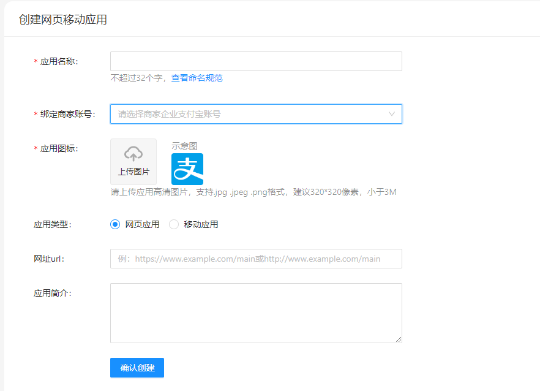
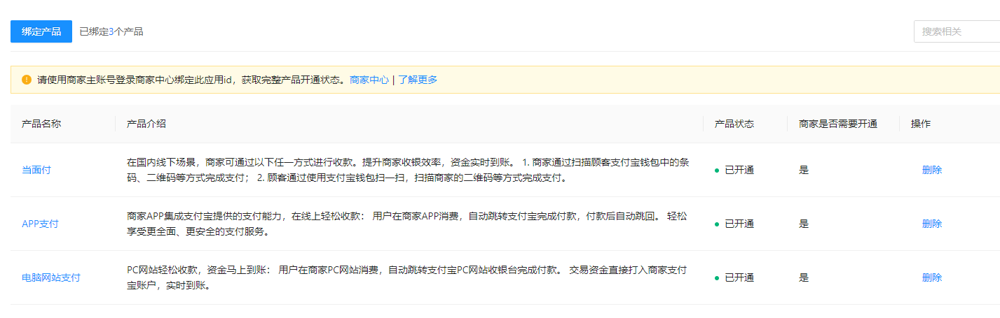

# 一、平台入驻


开发者在入驻前，需要注册个人或企业支付宝账号并完成实名认证。

企业支付宝注册指南：https://opendocs.alipay.com/common/02kkum
个人支付宝注册指南：https://opendocs.alipay.com/common/02kg61

入驻成功后，需要选择开发身份：

根据开发者实际提供的服务可选择：自研开发服务 和 自研开发服务+提供第三方服务 。两种身份对应的定义和区别如下：

自研开发服务
身份要求：有开发能力的个人或者企业，即登录账号可以是个人支付宝账号或企业支付宝账号。
通过开放平台提供的丰富的 API 和业务能力，集成支付、营销、资金和会员等能力更好地服务自己的顾客。
自研开发者可给自己开发小程序、生活号以及开放平台后续开放的其他应用类型；同时，开发者如果有网页应用或者移动应用，也可以在自己的网页&移动应用中集成开放平台提供的丰富能力。

提供第三方服务
身份要求：有开发能力的企业，即登录账号只能是企业支付宝账号。
主要面向系统服务商 ISV，为他人开发应用。通过开放平台提供的丰富的 API 和业务能力，系统服务商可以开发第三方应用服务商家，并在服务市场上线各类插件、应用，解决商家门店管理、支付核销、会员营销、资金管理等方面的问题。开放平台还为各类应用提供了清晰的盈利模式，可通过服务市场的销售获得回报。
三方服务开发者除了拥有开发第三方应用、小程序模板、小程序插件等三方业务的权限外；还能给自己开发小程序、生活号以及开放平台后续开放的其他应用类型。同时，服务商还能通过开放平台，为商户或者自己的网页&移动应用集成丰富的业务能力。



# 二、签约支付宝功能

应用使用支付宝提供的支付功能，需要和支付宝进行功能签约。功能签约可以在开发者创建应用时在开放平台开通，也可以由商户在商户平台通过应用ID来绑定开通。




# 三、创建应用

目前，支付宝的应用类型可分为如下应用：

• 网页&移动应用：为商户自行调用接口使用。

• 网页应用：一般应用于 PC 网站、手机网站，用于增加网页的支付宝支付、PC 快捷登录，卡券发放等功能。

• 移动应用：一般应用于手机 APP，可用于为 APP 增加移动端的支付宝支付、发放卡券、分享给支付宝好友等功能。

• 生活号：调用生活号开发集成使用。

• 小程序：调用小程序开发集成使用。

• 第三方应用：系统服务商（ISV）通过创建第三方应用来为广大商户提供 服务 （包括但不仅限于小程序、支付花呗、会员营销、信用服务、行业解决方案、设计 和 API 等类目），代替没有开发能力的商户接入支付宝开放平台的多种业务能力。可选择 小程序、生活号、网页&移动应用。

• 沙箱应用：沙箱应用是用于模拟测试使用，无需创建。每个入驻开放平台的支付宝账户都拥有一个沙箱应用，每个账户内的沙箱数据信息不同。 
沙箱应用可 点击 进入，获取沙箱的 APPID、支付宝网关、沙箱支付宝钱包下载二维码、沙箱账户等。 
沙箱环境测试不适用于所有接口，建议通过 沙箱支持产品 进行了解。

注意：应用创建后，无法修改应用的类型。若想修改应用类型，建议通过 应用类型 选择重新创建应用。


应用数量：

• 网页&移动应用：最多可创建 50 个应用（网页应用+移动应用总个数）。

• 小程序：最多可创建 10 个。

• 第三方应用：最多可创建 10 个。

• 生活号：
支付宝开放平台 只支持创建 1 个。
生活号官方平台 最多可创建 10 个（包含开发者中心的 1 个应用）。


应用命名：注意命名规范。

应用类型：网页应用适用于网站，移动应用适用于移动app。

网址url、应用简介等：可以不用设置。

Bundle ID、应用签名和应用包名：选择移动应用必传

# 四、生成密钥及其他开放需要的配置：

```
  appId: 2021002144676901

  url: https://openapi.alipay.com/gateway.do

  privateKey: MIIEvQIBADANBgkqhkiG9w0BAQEFAASCBKcwggSjAgEAAoIBAQC09ZajR5nm+lENe7QRFpaDFYTUzzUZcKmsdiMGJQIOFNzfZi6JCR9TXbGiPMIDAIHSfAsXNB1d3VKNez5WoY9fxBK/LZ9BUGz9liUXDIvWxKiNz2LVWSFekJ2NefwDNw8cmU6fcxQ8C8g+Fdyy+VnibnVfZ0XqveOKKbarqrIfrmKsXgHeB8E71oY9GZoLYOJNANLMArwoJynjaCW115lEKHwFGj8AJbu/N3AsKY3EcuThDVeTA34XWgNtkOl89ADEl/Lgx3B9ZmQp0SGh7RJXV2NekmLN9DQfn9M0axFrt3wnaHZ4fUFSeVGG458TImPLJgHMX0ZP3IpnXh6ySzJ3AgMBAAECggEAUekMm7IQXvYVdDX3ZvjDfmhiLPXyAib2FqOO7PwZdwhIhjK5g7wGWvUBL/+yjitPmFgfqQwk8tT4xiPwLsSIon+dQL5E5QqjmxG4jjtWnQt9hFtIUGw855IsTtrVkRr+EyLt7Mzpbtiidj/tG3I1FoKLTHjxs/TqJyMElaX5ZM8GWLM1YP5rHgfmyMNrjh8lGkuaZYrXFBxER1yU3zrfVt/kDdNB+/W/KIhrN11SSSxQKWIlECnOrs7YGQAIKLmOfMn4Kp54LJFTyDioCvDeul1BMZu1dO7xEpyuAirORXMgLL4lbYmbS125ouZzzJdhiZ6Ma7BFbZhmycK0PMswSQKBgQDomqpZ7T70/rVLbAOKwl5EZdR2jIYHaSEbJ2gNhmL/ggLmTBAK7qqTKcJ4JemIqqAGuZaoJYet9vDyYEw9njJlJvqSrybpWqMzOjUbQ0w+KKbNA4jD30fczEQSRyqYW/timYexOFVUzCDnpL9jA2P8NTjRdj5YWnqStZQ9J7w9OwKBgQDHKR40yvHkN4L/SIlkk5LKjtMxPH/MenDCqrLzmw+265oWHi+Ui+MVwFvZlt7cdZhqe/rwrstYeqn0QYCwhg3XPnFHRCZIBsfZIff2oe6YCjz0A9FsddY0J6JFKTQ3BlnRxgUidD6YeMVLY6WLa3nU+cevDYnL7sqDVr/p6pg79QKBgFKvkHkRNj0fQlFCX2v3Nk14KXPO9mIyA/vEIWAVcqHDlMZLKbTJLMfNo3zUdVUI2oQpex3g4X989iAjDVcmImIE3jRAoUN43eT6/x/m53Z9OvZMGFUQzVn3HwekVsb8g7uEOlFMZkETo2rVDNfkv6lLPhxvvS/pUgNPGxg2RNs7AoGAd6UJA3gkBxEePlSKTYSmO8+/qiWJNQMdeKTpqpUtxJsXT1BFDz1WZ7vOshIDwndW4CmpICwx9u6B6T3snJ978yINFV4ojT6dkqDogR7Y4jfMVF9y0XCdBWoF/vx45NGI5g/LB97Dt/9dryOm0PH5F+wSfORqMrw6ptpXoqQPXn0CgYEA3WqfSHqePnOebqIgzFb6RbrV3lYQihLC4Wa52fjMG+FB9EeQ198UDpa8TUkpO5/cR0TaTl24S9vCT0g6Q7LVipnyeIg52h4A0EV+mf9gtAmS9hjOlv8DEm3dtKNWN9o8MghtYu2ZbcX5K1gdG1esNr6dDtYVwTWgc45JIHfK6bQ=
  
  publicKey: MIIBIjANBgkqhkiG9w0BAQEFAAOCAQ8AMIIBCgKCAQEA4wA6J0cKkgq8KGb8g/55Q+ByS6JW440ZZuDpVNdoT0fx2lLg/mNDPSNDgGdJrshZ/GbyEa3OzB4S1duqL74xJ86Ad7ywvBOynsiY1NhlPX+SLujYCNS9R+6dHoQ+9pQ5LBK1bZF6wU49F2eJYo9aNHLvyJMEyPhM1aAGYP0UgpHSlTHebTJpnXRsgoF+88F7B/I7cevNiGRx2NIXhYqdkUptmE+KM6aLOhqiidb37Ppds5mmN0J2feo1PbnPjLWkMrnFe4Jctc02oWaaKC5f2gz4H5p88PNzG1SizJ7QiTPAtYi4LyffCIuQIL9b+Mvdw46bQSRnp5alyiLeSTt+/wIDAQAB
  
  notifyUrl: http://biz.iyuya.com/api/pay/callback/alipay/payAsyn
  
  signType: RSA2
  
  format: json
  
  charset: utf-8
```


# 五、搭建和配置开发环境

服务端sdk可参见 服务端SDK 进行下载操作。
客户端sdk可参见 客户端sdk 进行下载操作。
刷脸付sdk需另外参见 刷脸客户端sdk 下载操作。
更多详细sdk和demo参见 SDK与demo下载。 

# 六、沙箱环境测试

沙箱测试为模拟测试，建议正式环境测试为准。
• 沙箱环境测试可参见 如何使用沙箱环境。
• 沙箱环境接口测试成功后，切换为正式环境，可参见 沙箱环境如何切换正式环境。