了解java web的发展历史和相关技术的演进历程，非常有助于加深对java web技术的理解和认识。


# 一、远古期 - 静态页面时代

讲Java Web开发的历史进程，不得不提Web开发的历史进程。

在互联网刚发展的时候，那时候的网站功能是很简单的。那时候的网站还都是静态的。这里所说的静态是指，请求访问的网页都是事先编辑好的，不能改变的。

这里先讲下当时一个请求是如何返回结果的。

比如，你想访问新浪上的一张图片，会在浏览器键入这个图片的地址：


浏览器会根据地址向新浪服务器发送HTTP请求。新浪服务器上的HTTP Server接收到请求后，会根据路径地址/img/12345.jpg查找的这个文件，然后read文件，再把图片数据发送给客户端，客户端的浏览器就能正确展示图片了。

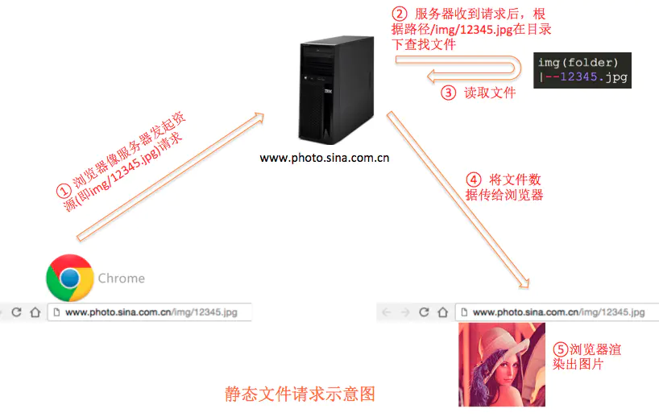

也就是说，这里的URL对服务器来说就是查找文件的地址，而文件必须实实在在存在于服务器中的特定目录下的。


缺点

很明显，访问的资源必须事先已经存在，否则访问不到。而动态展示也是没法实现的。比如：某人刚发布了一篇文章，想在首页立即看到是不可能的。只能重新手动编辑首页，把文章链接加进去


# 二、混沌期 - CGI时代

然而，如果页面一直是静态的额，也就不会有现在纷繁复杂的网站了。那么动态展示页面的解决方案是什么呢？是CGI！

CGI全称是通用网关接口(Common Gateway Interface)。那么它的作用是啥呢？


CGI是啥

首先，要清楚CGI是啥？

CGI是一个可执行的程序或者可运行的脚本。几乎所有语言都能写CGI，像python，C，甚至shell。

举个例子。下面一段C代码，经过编译成可执行程序后，就是一个CGI。

```cpp
int _tmain(int argc, _TCHAR* argv[])
{
    printf("Content-type:text/html\n\n");
    printf("%s",getenv("QUERY_STRING")); //打印get获取的信息
    return 0;
}
```

再或者，下面一个python脚本，也是一个CGI

```python
#!/usr/bin/python
# -*- coding: UTF-8 -*-

print "Content-type:text/html"
print                               # 空行，告诉服务器结束头部
print '<html>'
print '<head>'
print '<meta charset="utf-8">'
print '<title>Hello Word - 我的第一个 CGI 程序！</title>'
print '</head>'
print '<body>'
print '<h2>Hello Word! 我是来自菜鸟教程的第一CGI程序</h2>'
print '</body>'
print '</html>'
```

OK，知道了CGI是可执行的程序或脚本，但是怎么工作的呢？

CGI怎么用

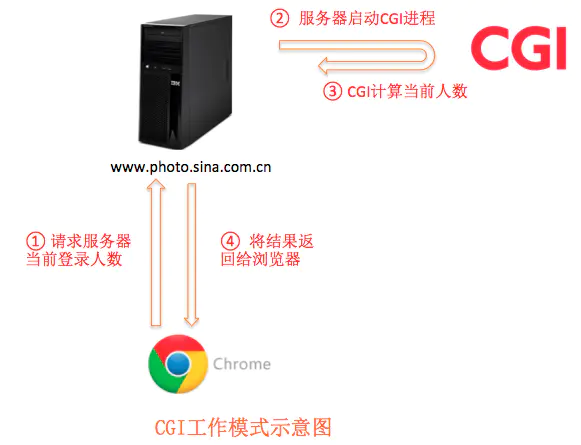


如上图，当浏览器发送一个CGI请求后，服务器会启动一个进程运行CGI程序或脚本，由CGI来处理数据，并将结果返回给服务器，服务器再将结果返回给浏览器。

举个表单提交的例子：

```html
<form id="form" name="form" method="post" action="http://localhost/cgi-bin/test/cgi_test.cgi">
  <p>输入内容：
    <input type="text" name="user" id="user" />
  </p>
  <p>
    <input type="submit" name="submit" id="submit" value="提交" />
  </p>
</form>
```

上面是一个表单提交的html代码，展示的效果是下面这个样子：

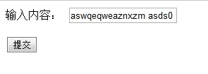

细心的你会发现，action的值是http://localhost/cgi-bin/test/cgi_test.cgi。这里，cgi_test.cgi就是一个cgi程序。

还记得上面那段C++代码吗？

```cpp
int _tmain(int argc, _TCHAR* argv[])
{
    printf("Content-type:text/html\n\n");
    printf("%s",getenv("QUERY_STRING")); //打印get获取的信息
    return 0;
}
```

cgi_test.cgi就是这段代码编译出来的可执行程序。

这段代码的作用是什么呢？

作用是将表单提交的信息直接打印出来。

如何做到的？

只有两行代码，第二行代码是关键。getenv()是C函数库中的函数，getenv("QUERY_STRING")的意思是读取环境变量QUERY_STRING的值。而QUERY_STRING的值就是表单提交的信息。

OK，这个CGI的功能就清晰了。表单提交后展示下面的结果也就不奇怪了：

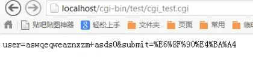

我们再通过一个图梳理下上述流程：

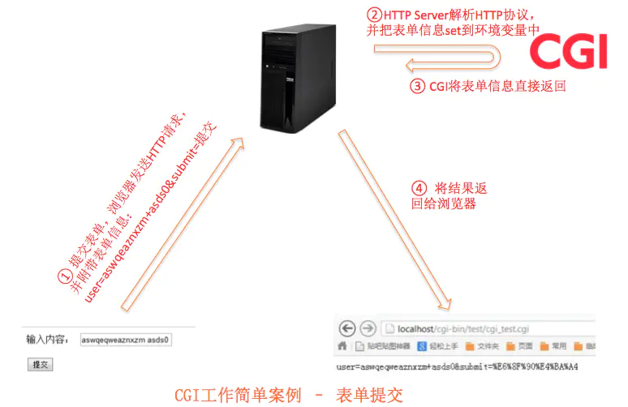

综上，CGI工作模式示意图如下：

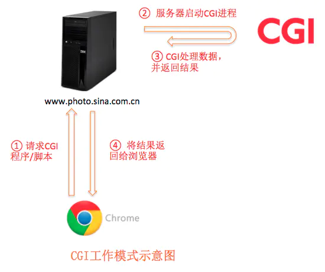

CGI的特点

由Http Server唤起。常见的Http Server如Apache，Lighttpd，nginx都支持CGI

CGI单独启动进程，并且每次调用都会重新启动进程

可以用任何语言编写，只要该语言支持标准输入、输出和环境变量

CGI的缺点

消耗资源多：每个请求都会启动一个CGI进行，进程消耗资源15M内存的话，同时到达100个请求的话，就会占用1.5G内存。如果请求更多，资源消耗是不可想象的。

慢：启动进程本身就慢。每次启动进程都需要重新初始化数据结构等，会变得更慢。

引申

为了解决CGI重复启动进程和初始化的问题，后来出现了FastCGI

# 三、开荒期 - Servlet时代

在CGI繁荣发展的时代，Java还没有发展起来。当Java开始参与历史，引领潮流的时候，也必然会借鉴和改进之前的技术和思想。

鉴于CGI的一些缺点，Java Web在开始设计的时候就想出了一种解决方案 -- Servlet

同样，第一个问题，Servlet是啥？

Servlet是啥？

举个例子，网站一般都有注册功能。当用户填写好注册信息，点击“注册”按钮时，谁来处理这个请求？用户名是否重复谁来校验？用户名和密码需要写入数据库，谁来写入？是Servlet！


Servlet是实现javax.servlet.Servlet接口的类。一般处理Web请求的Servlet还需要继承javax.servlet.http.HttpServlet

```java
abstract class HttpServlet implements Servlet{
    void doGet();
    void doPost();
}
```

doGet()方法处理GET请求

doPost()方法处理POST请求

浏览器发来的请求是怎么被Servlet处理的呢？还是举表单提交的例子。

我们假设表单样式如下，只是简单提交两个数据：网址名和网址。并假设处理URL为http://localhost:8080/TomcatTest/HelloForm

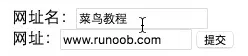

浏览器工作

当表单使用GET方式提交时，浏览器会把表单数据组装成这样的URL：

***http://localhost:8080/TomcatTest/HelloForm?name=菜鸟教程&url=www.runoob.com***

好，现在浏览器的任务暂时告一段落，开始Java Web服务工作了。

Java Web服务

首先，我们得指定http://localhost:8080/TomcatTest/HelloForm这个URL由谁来处理。这个映射关系需要在web.xml中配置：

```xml
<?xml version="1.0" encoding="UTF-8"?>
<web-app>
  <servlet>
    <servlet-name>HelloForm</servlet-name>
    <servlet-class>com.runoob.test.HelloForm</servlet-class>
  </servlet>
  <servlet-mapping>
    <servlet-name>HelloForm</servlet-name>
    <url-pattern>/TomcatTest/HelloForm</url-pattern>
  </servlet-mapping>
</web-app>
```

web.xml中配置的意思是：当URI为/TomcatTest/HelloForm时，交给com.runoob.test.HelloForm处理。而HelloForm正是个Servlet。

因此，我们需要编写HelloForm这样一个Servlet：

```java
import java.io.IOException;
import java.io.PrintWriter;

import javax.servlet.ServletException;
import javax.servlet.annotation.WebServlet;
import javax.servlet.http.HttpServlet;
import javax.servlet.http.HttpServletRequest;
import javax.servlet.http.HttpServletResponse;

/**
 * Servlet implementation class HelloForm
 */
@WebServlet("/HelloForm")
public class HelloForm extends HttpServlet {
    private static final long serialVersionUID = 1L;
       
    /**
     * @see HttpServlet#HttpServlet()
     */
    public HelloForm() {
        super();
        // TODO Auto-generated constructor stub
    }

    /**
     * @see HttpServlet#doGet(HttpServletRequest request, HttpServletResponse response)
     */
    protected void doGet(HttpServletRequest request, HttpServletResponse response) throws ServletException, IOException {
        // 设置响应内容类型
        response.setContentType("text/html;charset=UTF-8");

        PrintWriter out = response.getWriter();
        String title = "使用 GET 方法读取表单数据";
        // 处理中文
        String name =new String(request.getParameter("name").getBytes("ISO8859-1"),"UTF-8");
        String docType = "<!DOCTYPE html> \n";
        out.println(docType +
            "<html>\n" +
            "<head><title>" + title + "</title></head>\n" +
            "<body bgcolor=\"#f0f0f0\">\n" +
            "<h1 align=\"center\">" + title + "</h1>\n" +
            "<ul>\n" +
            "  <li><b>站点名</b>："
            + name + "\n" +
            "  <li><b>网址</b>："
            + request.getParameter("url") + "\n" +
            "</ul>\n" +
            "</body></html>");
    }
    
    // 处理 POST 方法请求的方法
    public void doPost(HttpServletRequest request, HttpServletResponse response) throws ServletException, IOException {
        doGet(request, response);
    }
}
```

由于请求方式是GET，因此需要doGet()方法来处理。仔细阅读doGet()方法的代码，发现处理逻辑只是把表单数据放入到了一段html代码中。这段html代码会被传输给浏览器，然后浏览器渲染出结果，如下图所示：

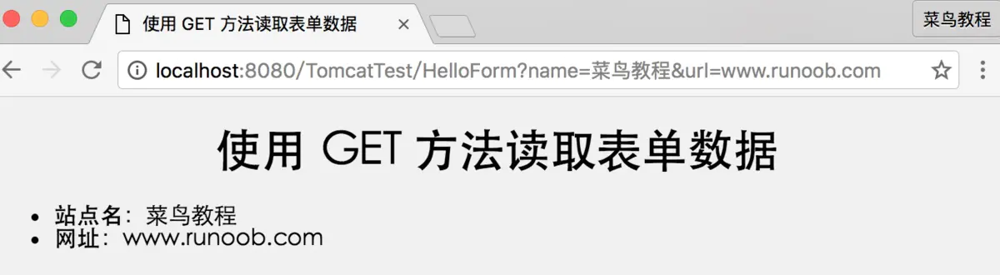

Servlet的特点

Servlet相对于CGI有了很大的改进，效率更高，功能更强大，更容易移植。主要表现在一下几个方面：

CGI每个请求启动一个进程，而Servlet是更轻量的线程。线程和进程的对比和优劣请自行Google。

CGI每个进程都需要初始化，Servlet只初始化一次实例就行

Servlet依托于Java语言，具有很好的跨平台型。CGI根据语言的不同，跨平台型不同

CGI与数据库连接需要重连，Servlet可以使用数据库连接池。

Java有丰富的、各种各样的库函数

Servlet的缺点

看上面的代码，会发现，html代码是写在Java代码中的。对于前端人员来说，这种形式非常非常难以开发和修改。

Servlet的升级 -- JSP

Servlet是在Java代码中写HTML代码。与之对应的就是在HTML代码中写Java代码，这就是JSP。

JSP是啥？

JSP：JavaServer Pages

简单点说，就是可以在html中写Java代码。

还是先从例子中大概了解下JSP：

还是上面表单处理的例子。表单的html代码就不展示了，我们直接模拟GET请求，即在浏览器中输入地址：

http://localhost:8080/testjsp/main.jsp?name=菜鸟教程&url=http://www.runoob.com

很明显，这个URL的关键是main.jsp。这个文件的内容是啥呢？

main.jsp

```javascript
<%@ page language="java" contentType="text/html; charset=UTF-8"
    pageEncoding="UTF-8"%>
<%@ page import="java.io.*,java.util.*" %>
<!DOCTYPE html>
<html>
<head>
<meta charset="utf-8">
<title>菜鸟教程(runoob.com)</title>
</head>
<body>
<h1>使用 GET 方法读取数据</h1>
<ul>
<li><p><b>站点名:</b>
   <%= request.getParameter("name")%>
</p></li>
<li><p><b>网址:</b>
   <%= request.getParameter("url")%>
</p></li>
</ul>
</body>
</html>
```

这就是JSP，在html代码中插入Java代码。java代码被<% %>所包围。

<%= request.getParameter("name")%>表示获取请求参数name的值，<%= request.getParameter("url")%>表示获取请求参数url的值。最终展示结果是怎样的呢？看下图：

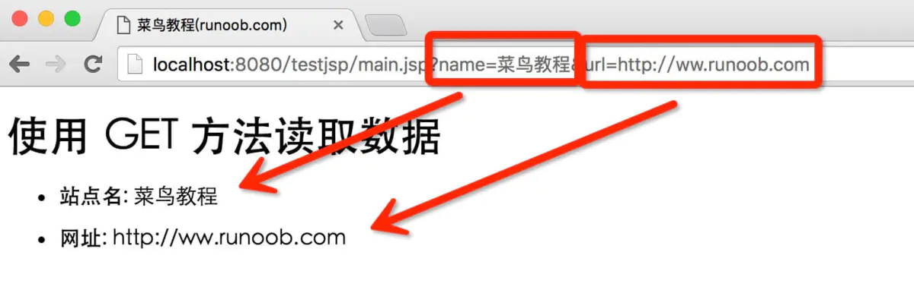

JSP是如何工作的？

为啥html代码中可以写Java代码呢？看下图：

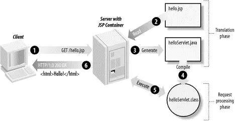

其实原理是这样的：

就像其他普通的网页一样，您的浏览器发送一个HTTP请求给服务器。

Web服务器识别出这是一个对JSP网页的请求，并且将该请求传递给JSP引擎。通过使用URL或者.jsp文件来完成。

JSP引擎从磁盘中载入JSP文件，然后将它们转化为servlet。这种转化只是简单地将所有模板文本改用println()语句，并且将所有的JSP元素转化成Java代码。

JSP引擎将servlet编译成可执行类，并且将原始请求传递给servlet引擎。

Web服务器的某组件将会调用servlet引擎，然后载入并执行servlet类。在执行过程中，servlet产生HTML格式的输出并将其内嵌于HTTP response中上交给Web服务器。

Web服务器以静态HTML网页的形式将HTTP response返回到您的浏览器中。

最终，Web浏览器处理HTTP response中动态产生的HTML网页，就好像在处理静态网页一样。

用一句话来讲：每个JSP都最终会变成对应的Servlet执行

JSP的缺点

在HTML代码中写Java代码，方便了前端人员，但是苦了后端人员。因此，单纯使用JSP，开发效率依旧不高。

后来，有牛人发现，Servlet天生非常适合逻辑处理(因为主要是Java代码)，而JSP非常适合页面展示(因为主要是html代码)，那么在结合Servlet和JSP各自的优缺点后，诞生了Web开发中最常用和最重要的架构设计模式：MVC

# 四、发展期 - MVC时代

MVC模式（Model-View-Controller）是软件工程中的一种软件架构模式，把软件系统分为三个基本部分：模型（Model）、视图（View）和控制器（Controller）：

- Controller——负责转发请求，对请求进行处理

- View——负责界面显示

- Model——业务功能编写（例如算法实现）、数据库设计以及数据存取操作实现


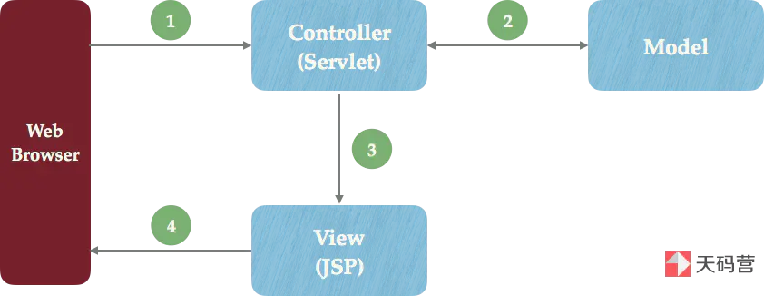

简而言之，请求发来后，会首先经过Controller层处理，需要返回的结果封装成对象传递给JSP，然后JSP负责取出数据展示就够了。这样，后端开发人员只负责编写Servlet，前端人员负责JSP，极大提升了开发效率。

```java
@WebServlet("/userPosts")
public class UserPostController extends HttpServlet {

    private static final long serialVersionUID = -4208401453412759851L;

    @Override
    protected void doGet(HttpServletRequest req, HttpServletResponse resp) throws ServletException, IOException {
        String username = req.getParameter("username");
        User user = Data.getByUsername(username);
        List<Post> posts = Data.getPostByUser(user);

        req.setAttribute("posts", posts);
        req.setAttribute("user", user);
        RequestDispatcher dispatcher = req.getRequestDispatcher("/templates/userPost.jsp");
        dispatcher.forward(req, resp);
    }
}
```

像上面这段代码，UserPostController就是一个Servlet，负责逻辑处理。需要返回的数据封装到HttpServletRequest对象中，传递给jsp页面。而负责展示的就是/templates/userPost.jsp这个jsp文件。

# 五、繁盛期 - 框架时代

有了Servlet和JSP，相当于有了武器。有了MVC，相当于有了战术。但是武器和战术之间还缺少一层，就是具体实施者。

实践证明，单纯使用Servlet、JSP和MVC开发，依然会面临诸多的问题。而程序员普遍存在一种特质，就是懒。因为懒，所以才想着能有更简单的解决办法。因为懒，针对一些通用问题，才会想出通用解决方法。可以说，因为懒，科技才有了进步。。。这时候，为了解放劳动力，一些开源框架营运而出。这些框架的目的只有一个：让开发简单，简单，更简单

## 1、SSH框架

SSH框架是JAVA EE中三种框架所集成，分别是Struts，Spring，Hibernate框架所组成，是当前比较流行的java web开源框架。

集成SSH框架的系统从职责上分为（Struts2--控制；spring--解耦；hibernate--操作数据库），以帮助开发人员在短期内搭建结构清晰、可服用好、维护方便的web应用程序。使用Struts作为系统的整体基础框架，负责MVC的分离，在Struts框架的模型部分，控制业务跳转，利用hibernate框架对持久层提供支持，spring做管理，管理Struts和hibernate。

### 1-1、Struts2

（1）基本概念

Struts2是一个基于MVC设计模式的web应用框架，相当于一个servlet，在MVC设计模式中，Struts2作为控制器（controller）来建立模型与视图的数据交互。Struts2在Struts1融合webwork。struts2以webwork为核心，采用拦截器的机制来处理用户的请求，这样的设计使得业务逻辑控制器能够与servletAPI完全脱离。

（2）Struts2框架的运行结构

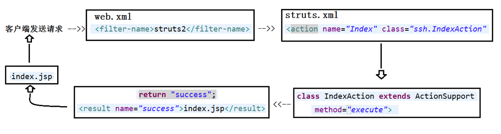

解析：客户端发送请求（HttpServletRequest）到服务器，服务器接收到请求就先进入web.xml配置文件看看有没有配置过滤器，发现有有Struts2的过滤器，然后找到struts.xml配置文件，struts.xml配置文件里定义一个action，然后就去找到action类，此类继承ActionSupport接口，并且实现了execute()方法，返回一个字符串“success”给struts.xml配置文件，struts.xml配置文件的action会默认调用action类的execute()方法，result接收到返回的字符串，result就会调用你指定的jsp页面将结果呈现，最后响应给客户端。

（3）Struts2的优势

实现了MVC模式，层次结构清晰，使程序员只需要关注业务逻辑的实现。

丰富的标签库，大大提高了开发的效率。

Struts2提供丰富的拦截器实现。

通过配置文件，就可以掌握整个系统各个部分之间的关系。

异常处理机制，只需在配置文件中配置异常的映射，即可对异常做响应的处理。

Struts2的可扩展性高。

面向切面编程的思想在Struts2中也有了很好的体现。

体现了拦截器的使用，拦截器是一个一个的小功能模块，用户可以将这些拦截器合并成一个大的拦截器，这个合成的拦截器就像单独的拦截器一样，只要将它配置到一个Action中就可以。

（4）Struts2的缺点：

校验较繁琐，多字段出错返回不同。

安全性太低

获取传参时较麻烦

### 1-2、Spring

spring是一个开源开发框架，是一个轻量级控制反转(IoC)和面向切面(AOP)的容器框架。

spring主要用来开发java应用，构建J2EE平台的web应用。其核心就是提供一种新的机制管理业务对象及其依赖关系。

（2）spring的流程图

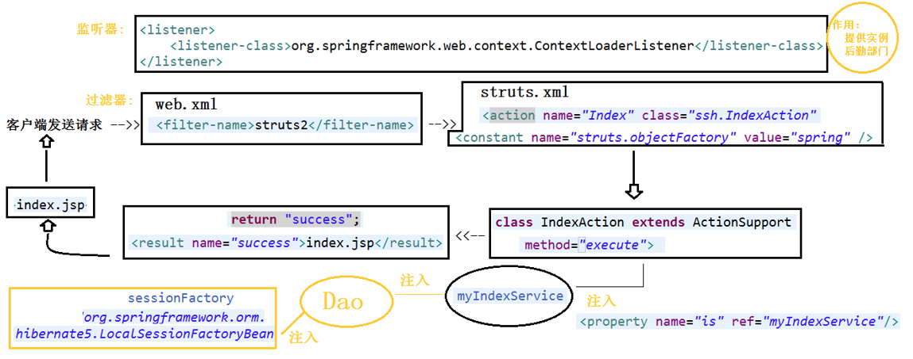

解析：上面是在Struts结构图的基础上加入了spring流程图，在web.xml配置文件中加入了spring的监听器，在struts.xml配置文件中添加

```xml
“<constant name="struts.objectFactory" value="spring" />”
```

是告知Struts2运行时使用spring来管理对象，spring在其中主要做的就是注入实例，所有需要类的实例都由spring管理。

（3）spring的优点

容器：spring是一个容器，包含并管理对象的生命周期和配置。可以配置每个bean如何被创建，基于一个可配置原型prototype，你的bean可以创建一个单独的实例或者每次需要时都生成一个新的实例。

支持AOP：spring提供对AOP的支持，它允许将一些通用任务，如安全、事物、日志等进行集中式处理，从而提高了程序的复用性。

轻量级框架：spring是轻量级框架，其基本的版本大约2M。

控制反转：spring通过控制反转实现松耦合。对象们给他们依赖，而不是对象本身，方便解耦，简化开发。

方便程序测试：spring提供了Junit4的支持，可以通过注解方便的测试spring程序。

降低java EE API的使用难度：spring对java EE开发中非常难用的一些API（比如JDBC），都提供了封装，使这些API应用难度大大降低。

方便集成各种优秀框架：spring内部提供了对各种优秀框架（如Struts、mybatis）的直接支持。

支持声明式事务处理：只需要通过配置就可以完成对事务的管理，而无须手动编程。

（4）spring的缺点

依赖反射，反射影响进程。

太过于依赖设计模式。

控制器过于灵活。

不支持分布式应用。


### 1-3、hibernate

（1）基本概念

Hibernate是一个开放源代码的对象关系映射框架，它对JDBC进行了非常轻量级的对象封装，它将POJO与数据库表建立映射关系，是一个全自动的orm框架，hibernate可以自动生成SQL语句，自动执行，使得Java程序员可以随心所欲的使用对象编程思维来操纵数据库。 Hibernate可以应用在任何使用JDBC的场合，既可以在Java的客户端程序使用，也可以在Servlet/JSP的Web应用中使用，最具革命意义的是，Hibernate可以在应用EJB的J2EE架构中取代CMP，完成数据持久化的重任。

（2）hibernate的核心构成和执行流程图

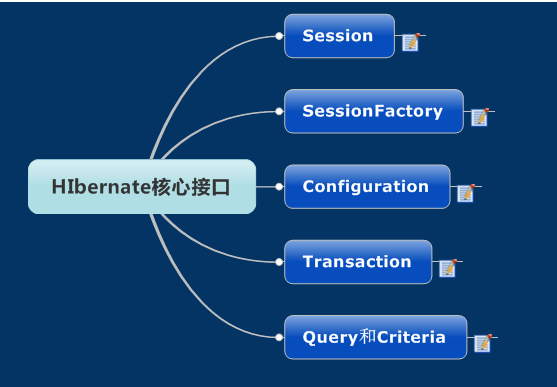

（3）hibernate的优点

对JDBC访问数据库的代码做了封装，大大简化了数据访问层繁琐的重复性代码。

Hibernate是一个优秀的ORM实现。他很大程度的简化DAO层的编码工作，将软件开发人员从大量相同的数据持久层相关编程工作中解放出来，使开发更对象化了。

透明持久化（persistent）带有持久化状态的、具有业务功能的单线程对象，此对象生存期很短。这些对象可能是普通的javabeans/POJO，（POJO概念，plain ordinary java object，简单的java对象，可以简单理解为简单的实体类entity。）这个对象没有实现第三方框架或接口，唯一特殊的是他们正与session关联。一旦这个session被关闭，这些对象就会脱离持久化状态，这样就可被应用程序的任何层自由使用。

事务transaction应用程序用来指定原子操作单元范围的对象，它是单线程的，生命周期很短。它通过抽象将应用从底层具体的JDBC、JTA（java transaction API，JTA允许应用程序执行分布式事务处理，在两个或多个网络计算机资源访问并且更新数据，JDBC驱动程序的JTA支持极大地增强了数据访问能力）以及CORBA（公用对象请求代理程序体系结构，common object request broker architecture，简而言之，CORB允许应用程序和其它的应用程序通讯）事务隔离开。某些情况下，一个session之内可能包含多个transaction对象，事务边界的开启与关闭时必不可少的。

它没有侵入性，是轻量级框架。

移植性好，支持各种数据库，如果换个数据库只要在配置文件中变换配置就可以了，不用改变hibernate代码。

缓存机制，提供一级缓存和二级缓存。

一级缓存：是session级别的缓存，一个session做了一个查询操作，它会把这个操作的结果放到一级缓存中，如果短时间内这个session又做了同一个操作，那么hibernate直接从一级缓存中拿出，而不会去连数据库取数据。

二级缓存：是sessionFactory级别的缓存，就是查询的时候会把结果缓存到二级缓存中，如果同一个sessionFactory创建的某个session执行了相同的操作，hibernate就会从二级缓存中拿出结果，而不会再去连接数据库。

（4）hibernate的缺点

持久层封装过于完整，导致开发人员无法对SQL进行优化，无法灵活应用原生SQL。

批量数据处理的时候较为弱势。

框架中使用ORM原则，导致配置过于复杂，遇到大项目，维护问题不断。


## 二、SSM框架

SSM架构，是三层结合所成的框架，分别是Spring、SpringMVC、MyBatis所组成。Spring依赖注入来管理各层，面向切面编程管理事务，日志和权限。SpringMVC代表了model、view、controller接收外部请求，进行开发和处理。mybatis是基于jdbc的框架，主要用来操作数据库，并且将业务实体和数据表联系起来。

### 2-1、spring

详细介绍见SSH中spring。

### 2-2、SpringMVC

（1）基本概念

属于spring框架的一部分，用来简化MVC架构的web应用程序开发。

（2）SpringMVC的优点

拥有强大的灵活性，非侵入性和可配置性

提供了一个前端控制器dispatcherServlet，开发者无需额外开发控制器对象

分工明确，包括控制器、验证器、命令对象、模型对象、处理程序映射视图解析器，每一个功能实现由一个专门的对象负责完成

可以自动绑定用户输入，并正确的转换数据类型

可重用的业务代码：可以使用现有的业务对象作为命令或表单对象，而不需要去扩展某个特定框架的基类。

（3）SpringMVC的缺点

servlet API耦合难以脱离容器独立运行

太过于细分，开发效率低


### 2-3、mybatis

（1）基本概念

mybatis是一个简化和实现了java数据持久层的开源框架，它抽象了大量的JDBC冗余代码，并提供了一个简单易用的API和数据库交互。

（2）mybatis的优点

与JDBC相比，减少了50%以上的代码量。

mybatis是最简单的持久化框架，小巧并且简单易学。

mybatis灵活，不会对应用程序或者数据库的限售设计强加任何影响，SQL写在XML里，从程序代码中彻底分离，降低耦合度，便于统一管理和优化，可重用。

提供XML标签，支持编写动态SQL语句（XML中使用if,else）。

提供映射标签，支持对象与数据库的ORM字段关系映射（在XML中配置映射关系，也可以使用注解）

（3）mybatis的缺点

SQL语句的编写工作量较大，对开发人员的SQL语句编写有一定的水平要求。

SQL语句过于依赖数据库，不能随意更换数据库。

拼接复杂SQL语句时不灵活。


## 三、Springboot框架

### 1、springboot基本概念

springboot是一个全新的框架，简化Spring的初始搭建和开发过程，使用了特定的方式来进行配置，让开发人员不再需要定义样板化的配置。此框架不需要配置xml，依赖于maven这样的构建系统。

### 2、Springboot的优点
（1）减少了大量的开发时间并提高了生产力

（2）避免了编写大量的样板代码，注释和XML配置

（3）解决了spring的弊端

（4）代码少了、配置文件少了、不需要对第三方框架烦恼了、项目精简了，对整个团队的开发和维护来说，更大的节约了成本。

### 3、springboot的缺点
（1）修复bug较慢，报错时难以定位。

（2）集成度较高，不易于了解底层。

### 4、springboot总结
简单、快速、方便的搭建项目；对主流开发框架的无配置集成；极大提高了开发、部署效率。

### 5、springboot和spring的区别

（1）springboot可以建立独立的spring应用程序。

（2）内嵌了如tomcat，Jetty和Undertow这样的容器，也就是说可以直接跑起来，用不着再做部署工作。

（3）无需再像spring那样写一堆繁琐的XML配置文件

（4）可以自动配置spring

（5）提供的POM可以简化maven的配置

### 6、springboot和springMVC的区别

（1）SpringMVC是基于spring的一个MVC框架。

（2）springboot的基于spring的条件注册的一套快速开发整合包。
