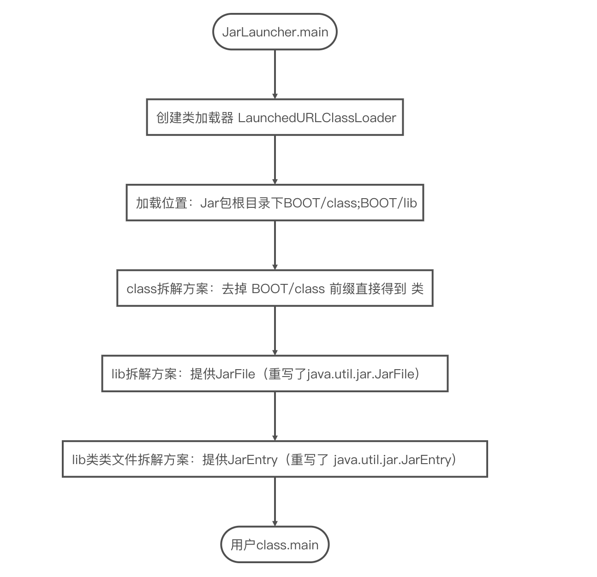

## 一、Jar包介绍


### 1.1 jar包定义

jar（Java Archive File），是 Java 的一种文档格式，是一种与平台无关的文件格式，可将多个文件合成一个文件。我们可以理解jar 是一种特殊的zip文件，所以叫它文件包。

java项目中，往往有很多的class文件，分布在各层目录中，不方便管理和执行，jar可以将所有文件（包括.class文件和其他文件）都打成一个jar文件，这样一来，无论是备份，还是发布，简单多了。

jar 与 zip 唯一的区别就是在 jar 文件的内容中，包含了一个 META-INF/MANIFEST.MF 文件，该文件是在生成 jar 文件的时候自动创建的，作为jar里面的"详情单"，包含了该Jar包的版本、创建人和类搜索路径Class-Path等信息，当然如果是可执行Jar包，会包含Main-Class属性，表明Main方法入口，尤其是较为重要的Class-Path和Main-Class，咱们一会在后续的内容里面会进行详细地讲解。

此外，值得注意的是，因为jar包主要是对class文件进行打包，而java编译生成的class文件是平台无关的，这就意味着jar包是跨平台的，所以不必关心涉及具体平台的问题。

### 1、2 jar包中的内容

咱们来看看最普通的一个带有静态页面的springboot项目jar里面的内容，就会发现解压出来的

jar并不简单，为了贴近实际咱们未做任何删减，可以看到有很多东西
只需要运行如下指令，就能看到jar里面的内容（调用jar指令的前提是已经配置了jdk的环境变量）

```

jar -tf springbootdemo-0.0.1-SNAPSHOT.jar

```

其中-tf 后接的jar就是我们要查看的jar,我们可以看到解压后的jar包内容如下：

```xml
META-INF/
META-INF/MANIFEST.MF
org/
org/springframework/
org/springframework/boot/
org/springframework/boot/loader/
org/springframework/boot/loader/util/
org/springframework/boot/loader/PropertiesLauncher$ArchiveEntryFilter.class

......

org/springframework/boot/loader/jar/JarFileEntries$1.class
org/springframework/boot/loader/LaunchedURLClassLoader$UseFastConnectionExceptionsEnumeration.class

BOOT-INF/
BOOT-INF/classes/
BOOT-INF/classes/static/

BOOT-INF/classes/static/js/index.js
BOOT-INF/classes/com/imooc/springbootdemo/web/DemoController.class
BOOT-INF/classes/com/imooc/springbootdemo/SpringbootdemoApplication.class
BOOT-INF/classes/application.properties
META-INF/maven/com.imooc/springbootdemo/pom.xml
BOOT-INF/classes/static/css/index.css
META-INF/maven/com.imooc/springbootdemo/pom.properties
BOOT-INF/classes/static/pages/index.html
BOOT-INF/classes/static/img/cert.png
BOOT-INF/lib/
BOOT-INF/lib/spring-boot-starter-web-2.1.8.RELEASE.jar
BOOT-INF/lib/spring-boot-starter-2.1.8.RELEASE.jar
BOOT-INF/lib/spring-boot-2.1.8.RELEASE.jar
BOOT-INF/lib/spring-boot-autoconfigure-2.1.8.RELEASE.jar

......

BOOT-INF/lib/spring-jcl-5.1.9.RELEASE.jar
```

大致看看里面的东西我们可以发现，除了.MF以及.class文件之外，jar还能打包静态资源文件如.html、.css以及.js等项目所需的一切，这也就意味着咱们能将自己的项目打成jar，即不管是web应用还是底层框架，都能打成jar包。


### 1.3 jar包和war包的区别

war包是Sun提出的一种web应用程序格式，与jar类似，是很多文件的压缩包

war包中的文件按照一定目录结构来组织。根据其根目录下包含有html和jsp文件，或者包含有这两种文件的目录，另外还有WEB-INF目录。通常在WEB-INF目录下含有一个web.xml文件和一个classes目录，web.xml是这个应用的配置文件，而classes目录下则包含编译好的servlet类和jsp，或者servlet所依赖的其他类（如JavaBean）。通常这些所依赖的类也可以打包成jar包放在WEB-INF下的lib目录下。

war是一个可以直接运行的web模块，通常应用于web项目中，将其打成war包部署到Tomcat等容器中。以大家熟悉的Tomcat举例，将war包放置在tomcat根目录的webapps目录下，如果Tomcat成功启动，这个包就会自动解压，就相当于发布了。

目前，war相较于jar的唯一优势在于，就拿tomcat来讲，当tomcat的进程启动之后，将符合规范的war包放在tomcat的webapps目录下的时候，tomcat会自动将war包解压并对外提供web服务，而jar包则不行。

war能自动被解压

过去由于并未通过微服务将机器资源进行隔离，因此提倡的是一个tomcat实例管理多个java web项目，因此对于java web项目，都提倡将其打成war包然后放置于同一个tomcat的webapps下进行管理，便于资源的统一利用。而随着微服务成为主流，同一台机器上的多个web服务可以通过docker等容器进行隔离，因此我们可以让每个容器都单独运行一个tomcat实例，每个tomcat实例独立运行一个web服务，换句话说，我们可以像springboot一样，将tomcat和web项目打成jar放在一起，以内嵌的方式来启动web服务，使得所有服务的启动方式更优雅和统一，不管是Web服务还是后台服务，均使用java -jar指令来启动。

## 二、jar包如何执行

有的jar包是可以直接通过 java -jar 指令来执行的。我们都知道，有的类之所以能够执行，是因为它用你有main函数，该函数是程序的入口，同理，可执行的jar包中肯定是有某个.class文件提供了main函数才使得其可执行。那么问题来了，一个jar里面可能存在多个.class文件都有main函数的情况，我怎么知道该执行哪个？其实答案非常简单，就是看前面说的MANIFEST.MF里面的Main-Class属性，它会指定函数入口，相关知识咱们会在执行jar的时候进行讲解。

## 三、jar命令介绍

jar 命令是随jdk 自动安装的,在 jdk 安装目录的 bin 目录中,我们可能需要先将 tools.jar配置到classpath环境变量中,才能正常使用.(关于为什么需要配置环境变量才能使用,在文末会给出解释),下面让我们了解一下常用的 jar 命令吧!

### 3.1.创建JAR 文件

```
jar cvf test.jar test

```

-c 创建，

-v 显示创建过程文件的详细信息

cf 参数是必须的.


该命令的意思是将 test 目录下的所有文件打包成一个 test.jar文件,如果 test.jar 文件已经存在则覆盖. 

### 3.2.查看 JAR 文件内容列表

```
jar tvf test.jar

```

-t 显示列表 ,

-v 显示文件的详细信息,如果不想显示详细信息可去掉参数 v,

tf参数是必须的. 

当 jar 包文件特别多的时候，我们可以使用命令 jar tvf test.jar > a.txt 将列表结果保存在 a.txt 文本中进行查看.

### 3.3.解压JAR 文件

```
jar xvf test.jar

```

-v,显示详细解压缩信息

将 test.jar 文件解压到当前的目录下,加上参数 

### 3.4.更新 JAR 文件

```
jar uvf test.jar Hello.class

```

如果已经存在该文件,则替换该文件,如果不存在则添加该文件.


## 四、如何打jar包 jar的依赖如何处理 如何调用

关于如何打jar包，应对不同的情况，可以有很多种方式，这里通过讲解应对主流需求的打包方式来让大家明白如何打jar包，其他的方式大家可以在课下触类旁通进行学习。

### 1、含有多个类的jar，类之间存在调用关系** 

咱们先创建一个java项目，编写两个非常简单的类，Welcome.java和Teacher.java，其中Welcome类在main函数里调用了Teacher类的静态方法greeting

```java
Welcome.java
package com.imooc.jardemo1;

import com.imooc.jardemo1.impl.Teacher;

public class Welcome {
    public static void main(String[] args) {
        Teacher.greeting();
    }
}

Teacher.java
package com.imooc.jardemo1.impl;

public class Teacher {
    public static void greeting(){
        System.out.printf("Welcome!");
    }
}
```

编写完成后，在命令行里，去到项目的src路径下，执行javac指令

**javac com/imooc/jardemo1/Welcome.java**


此时就会生成与这两个类相对应的.class字节码文件

由于jvm实际解析的是.class字节码文件而非.java文件，且jar中最好不要包含代码源文件，我们来将.class文件打个jar包，在src根目录下执行如下指令

**jar -cvf welcome.jar com/imooc/jardemo1/Welcome.class com/imooc/jardemo1/impl/Teacher.class**

c表示要创建一个新的jar包，v表示创建的过程中在控制台输出创建过程的一些信息，f表示给生成的jar包命名。执行后便会生成一个welcome.jar的文件。


接下来便是如何执行上面的welcome.jar了，非常简单，只需要执行如下指令

**java -jar welcome.jar**
r
就会发现，事情果然没有这么简单，报错了：）


通过异常信息我们不难看出，这是和先前咱们说过的MANIFEST.Mf这个主清单属性相关的，此时我们查看一下welcome.jar里面的内容，通过指令

jar -tf welcome.jar
就会发现我们之前打jar的时候，会生成一个META-INF的目录，里面有MANIFEST.MF这个清单列表


将welcome.jar拷贝到新建的文件夹myjar下面，用解压缩软件或者unzip指令解压，并打开MANIFEST.MF，就会发现文件里有如下内容

Manifest-Version: 1.0
Created-By: 11 (Oracle Corporation)

我们发现，缺少咱们先前说的Main-Class属性，导致jar被执行的时候，不知道执行哪个main函数。因此我们需要加上Main-Class，后接main函数所在类的全路径名（注意冒号之后一定要跟英文的空格，整个文件最后有一行空行）

 Manifest-Version: 1.0
 Created-By: 11 (Oracle Corporation)
 Main-Class: com.imooc.jardemo1.Welcome
 
添加完成后，重新执行指令打包，这次咱们在打包指令里多加一个参数，即多传入修改完成后的MANIFEST.MF文件

**jar -cvfm welcome.jar META-INF/MANIFEST.MF  com/imooc/jardemo1/Welcome.class com/imooc/jardemo1/impl/Teacher.class**

其中多了一个参数m，表示要定义MANIFEST文件。之后再重新执行

**java -jar welcome.jar**

就会发现jar已成功执行

有的同学会说有没有更简便点的方式，因为每次打jar的时候都要指定所有class文件。确实是有的，大家可以尝试一下，直接在src根目录下执行

**javac com/imooc/jardemo1/Welcome.java -d target**

该命令表示，将所有编译后的.class文件，都放到src/target文件夹下

再将先前修改好的META-INF文件夹整体复制或者移动到target/下，去到target目录，直接执行

**jar -cvfm welcome.jar META-INF/MANIFEST.MF * ** 

即可完成打包，注意最后一个位置变成了*，表示把当前目录下所有文件都打在jar包里。
此外，还有一种更简单的也更灵活的方式，不需要修改META-INF/MANIFEST.MF，即不需要指定main函数，而通过如下指令来动态指定

** java -cp welcome.jar com.imooc.jardemo1.Welcome**

其中cp表示classpath，后面接上全限的main函数所在的类即可


此种方式虽然灵活，但是由于不需要在MANIFEST.MF里面标注执行函数以及后面要将的Class-Path，需要调用方充分熟悉jar及其内部构造，否则需要在MANIFEST.MF以及相关的使用说明文档里描述清楚。

### 2、含有多个jar，jar之间存在调用关系**

咱们还是跟刚刚的项目一样，只是这次将Teacher.class和Welcome.class打成两个jar，并且为了避免IDE报错，咱们直接手写java类，创建一个jardemo2目录，进到目录里，再创建一个src目录，再进入到src目录里，创建按照package的形式创建深层的文件夹com/imooc/jardemo2，之后在jardemo2里面创建Welcome.java，跟先前类似

```java
package com.imooc.jardemo2;

import com.imooc.jardemo1.impl.Teacher;

public class Welcome {
    public static void main(String[] args) {
        Teacher.greeting();
    }
}
```

唯一的区别是package从com.imooc.jardemo1变成了com.imooc.jardemo2，但是仍然引用的是jardemo1里面的Teacher，com.imooc.jardemo1.impl.Teacher。
如果此时直接在src目录下执行

**javac  com/imooc/jardemo2/Welcome.java -d target/ **


必然会报错，提示Teacher找不到

为了保证编译通过，除了把Teacher连同其文件目录结构一同复制过来之外，咱们还可以在原先的jardemo1项目里给Teacher.class打个jar，即在jardemo1/src目录下执行

**javac com/imooc/jardemo1/impl/Teacher.java -d target2/**

随后去到target2文件夹里将里面的信息打个jar包

**jar -cvf teacher.jar * **


将生成好的jar复制粘贴到jardemo2项目的lib目录底下（需要先创建好lib目录，其位于jardemo2根目录下，与src同级）
随后来到src目录下，执行

**javac -cp ../lib/teacher.jar com/imooc/jardemo2/Welcome.java -d target**

便会发现Teacher.java会被成功编译，相关的class文件以及package对应的目录均被放置在src/target目录底下，这里的 -cp 表示 -classpath，指的是把teacher.jar加入classpath路径下

此时咱们在target目录底下创建好META-INF/MANIFEST.MF，并写入以下内容

Manifest-Version: 1.0
Created-By: 11 (Oracle Corporation)
Main-Class: com.imooc.jardemo2.Welcome


然后在target里打jar包

**jar -cvfm welcome.jar META-INF/MANIFEST.MF * **


就会发现相关的jar已经被打包成功，咱们是无法直接调用jar的

还是报找不到Teacher这个类的错误，原因是因为咱们打包的jar里面并为包含Teacher.class，大家不信可以解压出来看看就知道了。

那该如何解决呢，其实思路非常简单，我们只需要跟javac -cp一样，将teacher.jar加入到classpath里即可，如何实现呢？此时我们便需要了解MANIFEST.MF的另外一个属性Class-Path了，这个属性看名字就知道是用来指定CLASSPATH的，CLASSPATH是指定程序中所使用的类文件所在的位置，相信咱们在编写项目的时候，经常也会接触到这个词，此时我们需要修改target里面的META-INF/MANIFEST.MF文件，添加Class-Path属性，指定相对当前的执行路径，即target，teacher在什么路径下（如果是多个jar，则用英文空格隔开）。

```xml
Manifest-Version: 1.0
Created-By: 11 (Oracle Corporation)
Main-Class: com.imooc.jardemo2.Welcome
Class-Path: ../../lib/teacher.jar
```

修改好之后，重新打jar

** jar -cvfm welcome.jar META-INF/MANIFEST.MF *  **

之后再执行jar包，就会发现执行成功了

当然，更快捷的方式还是通过现在的java -cp指令来执行


### 3、读取jar内的资源文件

这种情况就是在普通的java项目内部创建一个资源文件并读取，由于实际和资源文件都打包在了一块，可以直接调用。像这里，如果在根目录下执行jar包的main函数时，main函数有如下指令

**InputStream is = Welcome.getClass().getResourceAsStream("static/text.txt");**

则便能获取到项目根目录static/下面的text.txt的信息。

### 4、读取jar外的资源文件

这种情况更简单，指明需要去读取的路径即可。像这里，如果在根目录下执行jar包的main函数时，main函数有如下指令

InputStream is = new FileInputStream("/home/work/outside/text.txt");
则便能获取到/home/work/outside/text.txt绝对路径下的text.txt内容。

### 5、读取外部jar包里的资源文件

结合前面的第2，3种情况，咱们可以先指定MANIFEST.MF里的Class-Path为所要读取的jar包所在的路径，之后和第3种情况一样访问目标jar中的资源文件即可。

### 6、访问Jar包内部的Jar包资源

接着jardemo2，咱们把teacher.jar从src/lib复制一份，粘贴到target里，同时将target里的welcome.jar删除，

随后将META-INF/MANIFEST.MF里的Class-Path给去了，因为现在我们想把teacher.jar打包进welcome.jar里面，并希望teacher.jar能够自动被调用。

```xml
Manifest-Version: 1.0
Created-By: 11 (Oracle Corporation)
Main-Class: com.imooc.jardemo2.Welcome
```

重新打包成welcome.jar

随后执行welcome.jar，便发现会报错

当项目中咱们把所需要的第三方jar包也打进自己的jar包中时，如果仍然按照上述操作方式，会报找不到Class异常，原因就是jar引用不到放在自己内部的jar包。咱们尝试重新加入Class-Path

```xml
Manifest-Version: 1.0
Created-By: 11 (Oracle Corporation)
Main-Class: com.imooc.jardemo2.Welcome
Class-Path: teacher.jar
```

再次打包后，将target目录下的teacher.jar删除并执行，会发现，依旧不能执行成功


这下坏了，无论怎么尝试都访问不到jar里的jar，该如何是好？此时就需要适当地深入去分析其中的奥秘。我们都知道，执行jar其实也就是执行里面的class，而class之所以能够被执行，前提提交是被classloader加载到内存当中，而目前如何加载内部jar的问题也就简化到了如何让classloader加载这些存在于内部jar里的class。

咱们首先来了解下classloader的加载机制，这个在我的面试课程中提到过。
主要是研究其双亲委派机制，这里限于篇幅，大致讲解一下jar的运行过程。jar 运行过程和类加载机制有关，而类加载机制又和我们自定义的类加载器有关，现在我们先来了解一下双亲委派模式。

java 中类加载器分为三个：

BootstrapClassLoader 负责加载 ${JAVA_HOME}/jre/lib 部分 jar 包

ExtClassLoader 加载 ${JAVA_HOME}/jre/lib/ext 下面的 jar 包

AppClassLoader 加载用户自定义 -classpath 或者 Jar 包的 Class-Path 定义的第三方包

类的生命周期为：加载（Loading）、验证（Verification）、准备(Preparation)、解析(Resolution)、初始化(Initialization)、使用(Using) 和 卸载(Unloading)七个阶段。


当我们执行 java -jar 的时候 jar 文件以二进制流的形式被读取到内存，但不会加载到 jvm 中，类会在一个合适的时机加载到虚拟机中。类加载的时机：

遇到 new、getstatic、putstatic 或 invokestatic 这四条字节码指令时，如果类没有进行过初始化，则需要先对其进行初始化。这四条指令的最常见的 Java 代码场景是使用 new 关键字实例化对象的时候，读取或设置一个类的静态字段调用一个类的静态方法的时候。
使用 java.lang.reflect 包的方法对类进行反射调用的时候，如果类没有进行过初始化，则需要先触发其初始化。

当初始化一个类的时候，如果发现其父类还没有进行过初始化，则需要先触发其父类的初始化。

当虚拟机启动时，用户需要指定一个要执行的主类（包含 main() 方法的那个类），虚拟机会先初始化这个主类。

当触发类加载的时候，类加载器也不是直接加载这个类。首先交给 AppClassLoader ，它会查看自己有没有加载过这个类，如果有直接拿出来，无须再次加载，如果没有就将加载任务传递给 ExtClassLoader ，而 ExtClassLoader 也会先检查自己有没有加载过，没有又会将任务传递给 BootstrapClassLoader ，最后 BootstrapClassLoader 会检查自己有没有加载过这个类，如果没有就会去自己要寻找的区域去寻找这个类，如果找不到又将任务传递给 ExtClassLoader ，以此类推最后才是 AppClassLoader 加载我们的类。这样做是确保类只会被加载一次。通常我们的类加载器只识别 classpath （这里的 classpath 指项目根路径，也就是 jar 包内的位置）下 .class 文件。jar 中其他的文件包括 jar 包被当做了资源文件，而不会去读取里面的 .class 文件。但实际上我们可以通过自定义类加载器来实现一些特别的操作。

学到这里，我们便大致明白，之前咱们这样的做法是使用AppClassloader来加载相关jar里面的class的，而在加了-jar参数之后，AppClassloader就只关注welcome.jar范围内的class了，注意这里说的是class，并不包含内部的jar，其内部的jar此时相当于是前面说的内部资源文件，是以二进制流的形式存在的，因此，此时是访问不到内部jar文件的。那该如何是好？其实，这里的线索已经很充足了，我们其实就是用自定义的classloader来发现并获取其内部jar里的class即可。自定义ClassLoader需要继承ClassLoader抽象类，重写findClass方法，这个方法定义了ClassLoader查找class的方式。前面提到，Java 本身支持访问Jar包里面的资源， 他们以 Stream 的形式存在（他们本就处于Jar包之中），而Jar文件被描述为JarFile， 里面的资源文件被描述为JarEntry，可以通过判断JarEntry的Jar属性使得直接访问Jar包内部的Jar包，这里给出一些关键的程序语句以及思路。
首先我们可以以前面静态访问jar内部资源文件的方式访问jar

```java
　　　InputStream stream = 
　　　　 ClassLoader.getSystemResourceAsStream(name); 
其中name可以通过遍历jar里面的内容获取到，并且能够过滤出以.jar结尾的文件名并读取
获取到InputStream之后，可以将其转换为File（网上很多教程），而后转换成JarFile

　　　 JarFile jarFile = new JarFile(file); 
获取到了jarFile之后，便能获取到jar里面的信息并进行后续的操作了，

 Enumeration enum = jarFile.entries(); 
　　 while (enum.hasMoreElements()) { 
　　　 process(enum.nextElement()); 
　　 } 
```

后续的操作无非就是获取到class二进制流并传递给classloader defineClass去定义并做后续加载（能实现的前提是你了解自定义类加载器的工作原理）

上述过程比较复杂，如果希望直接在自己的类里面访问引用在 Jar包中的Jar包， 可以使用Spring Boot打包插件。强烈推荐该方案， 适用于所有的jar项目，主要通过maven打包
pom.xml

```xml
<plugin>
    <groupId>org.springframework.boot</groupId>
    <artifactId>spring-boot-maven-plugin</artifactId>
    <executions>
        <execution>
            <goals>
                <goal>repackage</goal>
            </goals>
        </execution>
    </executions>
</plugin>
```

具体过程就靠大家去研究了。这里大致讲解下Springboot的Jar包内的类加载原理。咱们可以尝试打包一个最简单的springboot jar包，查看META-INF/MANIFEST.MF中的Main-Class，就会发现是Spring Boot的自定义类org.springframework.boot.loader.JarLauncher。

其加载原理则是通过自定义类加载器LaunchedURLClassLoader实现类加载。 


