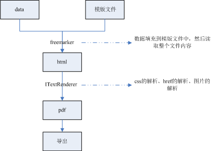

# 一、基本组件介绍

## 1.1 iText

iText是Java中用于创建和操作PDF文件的开源库。它是由Bruno Lowagie、Paulo Soares等人编写的。iText可以实现的功能：

* 从XML文件或数据库来动态生成PDF文档

* 为浏览器生成PDF文档

* 利用PDF的许多互动功能

* 添加书签、页码、水印、条形码等

* 分割、拼接和处理PDF页面

* 自动填写PDF表单

* 给PDF文件添加数字签名

## 1.2 Flying Saucer PDF Rendering 

Flying Saucer 用基于iText5之上，用纯Java编写的的一个开源pdf库，可以将 XML/XHTML 应用 CSS2.1 样式渲染为 PDF、图片。此库基本上能实现 CSS 2.1 的整体性， 并且完全符合 W3C 规范。

其优点在于对于html的格式支持和中文字体的支持，包括换行、css格式、字体等的处理。

项目在github上的地址：https://github.com/flyingsaucerproject/flyingsaucer

## 1.3 freemarker

freemarker是一个html的渲染工具，可以根据模板用数据替换模板中的变量，生成动态的html网页。

## 1.4 java中生成pdf的方案

java项目中生成pdf的一个比较合理的实现方案是用freemarker生成html，然后由flying saucer将html生成为pdf。

## 二、Freemarker生成html

## 三、html生成PDF
<!-- https://mvnrepository.com/artifact/org.xhtmlrenderer/flying-saucer-pdf-itext5 -->
<dependency>
    <groupId>org.xhtmlrenderer</groupId>
    <artifactId>flying-saucer-pdf-itext5</artifactId>
    <version>9.1.22</version>
</dependency>

