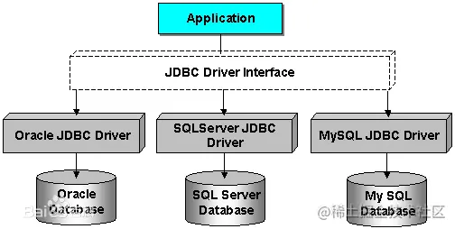
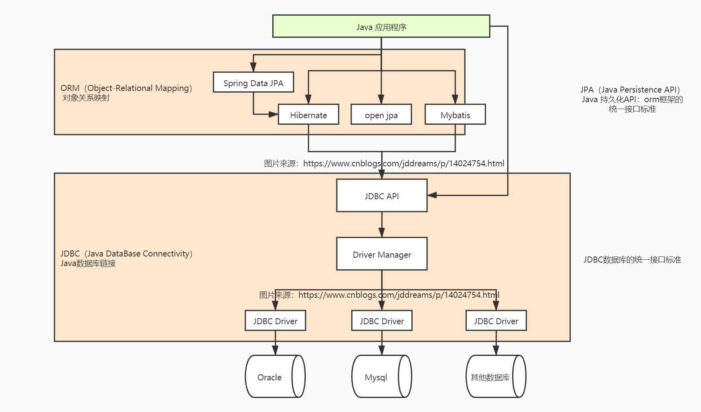

## JDBC

什么是JDBC？JDBC是Java DataBase Connectivity的缩写，它是Java程序访问数据库的标准接口。

JDBC（Java Data Base Connectivity）即Java数据库连接，官方解释它是Java编程语言和广泛的数据库之间独立于数据库的连接标准的Java API，根本上说JDBC是一种规范，它提供的接口，一套完整的，允许便捷式访问底层数据库。简单说它就是JAVA与数据库的连接的桥梁或者插件，用JAVA代码就能操作数据库的增删改查、存储过程、事务等。

使用Java程序访问数据库时，Java代码并不是直接通过TCP连接去访问数据库，而是通过JDBC接口来访问，而JDBC接口则通过JDBC驱动来实现真正对数据库的访问。

例如，我们在Java代码中如果要访问MySQL，那么必须编写代码操作JDBC接口。注意到JDBC接口是Java标准库自带的，所以可以直接编译。而具体的JDBC驱动是由数据库厂商提供的，例如，MySQL的JDBC驱动由Oracle提供。因此，访问某个具体的数据库，我们只需要引入该厂商提供的JDBC驱动，就可以通过JDBC接口来访问，这样保证了Java程序编写的是一套数据库访问代码，却可以访问各种不同的数据库，因为他们都提供了标准的JDBC驱动：

## JPA（Java Persistence API）

Java对象持久化的 API。是SUN公司推出的一套基于ORM的规范，通过注解或者XML描述【对象-关系表】之间的映射关系，并将实体对象持久化到数据库中。JPA规范本质上就是一种ORM规范，注意不是ORM框架——因为JPA并未提供ORM实现，它只是制订了一些规范，提供了一些编程的API接口，但具体实现则由服务厂商来提供实现。JPA是为了让面向对象设置的，为了不写sql语句而设置的。

优点：数据库移植快，一级二级缓存，查询，提高性能（ehcache框架实现缓存）
缺点：查询所有的时候，find性能无法控制，无法干预sql语句的生成，对sql语句要求高的话

是对象关系映射的标准。这是一种允许在代码和数据库表中的对象之间进行映射的技术。这可以从开发人员那里“隐藏”SQL，以便他们处理的所有内容都是Java类，并且提供程序允许保存它们并以神奇的方式加载它们。大多数情况下，XML映射文件或getter上的注释，setter可用于告知JPA提供程序，对象上的哪些字段映射到DB中的哪些字段。最着名的JPA提供者是Hibernate，因此是开始具体示例的好地方。

## ORM（Object-Relational Mapping）

对象关系映射。简单的说：ORM就是建立实体类和数据库表之间的关系，从而达到操作实体类就相当于操作数据库表的目的。
优点：减少重复性代码。

常见的orm框架有：
Hibernate、spring data jpa、open jpa

Hibernate
Hibernate是一个开源的对象关系映射框架，它对JDBC进行了非常轻量级的对象封装，它将POJO与数据库表建立映射关系，是一个全自动的orm框架，hibernate可以自动生成SQL语句，自动执行，使得Java程序员可以使用面向对象的思维来操纵数据库。是一种JPA实现。

## 数据库访问框架介绍

Hibernate：是JPA的一种实现，是一个框架

Spring Data JPA：对JPA规范的再次抽象，底层使用Hibernate实现

Spring Data JDBC： jdbcTemplate模板数据库简化对数据库的操作，相比传统JDBC而言省去了，数据库驱动，连接等无关配置，只需要写sql，设置参数

Mybatis：是一个持久化框架，但不完全是一个orm框架，不是依照的jpa规范，她需要些sql语句，半ORM。

