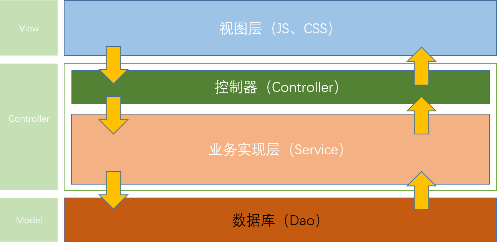
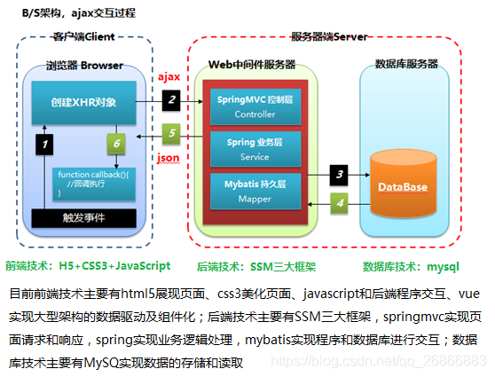

## Java web开发的层级结构

### 一、MVC层级结构

java web开发，一般分为View，Controller，Model三层架构。

对应于开发中的实际架构：

### 二、Controller、Service和Dao的解释

#### controller层

Controler负责请求转发，接受页面过来的参数，传给Service处理，接到返回值，再传给页面。

controller层负责具体的业务模块流程的控制，在此层要调用service层的接口来控制业务流程，控制的配置也同样是在Spring的配置文件里进行，针对具体的业务流程，会有不同的控制器。我们具体的设计过程可以将流程进行抽象归纳，设计出可以重复利用的子单元流程模块。这样不仅使程序结构变得清晰，也大大减少了代码量。

#### service层：服务层

粗略的理解就是对一个或多个DAO进行的再次封装，封装成一个服务，所以这里也就不会是一个原子操作了，需要事物控制。

service层主要负责业务模块的应用逻辑应用设计。同样是首先设计接口，再设计其实现类，接着再Spring的配置文件中配置其实现的关联。这样我们就可以在应用中调用service接口来进行业务处理。service层的业务实，具体要调用已经定义的dao层接口，封装service层业务逻辑有利于通用的业务逻辑的独立性和重复利用性。程序显得非常简洁。

#### Dao（mapper）层：数据访问层

dao层属于一种比较底层，比较基础的操作，具体到对于某个表的增删改查，也就是说某个DAO一定是和数据库的某一张表一 一对应的，其中封装了增删改查基本操作，建议DAO只做原子操作，增删改查。

负责与数据库进行联络的一些任务都封装在此，dao层的设计首先是设计dao层的接口，然后在Spring的配置文件中定义此接口的实现类，然后就可以再模块中调用此接口来进行数据业务的处理，而不用关心此接口的具体实现类是哪个类，显得结构非常清晰，dao层的数据源配置，以及有关数据库连接参数都在Spring配置文件中进行配置。

### 三、三者之间的关系

通俗地说，Controller层像是一个服务员，他把客人（前端）点的菜（数据、请求的类型等）进行汇总什么口味、咸淡、量的多少，交给厨师长（Service层），厨师长则告诉沾板厨师（Dao 1）、汤料房（Dao 2）、配菜厨师（Dao 3）等（统称Dao层）我需要什么样的半成品，副厨们（Dao层）就负责完成厨师长（Service）交代的任务。

