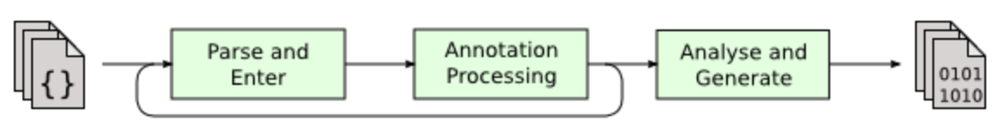
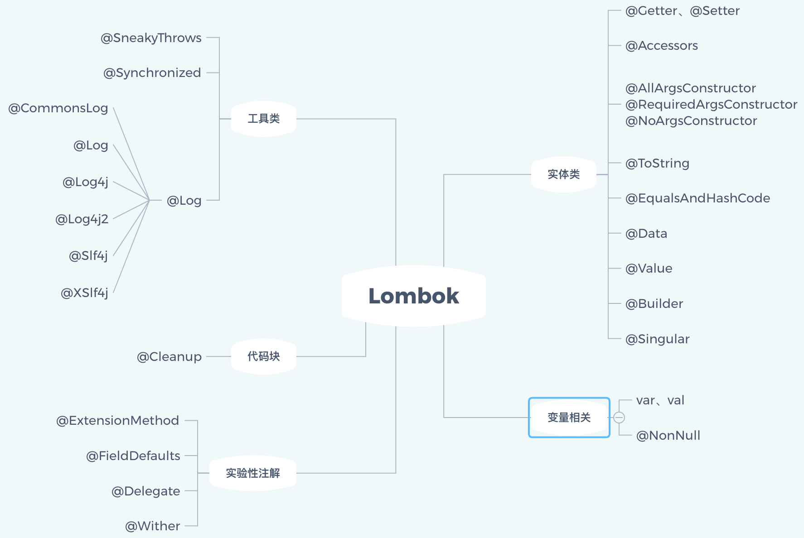

# 一、Lombok简介

Lombok是一个插件，其主要用途是提供了简单的注解的形式来帮助我们简化消除一些必须有但显得很臃肿的 java 代码，提高编码效率，使代码更简洁。

Lombok能以简单的注解形式来简化java代码，提高开发人员的开发效率。例如开发中经常需要写的javabean，都需要花时间去添加相应的getter/setter，也许还要去写构造器、equals等方法，而且需要维护，当属性多时会出现大量的getter/setter方法，这些显得很冗长也没有太多技术含量，一旦修改属性，就容易出现忘记修改对应方法的失误。

Lombok能通过注解的方式，在编译时自动为属性生成构造器、getter/setter、equals、hashcode、toString方法。

# 二、Lombok插件安装

想要使用 Lombok，必须要安装一个 Lombok 插件，不然的话，ide 编辑器会无法识别 Lombok 的注解，报找不到方法的异常。

以 idea 为例，直接在工具中搜索 Lombok 插件，然后安装它。安装完成后重启 idea 开发工具即可。


# 三、在项目中导入依赖

 在使用 Lombok 的项目中引入 Lombok 的 jar 包。
 
 Maven 的 pom.xml 中引入以下配置：

```xml
<!-- https://mvnrepository.com/artifact/org.projectlombok/lombok -->
<dependency>
    <groupId>org.projectlombok</groupId>
    <artifactId>lombok</artifactId>
    <version>1.18.10</version>
    <scope>provided</scope>
</dependency>
```


# 四、Lombok注解介绍

## 1、变量相关

### 1.1、val和var

lombok帮助java低级版本拥有jdk10的特性(在lombok 0.10引入)。

使用var作为任何局部变量声明的类型（即使在for语句中），该类型将从初始化表达式中推断出来（该类型推断中不涉及对变量的任何进一步赋值）。例如：

var x=10.0; 将推断double;

var y=new arraylist(); 将推断Arraylist;
　　

对于复合类型,推断出最常见的父类，而不是接口。例如，
bool ? new HashSet() : new ArrayList()是一个带有复合类型的表达式.存在同样的父类:AbstractCollection,也实现了同样的接口:Serializable。最终推断的类型将是AbstractCollection，因为它是一个类,而Serializable是接口。

在不明确的情况下，例如当初始化表达式是null，将推断为java.lang.Object

这是一个注释类型，因为var x=10；将被解语法糖为@var int x=10;

注意:var 和 val 具有完全相同的语义，只是val变成@val

但是推荐使用val,因为idea具有val自带的postfix template：

```java
//使用示例
public String example() {
    val example = new ArrayList<String>();
    example.add("Hello, World!");
    val foo = example.get(0);
    return foo.toLowerCase();
}
```

### 1.2、NonNull

在方法参数上：Lombok将在方法/构造函数体的开头插入一个空检查，并将参数的名称作为消息引发一个NullPointerException。

在字段上：任何为该字段赋值的生成方法也将生成这些空检查。

例如：
```java
public class DataExample {
    @NonNull 
    private String name;
}
```
　　
编译后的class为：

```java
public class DataExample {
    public DataExample(@NonNull String name) {
        if (name == null)
            throw new NullPointerException("name is marked non-null but is null");
        this.name = name;
    }

    public void setName(@NonNull String name) {
        if (name == null)
            throw new NullPointerException("name is marked non-null but is null");
        this.name = name;
    }
}
```

## 2、实体类相关

### 2.1、@Getter、@Setter

取代实体类中的get和set方法：可以在任何字段上使用@Getter或@Setter，lombok会自动生成默认的getter / setter；如果在类上使用，则所有字段生成getter / setter。

AccessLevel：可以通过AccessLevel重写访问级别。

关于字段注释(lombok v1.12.0中的新功能)：将字段上的javadoc复制到生成的getter和setter。

关于方法命名：

getter：默认情况下方法名为:get+字段名以驼峰连接；如果是boolean类型则:is+字段名以驼峰连接。(Boolean类型是get开头)。不建议使用is开头的字段命名，会产生混淆：

setter：setter不受boolean影响:set+字段名以驼峰连接。

```java
public class DataExample {
    @Setter(AccessLevel.PROTECTED) 
    private String name;

    @Getter 
    @Setter 
    boolean flag;

    @Getter 
    @Setter 
    Boolean flagObj;
}
```
编译后的class为：

```java
public class DataExample {private String name;
    boolean flag;

    Boolean flagObj;

    protected void setName(String name) {
        this.name = name;
    }

    public boolean isFlag() {
        return this.flag;
    }

    public void setFlag(boolean flag) {
        this.flag = flag;
    }

    public Boolean getFlagObj() {
        return this.flagObj;
    }

    public void setFlagObj(Boolean flagObj) {
        this.flagObj = flagObj;
    }
}
```

@Getter可用于枚举而@Setter不能

来自流行库的注释检查，例如javax.annotation.Nonnull，如果存在于字段上，导致生成的setter中会进行显式的空检查。

当与@Accessors注解一起使用会产生影响
　　
### 2.2、@Accessors

使用在类或字段上，目的是修改getter和setter方法的内容（在lombok v0.11.0中作为实验特征引入）。

功能：

fluent：如果为true，那么getter 和setter 生成的方法名没有前缀。此外，除非指定，否则chain将为true。

chain：如果为true，则生成的setter返回this而不是void。默认值：false

prefix：如果存在，则字段必须以任何这些前缀为前缀。每个字段名称依次与列表中的每个前缀进行比较，如果找到匹配项，则会剥离前缀以创建字段的基本名称。在列表中包含一个空字符串是合法的它将始终匹配。对于字母的字符，前缀后面的字符不能是小写字母，即以p为前缀也不会匹配pepper，但是pEpper会被匹配上(并且意味着该字段的基本名称epper)。++如果提供了前缀列表并且字段不以其中一个字段开头，则lombok将完全跳过该字段，并将生成警告++
```java
@Getter
@Setter
public class AccessorsExample {
    @Accessors(fluent = true)
    private int age = 10;

    @Accessors(prefix = "f")
    private String fName;

    @Accessors(chain = true)
    private String chainName;
}
```

编译后的class为：

```java
public class AccessorsExample {

  private int age = 10;
  private String fName;
  private String chainName;
  
  public int age() {
    return this.age;
  }

  public AccessorsExample age(int age) {
    this.age = age;
    return this;
  }

  public String getName() {
    return this.fName;
  }
  
  public void setName(String fName) {
    this.fName = fName;
  }
  
  public AccessorsExample setChainName(String chainName) {
    this.chainName = chainName;
    return this;
  }
  
  public String getChainName() {
    return this.chainName;
  }
}
```
### 2.3、@AllArgsConstructor、RequiredArgsConstructor、@NoArgsConstructor
　　
分别生成全参构造方法,带参构造,无参构造。

@NoArgsConstructor : 生成一个没有参数的构造器。

@AllArgsConstructor : 生成一个包含所有参数的构造器

@RequiredArgsConstructor : 生成一个包含 "特定参数" 的构造器，特定参数指的是那些有加上 final 修饰词的变量们或者加了@NonNull注解的参数。如果指定staticName = "of"参数，还会生成一个返回类对象的静态工厂方法。

如下例：
```java
@RequiredArgsConstructor(staticName = "of")
@AllArgsConstructor(access = AccessLevel.PROTECTED)
public class ConstructorExample<T> {
    private int x, y;
    @NonNull private T description;
    private final String finalString;

    @NoArgsConstructor
    public static class NoArgsExample {
        @NonNull private String field;
    }
}
```

经过编译后，class文件反编译，实际的类文件等同于：

```java
public class ConstructorExample<T> {
    private int x;
    private int y;

    @NonNull
    private T description;
    private final String finalString;

    private ConstructorExample(@NonNull T description, String finalString) {
        if (description == null)
            throw new NullPointerException("description is marked non-null but is null");
        this.description = description;
        this.finalString = finalString;
    }

    public static <T> ConstructorExample<T> of(@NonNull T description, String finalString) {
        return new ConstructorExample<>(description, finalString);
    }

    protected ConstructorExample(int x, int y, @NonNull T description, String finalString) {
        if (description == null)
            throw new NullPointerException("description is marked non-null but is null");
        this.x = x;
        this.y = y;
        this.description = description;
        this.finalString = finalString;
    }

    public static class NoArgsExample {
        @NonNull
        private String field;
    }
}
```

这里注意一个 Java 的小坑，当我们没有指定构造器时，Java 编译器会帮我们自动生成一个没有任何参数的构造器给该类，但是如果我们自己写了构造器之后，Java 就不会自动帮我们补上那个无参数的构造器了，然而很多地方（像是 Spring Data JPA），会需要每个类都一定要有一个无参数的构造器，所以你在加上 @AllArgsConstructor 时，一定要补上 @NoArgsConstrcutor，不然会有各种坑等着你。

### 2.4、@ToString

类使用@ToString注解，Lombok会生成一个toString()方法，默认情况下，会输出类名、所有属性（会按照属性定义顺序），用逗号来分割。通过将includeFieldNames参数设为true，就能明确的输出toString()属性。这一点是不是有点绕口，通过代码来看会更清晰些。

使用Lombok的示例：

```java
@ToString(exclude="id")
public class ToStringExample {
    private static final int STATIC_VAR = 10;
    private String name;
    private Shape shape = new Square(5, 10);
    private String[] tags;
    private int id;

    @ToString(callSuper=true, includeFieldNames=true)
    public static class Square extends Shape {
        private final int width, height;

        public Square(int width, int height) {
            this.width = width;
            this.height = height;
        }
    }
}
```

经过编译后，class文件反编译，实际的类文件等同于：

```java
public class ToStringExample {

    private int id;
    private static final int STATIC_VAR = 10;
    private String name;
    private Shape shape = new Square(5, 10);
    private String[] tags;

    public String toString() {
        return "ToStringExample(name=" + getName() + ", shape=" + this.shape + ", tags=" + Arrays.deepToString((Object[])this.tags) + ")";
    }

    public static class Square extends Shape {
        private final int width;
        private final int height;

        public Square(int width, int height) {
            this.width = width;
            this.height = height;
        }

        public String toString() {
            return "ToStringExample.Square(super=" + super.toString() + ", width=" + this.width + ", height=" + this.height + ")";
        }
    }
}
```

### 2.5、@EqualsAndHashCode

默认情况下，会使用所有非静态（non-static）和非瞬态（non-transient）属性来生成equals/canEqual和hasCode，也能通过exclude注解来排除一些属性。

使用Lombok的示例：

```java
@EqualsAndHashCode(exclude={"id", "shape"})
public class EqualsAndHashCodeExample {
    private transient int transientVar = 10;
    private String name;
    private double score;
    private Shape shape = new Square(5, 10);
    private String[] tags;
    private int id;

    @EqualsAndHashCode(callSuper=true)
    public static class Square extends Shape {
        private final int width, height;

        public Square(int width, int height) {
            this.width = width;
            this.height = height;
        }

        @Override
        public com.sun.javafx.geom.Shape impl_configShape() {
            return null;
        }
    }
}
```

经过编译后，class文件反编译，实际的类文件等同于：

```java
public class EqualsAndHashCodeExample {

    private transient int transientVar = 10;
    private int id;
    private String name;
    private double score;
    private Shape shape = new Square(5, 10);
    private String[] tags;


    public int hashCode() {
        int PRIME = 59;
        result = 1;
        Object $name = getName();
        result = result * 59 + (($name == null) ? 43 : $name.hashCode());
        long $score = Double.doubleToLongBits(this.score);
        result = result * 59 + (int)($score >>> 32L ^ $score);
        return result * 59 + Arrays.deepHashCode((Object[])this.tags);
    }

    protected boolean canEqual(Object other) {
        return other instanceof EqualsAndHashCodeExample;
    }

    public boolean equals(Object o) {
        if (o == this)
            return true;
        if (!(o instanceof EqualsAndHashCodeExample))
            return false;
        EqualsAndHashCodeExample other = (EqualsAndHashCodeExample)o;
        if (!other.canEqual(this))
            return false;
        Object this$name = getName(), other$name = other.getName();
        return ((this$name == null) ? (other$name != null) : !this$name.equals(other$name)) ? 
　　　　　　　　　false : ((Double.compare(this.score, other.score) != 0) ? false : (!!Arrays.deepEquals((Object[])this.tags, (Object[])other.tags)));
    }


    public static class Square extends Shape {
        private final int width;
        private final int height;

        public boolean equals(Object o) {
            if (o == this)
                return true;
            if (!(o instanceof Square))
                return false;
            Square other = (Square)o;
            return !other.canEqual(this) ? false : (!super.equals(o) ? 
　　　　　　　　　　　　false : ((this.width != other.width) ? false : (!(this.height != other.height))));
        }

        protected boolean canEqual(Object other) {
            return other instanceof Square;
        }

        public int hashCode() {
            int PRIME = 59;
            result = super.hashCode();
            result = result * 59 + this.width;
            return result * 59 + this.height;
        }

        public Square(int width, int height) {
            this.width = width;
            this.height = height;
        }
    }
}
```
### 2.6、@Data

作用在类上，相当于集成以下注解
```java
@Getter
@Setter
@RequiredArgsConstructor
@ToString
@EqualsAndHashCode
```

其独有属性配置:

staticConstructor 静态方法名：@Data(staticConstructor=“of”)通过新的方式来创建实例：Foo.of(5)
　
```java
@Data 
public class DataExample {
    private final String name;
    @Setter(AccessLevel.PACKAGE) private int age;
    private double score;
    private String[] tags;

    @ToString(includeFieldNames=true)
    @Data(staticConstructor="of")
    public static class Exercise<T> {
        private final String name;
        private final T value;
    }
}
```
经过编译后，class文件反编译，实际的类文件等同于：

```java
public class DataExample {
  private final String name;
  private int age;
  private double score;
  private String[] tags;
  
  public DataExample(String name) {
    this.name = name;
  }
  
  public String getName() {
    return this.name;
  }
  
  void setAge(int age) {
    this.age = age;
  }
  
  public int getAge() {
    return this.age;
  }
  
  public void setScore(double score) {
    this.score = score;
  }
  
  public double getScore() {
    return this.score;
  }
  
  public String[] getTags() {
    return this.tags;
  }
  
  public void setTags(String[] tags) {
    this.tags = tags;
  }
  
  @Override public String toString() {
    return "DataExample(" + this.getName() + ", " + this.getAge() + ", " + this.getScore() + ", " + Arrays.deepToString(this.getTags()) + ")";
  }
  
  protected boolean canEqual(Object other) {
    return other instanceof DataExample;
  }
  
  @Override public boolean equals(Object o) {
    if (o == this) return true;
    if (!(o instanceof DataExample)) return false;
    DataExample other = (DataExample) o;
    if (!other.canEqual((Object)this)) return false;
    if (this.getName() == null ? other.getName() != null : !this.getName().equals(other.getName())) return false;
    if (this.getAge() != other.getAge()) return false;
    if (Double.compare(this.getScore(), other.getScore()) != 0) return false;
    if (!Arrays.deepEquals(this.getTags(), other.getTags())) return false;
    return true;
  }
  
  @Override public int hashCode() {
    final int PRIME = 59;
    int result = 1;
    final long temp1 = Double.doubleToLongBits(this.getScore());
    result = (result*PRIME) + (this.getName() == null ? 43 : this.getName().hashCode());
    result = (result*PRIME) + this.getAge();
    result = (result*PRIME) + (int)(temp1 ^ (temp1 >>> 32));
    result = (result*PRIME) + Arrays.deepHashCode(this.getTags());
    return result;
  }
  
  public static class Exercise<T> {
    private final String name;
    private final T value;
    
    private Exercise(String name, T value) {
      this.name = name;
      this.value = value;
    }
    
    public static <T> Exercise<T> of(String name, T value) {
      return new Exercise<T>(name, value);
    }
    
    public String getName() {
      return this.name;
    }
    
    public T getValue() {
      return this.value;
    }
    
    @Override public String toString() {
      return "Exercise(name=" + this.getName() + ", value=" + this.getValue() + ")";
    }
    
    protected boolean canEqual(Object other) {
      return other instanceof Exercise;
    }
    
    @Override public boolean equals(Object o) {
      if (o == this) return true;
      if (!(o instanceof Exercise)) return false;
      Exercise<?> other = (Exercise<?>) o;
      if (!other.canEqual((Object)this)) return false;
      if (this.getName() == null ? other.getValue() != null : !this.getName().equals(other.getName())) return false;
      if (this.getValue() == null ? other.getValue() != null : !this.getValue().equals(other.getValue())) return false;
      return true;
    }
    
    @Override public int hashCode() {
      final int PRIME = 59;
      int result = 1;
      result = (result*PRIME) + (this.getName() == null ? 43 : this.getName().hashCode());
      result = (result*PRIME) + (this.getValue() == null ? 43 : this.getValue().hashCode());
      return result;
    }
  }
}
```

通常 @Data 会加在一个值可以被更新的对象上，像是日常使用的 DTO 们、或是 JPA 裡的 Entity 们，就很适合加上 @Data 注解，也就是 @Data for mutable class。

### @Value

也是整合包，但是他会把所有的变量都设成 final 的，其他的就跟 @Data 一样，等于同时加了以下注解：
```java
@ToString
@EqualsAndHashCode
@AllArgsConstructor
@FieldDefaults
@Getter
```

所有字段由private和final修饰，不会产生setter方法。类本身也是由final修饰。

创建Lombok示例如下：

```java
@Value public class ValueExample {
    String name;
    @NonFinal
    int age;
    double score;
    protected String[] tags;

    @ToString(includeFieldNames=true)
    @Value(staticConstructor="of")
    public static class Exercise<T> {
        String name;
        T value;
    }
}
```

经过编译后，class文件反编译，实际的类文件等同于：

```java
public final class ValueExample {
    private final String name;

    private int age;

    private final double score;

    protected final String[] tags;

    public ValueExample(String name, int age, double score, String[] tags) {
        this.name = name;
        this.age = age;
        this.score = score;
        this.tags = tags;
    }

    public boolean equals(Object o) {
        if (o == this)
            return true;
        if (!(o instanceof ValueExample))
            return false;
        ValueExample other = (ValueExample)o;
        Object this$name = getName(), other$name = other.getName();
        return ((this$name == null) ? (other$name != null) : !this$name.equals(other$name)) ? false : ((getAge() != other.getAge()) ? false : ((Double.compare(getScore(), other.getScore()) != 0) ? false : (!!Arrays.deepEquals((Object[])getTags(), (Object[])other.getTags()))));
    }

    public int hashCode() {
        int PRIME = 59;
        result = 1;    //不知道为什么反编译class会是这样的写法
        Object $name = getName();
        result = result * 59 + (($name == null) ? 43 : $name.hashCode());
        result = result * 59 + getAge();
        long $score = Double.doubleToLongBits(getScore());
        result = result * 59 + (int)($score >>> 32L ^ $score);
        return result * 59 + Arrays.deepHashCode((Object[])getTags());
    }

    public String toString() {
        return "ValueExample(name=" + getName() + ", age=" + getAge() + ", score=" + getScore() + ", tags=" + Arrays.deepToString((Object[])getTags()) + ")";
    }

    public String getName() {
        return this.name;
    }

    public int getAge() {
        return this.age;
    }

    public double getScore() {
        return this.score;
    }

    public String[] getTags() {
        return this.tags;
    }

    public static final class Exercise<T> {
        private final String name;

        private final T value;

        public String toString() {
            return "ValueExample.Exercise(name=" + getName() + ", value=" + getValue() + ")";
        }

        private Exercise(String name, T value) {
            this.name = name;
            this.value = value;
        }

        public static <T> Exercise<T> of(String name, T value) {
            return new Exercise<>(name, value);
        }

        public boolean equals(Object o) {
            if (o == this)
                return true;
            if (!(o instanceof Exercise))
                return false;
            Exercise<?> other = (Exercise)o;
            Object this$name = getName(), other$name = other.getName();
            if ((this$name == null) ? (other$name != null) : !this$name.equals(other$name))
                return false;
            Object this$value = getValue(), other$value = other.getValue();
            return !((this$value == null) ? (other$value != null) : !this$value.equals(other$value));
        }

        public int hashCode() {
            int PRIME = 59;
            result = 1;    //不知道为什么反编译class会是这样的写法
            Object $name = getName();
            result = result * 59 + (($name == null) ? 43 : $name.hashCode());
            Object $value = getValue();
            return result * 59 + (($value == null) ? 43 : $value.hashCode());
        }

        public String getName() {
            return this.name;
        }

        public T getValue() {
            return this.value;
        }
    }
}    
```

### 2.8、@Builder、@Singular

@Builder：通过内部类和一个全参构造器来实现构造者模式。

@Singular：自动生成构造者模式代码,Singular是针对集合属性的特殊处理。@Singular对集合进行操作，最终会生成不可变集合

不可变集合:底层是可变集合，但是修改时会抛出异常。

如示例：
```java
@Builder
public class SingularExample<T extends Number> {
    private @Singular
    Set<String> occupations;
    private @Singular("axis")
    ImmutableList<String> axes;
    private @Singular
    SortedMap<Integer, T> elves;
    private @Singular
    Collection<?> minutiae;
}
```

经过编译后，class文件反编译，实际的类文件等同于：

```java
public class SingularExample<T extends Number> {
    private Set<String> occupations;
    private ImmutableList<String> axes;
    private SortedMap<Integer, T> elves;
    private Collection<?> minutiae;

    SingularExample(Set<String> occupations, ImmutableList<String> axes, SortedMap<Integer, T> elves, Collection<?> minutiae) {
        this.occupations = occupations;
        this.axes = axes;
        this.elves = elves;
        this.minutiae = minutiae;
    }

    public static <T extends Number> SingularExampleBuilder<T> builder() {
        return new SingularExampleBuilder<>();
    }

    public static class SingularExampleBuilder<T extends Number> {
        private ArrayList<String> occupations;
        private ImmutableList.Builder<String> axes;
        private ArrayList<Integer> elves$key;
        private ArrayList<T> elves$value;
        private ArrayList<Object> minutiae;

        public SingularExampleBuilder<T> occupation(String occupation) {
            if (this.occupations == null)
                this.occupations = new ArrayList<>();
            this.occupations.add(occupation);
            return this;
        }

        public SingularExampleBuilder<T> occupations(Collection<? extends String> occupations) {
            if (this.occupations == null)
                this.occupations = new ArrayList<>();
            this.occupations.addAll(occupations);
            return this;
        }

        public SingularExampleBuilder<T> clearOccupations() {
            if (this.occupations != null)
                this.occupations.clear();
            return this;
        }

        public SingularExampleBuilder<T> axis(String axis) {
            if (this.axes == null)
                this.axes = ImmutableList.builder();
            this.axes.add(axis);
            return this;
        }

        public SingularExampleBuilder<T> axes(Iterable<? extends String> axes) {
            if (this.axes == null)
                this.axes = ImmutableList.builder();
            this.axes.addAll(axes);
            return this;
        }

        public SingularExampleBuilder<T> clearAxes() {
            this.axes = null;
            return this;
        }

        public SingularExampleBuilder<T> elf(Integer elfKey, T elfValue) {
            if (this.elves$key == null) {
                this.elves$key = new ArrayList<>();
                this.elves$value = new ArrayList<>();
            }
            this.elves$key.add(elfKey);
            this.elves$value.add(elfValue);
            return this;
        }

        public SingularExampleBuilder<T> elves(Map<? extends Integer, ? extends T> elves) {
            if (this.elves$key == null) {
                this.elves$key = new ArrayList<>();
                this.elves$value = new ArrayList<>();
            }
            for (Map.Entry<? extends Integer, ? extends T> $lombokEntry : elves.entrySet()) {
                this.elves$key.add($lombokEntry.getKey());
                this.elves$value.add($lombokEntry.getValue());
            }
            return this;
        }

        public SingularExampleBuilder<T> clearElves() {
            if (this.elves$key != null) {
                this.elves$key.clear();
                this.elves$value.clear();
            }
            return this;
        }

        public SingularExampleBuilder<T> minutia(Object minutia) {
            if (this.minutiae == null)
                this.minutiae = new ArrayList();
            this.minutiae.add(minutia);
            return this;
        }

        public SingularExampleBuilder<T> minutiae(Collection<?> minutiae) {
            if (this.minutiae == null)
                this.minutiae = new ArrayList();
            this.minutiae.addAll(minutiae);
            return this;
        }

        public SingularExampleBuilder<T> clearMinutiae() {
            if (this.minutiae != null)
                this.minutiae.clear();
            return this;
        }

        public SingularExample<T> build() {
            Set<String> occupations;
            switch ((this.occupations == null) ? 0 : this.occupations.size()) {
                case false:
                    occupations = Collections.emptySet();
                    break;
                case true:
                    occupations = Collections.singleton(this.occupations.get(0));
                    break;
                default:
                    occupations = new LinkedHashSet<>((this.occupations.size() < 1073741824) ? (1 + this.occupations.size() + (this.occupations.size() - 3) / 3) : Integer.MAX_VALUE);
                    occupations.addAll(this.occupations);
                    occupations = Collections.unmodifiableSet(occupations);
                    break;
            }
            ImmutableList<String> axes = (this.axes == null) ? ImmutableList.of() : this.axes.build();
            SortedMap<Integer, T> elves = new TreeMap<>();
            if (this.elves$key != null)
                for (int $i = 0; $i < ((this.elves$key == null) ? 0 : this.elves$key.size()); ) {
                    elves.put(this.elves$key.get($i), this.elves$value.get($i));
                    $i++;
                }
            elves = Collections.unmodifiableSortedMap(elves);
            switch ((this.minutiae == null) ? 0 : this.minutiae.size()) {
                case false:
                    minutiae = Collections.emptyList();
                    return new SingularExample<>(occupations, axes, elves, minutiae);
                case true:
                    minutiae = Collections.singletonList(this.minutiae.get(0));
                    return new SingularExample<>(occupations, axes, elves, minutiae);
            }
            Collection<Object> minutiae = Collections.unmodifiableList(new ArrayList(this.minutiae));
            return new SingularExample<>(occupations, axes, elves, minutiae);
        }

        public String toString() {
            return "SingularExample.SingularExampleBuilder(occupations=" + this.occupations + ", axes=" + this.axes
　　　　　　　　　　 + ", elves$key=" + this.elves$key + ", elves$value=" + this.elves$value + ", minutiae=" + this.minutiae + ")";
        }
    }
}
```
　　
注意：

虽然只要加上 @Builder 注解，我们就能够用流式写法快速设定对象的值，但是 setter 还是必须要写不能省略的，因为 Spring 或是其他框架有很多地方都会用到对象的 getter/setter 对他们取值/赋值，所以通常是 @Data 和 @Builder 会一起用在同个类上，既方便我们流式写代码，也方便框架做事。
由于Builder会生成一个全参构造器，导致默认的无参构造器失效，所以类采用@Builder注解后无法new出来。完美的避免方式：加上@AllArgsConstructor、@NoArgsConstructor后就可以同时使用new和构造者方式实例化对象了。
```java
@Builder
@AllArgsConstructor
@NoArgsConstructor
```
父类中的属性子类继承问题：简单解决方案是在子类中也手动写该属性

### 2.9、@Getter(lazy=true)

可以替代经典的Double Check Lock样板代码，如下示例：

```java
public class GetterLazyExample {
    @Getter(lazy = true)
    private final double[] cached = expensive();
    private double[] expensive() {
        double[] result = new double[1000000];
        for (int i = 0; i < result.length; i++) {
            result[i] = Math.asin(i);
        }
        return result;
    }
}
```

经过编译，相当于以下这个class
```java
public class GetterLazyExample {
    private final AtomicReference<Object> cached = new AtomicReference();

    public double[] getCached() {
        Object value = this.cached.get();
        if (value == null)
            synchronized (this.cached) {
                value = this.cached.get();
                if (value == null) {
                    double[] actualValue = expensive();
                    value = (actualValue == null) ? this.cached : actualValue;
                    this.cached.set(value);
                }
            }
        return (value == this.cached) ? null : (double[])value;
    }

    private double[] expensive() {
        double[] result = new double[1000000];
        for (int i = 0; i < result.length; i++)
            result[i] = Math.asin(i);
        return result;
    }
}
```

## 3、工具类注解

### 3.1、@Cleanup

自动资源管理：自动调用关闭资源方法,默认是调用close()方法，在finally块中，只有在给定资源不是null的情况下才会调用清理方法。

如果要清理的对象没有close()方法,可以指定一个无参方法来进行自动清理。

@Cleanup("dispose") CoolBar bar = new CoolBar(parent, 0);

```java
public class CleanupExample {
    public static void main(String[] args) throws IOException {
        @Cleanup InputStream in = new FileInputStream(args[0]);
        @Cleanup OutputStream out = new FileOutputStream(args[1]);
        byte[] b = new byte[10000];
        while (true) {
            int r = in.read(b);
            if (r == -1) break;
            out.write(b, 0, r);
        }
    }
}
```

经过编译后，class文件反编译，实际的类文件等同于：

```java
public class CleanupExample {
    public static void main(String[] args) throws IOException {
        InputStream in = new FileInputStream(args[0]);
        try {
            OutputStream out = new FileOutputStream(args[1]);
            try {
                byte[] b = new byte[10000];
                while (true) {
                    int r = in.read(b);
                    if (r == -1) break;
                    out.write(b, 0, r);
                }
            } finally {
                if (out != null) {
                    out.close();
                }
            }
        } finally {
            if (in != null) {
                in.close();
            }
        }
    }
}
```

### 3.2、@Log、@Slf4j、@Log4j、@Log4j2、@XSlf4j、@CommonsLog

自动生成该类的 log 静态常量，要打日志就可以直接打，不用再手动 new log 静态常量了。lombok 提供@Log、@Slf4j、@Log4j、@Log4j2、@XSlf4j、@CommonsLog日志框架的变种注解，他们都是帮我们创建一个静态常量 log，只是使用的库不一样而已。

SpringBoot默认支持的就是 slf4j + logback 的日志框架，所以也不用再多做啥设定，直接就可以用在 SpringBoot project上，log 系列注解最常用的就是 @Slf4j。

对应注解的log静态常亮初始化如下：

```java
@Log //对应的log语句如下
private static final java.util.logging.Logger log = java.util.logging.Logger.getLogger(LogExample.class.getName());

@Log4j //对应的log语句如下
private static final org.apache.log4j.Logger log = org.apache.log4j.Logger.getLogger(LogExample.class);

@Log4j2
private static final org.apache.logging.log4j.Logger log = org.apache.logging.log4j.LogManager.getLogger(LogExample.class);

@CommonsLog
private static final org.apache.commons.logging.Log log = org.apache.commons.logging.LogFactory.getLog(LogExample.class);

@XSlf4j
private static final org.slf4j.ext.XLogger log = org.slf4j.ext.XLoggerFactory.getXLogger(LogExample.class);

@Slf4j
private static final org.slf4j.Logger log = org.slf4j.LoggerFactory.getLogger(CleanupExample.class);
```

### 3.3、@SneakyThrows

```java
public class SneakyThrowsExample implements Runnable {
    @SneakyThrows(UnsupportedEncodingException.class)
    public String utf8ToString(byte[] bytes) {
        return new String(bytes, "UTF-8");
    }

    @SneakyThrows
    public void run() {
        throw new Throwable();
    }
}
```

经过编译后，class文件反编译，实际的类文件等同于：

```java
public class SneakyThrowsExample implements Runnable {
    public String utf8ToString(byte[] bytes) {
        try {
            return new String(bytes, "UTF-8");
        } catch (UnsupportedEncodingException e) {
            throw Lombok.sneakyThrow(e);
        }
    }

    public void run() {
        try {
            throw new Throwable();
        } catch (Throwable t) {
            throw Lombok.sneakyThrow(t);
        }
    }
}
```

### 3.4、@Synchronized
　
synchronized是线程安全中一个重要的关键字，它是一种同步锁，主要用来保证在同一个时刻，只有一个线程可以执行某个方法或者某段代码块。一般使用synchronized去锁住代码块，而不是方法，因为锁住代码块效率更高。

@Synchronized是synchronized方法修饰符的更安全的变体。@synchronized 的作用是创建一个互斥锁，保证此时没有其它线程对self对象进行修改，保证代码的安全性。也就是包装这段代码是原子性的，安全的。这个是objective-c的一个锁定令牌，防止self对象在同一时间内被其他线程访问，起到保护线程安全的作用。

　　与一样synchronized，注释只能在静态方法和实例方法上使用。它的操作类似于synchronized关键字，但是它锁定在不同的对象上。关键字锁定在上this，但注释锁定在名为的字段上$ lock，该字段是私有的。如果该字段不存在，则会为您创建。如果对static方法进行注释，则注释将锁定在名为的静态字段上$ LOCK。

　　如果 $lock 或 $LOCK 是自动生成的，则字段将使用一个空Object[]数组进行初始化，而不仅仅是new Object()显示该模式在实际使用中的大多数代码片段。Lombok这样做是因为新对象不可序列化，而0大小的数组则可序列化。因此，使用@Synchronized不会阻止您的对象被序列化。

　　@Synchronized类 中至少有一个方法意味着将有一个锁字段，但是如果以后删除所有这些方法，将不再有锁字段。这意味着您预定的serialVersionUID更改。如果您打算通过Java的序列化机制长期存储它们，我们建议您始终serialVersionUID向类中添加a 。如果这样做，@Synchronized从方法中删除所有注释不会破坏序列化。

　　如Lombok示例如下：

```java
public class SynchronizedExample{

    private static final Object manualLock = new Object();
    public static void main(String[] args) {
        hello("HJ");
    }
    @Synchronized
    private static void hello(String print) {
        System.out.println("hello" + print);
    }
    @Synchronized
    public void print(){
        System.out.println("print");
    };

    @Synchronized("manualLock")
    public void manualLock(){
        System.out.println("manualLock");
    };
}
```
经过编译后，class文件反编译，实际的类文件等同于：

```java
public class SynchronizedExample {
    private static final Object manualLock = new Object();

    public static void main(String[] args) {
        hello("HJ");
    }

    private static final Object $LOCK = new Object[0];
    private static void hello(String print) {
        synchronized ($LOCK) {
            System.out.println("hello" + print);
        }
    }

    private final Object $lock = new Object[0];
    public void print() {
        synchronized (this.$lock) {
            System.out.println("print");
        }
    }

    public void manualLock() {
        this.getClass();
        synchronized (manualLock) {
            System.out.println("manualLock");
        }
    }
}

```
　　
@Synchronized源码如下：

```java
@Target(ElementType.METHOD)
@Retention(RetentionPolicy.SOURCE)
public @interface Synchronized {
    /**
     * Optional: specify the name of a different field to lock on. It is a compile time error if this field
     * doesn't already exist (the fields are automatically generated only if you don't specify a specific name
     * @return Name of the field to lock on (blank = generate one).
     */
    String value() default "";    //注解属性：value是指自定义锁的字段名。
}
```

# 四、Lombok原理解析

Lombok使用的过程中，只需要添加相应的注解，无需再为此写任何代码。但是自动生成的代码到底是如何产生的呢？

核心之处就是对于注解的解析上。JDK5引入了注解的同时，也提供了两种解析方式。

运行时解析：运行时能够解析的注解，必须将@Retention设置为RUNTIME，这样就可以通过反射拿到该注解。java.lang,reflect反射包中提供了一个接口AnnotatedElement，该接口定义了获取注解信息的几个方法，Class、Constructor、Field、Method、Package等都实现了该接口，对反射熟悉的朋友应该都会很熟悉这种解析方式。
编译时解析

编译时解析有两种机制，分别简单描述下：

Annotation Processing Tool：apt自JDK5产生，JDK7已标记为过期，不推荐使用，JDK8中已彻底删除，自JDK6开始，可以使用Pluggable Annotation Processing API来替换它，apt被替换主要有2点原因：api都在com.sun.mirror非标准包下；没有集成到javac中，需要额外运行。

Pluggable Annotation Processing API：JSR 269自JDK6加入，作为apt的替代方案，它解决了apt的两个问题，javac在执行的时候会调用实现了该API的程序，这样我们就可以对编译器做一些增强，这时javac执行的过程如下： 
　　　　
　　

Lombok本质上就是一个实现了“JSR 269 API”的程序。在使用javac的过程中，它产生作用的具体流程如下：

javac对源代码进行分析，生成了一棵抽象语法树（AST）
运行过程中调用实现了“JSR 269 API”的Lombok程序
此时Lombok就对第一步骤得到的AST进行处理，找到@Data注解所在类对应的语法树（AST），然后修改该语法树（AST），增加getter和setter方法定义的相应树节点
javac使用修改后的抽象语法树（AST）生成字节码文件，即给class增加新的节点（代码块）
拜读了Lombok源码，对应注解的实现都在HandleXXX中，比如@Getter注解的实现时HandleGetter.handle()。还有一些其它类库使用这种方式实现，比如Google Auto、Dagger等等。

附Lombok注解类型：


　　　　