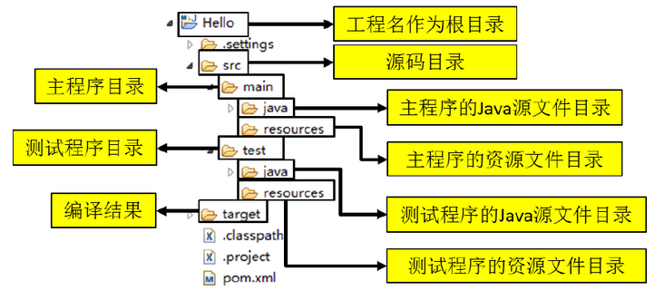

# 一、Maven介绍

## 1、引入（java项目开发的琐碎配置）

在了解Maven之前，我们先来看看一个Java项目需要的东西。

* 依赖

首先，我们需要确定引入哪些依赖包。例如，如果我们需要用到commons logging，我们就必须把commons logging的jar包放入classpath。如果我们还需要log4j，就需要把log4j相关的jar包都放到classpath中。这些就是依赖包的管理。

* 目录结构


其次，我们要确定项目的目录结构。例如，src目录存放Java源码，resources目录存放配置文件，bin目录存放编译生成的.class文件。

* 环境配置

此外，我们还需要配置环境，例如JDK的版本，编译打包的流程，当前代码的版本号。

* 编译

最后，除了使用Eclipse这样的IDE进行编译外，我们还必须能通过命令行工具进行编译，才能够让项目在一个独立的服务器上编译、测试、部署。

这些工作难度不大，但是非常琐碎且耗时。如果每一个项目都自己搞一套配置，肯定会一团糟。我们需要的是一个标准化的Java项目管理和构建工具。

## 2、Maven介绍

Maven是Apache软件基金会唯一维护的一款自动化构建工具，专注于服务Java平台的项目构建和依赖管理，可以通过一小段描述信息来管理项目的构建、报告和文档的软件项目管理工具。

## 3、Maven的主要功能：

- 定义项目结构

- 管理项目依赖

- 构建编译项目

- 管理项目模块

## 4、安装Maven

要安装Maven，可以从Maven[官网](https://maven.apache.org/)下载最新的Maven 3.8.x.


然后在本地解压，即可。

## 5、配置Maven

设置几个环境变量：

M2_HOME=/path/to/maven-3.6.x

PATH=$PATH:$M2_HOME/bin

Windows可以把%M2_HOME%\bin添加到系统Path变量中。

然后，打开命令行窗口，输入mvn -version，应该看到Maven的版本信息：

```java
┌────────────────────────────────────────────────────────┐
│Command Prompt                                    - □ x │
├────────────────────────────────────────────────────────┤
│Microsoft Windows [Version 10.0.0]                      │
│(c) 2015 Microsoft Corporation. All rights reserved.    │
│                                                        │
│C:\> mvn -version                                       │
│Apache Maven 3.6.0 (97c98ec64a1fdfee7767ce5ffb20918...) │
│Maven home: C:\Users\liaoxuefeng\maven                  │
│Java version: ...                                       │
│...                                                     │
│C:\> _                                                  │
│                                                        │
│                                                        │
└────────────────────────────────────────────────────────┘
```
如果提示命令未找到，说明系统PATH路径有误，需要修复后再运行。

# 二、Maven定义项目结构

## 1、Maven项目结构

一个使用Maven管理的普通的Java项目，它的目录结构默认如下：
```xml
a-maven-project
├── pom.xml
├── src
│   ├── main
│   │   ├── java
│   │   └── resources
│   └── test
│       ├── java
│       └── resources
└── target
```



项目的根目录a-maven-project是项目名，它有一个项目描述文件pom.xml，存放Java源码的目录是src/main/java，存放资源文件的目录是src/main/resources，存放测试源码的目录是src/test/java，存放测试资源的目录是src/test/resources，最后，所有编译、打包生成的文件都放在target目录里。这些就是一个Maven项目的标准目录结构。

所有的目录结构都是约定好的标准结构，我们千万不要随意修改目录结构。使用标准结构不需要做任何配置，Maven就可以正常使用。

## 2、.iml和.idea文件夹

初次使用IDEA，创建一个maven工程，发现在目录结构中产生了两个不一样的东西——.iml文件和.idea文件夹。

非常好奇，所以立刻上网查找了这两个东西的信息。

iml是 intellij idea的工程配置文件，里面是当前project的一些配置信息。.Idea存放项目的配置信息，包括历史记录，版本控制信息等。其实可以不用理它。

如果觉得看着麻烦的话，我们可以配置隐藏。点击file->Settings->File types,在右下角的Ignore files and folders中可以将.idea隐藏，但是似乎不可以隐藏.iml文件。

解析二:
idea 删除生成的.iml文件后 项目目录不显示 或者报错
因为idea生成的.iml文件里面存的都是一些配置之类的东西 所以删了以后就会出现问题
解决这个问题的办法很简单点击maven 刷新就好了 就会生成新的.iml文件

解析三:
iml是 intellij idea的工程配置文件，里面是当前projec的一些配置信息
web.xml 是当前这个project是一个web project，里面是web 工程的具体配置信息 初始参数，servlet filter 等等

# 三、Maven管理依赖

## 1、通过配置文件管理依赖

Maven解决了依赖管理问题。例如，我们的项目依赖abc这个jar包，而abc又依赖xyz这个jar包：

```xml
┌──────────────┐
│Sample Project│
└──────────────┘
        │
        ▼
┌──────────────┐
│     abc      │
└──────────────┘
        │
        ▼
┌──────────────┐
│     xyz      │
└──────────────┘
```

当我们声明了abc的依赖时，Maven自动把abc和xyz都加入了我们的项目依赖，不需要我们自己去研究abc是否需要依赖xyz。

因此，Maven的第一个作用就是解决依赖管理。我们声明了自己的项目需要abc，Maven会自动导入abc的jar包，再判断出abc需要xyz，又会自动导入xyz的jar包，这样，最终我们的项目会依赖abc和xyz两个jar包。

我们来看一个复杂依赖示例：

```xml
<dependency>
    <groupId>org.springframework.boot</groupId>
    <artifactId>spring-boot-starter-web</artifactId>
    <version>1.4.2.RELEASE</version>
</dependency>
```

当我们声明一个spring-boot-starter-web依赖时，Maven会自动解析并判断最终需要大概二三十个其他依赖：

```java
spring-boot-starter-web
  spring-boot-starter
    spring-boot
    sprint-boot-autoconfigure
    spring-boot-starter-logging
      logback-classic
        logback-core
        slf4j-api
      jcl-over-slf4j
        slf4j-api
      jul-to-slf4j
        slf4j-api
      log4j-over-slf4j
        slf4j-api
    spring-core
    snakeyaml
  spring-boot-starter-tomcat
    tomcat-embed-core
    tomcat-embed-el
    tomcat-embed-websocket
      tomcat-embed-core
  jackson-databind
  ...
```

如果我们自己去手动管理这些依赖是非常费时费力的，而且出错的概率很大。

## 2、依赖关系分类

Maven定义了几种依赖关系，分别是compile、test、runtime和provided：

| scope | 说明  | 示例 |
| ----  | ----  | ---- |
|compile|编译时需要用到该jar包（默认）|commons-logging|
|test|编译Test时需要用到该jar包|junit|
|runtime|编译时不需要，但运行时需要用到|mysql|
|provided|编译时需要用到，但运行时由JDK或某个服务器提供|servlet-api|


其中，默认的compile是最常用的，Maven会把这种类型的依赖直接放入classpath。

test依赖表示仅在测试时使用，正常运行时并不需要。最常用的test依赖就是JUnit：

```java
<dependency>
    <groupId>org.junit.jupiter</groupId>
    <artifactId>junit-jupiter-api</artifactId>
    <version>5.3.2</version>
    <scope>test</scope>
</dependency>
```

runtime依赖表示编译时不需要，但运行时需要。最典型的runtime依赖是JDBC驱动，例如MySQL驱动：

```java
<dependency>
    <groupId>mysql</groupId>
    <artifactId>mysql-connector-java</artifactId>
    <version>5.1.48</version>
    <scope>runtime</scope>
</dependency>
```

provided依赖表示编译时需要，但运行时不需要。最典型的provided依赖是Servlet API，编译的时候需要，但是运行时，Servlet服务器内置了相关的jar，所以运行期不需要：

```java
<dependency>
    <groupId>javax.servlet</groupId>
    <artifactId>javax.servlet-api</artifactId>
    <version>4.0.0</version>
    <scope>provided</scope>
</dependency>
```

## 3、Maven仓库

Maven如何知道从何处下载所需的依赖？也就是相关的jar包？

答案是Maven维护了一个中央仓库（repo1.maven.org），所有第三方库将自身的jar以及相关信息上传至中央仓库，Maven就可以从中央仓库把所需依赖下载到本地。


Maven并不会每次都从中央仓库下载jar包。一个jar包一旦被下载过，就会被Maven自动缓存在本地目录（用户主目录的.m2目录），所以，除了第一次编译时因为下载需要时间会比较慢，后续过程因为有本地缓存，并不会重复下载相同的jar包。


对于某个依赖，Maven只需要3个变量即可唯一确定某个jar包：

```
groupId：属于组织的名称，类似Java的包名；

artifactId：该jar包自身的名称，类似Java的类名；

version：该jar包的版本。
```

通过上述3个变量，即可唯一确定某个jar包。Maven通过对jar包进行PGP签名确保任何一个jar包一经发布就无法修改。修改已发布jar包的唯一方法是发布一个新版本。

因此，某个jar包一旦被Maven下载过，即可永久地安全缓存在本地。

注：只有以-SNAPSHOT结尾的版本号会被Maven视为开发版本，开发版本每次都会重复下载，这种SNAPSHOT版本只能用于内部私有的Maven repo，公开发布的版本不允许出现SNAPSHOT。

## 4、Maven镜像及搜索依赖的方法

除了可以从Maven的中央仓库下载外，还可以从Maven的镜像仓库下载。如果访问Maven的中央仓库非常慢，我们可以选择一个速度较快的Maven的镜像仓库。Maven镜像仓库定期从中央仓库同步：
```xml
           slow    ┌───────────────────┐
    ┌─────────────>│Maven Central Repo.│
    │              └───────────────────┘
    │                        │
    │                        │sync
    │                        ▼
┌───────┐  fast    ┌───────────────────┐
│ User  │─────────>│Maven Mirror Repo. │
└───────┘          └───────────────────┘

```
中国区用户可以使用阿里云提供的Maven镜像仓库。使用Maven镜像仓库需要一个配置，在用户主目录下进入.m2目录，创建一个settings.xml配置文件，内容如下：

```java
<settings>
    <mirrors>
        <mirror>
            <id>aliyun</id>
            <name>aliyun</name>
            <mirrorOf>central</mirrorOf>
            <!-- 国内推荐阿里云的Maven镜像 -->
            <url>https://maven.aliyun.com/repository/central</url>
        </mirror>
    </mirrors>
</settings>
```

配置镜像仓库后，Maven的下载速度就会非常快。

搜索第三方组件

最后一个问题：如果我们要引用一个第三方组件，比如okhttp，如何确切地获得它的groupId、artifactId和version？方法是通过search.maven.org搜索关键字，找到对应的组件后，直接复制：

copy-maven


# 四、Maven构建项目

Maven有一套标准化的构建流程，可以自动化实现编译，打包，发布，等等。

## 1、Maven生命周期

Maven 生命周期定义了各个构建环节的执行顺序，有了这个清单，Maven 就可以自动化的执行构建命令了。

Maven 有三套相互独立的生命周期，分别是：

* Clean Lifecycle 

在进行真正的构建之前进行一些清理工作

* Default Lifecycle 

构建的核心部分，编译，测试，打包，安装，部署等等

Default 生命周期是 Maven 生命周期中最重要的一个，绝大部分工作都发生在这个生命周期中（列出一些重要阶段）

* Site Lifecycle 

生成项目报告，站点，发布站点

它们是相互独立的，你可以仅仅调用 clean 来清理工作目录，仅仅调用 site 来生成站点。当然你也可以直接运行 mvn clean install site 运行所有这三套生命周期。 

## 2、Maven声明周期的阶段

Maven的生命周期由一系列阶段（phase）构成，我们平时在命令行输入的命令总会对应于一个特定的阶段。

例如：

```
mvn clean 的clean是一个phase，是Clean声明周期的一个阶段。
```

* Clean 生命周期一共包含了三个阶段：

pre-clean 执行一些需要在 clean 之前完成的工作

clean 移除所有上一次构建生成的文件

post-clean 执行一些需要在 clean 之后立刻完成的工作

* default 生命周期包含了下面的阶段：

validate：验证工程是否正确，所有需要的资源是否可用。

compile：编译项目的源代码。

test：使用合适的单元测试框架来测试已编译的源代码。这些测试不需要已打包和布署。

package：把已编译的代码打包成可发布的格式，比如 jar、war 等。

integration-test：如有需要，将包处理和发布到一个能够进行集成测试的环境。

verify：运行所有检查，验证包是否有效且达到质量标准。

install：把包安装到maven本地仓库，可以被其他工程作为依赖来使用。

deploy：在集成或者发布环境下执行，将最终版本的包拷贝到远程的repository，使得其他的开发者或者工程可以共享

* Site 生命周期包含4个阶段：

pre-site 执行一些需要在生成站点文档之前完成的工作

site 生成项目的站点文档

post-site 执行一些需要在生成站点文档之后完成的工作，并且为部署做准备

site-deploy 将生成的站点文档部署到特定的服务器上 这里经常用到的是 site 阶段和 site-deploy 阶段，用以生成和发布 Maven 站点，这可是 Maven 相当强大 的功能，Manager 比较喜欢，文档及统计数据自动生成，很好看。

## 3、Maven阶段的执行：Goal

执行一个phase又会触发一个或多个goal：

例如：我们执行mvn compile，实际上是执行了下面的goal：
compile	compiler:compile

我们执行mvn test，实际上是执行了下面的goal：

test	compiler:testCompile

大多数情况，我们只要指定phase，就默认执行这些phase默认绑定的goal，只有少数情况，我们可以直接指定运行一个goal，

例如，启动Tomcat服务器：
mvn tomcat:run


## 4、maven命令的执行过程：

maven 命令的常用格式是：  mvn phase名

其执行过程是：

使用mvn这个命令时，Maven自动根据生命周期，从某一个生命周期的第一个阶段开始，运行到指定的阶段为止。

例如：

我们运行mvn package，Maven就会执行default生命周期，它会从开始一直运行到package这个phase为止：

```xml
validate
...

package
```

如果我们运行mvn compile，Maven也会执行default生命周期，但这次它只会运行到compile，即以下几个phase：

```xml
validate
...
compile
```

更复杂的例子是指定多个phase，例如，运行mvn clean package，Maven先执行clean生命周期并运行到clean这个phase，然后执行default生命周期并运行到package这个phase，实际执行的phase如下：

```
pre-clean
clean （注意这个clean是phase）
validate
...

package
```

## 5、maven 常用命令：

在实际开发过程中，经常使用的命令有：

### 版本信息

* mvn -version/-v 显示版本信息

### 清理

* mvn clean 清空生成的文件

### 编译

* mvn compile 编译

* mvn clean compile 表示先运行清理之后运行编译，会将代码编译到target文件夹中

### 打包

* mvn package 生成target目录，编译、测试代码，生成测试报告，生成jar/war文件

* mvn clean package 运行清理和打包


### 安装
* mvn clean install 运行清理和安装，会将打好的包安装到本地仓库中，以便其他的项目可以调用


### 发布
* mvn clean deploy 运行清理和发布

### 测试

* mvn test 编译并测试

### 生成站点信息

* mvn site 生成项目相关信息的网站


## 6、通过profiles构建不同的应用

在开发过程中，我们的软件会面对不同的运行环境，比如开发环境、测试环境、生产环境，而我们的软件在不同的环境中，有的配置可能会不一样，比如数据源配置、日志文件配置、以及一些软件运行过程中的基本配置，那每次我们将软件部署到不同的环境时，都需要修改相应的配置文件，这样来回修改，很容易出错，而且浪费劳动力。

maven提供了一种方便的解决这种问题的方案，就是profile功能。profile可以让我们定义一系列的配置信息，然后指定其激活条件。这样我们就可以定义多个profile，然后每个profile对应不同的激活条件和配置信息，从而达到不同环境使用不同配置信息的效果。

profile定义的位置

（1）    针对于特定项目的profile配置我们可以定义在该项目的pom.xml中。（下面举例是这种方式）

（2）    针对于特定用户的profile配置，我们可以在用户的settings.xml文件中定义profile。该文件在用户家目录下的“.m2”目录下。

（3）    全局的profile配置。全局的profile是定义在Maven安装目录下的“conf/settings.xml”文件中的。

### 6.1 profile的配置写法

在项目根目录的pom.xml文件中，

```xml
<profiles>
		<profile>
			<id>local</id>
			<properties>
				<profileActive>local</profileActive>
			</properties>
			<activation>
				<activeByDefault>true</activeByDefault>
			</activation>
		</profile>
		<profile>
			<id>test</id>
			<properties>
				<profileActive>test</profileActive>
			</properties>
		</profile>
		<profile>
			<id>prod</id>
			<properties>
				<profileActive>prod</profileActive>
			</properties>
		</profile>
	</profiles>
```

### 6.2 在profile中可以被配置的项及使用方法：

pom中的下列元素中的配置均可通过profiles定义:

```xml
<project>
    <profiles>
        <profile>
            <build>
                <defaultGoal>...</defaultGoal>
                <finalName>...</finalName>
                <resources>...</resources>
                <testResources>...</testResources>
                <plugins>...</plugins>
            </build>
            <reporting>...</reporting>
            <modules>...</modules>
            <dependencies>...</dependencies>
            <dependencyManagement>...</dependencyManagement>
            <distributionManagement>...</distributionManagement>
            <repositories>...</repositories>
            <pluginRepositories>...</pluginRepositories>
            <properties>...</properties>
        </profile>
    </profiles>
</project>
```

在前面的例子中，我们可以看到定义了多个profile，每个profile都有唯一的id，也包含properties属性。

这里为每个profile都定义一个名为profiles.active的properties，每个环境的值不同。当我们打包项目时，激活不同的环境，profiles.active字段就会被赋予不同的值。profiles.active字段可以应用到许多地方，及其灵活。可以在配置文件里被引用；也可以结合pom文件里的resource和filter属性，作为文件名的一部分或者文件夹名的一部分。

例如，我们在pom.xml的resouece标签中使用了该定义：

```xml
<resource>
    <!--这里是关键！ 根据不同的环境，把对应文件夹里的配置文件打包-->
    <directory>src/main/resources/${profiles.active}</directory>
</resource>
```
当我们在执行maven命令的时候，指定某一个profile被激活，如：

```
mvn clean package -Plocal
```
则resouce中的directory为： src/resources/local目录。


### 6.3 Profile的激活方式

#### 1. 使用 activeByDefault设置激活

我们可以在profile中的activation元素中指定激活条件，当没有指定条件，并且指定activeByDefault为true的时候，就表示当没有指定其他profile为激活状态时，该profile就默认会被激活。
在上面的例子中：

```xml
<profile>
			<id>local</id>
			<properties>
				<profileActive>local</profileActive>
			</properties>
			<activation>
				<activeByDefault>true</activeByDefault>
			</activation>
</profile>
```
我们设置id为local的profile的activeByDefault属性为true，当我们调用mvn package的时候，则localprofile将会被激活，但是当我们使用mvn package –P test的时候，testProfile将被激活，而这个时候local将不会被激活。


#### 2. 在 settings.xml中使用activeProfiles设置激活

我们就可以在settings.xml中定义activeProfiles，具体定义如下：

```xml
<activeProfiles> 
    <activeProfile>profile1</activeProfile> 
</activeProfiles> 
```
这样，如果profile的配置如下所示：

```xml
<profiles> 
    <profile> 
        <id>profile1</id> 
        <properties> 
            <hello>lilei</hello> 
        </properties> 
    </profile> 

    <profile> 
        <id>profile2</id> 
        <properties> 
            <hello>hanmeimei</hello> 
        </properties> 
    </profile> 
</profiles>
```
那么，profile为profile1的配置会被激活。

补充：考虑这样一种情况，我们在activeProfiles下同时定义了多个需要激活的profile。这里还拿上面的profile定义来举例，我们定义了同时激活profileTest1和profileTest2。
```
<activeProfiles> 
    <activeProfile>profile1</activeProfile> 
    <activeProfile>profile2</activeProfile> 
</activeProfiles>
```
从profileTest1和profileTest2我们可以看出它们共同定义了属性hello。那么这个时候我在pom.xml中使用属性hello的时候，它到底取的哪个值呢？是根据activeProfile定义的顺序，后面的覆盖前面的吗？根据我的测试，答案是非也，它是根据profile定义的先后顺序来进行覆盖取值的，然后后面定义的会覆盖前面定义的。


#### 3.使用-P参数显示的激活一个profile

我们在进行Maven操作时，可以使用-P参数显示的指定当前激活的是哪一个profile。比如我们需要在对项目进行打包的时候使用id为profile1的profile，我们就可以这样做：
```
mvn package –P profile1 
```

当我们使用activeByDefault或settings.xml中定义了处于激活的profile，但是当我们在进行某些操作的时候又不想它处于激活状态，这个时候我们可以这样做：
```
Mvn package –P !profile2
``` 
这里假设profileTest1是在settings.xml中使用activeProfile标记的处于激活状态的profile，那么当我们使用“-P !profile”的时候就表示在当前操作中该profile将不处于激活状态。


#### 4.根据环境来激活profile

profile一个非常重要的特性就是它可以根据不同的环境来激活，比如说根据操作系统的不同激活不同的profile，也可以根据jdk版本的不同激活不同的profile，等等。


profile一个非常重要的特性就是它可以根据不同的环境来激活，比如根据jdk的版本：
```xml
<!-- 如果jdk的版本为1.8则激活该profile -->
<profiles>
    <profile>
        <id>profile1</id>
        <activation>
            <jdk>1.8</jdk>
        </activation>
    </profile>
</profiles>
```
根据操作系统：
```xml
<profiles>
    <profile>
        <id>profile1</id>
        <activation>
            <os>
                <!-- 不必指定所有信息 -->
                <name>linux</name>
                <family>unix</family>
                <arch>amd64</arch>
                <version>3.19.0-30-generic</version>
            </os>
        </activation>
    </profile>
</profiles>
```

根据环境变量：
```xml
<profiles>
    <profile>
        <id>profile1</id>
        <activation>
            <property>
                <name>debug</name>
                <value>true</value>
            </property>
        </activation>
    </profile>
</profiles>
```

根据文件是否存在来激活：
```
<profiles>
    <profile>
        <id>profile1</id>
        <activation>
            <file>
                <missing>/path/to/missing/file</missing>
                <exists>/path/to/exists/file</exists>
            </file>
        </activation>
    </profile>
</profiles>
```

>查看当前处于激活状态的profile
>
>我们可以同时定义多个profile，那么在建立项目的过程中，到底激活的是哪一个profile呢？Maven为我们提供了一个指令可以查看当前处于激活状态的profile都有哪些，这个指定就是：
>
> mvn help:active-profiles

## 7.Maven变量

### 关于Filter
Filter 是 maven 的 resource插件提供的功能，作用是用环境变量、pom文件里定义的属性和指定配置文件里的属性替换属性(*.properties)文件里的占位符(${jdbc.url})。

在src/main/resources目录有个配置文件jdbc.properties，内容如下：
```
jdbc.url=${pom.jdbc.url}
jdbc.username=${pom.jdbc.username}
jdbc.passworkd=${pom.jdbc.password}
```

配置 resource 插件，启用filtering功能并添加属性到pom：

```xml
<project>
    ...
    <!-- 用pom里定义的属性做替换 -->
    <properties>
        <pom.jdbc.url>jdbc:mysql://127.0.0.1:3306/dev</pom.jdbc.url>
        <pom.jdbc.username>root</pom.jdbc.username>
        <pom.jdbc.password>123456</pom.jdbc.password>
    </properties>
    <build>
        ...
        <!-- 可以把属性写到文件里,用属性文件里定义的属性做替换 -->
        <filters>
            <filter>src/main/filters.properties</filter>
        </filters>
        <resources>
            <resource>
                <directory>src/main/resources</directory>
                <filtering>true</filtering>
            </resource>
        </resources>
        ...
    </build>
    ...
</project>
```

编译包后 target 目录下的 jdbc.properties :
```
jdbc.url=jdbc:mysql://127.0.0.1:3306/dev
jdbc.username=root
jdbc.passworkd=123456
```

## 8、Maven插件

我们在前面介绍了Maven的lifecycle，phase和goal：使用Maven构建项目就是执行lifecycle，执行到指定的phase为止。每个phase会执行自己默认的一个或多个goal。goal是最小任务单元。

我们以compile这个phase为例，如果执行：

mvn compile
Maven将执行compile这个phase，这个phase会调用compiler插件执行关联的compiler:compile这个goal。

实际上，执行每个phase，都是通过某个插件（plugin）来执行的，Maven本身其实并不知道如何执行compile，它只是负责找到对应的compiler插件，然后执行默认的compiler:compile这个goal来完成编译。

所以，使用Maven，实际上就是配置好需要使用的插件，然后通过phase调用它们。

Maven已经内置了一些常用的标准插件：

插件名称	对应执行的phase

clean	clean

compiler	compile

surefire	test

jar	package

如果标准插件无法满足需求，我们还可以使用自定义插件。使用自定义插件的时候，需要声明。例如，使用maven-shade-plugin可以创建一个可执行的jar，要使用这个插件，需要在pom.xml中声明它：

```xml
<project>
    ...
	<build>
		<plugins>
			<plugin>
				<groupId>org.apache.maven.plugins</groupId>
				<artifactId>maven-shade-plugin</artifactId>
                <version>3.2.1</version>
				<executions>
					<execution>
						<phase>package</phase>
						<goals>
							<goal>shade</goal>
						</goals>
						<configuration>
                            ...
						</configuration>
					</execution>
				</executions>
			</plugin>
		</plugins>
	</build>
</project>
```

自定义插件往往需要一些配置，例如，maven-shade-plugin需要指定Java程序的入口，它的配置是：

```java
<configuration>
    <transformers>
        <transformer implementation="org.apache.maven.plugins.shade.resource.ManifestResourceTransformer">
            <mainClass>com.itranswarp.learnjava.Main</mainClass>
        </transformer>
    </transformers>
</configuration>
```

注意，Maven自带的标准插件例如compiler是无需声明的，只有引入其它的插件才需要声明。

下面列举了一些常用的插件：

maven-shade-plugin：打包所有依赖包并生成可执行jar；

cobertura-maven-plugin：生成单元测试覆盖率报告；

findbugs-maven-plugin：对Java源码进行静态分析以找出潜在问题。


# 五、使用Maven进行模块化管理

在软件开发中，把一个大项目分拆为多个模块是降低软件复杂度的有效方法：

```xml

                        ┌ ─ ─ ─ ─ ─ ─ ┐
                          ┌─────────┐
                        │ │Module A │ │
                          └─────────┘
┌──────────────┐ split  │ ┌─────────┐ │
│Single Project│───────>  │Module B │
└──────────────┘        │ └─────────┘ │
                          ┌─────────┐
                        │ │Module C │ │
                          └─────────┘
                        └ ─ ─ ─ ─ ─ ─ ┘
```
对于Maven工程来说，原来是一个大项目：

```xml
single-project
├── pom.xml
└── src
```

现在可以分拆成3个模块：

```xml
mutiple-project
├── module-a
│   ├── pom.xml
│   └── src
├── module-b
│   ├── pom.xml
│   └── src
└── module-c
    ├── pom.xml
    └── src
```

Maven可以有效地管理多个模块，我们只需要把每个模块当作一个独立的Maven项目，它们有各自独立的pom.xml。例如，模块A的pom.xml：

```xml
<project xmlns="http://maven.apache.org/POM/4.0.0"
    xmlns:xsi="http://www.w3.org/2001/XMLSchema-instance"
    xsi:schemaLocation="http://maven.apache.org/POM/4.0.0 http://maven.apache.org/xsd/maven-4.0.0.xsd">
    <modelVersion>4.0.0</modelVersion>

    <groupId>com.itranswarp.learnjava</groupId>
    <artifactId>module-a</artifactId>
    <version>1.0</version>
    <packaging>jar</packaging>

    <name>module-a</name>

    <properties>
        <project.build.sourceEncoding>UTF-8</project.build.sourceEncoding>
        <project.reporting.outputEncoding>UTF-8</project.reporting.outputEncoding>
        <maven.compiler.source>11</maven.compiler.source>
        <maven.compiler.target>11</maven.compiler.target>
        <java.version>11</java.version>
    </properties>

    <dependencies>
        <dependency>
            <groupId>org.slf4j</groupId>
            <artifactId>slf4j-api</artifactId>
            <version>1.7.28</version>
        </dependency>
        <dependency>
            <groupId>ch.qos.logback</groupId>
            <artifactId>logback-classic</artifactId>
            <version>1.2.3</version>
            <scope>runtime</scope>
        </dependency>
        <dependency>
            <groupId>org.junit.jupiter</groupId>
            <artifactId>junit-jupiter-engine</artifactId>
            <version>5.5.2</version>
            <scope>test</scope>
        </dependency>
    </dependencies>
</project>
```

模块B的pom.xml：

```xml
<project xmlns="http://maven.apache.org/POM/4.0.0"
    xmlns:xsi="http://www.w3.org/2001/XMLSchema-instance"
    xsi:schemaLocation="http://maven.apache.org/POM/4.0.0 http://maven.apache.org/xsd/maven-4.0.0.xsd">
    <modelVersion>4.0.0</modelVersion>

    <groupId>com.itranswarp.learnjava</groupId>
    <artifactId>module-b</artifactId>
    <version>1.0</version>
    <packaging>jar</packaging>

    <name>module-b</name>

    <properties>
        <project.build.sourceEncoding>UTF-8</project.build.sourceEncoding>
        <project.reporting.outputEncoding>UTF-8</project.reporting.outputEncoding>
        <maven.compiler.source>11</maven.compiler.source>
        <maven.compiler.target>11</maven.compiler.target>
        <java.version>11</java.version>
    </properties>

    <dependencies>
        <dependency>
            <groupId>org.slf4j</groupId>
            <artifactId>slf4j-api</artifactId>
            <version>1.7.28</version>
        </dependency>
        <dependency>
            <groupId>ch.qos.logback</groupId>
            <artifactId>logback-classic</artifactId>
            <version>1.2.3</version>
            <scope>runtime</scope>
        </dependency>
        <dependency>
            <groupId>org.junit.jupiter</groupId>
            <artifactId>junit-jupiter-engine</artifactId>
            <version>5.5.2</version>
            <scope>test</scope>
        </dependency>
    </dependencies>
</project>
```

可以看出来，模块A和模块B的pom.xml高度相似，因此，我们可以提取出共同部分作为parent：

```xml
<project xmlns="http://maven.apache.org/POM/4.0.0"
    xmlns:xsi="http://www.w3.org/2001/XMLSchema-instance"
    xsi:schemaLocation="http://maven.apache.org/POM/4.0.0 http://maven.apache.org/xsd/maven-4.0.0.xsd">
    <modelVersion>4.0.0</modelVersion>

    <groupId>com.itranswarp.learnjava</groupId>
    <artifactId>parent</artifactId>
    <version>1.0</version>
    <packaging>pom</packaging>

    <name>parent</name>

    <properties>
        <project.build.sourceEncoding>UTF-8</project.build.sourceEncoding>
        <project.reporting.outputEncoding>UTF-8</project.reporting.outputEncoding>
        <maven.compiler.source>11</maven.compiler.source>
        <maven.compiler.target>11</maven.compiler.target>
        <java.version>11</java.version>
    </properties>

    <dependencies>
        <dependency>
            <groupId>org.slf4j</groupId>
            <artifactId>slf4j-api</artifactId>
            <version>1.7.28</version>
        </dependency>
        <dependency>
            <groupId>ch.qos.logback</groupId>
            <artifactId>logback-classic</artifactId>
            <version>1.2.3</version>
            <scope>runtime</scope>
        </dependency>
        <dependency>
            <groupId>org.junit.jupiter</groupId>
            <artifactId>junit-jupiter-engine</artifactId>
            <version>5.5.2</version>
            <scope>test</scope>
        </dependency>
    </dependencies>
</project>
```

注意到parent的<packaging>是pom而不是jar，因为parent本身不含任何Java代码。编写parent的pom.xml只是为了在各个模块中减少重复的配置。现在我们的整个工程结构如下：

```
multiple-project
├── pom.xml
├── parent
│   └── pom.xml
├── module-a
│   ├── pom.xml
│   └── src
├── module-b
│   ├── pom.xml
│   └── src
└── module-c
    ├── pom.xml
    └── src
```

这样模块A就可以简化为：

```xml
<project xmlns="http://maven.apache.org/POM/4.0.0"
    xmlns:xsi="http://www.w3.org/2001/XMLSchema-instance"
    xsi:schemaLocation="http://maven.apache.org/POM/4.0.0 http://maven.apache.org/xsd/maven-4.0.0.xsd">
    <modelVersion>4.0.0</modelVersion>

    <parent>
        <groupId>com.itranswarp.learnjava</groupId>
        <artifactId>parent</artifactId>
        <version>1.0</version>
        <relativePath>../parent/pom.xml</relativePath>
    </parent>

    <artifactId>module-a</artifactId>
    <packaging>jar</packaging>
    <name>module-a</name>
</project>
```

模块B、模块C都可以直接从parent继承，大幅简化了pom.xml的编写。

如果模块A依赖模块B，则模块A需要模块B的jar包才能正常编译，我们需要在模块A中引入模块B：

```xml
    ...
    <dependencies>
        <dependency>
            <groupId>com.itranswarp.learnjava</groupId>
            <artifactId>module-b</artifactId>
            <version>1.0</version>
        </dependency>
    </dependencies>
```
最后，在编译的时候，需要在根目录创建一个pom.xml统一编译：

```xml
<project xmlns="http://maven.apache.org/POM/4.0.0"
    xmlns:xsi="http://www.w3.org/2001/XMLSchema-instance"
    xsi:schemaLocation="http://maven.apache.org/POM/4.0.0 http://maven.apache.org/maven-v4_0_0.xsd">

    <modelVersion>4.0.0</modelVersion>
    <groupId>com.itranswarp.learnjava</groupId>
    <artifactId>build</artifactId>
    <version>1.0</version>
    <packaging>pom</packaging>
    <name>build</name>

    <modules>
        <module>parent</module>
        <module>module-a</module>
        <module>module-b</module>
        <module>module-c</module>
    </modules>
</project>
```

这样，在根目录执行mvn clean package时，Maven根据根目录的pom.xml找到包括parent在内的共4个<module>，一次性全部编译。


### POM的继承关系

首先定义父项目

```xml
<project>  
    <modelVersion>4.0.0</modelVersion>  
    <groupId>com.mygroup </groupId>  
    <artifactId>my-parent</artifactId>  
    <version>2.0</version>  
    <packaging>pom</packaging>  
</project> 
```

子项目配置

```xml
<project>  
    <modelVersion>4.0.0</modelVersion>  
    <groupId>com.mygroup </groupId>  
    <artifactId>my-child-project</artifactId>  
    <parent>  
        <groupId>com.mygroup </groupId>  
        <artifactId>my-parent</artifactId>  
        <version>2.0</version>  
        <relativePath>../my-parent</relativePath>  
    </parent>  
</project> 
```

### POM的合成关系

```xml
<project>  
    <modelVersion>4.0.0</modelVersion>  
    <groupId>com.mygroup </groupId>  
    <artifactId>my-parent</artifactId>  
    <version>2.0</version>  
    <modules>  
         <module>my-child-project1<module>  
         <module>my-child-project2<module>  
    </modules>  
</project>  
```
