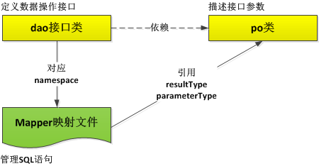
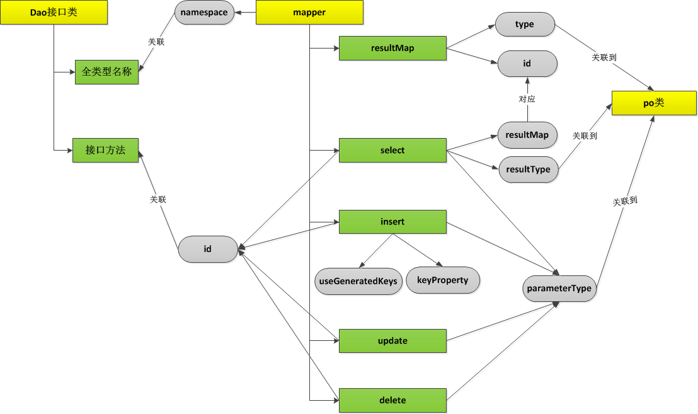

# 一、mybatis的mapper映射文件概述

MyBatis配置文件分为：mybatis配置文件和mapper配置文件。mybatis配置文件主要用来设计po类的别名，方便对po类的引用；mapper配置文件用来管理SQL语句。

在mybatis开发中，涉及到主要开发要素是:dao接口类，mapper映射文件，以及po类。它们之间的关系如下：



dao接口类中，定义了数据库操作的接口方法，主要包含增，删，改，查等接口方法；po类定义接口方法的参数，可使用po类保存查询结果，或者为insert，update方法提供数据集参数。操作数据库表的SQL语句保存在mapper映射文件中。mapper映射文件分别提供select,insert,update,delete xml元素，分别对应数据库的查询，插入，修改，删除操作。每一个xml元素通过id属性与dao接口类中的方法相互关联。

# 二、mapper文件的结构

mapper映射文件是xml格式的配置文件，由一系列具有层级关系的元素组成。并且通过元素的属性，这些元素之间具有关联关系。具体情况如下图所示：




在mapper映射文件中，主要包含如下配置元素：

* mapper元素

该元素是最顶层的配置元素，其属性namespace指向IDao类的全类型名，即：包路径+类名。

在mapper元素下面，包含如下子元素：resultMap元素，select元素，insert元素，update元素，delete元素。

* resultMap元素

建立数据库表的列名与po类的数据字段之间的映射关系。当po类的数据字段与数据库表不一致的时候，或者承载复杂查询结果的时候，使用resultMap配置；

* select元素

用来维护select语句。

* insert元素

用来维护insert语句。

* update元素

用来维护update语句。

* delete元素

用来维护delete语句。

常见的xml文件结构如下所示：

```xml
<?xml version="1.0" encoding="UTF-8"?>
<!DOCTYPE mapper PUBLIC "-//mybatis.org//DTD Mapper 3.0//EN" "http://mybatis.org/dtd/mybatis-3-mapper.dtd">
<mapper namespace="com.yuya.core.mapper.CCourseCollectionMapper">
  <resultMap id="BaseResultMap" type="com.yuya.common.entity.console.organ.CCourseCollection">
    <!--
      WARNING - @mbg.generated
    -->
    <id column="id" jdbcType="INTEGER" property="id" />
    <result column="title" jdbcType="VARCHAR" property="title" />
    <result column="cover_url" jdbcType="VARCHAR" property="coverUrl" />
    <result column="description" jdbcType="VARCHAR" property="description" />
    <result column="lecturer" jdbcType="VARCHAR" property="lecturer" />
    <result column="total_num" jdbcType="INTEGER" property="totalNum" />
    <result column="update_num" jdbcType="INTEGER" property="updateNum" />
    <result column="is_top" jdbcType="BIT" property="isTop" />
    <result column="create_time" jdbcType="TIMESTAMP" property="createTime" />
    <result column="update_time" jdbcType="TIMESTAMP" property="updateTime" />
    <result column="type" jdbcType="INTEGER" property="type" />
    <result column="is_deleted" jdbcType="BIT" property="isDeleted" />    
    <result column="content" jdbcType="LONGVARCHAR" property="content" />
  </resultMap>
  
  <sql id="Base_Column_List">
    id, title, cover_url, description, lecturer, total_num, update_num, is_top, create_time, 
    update_time, type, is_deleted,content
  </sql>
  
  <select id="findById" resultMap="BaseResultMap">
  	select <include refid="Base_Column_List"/> from c_course_collection where is_deleted = 0 and id = #{id}
  </select>
  ......
</mapper>
```
# 三、xml元素详解

## resultMap

使用resultMap配置节，建立po类的数据字段与数据库表的列名之间的映射关系。当po类的数据字段与数据库表的列名不一致的时候，可使用该配置。 resultMap的代码示例如下：
```xml
<resultMap type="UserInfo" id="userData">
        <id property="id" column="f_id" />
        <result property="name" column="f_name" />
        <result property="birth" column="f_birth" />
        <result property="salary" column="f_salary" />
</resultMap>
```

type属性执行po类的全类型名，即：包名+类名。如果在mybatis配置文件中，为po类建立了别名，那么type属性可以引用该别名。

id属性应该全局唯一，它被select元素的resultMap属性引用。

<id>子元素用来建立po数据字段与数据库表主键列之间的映射关系。

<result>子元素用来建立po数据字段与数据库表非主键列之间的映射关系。

property属性用来指定po类的数据字段名。例如：private String name；该定义中的name。

column属性用来指定数据库表的列名。

```xml
  <resultMap id="BaseResultMap" type="com.yuya.common.entity.console.msg.MBaby">
    <!--
      WARNING - @mbg.generated
    -->
    <id column="id" jdbcType="INTEGER" property="id" />
    <result column="ins_id" jdbcType="INTEGER" property="insId" />
    <result column="head_url" jdbcType="VARCHAR" property="headUrl" />
    <result column="baby_real_name" jdbcType="VARCHAR" property="babyRealName" />
    <result column="baby_nick_name" jdbcType="VARCHAR" property="babyNickName" />
    <result column="campus_id" jdbcType="INTEGER" property="campusId" />
    <result column="clazz_id" jdbcType="INTEGER" property="clazzId" />
  </resultMap>
```

## select

在mapper文件中，使用select元素来管理select语句。


### 返回单值

当查询结果返回一个单值的时候，其配置如下：
```xml
<select id="getUserCount" resultType="int">
  select count(*) from t_user
</select>
```
使用resultType属性指定返回结果的数据类型，这里可以是java基本数据类型，如：int,String等。

在IDao类中，接口方法定义如下：
```java
int getUserCount();
//方法的返回值类型是int，与resultType的值对应；方法的名称是getUserCount与id属性的值对应。
```
### 返回单对象

单对象的含义是：查询结果包含多个数据列，但只有一行数据。可以使用javabean或者map来保存查询结果。

#### 通过javabean返回单对象

通过javabean返回查询结果的配置如下：
```xml
<select id="getUserInfoById" resultMap="userData">
select * from t_user
where f_id = #{id}
</select>
```
当po类的数据字段与数据库表的列名完全一致的时候，可使用resultType=po类全类型名，或po类别名 的方式指定查询结果的类型。

当po类的数据字段与数据库表的列名不一致的时候，需要定义resultMap映射。在这种情况下，使用resultMap属性，该属性的值与<resultMap>元素的id属性的值相同。

resultMap与resultType不能同时使用。
    
在IDao类中，接口方法的定义如下：

```java
UserInfo getUserInfoById(int id)

//返回值的类型是UserInfo，通过<resultMap>元素的配置，将该类型映射到userData。在<select>元素中，通过resultMap属性引用userData.
```

#### 通过map返回单对象

当查询结果是一个单对象，但是没有定义po类的时候，可使用map来承载查询结果。map的key是数据库表的列名，value是该列对应的值。mapper映射文件的配置如下：
```xml
<select id="getUserInfoToMap" resultType="hashmap">
select * from t_user where f_id=#{id}
</select>
```
resultType属性的值设定为hashmap，或者map即可。IDao类中，接口方法定义如下：

```java
Map<String,Object> getUserInfoToMap(int id);
```

### 返回数据集

数据集的含义是：包含多行数据，每行数据包含多列。

#### 通过list返回数据集

当查询结果返回一个数据集的时候，mybatis会将查询结果放入list中，然后返回。在这种情况下,resultTpye或者resultMap属性指定的是list列表元素的类型，而非集合本身。mapper映射文件的配置如下：
```xml
<select id="listUserInfo" resultMap="userData">
select * from t_user
</select>
```
resultMap或者resultType可以设定为java bean ，也可设定为map。该配置形式与返回单对象相同，其差别在IDao类中的接口方法定义：

```java
list<UserInfo> listUserInfo();
//在定义接口方法的时候，需要使用list包装单值对象的类型。
```
 
#### 通过map返回数据集

该方式需要与注解@MapKey配合使用。map的key是：数据库表中的任意一列，一般选具有索引性质的列，如：id，name等。value是：po类的引用，或者另外一个map的引用。mapper配置文件的内容如下：
```
<select id="listUserInfoToMap" resultType="map">
select * from t_user
</select>
```

在IDao类中，接口方法的定义如下：

```java
@MapKey("f_id")
Map<BigInteger,Map<String,Object>> listUserInfoToMap();
```

在上面的示例中，value的值是map类型。value的值也可以是po类。在使用po类的时候，mapper映射文件的配置如下：

```xml
<select id="listUserInfo" resultMap="userData">
select * from t_user
</select>
```
在IDao类中，接口方法定义如下：

```java
@MapKey("id")
map<int,UserInfo> listUserInfo();
```

注：
resultType属性的值可以是如下情形：
>1.基本数据类型，如：int,String等；
>2.class数据类型，如：java bean，这里输入的是全类型名或者别名;
>3.map数据类型。包括：单对象和集合两种；
>4.集合数据类型，是集合元素的类型，而非集合本身。

resultMap的使用：
>该属性的值是：<resultMap>元素的id属性的值。只有当po数据字段与数据库表列名不一致的时候，才使用。