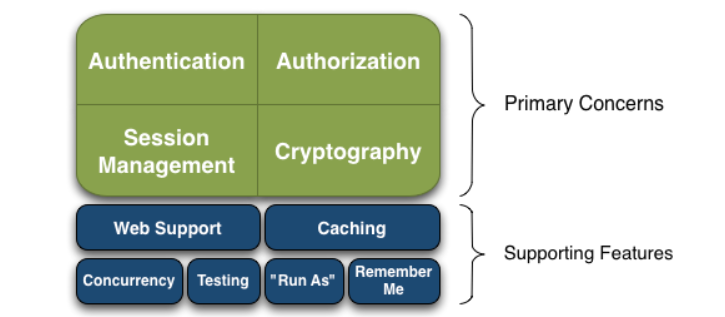
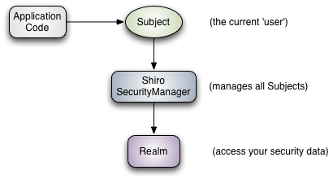
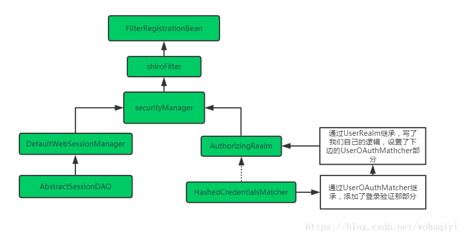

# 一、权限管理

只要有用户参与的系统一般都要有权限管理，权限管理实现对用户访问系统的控制，按照安全规则或者安全策略控制用户可以访问而且只能访问自己被授权的资源。

对权限的管理又分为两大类别：

用户认证和用户授权

## 用户认证

用户认证，用户去访问系统，系统要验证用户身份的合法性。最常用的用户身份验证的方法有：1、用户名密码方式、2、指纹打卡机、3、基于证书验证方法。

系统验证用户身份合法，用户方可访问系统的资源。

例如：
```
当我们输入了自己的淘宝的账户和密码，才能打开购物车用户认证的流程：

判断该资源能否不认证就能访问【登陆页面、首页】

如果该资源需要认证后才能访问，那么判断该访问者是否认证了

如果还没有认证，那么需要返回到【登陆页面】进行认证

认证通过后才能访问资源
```

从用户认证我们可以抽取出这么几个概念

subject主体：理解为用户,可能是程序，都要去访问系统的资源，系统需要对subject进行身份认证.

principal身份信息：通常是唯一的，一个主体还有多个身份信息，但是都有一个主身份信息（primary principal）【我们可以选择身份证认证、学生证认证等等都是我们的身份信息】

credential凭证信息：可以是密码 、证书、指纹。

总结：主体在进行身份认证时需要提供身份信息和凭证信息。

## 用户授权

用户授权，简单理解为访问控制，在用户认证通过后，系统对用户访问资源进行控制，用户具有资源的访问权限方可访问。

用户授权的流程
```
用户认证完成

用户访问资源，系统判断该用户是否有权限去操作该资源

如果该用户有权限才能够访问，如果没有权限就不能访问了

授权的过程可以简单理解为：主体认证之后，系统进行访问控制
```
subject必须具备资源的访问权限才可访问该资源..

权限/许可(permission) ：针对资源的权限或许可，subject具有permission访问资源，如何访问/操作需要定义permission，权限比如：用户添加、用户修改、商品删除。


# 二、Shiro介绍

Apache Shiro（读作“sheeroh”，即日语“城”）是一个开源安全框架，提供身份验证、授权、密码学和会话管理。Shiro框架直观、易用，同时也能提供健壮的安全性。

官网：https://shiro.apache.org/introduction.html
GitHub：https://github.com/apache/shiro



shiro安全的四大基石（上图中上层4个黄色部分）

* Authentication：认证，身份验证，有时称为“登录”，这是证明用户“我是谁”的行为。
  
* Authorization：授权，访问控制的过程，即确定“谁”有权访问“什么”。

* Session Management：会话管理，管理特定于用户的会话，即使在非web或EJB应用程序中也是如此。

* Cryptography：加密，使用密码算法保持数据安全，同时仍然易于使用

shiro使用的主要类：

Subject：主体，代表当前用户，当前登录用户的所有属性都可以通过该类获取

SecurityManager：安全管理器，判断Subject是否能登录、是否具有某些权限等等操作

Realm：数据访问器，shiro通过Realm访问数据库获取权限信息

ShiroFilterFactoryBean: 拦截器，用于确定权限；



在代码中的体现：当你对当前登录用户Subject进行操作时，Subject会与SecurityManager交互，SecurityManager会使用Realm查询权限。

网页安全的主要流程：

```
页面拦截的设置，系统中有些页面可以直接访问，有些页面需要登录才能访问，有些页面不仅需要登录还需要登录的用户有相关权限才能访问。

如果用户没登录直接访问需要登录或需要权限的页面，则调转到登录页面让用户登录。

用户登录认证后，访问需要权限的页面时，系统可以识别该用户是谁并鉴权。
```

通俗一点就是，如果你想让你开发的系统有用户登录功能、根据不同用户登陆进系统有不一样的功能，并且能够控制用户登录的一些状态，那就需要shiro这个东西，当然这只是shiro的一部分功能，对于我们一般开发的应用系统也就需要这两个功能了。

# 三、shiro实践第一步：创建数据库表

实现用户登录管理和权限验证管理的功能，一般需要五张表：

用户表：（记录登录用户的信息，如用户名、密码、邮箱、电话等）

角色表：（管理员、超级管理员、普通用户等，不同角色拥有不同权限）

权限表：（系统、模块、菜单、按钮等，基本上是前端页面的内容属性）

用户角色表：关联用户表和角色表

角色权限表：关联角色和权限；

# 四、shiro实践第二步：引入shiro依赖
```xml
<dependency>
    <groupId>org.apache.shiro</groupId>
    <artifactId>shiro-core</artifactId>
    <version>1.4.0</version>
</dependency>
<dependency>
    <groupId>org.apache.shiro</groupId>
    <artifactId>shiro-spring</artifactId>
    <version>1.4.0</version>
</dependency>
```

# 五、shiro实践第三步：实现shiro配置文件



该文件的第一个配置为FilterRegistrationBean。 

## FilterRegistrationBean

springboot注入过滤器有多种方式，一种是最简单的@WebFilter注解，一种就是下边的这种，写一个FilterRegistrationBean，然后将自定义过滤器set进去，下边是通过DelegatingFilterProxy代理的方式，注入容器中名字为shiroFilter 的过滤器，最后设置过滤器的规则。
```java
    @Bean
    public FilterRegistrationBean filterRegistrationBean() {
        FilterRegistrationBean filterRegistration = new FilterRegistrationBean();
        /**
        *DelegatingFilterProxy做的事情是代理Filter的方法，从application
        *context里获得bean,从下边可以理解到，它是将容器中名字为shiroFilter
        *的过滤器加入到过滤器注册bean中
        **/
        filterRegistration.setFilter(new DelegatingFilterProxy("shiroFilter")); 
        filterRegistration.setEnabled(true);
        filterRegistration.addUrlPatterns("/*"); //过滤规则，即所有的请求
        filterRegistration.setDispatcherTypes(DispatcherType.REQUEST);
        return filterRegistration;
    }
```

## shiroFilter配置

```java
    /**
     * 这个即是上边调用的shiroFilter过滤器，也就是shiro配置的过滤器
     * @return
     */
    @Bean(name = "shiroFilter")
    public ShiroFilterFactoryBean shiroFilter(){
        /**
        *MShiroFilterFactoryBean指向自定义过滤器，自定义过滤器对js/css等忽略
        **/
        ShiroFilterFactoryBean bean = new MyShiroFilterFactoryBean(); 
        bean.setSecurityManager(securityManager());
        bean.setLoginUrl("/login");
        bean.setUnauthorizedUrl("/unauthor");

        Map<String, Filter>filters = new LinkedHashMap<>();
        /**
        * shiro自己的过滤器,anon，表示不拦截的路径，authc,表示拦截的路径
        **/
        filters.put("anon", new AnonymousFilter());
        bean.setFilters(filters);
        /*
        *shiro配置过滤规则少量的话可以用hashMap,数量多了要用
        *LinkedHashMap,保证有序，原因未知。
        *,anon，表示不拦截的路径，authc,表示拦截的路径。匹配时，首先匹配
        *anon的，然后最后匹配authc
        **/
        Map<String, String> chains = new LinkedHashMap<>();
        chains.put("/login", "anon");
        chains.put("/unauthor", "anon");
        chains.put("/logout", "anon");
        chains.put("/weblogin", "anon");
        chains.put("/**", "authc"); 
        bean.setFilterChainDefinitionMap(chains);
        return bean;
    }
```
## MyShiroFilterFactoryBean 

以上的shiroFilter 配置中，引入了我们的第二个配置文件，名字为MyShiroFilterFactoryBean ，该类继承了ShiroFilterFactoryBean类，通过名字能知道，它是shiro的过滤器工厂类，而我们的MyShiroFilterFactoryBean 类就是一个自定义的shiro过滤器，为什么要自己写一个过滤器呢？

在当前的shiro框架中，无法拦截那种.js 、.css 、.html 、.jsp 等等带有. 的请求路径，对于前三种这种静态资源，我们可以不纳入shiro拦截，即可以在不登录的情况下访问成功，但是我们现在有这样的需求，即对.jsp 也要拦截起来，那就需要自定义shiro过滤器了，即现在MShiroFilterFactoryBean 类存在的意义。


在上边的配置中，其实就是自定义了一个shiro过滤器，然后对其进行了一些操作，其中bean.setLoginUrl("/login") 是在项目启动后，如果没有登录的情况下，会被shiro强制请求的路径，即为/login ；

另外，bean.setSecurityManager(securityManager()); 这句的配置，即引入设置shiro的控制中心，即securityManager ，安全管理器；即所有与安全有关的操作都会与securityManager交互；且它管理着所有Subject；可以看出它是Shiro的核心，它负责与后边介绍的其他组件进行交互，如果学习过SpringMVC，你可以把它看成DispatcherServlet前端控制器；关于subject ，你就理解为是每一个访问系统的用户对象即可，所有的访问用户的情况都是一种subject 的体现，它们又统一被securityManager 管理，这个在第一篇里已经说过。

## SecurityManager

设置shiro的控制中心，即securityManager ，安全管理器；所有与安全有关的操作都会与securityManager交互；且它管理着所有Subject；可以看出它是Shiro的核心，它负责与后边介绍的其他组件进行交互，如果学习过SpringMVC，你可以把它看成DispatcherServlet前端控制器；关于subject ，你就理解为是每一个访问系统的用户对象即可，所有的访问用户的情况都是一种subject 的体现，它们又统一被securityManager 管理。

```java
    /**
     * SecurityManager：安全管理器
     */
    @Bean("securityManager")
    public SecurityManager securityManager(UserRealm userRealm, SessionManager sessionManager) {
        DefaultWebSecurityManager securityManager = new DefaultWebSecurityManager();
        securityManager.setSessionManager(sessionManager);
        securityManager.setRealm(userRealm);
        return securityManager;
    }
```

## Realm

Realm：域，Shiro从Realm获取安全数据（如用户、角色、权限），可以把Realm看成DataSource，即安全数据源。SecurityManager要验证用户身份，需要从Realm获取相应的用户进行比较以确定用户身份是否合法；也需要从Realm得到用户相应的角色/权限进行验证用户是否能进行操作；UserRealm 类继承于AuthorizingRealm ，该类的作用其实有用户密码验证、权限授权等.
```java
package com.yuya.console.shiro.config;

import java.util.ArrayList;
import java.util.Arrays;
import java.util.HashSet;
import java.util.List;
import java.util.Objects;
import java.util.Set;

import org.apache.shiro.SecurityUtils;
import org.apache.shiro.authc.AuthenticationException;
import org.apache.shiro.authc.AuthenticationInfo;
import org.apache.shiro.authc.AuthenticationToken;
import org.apache.shiro.authc.LockedAccountException;
import org.apache.shiro.authc.SimpleAuthenticationInfo;
import org.apache.shiro.authc.UnknownAccountException;
import org.apache.shiro.authc.UsernamePasswordToken;
import org.apache.shiro.authc.credential.CredentialsMatcher;
import org.apache.shiro.authc.credential.HashedCredentialsMatcher;
import org.apache.shiro.authz.AuthorizationInfo;
import org.apache.shiro.authz.SimpleAuthorizationInfo;
import org.apache.shiro.realm.AuthorizingRealm;
import org.apache.shiro.subject.PrincipalCollection;
import org.apache.shiro.util.ByteSource;
import org.springframework.beans.factory.annotation.Autowired;
import org.springframework.stereotype.Component;

import com.alibaba.druid.util.StringUtils;
import com.yuya.common.constants.GeneralConstants;
import com.yuya.common.entity.console.sys.SysMenu;
import com.yuya.common.entity.console.sys.SysUser;
import com.yuya.console.service.sys.ISysDeptService;
import com.yuya.console.service.sys.ISysMenuService;
import com.yuya.console.service.sys.ISysUserService;
@Component
public class UserRealm extends AuthorizingRealm {

    @Autowired
    private ISysUserService sysUserService ;
    @Autowired
    private ISysMenuService sysMenuService ;
    @Autowired
    private ISysDeptService sysDeptService ;
    /**
     * 授权(验证权限时调用)
     * 获取用户权限集合
     */
    @Override
    public AuthorizationInfo doGetAuthorizationInfo
    (PrincipalCollection principals) {
        SysUser user = (SysUser)principals.getPrimaryPrincipal();
        if(user == null) {
            throw new UnknownAccountException("账号不存在"); //这里异常抛不出来
        }
        List<String> permsList;
        //默认用户拥有最高权限
        List<SysMenu> menuList = sysMenuService.listAll();
        permsList = new ArrayList<>(menuList.size());
        for(SysMenu menu : menuList){
            permsList.add(menu.getPerms());
        }
        //用户权限列表
        Set<String> permsSet = new HashSet<>();
        for(String perms : permsList){
            if(StringUtils.isEmpty(perms)){
                continue;
            }
            permsSet.addAll(Arrays.asList(perms.trim().split(",")));
        }
        SimpleAuthorizationInfo info = new SimpleAuthorizationInfo();
        info.setStringPermissions(permsSet);
        return info;
    }
    /**
     * 认证(登录时调用)
     * 验证用户登录
     */
    @Override
    protected AuthenticationInfo doGetAuthenticationInfo(
            AuthenticationToken authToken) throws AuthenticationException {
        UsernamePasswordToken token = (UsernamePasswordToken)authToken;
        //查询用户信息
        String username = token.getUsername();
        SysUser user = sysUserService.selectUserByLoginName(username);
        //账号不存在
        if(user == null) {
            throw new UnknownAccountException("账号或密码不正确");//这里异常抛不出来
        }
        //账号锁定
        if(user.getStatus() == 1){
            throw new LockedAccountException("账号已被锁定,请联系管理员");//这里异常抛不出来
        }
        
        user.setDept(sysDeptService.findById(user.getDeptId()));
        user.setInsId(GeneralConstants.ADMIN_DEPT_ID);
        // 机构管理员
        if (!Objects.equals(user.getDeptId(), GeneralConstants.ADMIN_DEPT_ID)) {
        	user.setInsId(!Objects.equals(user.getDept().getParentId(), GeneralConstants.ADMIN_DEPT_ID) ? user.getDept().getParentId() : user.getDept().getDeptId());
        }
        
        if (!Objects.equals(user.getDept().getParentId(), GeneralConstants.ADMIN_DEPT_ID)) {
        	user.setCampusId(user.getDept().getDeptId());
		}
		
        SimpleAuthenticationInfo info = new SimpleAuthenticationInfo(user, user.getPassword(), ByteSource.Util.bytes(user.getSalt()), getName());
        return info;
    }
    
    @Override
    public void setCredentialsMatcher(CredentialsMatcher credentialsMatcher) {
        HashedCredentialsMatcher shaCredentialsMatcher = new HashedCredentialsMatcher();
        shaCredentialsMatcher.setHashAlgorithmName(ShiroUtils.hashAlgorithmName);
        shaCredentialsMatcher.setHashIterations(ShiroUtils.hashIterations);
        super.setCredentialsMatcher(shaCredentialsMatcher);
    }
    
	/**
	 * 清理缓存权限
	 */
	public void clearCachedAuthorizationInfo() {
		this.clearCachedAuthorizationInfo(SecurityUtils.getSubject().getPrincipals());
	}
}
```

## SessionManager

SessionManager管理session的配置，比如，超时时间的设置等，基本上都是跟session相关的配置。另外，上边还有getSessionIdCookie() 方法的引用，众所周知，浏览器与后台系统交互的方式，是以后台存储session，然后将该session对应key，以字符串的形式返给浏览器，并在浏览器中以cookie 的形式记录起来，方便后续的访问，如果浏览器丢失了这个cookie，那就会失去与后台系统的联系，必须重新登录，才能重新再生成这个cookie

```java
/**
     * Session Manager：会话管理
     * 即用户登录后就是一次会话，在没有退出之前，它的所有信息都在会话中；
     * 会话可以是普通JavaSE环境的，也可以是如Web环境的；
     */
    @Bean("sessionManager")
    public SessionManager sessionManager(){
        DefaultWebSessionManager sessionManager = new DefaultWebSessionManager();
        //设置session过期时间
        sessionManager.setGlobalSessionTimeout(15 * 24 * 60 * 60 * 1000);
        sessionManager.setSessionValidationSchedulerEnabled(true);
        // 去掉shiro登录时url里的JSESSIONID
        sessionManager.setSessionIdUrlRewritingEnabled(false);
        return sessionManager;
    }
```
