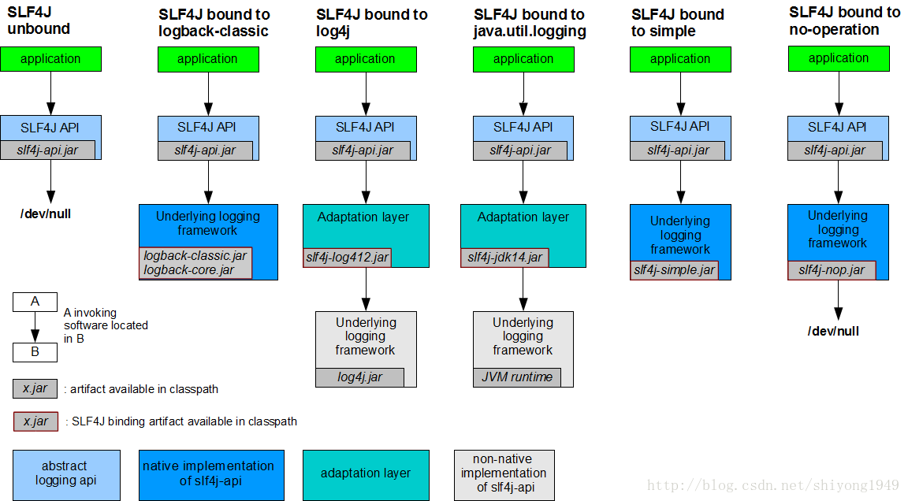

# 一、SLF4J介绍

SLF4J代表Simple Logging Facade for Java。它提供了Java中所有日志框架的简单抽象。因此，它使用户能够使用单个依赖项处理任何日志框架，例如：Log4j，Logback和JUL(java.util.logging)。可以在运行时/部署时迁移到所需的日志记录框架。

从设计模式的角度考虑，它是用来在log和代码层之间起到门面的作用。对用来来说只要使用slf4j提供的接口，即可隐藏日志的具体实现。这与jdbc和相似。使用jdbc也就避免了不同的具体数据库。使用了slf4j可以对客户端应用解耦。因为当我们在代码实现中引入log日志的时候，用的是接口，所以可以实时的更具情况来调换具体的日志实现类。这就是slf4j的作用。



可以支持字符串的拼接：

```java
public class LoggerTest {

    private static final Logger logger = LoggerFactory.getLogger(Tester.class);

    public static void main(String[] args) {
        logger.info("Current Time: {}", System.currentTimeMillis());
    }
}
```


官方网站：

https://www.slf4j.org/manual.html

# 二、SLF4J的使用

## 1.在pom.xml中添加依赖（或者手动导入上述3个jar包）
```xml
<dependency>
  <groupId>org.slf4j</groupId>
  <artifactId>slf4j-log4j12</artifactId>
  <version>1.8.0-alpha2</version>
</dependency>
```

## 2.配置log4j

在类路径下创建log4j.properties配置文件，这样log4j会自动加载配置文件。
```
# rootLogger参数分别为：根Logger级别，输出器stdout，输出器log
log4j.rootLogger = info,stdout,log

# 输出信息到控制台
log4j.appender.stdout = org.apache.log4j.ConsoleAppender
log4j.appender.stdout.layout = org.apache.log4j.PatternLayout
log4j.appender.stdout.layout.ConversionPattern = %d [%-5p] %l %rms: %m%n

# 输出DEBUG级别以上的日志到D://logs/debug.log
log4j.appender.log = org.apache.log4j.DailyRollingFileAppender
log4j.appender.log.DatePattern = '.'yyyy-MM-dd
log4j.appender.log.File = D://debug.log
log4j.appender.log.Encoding = UTF-8
#log4j.appender.log.Threshold = INFO
log4j.appender.log.layout = org.apache.log4j.PatternLayout
log4j.appender.log.layout.ConversionPattern = %d [%-5p] (%c.%t): %m%n
```

将log4j.properties放在类路径下是最简单的做法，当然也可以通过PropertyConfigurator在代码中加载或者通过web.xml加载。

## 测试代码
```java
import org.slf4j.Logger;
import org.slf4j.LoggerFactory;

public class LoggerTest {

    private static final Logger logger = LoggerFactory.getLogger(LoggerTest.class);

    public static void main(String[] args) {
        logger.info("Current Time: {}", System.currentTimeMillis());
        logger.info("Current Time: " + System.currentTimeMillis());
        logger.info("Current Time: {}", System.currentTimeMillis());
        logger.trace("trace log");
        logger.warn("warn log");
        logger.debug("debug log");
        logger.info("info log");
        logger.error("error log");
    }
}
```

# 三、切换日志系统

使用java自带的jdk logging
```java
<dependency>
  <groupId>org.slf4j</groupId>
  <artifactId>slf4j-jdk14</artifactId>
  <version>1.8.0-alpha2</version>
</dependency>
```

使用 log4j的logging

```xml
<dependency>
  <groupId>org.slf4j</groupId>
  <artifactId>slf4j-log4j12</artifactId>
  <version>1.8.0-alpha2</version>
</dependency>
```

# 四、Lombok的@Slf4j注解

在pom文件添加：
```xml
<dependency>
  <groupId>org.projectlombok</groupId>
  <artifactId>lombok</artifactId>
</dependency>
```

@Slf4j使用
```java
import lombok.extern.slf4j.Slf4j;

@Slf4j
public class LogExample {
}

以上将编译成
```java
public class LogExample {
 private static final org.slf4j.Logger log = org.slf4j.LoggerFactory.getLogger(LogExample.class);
}
```
