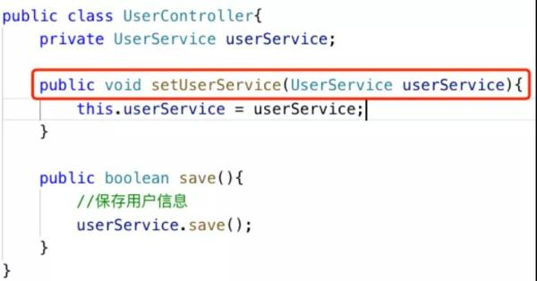
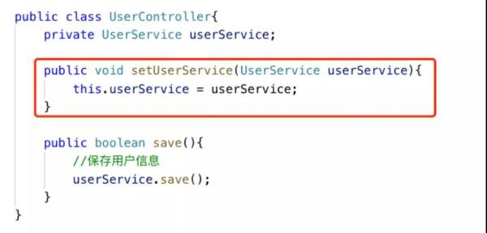
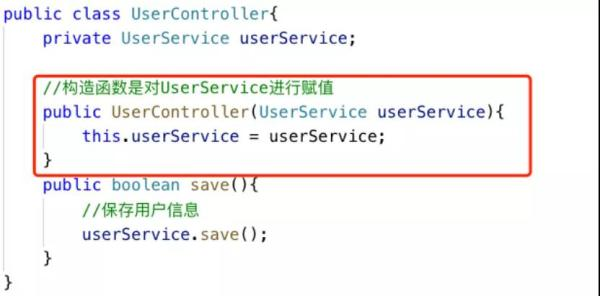
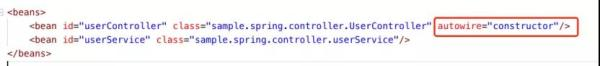
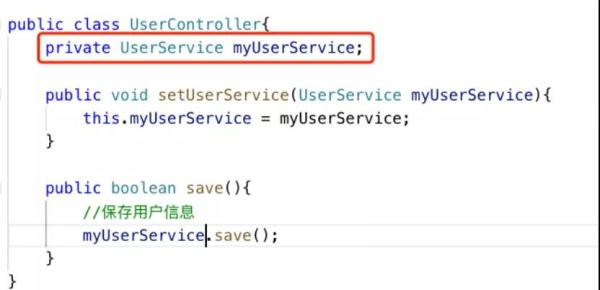
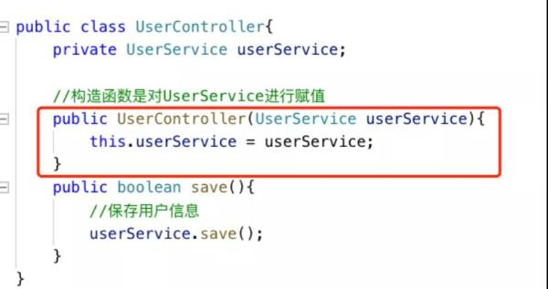
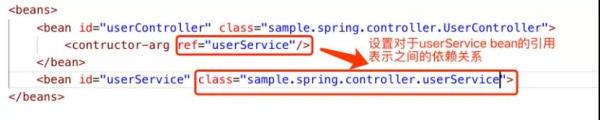
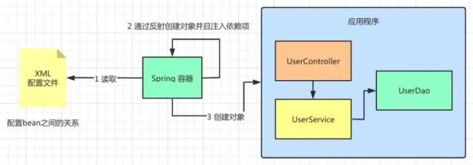
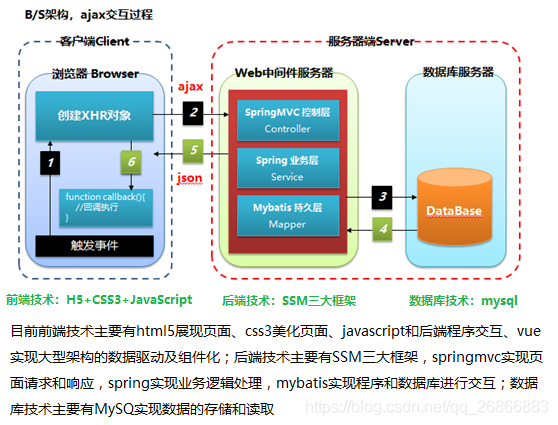

- [一、 Spring介绍](#一-spring介绍)
  - [1、Spring历史](#1spring历史)
  - [2、Spring组成部分](#2spring组成部分)
  - [3、Spring核心概念](#3spring核心概念)
- [二、Bean](#二bean)
  - [1、JavaBean](#1javabean)
  - [2、SpringBean](#2springbean)
  - [3、二者之间的区别](#3二者之间的区别)
- [三、依赖翻转（IOC）和依赖注入（DI）](#三依赖翻转ioc和依赖注入di)
  - [1、控制翻转和依赖注入的定义](#1控制翻转和依赖注入的定义)
  - [2、依赖注入的方式](#2依赖注入的方式)
  - [3、Spring IOC容器创建和管理Bean](#3spring-ioc容器创建和管理bean)
    - [3.1 Spring IoC容器的定义和作用](#31-spring-ioc容器的定义和作用)
    - [3.2 Spring中的IoC容器](#32-spring中的ioc容器)
      - [3.2.1 Spring BeanFactory 容器](#321-spring-beanfactory-容器)
      - [3.2.2 Spring ApplicationContext 容器](#322-spring-applicationcontext-容器)
    - [3.2、Spring IoC的依赖配置和自动装载](#32spring-ioc的依赖配置和自动装载)
    - [3.2.1 依赖配置](#321-依赖配置)
    - [3.2.2 依赖注入的自动装载](#322-依赖注入的自动装载)
  - [4、Spirng通过配置实现依赖注入](#4spirng通过配置实现依赖注入)
  - [4、Spring通过注解实现依赖注入](#4spring通过注解实现依赖注入)
- [四、切片编程（AOP）](#四切片编程aop)
  - [1、AOP介绍](#1aop介绍)
  - [2、AOP术语](#2aop术语)
  - [3、AOP注解](#3aop注解)
  - [4、AO编程例子](#4ao编程例子)
- [五、Spring读取资源文件和属性配置文件](#五spring读取资源文件和属性配置文件)
  - [1、使用Resource类和@Value注解注入资源文件](#1使用resource类和value注解注入资源文件)
  - [2、使用@PropertySource注解注入配置](#2使用propertysource注解注入配置)
  - [3、条件装配](#3条件装配)
- [六、Spring的MVC框架](#六spring的mvc框架)
  - [1、MVC层级结构](#1mvc层级结构)
  - [2、Controller、Service和Dao](#2controllerservice和dao)
    - [controller层](#controller层)
    - [service层：服务层](#service层服务层)
    - [Dao（mapper）层：数据访问层](#daomapper层数据访问层)
    - [三者之间的关系](#三者之间的关系)
  
# 一、 Spring介绍

## 1、Spring历史

Spring : 春天 --->给软件行业带来了春天。2002年，悉尼大学音乐学博士Rod Jahnson首次推出了Spring框架雏形interface21框架。2004年3月24日，Spring框架以interface21框架为基础，经过重新设计，发布了1.0正式版。

Spring理念 : 使现有技术更加实用 . 本身就是一个大杂烩 , 整合现有的框架技术。

* **官网 :** http://spring.io/

* **官方下载地址 :**  https://repo.spring.io/libs-release-local/org/springframework/spring/

* **GitHub :** https://github.com/spring-projects
* 
## 2、Spring组成部分


Spring 框架是一个分层架构，由 7 个定义良好的模块组成。Spring 模块构建在核心容器之上，核心容器定义了创建、配置和管理 bean 的方式 .

组成 Spring 框架的每个模块（或组件）都可以单独存在，或者与其他一个或多个模块联合实现。每个模块的功能如下：

* **核心容器：**

核心容器提供 Spring 框架的基本功能。核心容器的主要组件是 BeanFactory ，它是工厂模式的实现。 BeanFactory 使用控制反转（IOC） 模式将应用程序的配置和依赖性规范与实际的应用程序代码分开。

* **Spring 上下文：**

Spring 上下文是一个配置文件，向 Spring 框架提供上下文信息。Spring 上下文包括企业服务，例如 JNDI、EJB、电子邮件、国际化、校验和调度功能。

* **Spring AOP：** 

通过配置管理特性，Spring AOP 模块直接将面向切面的编程功能 , 集成到了 Spring框架中。所以，可以很容易地使 Spring 框架管理任何支持 AOP的对象。Spring AOP 模块为基于Spring 的应用程序中的对象提供了事务管理服务。通过使用 Spring AOP，不用依赖组件，就可以将声明性事务管理集成到应用程序中。

* **Spring DAO：**

JDBC DAO 抽象层提供了有意义的异常层次结构，可用该结构来管理异常处理和不同数据库供应商抛出的错误消息。异常层次结构简化了错误处理，并且极大地降低了需要编写的异常代码数量（例如打开和关闭连接）。Spring DAO 的面向 JDBC 的异常遵从通用的 DAO 异常层次结构。

* **Spring ORM：**

Spring 框架插入了若干个 ORM 框架，从而提供了 ORM 的对象关系工具，其中包括 JDO、Hibernate 和 iBatis SQL Map。所有这些都遵从 Spring 的通用事务和 DAO 异常层次结构。

* **Spring Web 模块：**

Web 上下文模块建立在应用程序上下文模块之上，为基于 Web 的应用程序提供了上下文。所以，Spring 框架支持与 Jakarta Struts 的集成。Web 模块还简化了处理多部分请求以及将请求参数绑定到域对象的工作。

* **Spring MVC 框架：**

MVC 框架是一个全功能的构建 Web 应用程序的 MVC 实现。通过策略接口，MVC 框架变成为高度可配置的，MVC 容纳了大量视图技术，其中包括 JSP、Velocity、Tiles、iText和 POI。


## 3、Spring核心概念

Spring是一个开源免费的框架 , 容器。Spring是一个轻量级的框架 , 非侵入式的。主要特性为：控制反转 IoC , 面向切面 Aop

***一句话概括：Spring是一个轻量级的控制反转(IoC)和面向切面(AOP)的容器（框架）。***

# 二、Bean

## 1、JavaBean

JavaBean是一种JAVA语言写的可重用组件。JavaBean符合一定规范写的Java类，是一种规范。它的方法命名，构造以及行为必须符合特定的要求：

1. 所有属性为private

2. 这个类必须具有一个公共的（public）无参构造函数

3. private属性必须提供public的getter和setter来给外部访问，并且方法的命名也必须遵循一定的命名规范

4. 这个类是可序列化的，要实现serializable接口

JavaBean，类必须是具体的和公共的，并且具有无参数的构造器。JavaBean 通过提供符合一致性设计模式的公共方法将内部域暴露成员属性。众所周知，属性名称符合这种模式，其他Java 类可以通过自身机制发现和操作这些JavaBean 的属性。


## 2、SpringBean

SpringBean是受Spring管理的对象  所有能受Spring容器管理的对象都可以成为SpringBean。

Spring中的bean，是通过配置文件、javaconfig等的设置，有Spring自动实例化，用完后自动销毁的对象。让我们只需要在用的时候使用对象就可以，不用考虑如果创建类对象（这就是spring的注入）。

## 3、二者之间的区别

* 用处不同：

　　传统javabean更多地作为值传递参数，而spring中的bean用处几乎无处不在，任何组件都可以被称为bean。

* 写法不同：

　　传统javabean作为值对象，要求每个属性都提供getter和setter方法；但spring中的bean只需为接受设值注入的属性提供setter方法。

* 生命周期不同：

　　传统javabean作为值对象传递，不接受任何容器管理其生命周期；spring中的bean由spring管理其生命周期行为。

# 三、依赖翻转（IOC）和依赖注入（DI）

## 1、控制翻转和依赖注入的定义

在我们的开发实践中，随处可见一个类的定义或者实现需要用到另外一个或多个类。例如：

```java
public class Engine {
    public Engine() {
    }
}

public class Car{
	private Engine engine;  //在Car类中包含了一个Engine类
	
    public Car() {
	}
}
```

再或者：

```java
public class Teacher{
	public int id；
	public String name;
	
    public Teacher() {

    }
}

public class Student{
	private int teacherId  //在Student类中需要Teacher类的信息
	
	public Student(Teacher teacher) {
		teacherId = teacher.id;
	}
}
```

这种一个类对于另外一个或多个类的引用就是依赖。这样的依赖贯穿于我们每天的coding之中。上面的例子中，我们可以说Teacher类就是Student类的依赖项，Engine类就是Car类的依赖项。或者说，“学校”类依赖于“学生”类，“汽车”类依赖于“引擎”类。

为目标类提供依赖的方式可以分为两种：

* **直接将依赖项的构造方式暴露出来，在目标类中直接调用依赖项的构造方法。**

比如：

```java
public class Car{
	private Engine engine;
	
	public Car() {
		engine = new Engine(); //直接调用依赖项的构造方法
	}
}
```
这里，car对象需要了解Engine对象的构造方法，engine对象和car对象耦合在了一起。


* **将依赖对象和其构造方式解耦，通过其他的方式传递依赖给目标调用者，即依赖是被“注入”进来的。**

比如：

```java
public class Car{
	private Engine engine;
	
	public Car() {
	}
	
	public void setEngine(Engine engine) {//通过参数传递的方式实现依赖
		this.engine = engine;
	}
}
```
这用依赖实现方式就称为依赖注入。

显然，相比于前者，依赖注入的方式有更明显的优点：

- 构造和使用分离：
将依赖项和目标调用者解耦，当依赖项的构造方式改变时，调用者不需要做任何代码上的改动。

- 便于对依赖项单元测试：
因为实现了依赖类和目标类的解耦，依赖注入更方便做单元测试，我们可以很容易地为上面的类编写单元测试的案例。

-  便于独立/并行开发模块化的代码.
依赖注入相当于给目标调用类提供了一个依赖项的接口，目标类和依赖类可以并行开发自己的模块，不会互相干扰。

## 2、依赖注入的方式

通常依赖注入有以下四种方式

- 1、通过构造方法注入：
```java
public class Car{    
	Engine engine;    
	public void Car(Engine engine) {  //通过带参数的构造器实现依赖注入      
		this.engine = engine;    
	}
}
```
- 2、通过set方法注入
```java
public class Car{    
	Engine engine;    
	public void setEngine(Engine engine) { //通过set方法实现依赖注入        
		this.engine = engine;    
	}
}
```
- 3、通过接口注入：
```java
interface EngineInterface {    
	public void engine(Engine engine);
}

public class Car implements EngineInterface {    
	Engine engine;        

	@override      
	public void engine(Engine engine) {            
		this.engine = engine;        
	}  
}
```

- 4、通过注解的方式注入：
 ```java
 public Car {    
	//需要依赖注入框架的支持，如Dagger2    
	@inject    
	Engine engine;    

	public Car() {} {
	}
}
 ```

## 3、Spring IOC容器创建和管理Bean

* 不使用Spring 依赖注入实现Java web

假设需要通过 RESTFUL 的方式访问用户信息(User)。

用户请求一个UserController获取User信息，UserController会调用UserService，在UserService中处理User的业务逻辑。同时UserService会调用UserDao，UserDao负责调用数据库并返回用户需要的信息。


在不采用依赖注入的情况下，我们直接创建需要依赖的对象。


* Spring IOC如何实现依赖注入和控制反转

IoC(Inversion of Control)也称为控制反转，也就是对象定义其依赖关系的控制反转。

在不引入IOC的情况下，对象的使用方式为：谁使用谁创建，例如上面的例子中 UserController 需要使用 UserService，于是就由 UserController 创建 UserService 的实例。这样增加了系统对象间的耦合性。

引入 IoC 以后，这个创建过程发生的反转。 Spring IoC引入了SPring容器的概念，即系统中所有被依赖的对象，有Spring容器完成创建。对象只要标注依赖，Spring容器会通过配置决定对象的依赖关系，并创建这些依赖，降低了对象间的耦合程度。

创建依赖对象的控制权从对象的使用者转换为 Spring 容器，就成为控制反转。也就是对象之间的依赖过程发生了变化，由原来的主动创建，变成了现在被动关联(因为 Spring 容器的参与)，这种控制权颠的现象被称为控制反转。

### 3.1 Spring IoC容器的定义和作用

Spring IoC 容器将创建对象，通过配置设定它们之间的依赖关系，并管理它们的生命周期(从创建到销毁)。

Spring IoC 容器管理的对象被称为 Spring Beans，也就是上面例子中提到的 UserController 和 UserService。

通过阅读配置文件元数据提供的指令，容器知道对哪些对象进行实例化，配置和组装。

配这里的置元数据就是上面例子的 XML，不过处理 XML 的配置之外还可以通过 Java 注释或 Java 代码来表示，大家可以理解为一种配置对象之间关系的方式。

### 3.2 Spring中的IoC容器 

说了这么多的 Spring IoC 容器的作用，在 Spring 中实现 IoC 容器的实际代表者是谁呢?

这里介绍两类 Spring IoC 容器的代表者，分别是：

#### 3.2.1 Spring BeanFactory 容器

它是最简单的容器，用 org.springframework.beans.factory.BeanFactory 接口来定义。

BeanFactory 或者相关的接口，如 BeanFactoryAware，InitializingBean，DisposableBean，在 Spring 中仍然存在具有大量的与 Spring 整合的第三方框架的反向兼容性的目的。

#### 3.2.2 Spring ApplicationContext 容器

添加了更多的企业特定的功能，例如从一个属性文件中解析文本信息的能力，发布应用程序事件给感兴趣的事件监听器的能力。

该容器是由 org.springframework.context.ApplicationContext 接口定义。

由于 ApplicationContext 容器包括 BeanFactory 容器的所有功能，同时 BeanFactory 适用于轻量级应用。

这里我们将目光放到 ApplicationContext 容器上，看看它是如何实现 Spring IoC 容器的功能的。

由于 ApplicationContext 是一个接口，针对它有几种不同的实现，这些实现会针对不同使用场景，以下列出三种不同实现：

* FileSystemXmlApplicationContext：

实现了从 XML 文件中加载 bean。初始化该类的时候需要提供 XML 文件的完整路径。

* ClassPathXmlApplicationContext：

也实现了 XML 文件中加载 bean，与上面一种方式不同的是：不需要提供 XML 文件的完整路径，只需正确配置 CLASSPATH 环境变量即可，容器会从 CLASSPATH 中搜索 bean 配置文件。

* WebXmlApplicationContext：

实现了在一个 web 应用程序的范围内加载在 XML 文件中已被定义的 bean。

由于篇幅原因，这里我们针对 FileSystemXmlApplicationContext 实现 Spring IoC 容器进行说明。


如图所示：

在使用 FileSystemXmlApplicationContext 实现类之前需要引入相关的包，由于其是接口 ApplicationContext 的实现类，因此需要引入 ApplicationContext 的包，以及自身 FileSystemXmlApplicationContext 的包。


在进行 FileSystemXmlApplicationContext 实例化时传入 XML 文件的地址，也就是上文中配置 bean 对象的 XML 文件地址，这里是“C:/Test/src/Beans.xml”。


最后通过 FileSystemXmlApplicationContext 所带的 getBean 方法，通过传入 bean id 的方式获取 bean 对象的实例，这里传入“userController”，从而调用 userController 中的 save 方法完成业务。

### 3.2、Spring IoC的依赖配置和自动装载

### 3.2.1 依赖配置

* 通过构造函数来注入依赖


通过构造函数来注入依赖的例子可以参加上面的举例。


* 通过set方法来注入依赖


与构造函数注入方式不同的是，在 UserController 中加入了一个 setUserService 的方法来设置 UserService 的属性，传入的参数依旧是 UserService。




### 3.2.2 依赖注入的自动装载

为了减少 XML 配置的数量，Spring 容器可以在不使用 和 <:property>元素的情况下配置 bean 之间的关系， 这种注入的方式称为自动装配。

下面我们来看看几种自动装配的方式：

* byType

这种方式由属性数据类型自动装配。 

如果在类中定义了与其他类的依赖关系，那么 Spring 容器在 XML 配置文件中会通过类型寻找对应依赖关系的 bean，然后与之关联。这个过程容器会尝试匹配和连接属性的类型。


例如 bean A 定义了 X 类型的属性， Spring 会在 ApplicationContext 中寻找一个类型为 X 的 bean，并将其注入 bean A。


如果还是觉得抽象，我们看下面的例子，如图 11 所示，UserController 设置 UserService 属性时定义了与 UserService 的依赖关系。



在 XML 配置文件中 UserController 就不需要使用 property 属性定义与 UserService 之间的关系，取而代之的是使用 autowire=“byType” 的方法。


容器通过类中 setUserService 传入的 UserService 类型自动在配置文件中寻找 UserService 对应的类型，从而完成 UserController 和 UserService 依赖关系，也就是依赖注入，这种方式也是基于类型的自动装载。

* constructor

用于构造函数参数类型的自动加载

有了 byType 的基础这个很好理解，例如 bean A 的构造函数接受 X 类型的参数，容器会在 XML 寻找 X 类型的 bean，并将其注入到 bean A 的构造函数中。

如图 所示，UserController 在构造函数中定义 UserService 作为初始化参数，确定了 UserController 对 UserService 的依赖。



在 XML 配置文件中 UserController 只需要设置 autowire=“constructor”。



告诉容器通过 UserController 类中的构造方法将 UserService 注入到 UserController 中，完成 UserController 和 UserService 依赖关系，这种方式也是基于构造器的自动装载。

* byName

通过指定特定的 bean 名称，容器根据名称自动选择 bean 属性，完成依赖注入


例如：bean A 定义了一个名为 X 的属性，容器会在 XML 寻找一个名为 X 的 bean，将其注入到 bean A 中。

如图所示，UserController 中定义了一个名为 myUserService 的成员属性，其类型是 UserService。




在 XML 的配置中 UserController 的 autowire 配置了“byName”。


此时容器会根据类中定义的 myUserService 成员属性(变量)自动关联到 UserService，在 UserController 中 setUserService 时自动装载 UserService 的实例。

## 4、Spirng通过配置实现依赖注入

回顾上面的例子，如果采用Spring IoC，我们可以这样做：

**step1：首先，将controller直接创建service的工作，改为通过controller的构造函数的方式进行依赖注入：**




**step2：然后，我们在一个xml文件里，将Controller和Service之间的依赖关系进行描述：**



Spring IoC 会通过一个 XML 文件配置对象之间的关系。

如图所示，在 beans 的标签中，定义了两个 bean，分别是 UserController 和 UserService。在 Class 属性中定义了 Class 的全程(包含 Namespace)。

需要注意的是，在 UserController的bean 定义中指定了 contructor-arg 的 ref 为 UserService。

这里的含义是在 UserController 的构造函数中会引入 UserService，从而说明两者之间的依赖关系，也就是 UserController 会依赖 UserService。

**step3：配置好依赖关系后，:Spring容器完成 UserService 的初始化。**


**step4：在 UserController 需要使用的时候直接使用这个 UserService 实体就行了。**

总结：


* Spring 容器会读取 XML 配置文件中的信息，获取 Bean 之间的依赖关系。


* Spring 容器通过反射机制创建对象的实例，由于 Spring 容器管理所有注册 Bean 因此为后续建立它们之间的依赖关系打下基础。


* Spring 容器通过 Bean 之间的依赖关系创建实例，同时保证 Bean 在使用依赖项的时候直接过去对应的实例，而不用自己去创建实例。

简单地说， Spring IoC 做的事情就是管理和创建 Bean 的实例，同时保证 Bean 之间的依赖关系。



## 4、Spring通过注解实现依赖注入


使用Spring的IoC容器，实际上就是通过类似XML这样的配置文件，把我们自己的Bean的依赖关系描述出来，然后让容器来创建并装配Bean。一旦容器初始化完毕，我们就直接从容器中获取Bean使用它们。


使用XML配置的优点是所有的Bean都能一目了然地列出来，并通过配置注入能直观地看到每个Bean的依赖。它的缺点是写起来非常繁琐，每增加一个组件，就必须把新的Bean配置到XML中。


有没有其他更简单的配置方式呢？


有！我们可以使用Annotation配置，可以完全不需要XML，让Spring自动扫描Bean并组装它们。


我们把上一节的示例改造一下，先删除XML配置文件，然后，给UserService和MailService添加几个注解。

首先，我们给MailService添加一个@Component注解：

```java

@Component
public class UserService {
    ...
}
```

这个@Component注解就相当于定义了一个Bean，它有一个可选的名称，默认是userService，即小写开头的类名。

然后，我们给UserController添加一个@Component注解和一个@Autowired注解：

```java

@Component
public class UserController {

    @Autowired
    USerService userService;

    ...
}
```
使用@Autowired就相当于把指定类型的Bean注入到指定的字段中。

和XML配置相比，@Autowired大幅简化了注入，因为它不但可以写在set()方法上，还可以直接写在字段上，甚至可以写在构造方法中：

```java
@Component
public class UserController {
    UserService userService;

    public UserController(@Autowired UserService userService) {
        this.userService = userService;
    }
    ...
}
```
我们一般把@Autowired写在字段上，通常使用package权限的字段，便于测试。

最后，编写一个AppConfig类启动容器：

```
@Configuration
@ComponentScan
public class AppConfig {
    public static void main(String[] args) {
        ApplicationContext context = new AnnotationConfigApplicationContext(AppConfig.class);
        UserController userController = context.getBean(UserController.class);
        User user = userService.login("bob@example.com", "password");
        System.out.println(user.getName());
    }
}
```

除了main()方法外，AppConfig标注了@Configuration，表示它是一个配置类，因为我们创建ApplicationContext时：

```
ApplicationContext context = new AnnotationConfigApplicationContext(AppConfig.class);
```

使用的实现类是AnnotationConfigApplicationContext，必须传入一个标注了@Configuration的类名。

此外，AppConfig还标注了@ComponentScan，它告诉容器，自动搜索当前类所在的包以及子包，把所有标注为@Component的Bean自动创建出来，并根据@Autowired进行装配。

整个工程结构如下：

spring-ioc-annoconfig
├── pom.xml
└── src
    └── main
        └── java
            └── com
                └── itranswarp
                    └── learnjava
                        ├── AppConfig.java
                        └── service
                            ├── MailService.java
                            ├── User.java
                            └── UserService.java


- 使用Annotation配合自动扫描能大幅简化Spring的配置，我们只需要保证：
 
- 每个Bean被标注为@Component并正确使用@Autowired注入；
 
- 配置类被标注为@Configuration和@ComponentScan；
 
- 所有Bean均在指定包以及子包内。

使用@ComponentScan非常方便，但是，我们也要特别注意包的层次结构。通常来说，启动配置AppConfig位于自定义的顶层包（例如com.itranswarp.learnjava），其他Bean按类别放入子包。


# 四、切片编程（AOP）

## 1、AOP介绍

AOP（Aspect Oriented Programming）意为：面向切面编程，通过预编译方式和运行期动态代理实现程序功能的统一维护的一种技术。AOP是OOP的延续，是软件开发中的一个热点，也是Spring框架中的一个重要内容，是函数式编程的一种衍生范型。利用AOP可以对业务逻辑的各个部分进行隔离，从而使得业务逻辑各部分之间的耦合度降低，提高程序的可重用性，同时提高了开发的效率。

在面向切面编程的思想里面，把功能分为两种：

核心业务：登陆、注册、增、删、改、查、都叫核心业务；

周边功能：与业务无关，却为业务模块所共同调用的逻辑或责任如：日志、事务管理等；

在面向切面编程中，核心业务功能和周边功能是分别独立进行开发，两者不是耦合的。AOP能够将周边功能（例如事务处理、日志管理、权限控制等）封装起来，在执行核心业务之前或之后来执行，把切面功能和核心业务功能 "编织" 在一起，这就叫AOP。简单来说的话，Spring使用容器来管理类，（AOP）就是在执行这些容器的时候提前或者延迟的时间段来执行周边功能的方法。

## 2、AOP术语

* 连接点（Joinpoint）
  
程序执行的某个特定位置：如类开始初始化前、类初始化后、类某个方法调用前、调用后、方法抛出异常后。一个类或一段程序代码拥有一些具有边界性质的特定点，这些点中的特定点就称为“连接点”。Spring仅支持方法的连接点，即仅能在方法调用前、方法调用后、方法抛出异常时以及方法调用前后这些程序执行点织入通知。连接点由两个信息确定：第一是用方法表示的程序执行点；第二是用相对点表示的方位。

* 切点（Pointcut）

每个程序类都拥有多个连接点，如一个拥有两个方法的类，这两个方法都是连接点，即连接点是程序类中客观存在的事物。AOP通过“切点”定位特定的连接点。连接点相当于数据库中的记录，而切点相当于查询条件。切点和连接点不是一对一的关系，一个切点可以匹配多个连接点。在Spring中，切点通过org.springframework.aop.Pointcut接口进行描述，它使用类和方法作为连接点的查询条件，Spring AOP的规则解析引擎负责切点所设定的查询条件，找到对应的连接点。其实确切地说，不能称之为查询连接点，因为连接点是方法执行前、执行后等包括方位信息的具体程序执行点，而切点只定位到某个方法上，所以如果希望定位到具体连接点上，还需要提供方位信息。

* 通知（Advice）

通知是织入到目标类连接点上的一段程序代码，在Spring中，通知除用于描述一段程序代码外，还拥有另一个和连接点相关的信息，这便是执行点的方位。结合执行点方位信息和切点信息，我们就可以找到特定的连接点。
通知有以下几种：

```
前置通知(Before advice):
在切入点匹配的方法执行之前运行。使用@Before注解来声明

返回后通知(After returning advice):
在切入点匹配的方法返回的时候执行。使用@AfterReturning注解来声明

抛出后通知(After throwing advice):
在切入点匹配的方法执行时抛出异常的时候运行。使用 @AfterThrowing 注解来声明

后置通知(After(finally)advice):
不论切入点匹配的方法是正常结束的，还是抛出异常结束的，在它结束后(finally)后通知(After(finally)advic)都会运行。使用@After注解来声明。这个通知必须做好处理正常返回和异常返回两种情况。通常用来释放资源。

环绕通知(Around Advice):
环绕通知既在切入点匹配的方法执行之前又在执行之后运行。并且，它可以决定这个方法在什么时候执行，如何执行，甚至是否执行。在环绕通知中，除了可以自由添加需要的横切功能以外，还需要负责主动调用连接点(通过 proceed)来执行激活连接点的程序。请尽量使用最简单的满足你需求的通知。（比如如果前置通知也可以适用的情况下，就不要使用环绕通知）。环绕通知使用 @Around 注解来声明。而且该通知对应的方法的第一个参数必须是 ProceedingJoinPoint 类型 。在通知体内（即通知的具体方法内），调用 ProceedingJoinPoint 的 proceed() 方法来执行连接点方法 。
```

* 目标对象（Target Object）
  
通知逻辑的织入目标类。如果没有AOP，目标业务类需要自己实现所有逻辑，而在AOP的帮助下，目标业务类只实现那些非横切逻辑的程序逻辑，而性能监视和事务管理等这些横切逻辑则可以使用AOP动态织入到特定的连接点上。

* 引入（Introduction）

引入是一种特殊的增强，它为类添加一些属性和方法。这样，即使一个业务类原本没有实现某个接口，通过AOP的引介功能，我们可以动态地为该业务类添加接口的实现逻辑，让业务类成为这个接口的实现类。

* 织入（Weaving）

织入是将通知添加到目标类具体连接点上的过程。AOP像一台织布机，将目标类、通知或引入通过AOP这台织布机天衣无缝地编织到一起。根据不同的实现技术，AOP有三种织入的方式：

编译期织入，这要求使用特殊的Java编译器。
类装载期织入，这要求使用特殊的类装载器。
动态代理织入，在运行期为目标类添加增强生成子类的方式。
Spring采用动态代理织入，而AspectJ采用编译期织入和类装载期织入。

* 代理（Proxy）

一个类被AOP织入通知后，就产出了一个结果类，它是融合了原类和增强逻辑的代理类。根据不同的代理方式，代理类既可能是和原类具有相同接口的类，也可能就是原类的子类，所以我们可以采用调用原类相同的方式调用代理类。

* 切面（Aspect）

切面由切点和通知（引入）组成，它既包括了横切逻辑的定义，也包括了连接点的定义，Spring AOP就是负责实施切面的框架，它将切面所定义的横切逻辑织入到切面所指定的连接点中。


## 3、AOP注解

| 注解	| 解释	| 应用 |
| ---- | ---- | ---- |
|@Aspect|表示当前类是一个切面类|标注在类上|
|@PointCut|切入点|被@PointCut标注的方法的实际内容其实并不重要，实际上应该是空的，该方法本身只是一个标识|
|@Before|前置通知|即在某个连接点之前执行通知|
|@AfterReturning|后置通知|即在某个连接点正常完成后执行通知，通常在一个匹配的方法返回的时候执行|
|@AfterThrowing|异常通知|即在方法抛出异常退出时执行通知|
|@After|最终通知|即某个连接点退出时执行通知|
|@Around|环绕通知|它是最强大也是最麻烦的通知，它可以在方法调用前后完成自定义的行为，它可以自己选择是否继续执行连接点或者直接返回或者抛出异常来结束执行|

## 4、AO编程例子

* *添加maven依赖

首先做的就是添加aop依赖，如果是Springboot项目，则默认已经使用了spring-boot-web依赖，可以不用添加了。
```xml
<dependency>
    <groupId>org.springframework.boot</groupId>
    <artifactId>spring-boot-starter-aop</artifactId>
</dependency>
```

* @EnableAspectJAutoProxy

在spring中我们可以通过@EnableAspectJAutoProxy来启用，如果是Springboo项目，则在spring boot中的启动类上不需要添加该注解。

**要注入的类**

```java
package com.demo.spring.dao;

import org.springframework.stereotype.Component;

@Component
public class TestDao {

    public void query(){
        System.out.println("dao-query ...");
    }
}
```

**切片类**

```java
package com.demo.spring.config;

import org.aspectj.lang.annotation.After;
import org.aspectj.lang.annotation.Aspect;
import org.aspectj.lang.annotation.Before;
import org.aspectj.lang.annotation.Pointcut;
import org.springframework.stereotype.Component;

@Aspect
@Component
public class AspectJTest {

    @Pointcut("execution(* com.demo.spring.dao.*.*(..))")
    public void pointCut(){
        System.out.println("point cut");
    }

    @After("com.demo.spring.config.AspectJTest.pointCut()")
    public void after(){
        System.out.println("after advice");
    }

    @Before("com.demo.spring.config.AspectJTest.pointCut()")
    public void before(){
        System.out.println("before advice");
    }
}
```

**配置类**

```java
package com.demo.spring.config;

import org.springframework.context.annotation.ComponentScan;
import org.springframework.context.annotation.Configuration;
import org.springframework.context.annotation.EnableAspectJAutoProxy;

@Configuration
@EnableAspectJAutoProxy
@ComponentScan("com.demo.spring")
public class AppConfig {
}
```

**主入口**
```java
package com.demo.spring.test;

import com.demo.spring.config.AppConfig;
import com.demo.spring.dao.TestDao;
import org.springframework.context.annotation.AnnotationConfigApplicationContext;

public class AopTest {
    public static void main(String[] args) {
        AnnotationConfigApplicationContext context = new AnnotationConfigApplicationContext(AppConfig.class);
        TestDao dao = context.getBean(TestDao.class);
        dao.query();
    }
}
```

# 五、Spring读取资源文件和属性配置文件

## 1、使用Resource类和@Value注解注入资源文件

在Java程序中，我们经常会读取配置文件、资源文件等。使用Spring容器时，我们也可以把“文件”注入进来，方便程序读取。

例如，AppService需要读取logo.txt这个文件，通常情况下，我们需要写很多繁琐的代码，主要是为了定位文件，打开InputStream。

Spring提供了一个org.springframework.core.io.Resource类（注意不是javax.annotation.Resource），它可以像String、int一样使用@Value注入：

```java

@Component
public class AppService {
    
    @Value("classpath:/logo.txt")
    private Resource resource;

    private String logo;

    @PostConstruct
    public void init() throws IOException {
        try (var reader = new BufferedReader(
                new InputStreamReader(resource.getInputStream(), StandardCharsets.UTF_8))) {
            this.logo = reader.lines().collect(Collectors.joining("\n"));
        }
    }
}
```

注入Resource最常用的方式是通过classpath，即类似classpath:/logo.txt.表示在classpath中搜索logo.txt文件，然后，我们直接调用Resource.getInputStream()就可以获取到输入流，避免了自己搜索文件的代码。

也可以直接指定文件的路径，例如：

```java

@Value("file:/path/to/logo.txt")
private Resource resource;

```
但使用classpath是最简单的方式。上述工程结构如下：
```
spring-ioc-resource
├── pom.xml
└── src
    └── main
        ├── java
        │   └── com
        │       └── itranswarp
        │           └── learnjava
        │               ├── AppConfig.java
        │               └── AppService.java
        └── resources
            └── logo.txt
```

使用Maven的标准目录结构，所有资源文件放入src/main/resources即可。

## 2、使用@PropertySource注解注入配置

在开发应用程序时，经常需要读取配置文件。最常用的配置方法是以key=value的形式写在.properties文件中。

例如，MailService根据配置的app.zone=Asia/Shanghai来决定使用哪个时区。要读取配置文件，我们可以使用上一节讲到的Resource来读取位于classpath下的一个app.properties文件。但是，这样仍然比较繁琐。

Spring容器还提供了一个更简单的@PropertySource来自动读取配置文件。我们只需要在@Configuration配置类上再添加一个注解：

```java
@Configuration
@ComponentScan
@PropertySource("app.properties") // 表示读取classpath的app.properties
public class AppConfig {
    @Value("${app.zone:Z}")
    String zoneId;

    @Bean
    ZoneId createZoneId() {
        return ZoneId.of(zoneId);
    }
}
```

Spring容器看到@PropertySource("app.properties")注解后，自动读取这个配置文件，然后，我们使用@Value正常注入：

```java
@Value("${app.zone:Z}")
String zoneId;
```

注意注入的字符串语法，它的格式如下：

"${app.zone}"表示读取key为app.zone的value，如果key不存在，启动将报错；

"${app.zone:Z}"表示读取key为app.zone的value，但如果key不存在，就使用默认值Z。

这样一来，我们就可以根据app.zone的配置来创建ZoneId。

还可以把注入的注解写到方法参数中：

```java
@Bean
ZoneId createZoneId(@Value("${app.zone:Z}") String zoneId) {
    return ZoneId.of(zoneId);
}
```

可见，先使用@PropertySource读取配置文件，然后通过@Value以${key:defaultValue}的形式注入，可以极大地简化读取配置的麻烦。

另一种注入配置的方式是先通过一个简单的JavaBean持有所有的配置，例如，一个SmtpConfig：

```java
@Component
public class SmtpConfig {
    @Value("${smtp.host}")
    private String host;

    @Value("${smtp.port:25}")
    private int port;

    public String getHost() {
        return host;
    }

    public int getPort() {
        return port;
    }
}
```

然后，在需要读取的地方，使用#{smtpConfig.host}注入：

```java
@Component
public class MailService {
    @Value("#{smtpConfig.host}")
    private String smtpHost;

    @Value("#{smtpConfig.port}")
    private int smtpPort;
}
```

注意观察#{}这种注入语法，它和${key}不同的是，#{}表示从JavaBean读取属性。"#{smtpConfig.host}"的意思是，从名称为smtpConfig的Bean读取host属性，即调用getHost()方法。一个Class名为SmtpConfig的Bean，它在Spring容器中的默认名称就是smtpConfig，除非用@Qualifier指定了名称。

使用一个独立的JavaBean持有所有属性，然后在其他Bean中以#{bean.property}注入的好处是，多个Bean都可以引用同一个Bean的某个属性。例如，如果SmtpConfig决定从数据库中读取相关配置项，那么MailService注入的@Value("#{smtpConfig.host}")仍然可以不修改正常运行。

## 3、条件装配

开发应用程序时，我们会使用开发环境，例如，使用内存数据库以便快速启动。而运行在生产环境时，我们会使用生产环境，例如，使用MySQL数据库。如果应用程序可以根据自身的环境做一些适配，无疑会更加灵活。

Spring为应用程序准备了Profile这一概念，用来表示不同的环境。例如，我们分别定义开发、测试和生产这3个环境：

* native

* test

* production

创建某个Bean时，Spring容器可以根据注解@Profile来决定是否创建。例如，以下配置：

```java
@Configuration
@ComponentScan
public class AppConfig {
    @Bean
    @Profile("!test")
    ZoneId createZoneId() {
        return ZoneId.systemDefault();
    }

    @Bean
    @Profile("test")
    ZoneId createZoneIdForTest() {
        return ZoneId.of("America/New_York");
    }
}
```

如果当前的Profile设置为test，则Spring容器会调用createZoneIdForTest()创建ZoneId，否则，调用createZoneId()创建ZoneId。注意到@Profile("!test")表示非test环境。

在运行程序时，加上JVM参数-Dspring.profiles.active=test就可以指定以test环境启动。

实际上，Spring允许指定多个Profile，例如：

```java
-Dspring.profiles.active=test,master
```

可以表示test环境，并使用master分支代码。

要满足多个Profile条件，可以这样写：

```java
@Bean
@Profile({ "test", "master" }) // 同时满足test和master
ZoneId createZoneId() {
    ...
}
```

使用Conditional

除了根据@Profile条件来决定是否创建某个Bean外，Spring还可以根据@Conditional决定是否创建某个Bean。

例如，我们对SmtpMailService添加如下注解：

```java
@Component
@Conditional(OnSmtpEnvCondition.class)
public class SmtpMailService implements MailService {
    ...
}
```

它的意思是，如果满足OnSmtpEnvCondition的条件，才会创建SmtpMailService这个Bean。OnSmtpEnvCondition的条件是什么呢？我们看一下代码：

```
public class OnSmtpEnvCondition implements Condition {
    public boolean matches(ConditionContext context, AnnotatedTypeMetadata metadata) {
        return "true".equalsIgnoreCase(System.getenv("smtp"));
    }
}
```

因此，OnSmtpEnvCondition的条件是存在环境变量smtp，值为true。这样，我们就可以通过环境变量来控制是否创建SmtpMailService。

Spring只提供了@Conditional注解，具体判断逻辑还需要我们自己实现。Spring Boot提供了更多使用起来更简单的条件注解，例如，如果配置文件中存在app.smtp=true，则创建MailService：

```java
@Component
@ConditionalOnProperty(name="app.smtp", havingValue="true")
public class MailService {
    ...
}
```
如果当前classpath中存在类javax.mail.Transport，则创建MailService：

```java
@Component
@ConditionalOnClass(name = "javax.mail.Transport")
public class MailService {
    ...
}
```

后续我们会介绍Spring Boot的条件装配。我们以文件存储为例，假设我们需要保存用户上传的头像，并返回存储路径，在本地开发运行时，我们总是存储到文件：

```java
@Component
@ConditionalOnProperty(name = "app.storage", havingValue = "file", matchIfMissing = true)
public class FileUploader implements Uploader {
    ...
}
```
在生产环境运行时，我们会把文件存储到类似AWS S3上：

```java
@Component
@ConditionalOnProperty(name = "app.storage", havingValue = "s3")
public class S3Uploader implements Uploader {
    ...
}
```

其他需要存储的服务则注入Uploader：

```java
@Component
public class UserImageService {
    @Autowired
    Uploader uploader;
}
```
当应用程序检测到配置文件存在app.storage=s3时，自动使用S3Uploader，如果存在配置app.storage=file，或者配置app.storage不存在，则使用FileUploader。

可见，使用条件注解，能更灵活地装配Bean。

# 六、Spring的MVC框架

## 1、MVC层级结构

java web开发，一般分为View，Controller，Model三层架构。


对应于开发中的实际架构：



## 2、Controller、Service和Dao

###  controller层

Controler负责请求转发，接受页面过来的参数，传给Service处理，接到返回值，再传给页面。

controller层负责具体的业务模块流程的控制，在此层要调用service层的接口来控制业务流程，控制的配置也同样是在Spring的配置文件里进行，针对具体的业务流程，会有不同的控制器。我们具体的设计过程可以将流程进行抽象归纳，设计出可以重复利用的子单元流程模块。这样不仅使程序结构变得清晰，也大大减少了代码量。

###  service层：服务层

粗略的理解就是对一个或多个DAO进行的再次封装，封装成一个服务，所以这里也就不会是一个原子操作了，需要事物控制。

service层主要负责业务模块的应用逻辑应用设计。同样是首先设计接口，再设计其实现类，接着再Spring的配置文件中配置其实现的关联。这样我们就可以在应用中调用service接口来进行业务处理。service层的业务实，具体要调用已经定义的dao层接口，封装service层业务逻辑有利于通用的业务逻辑的独立性和重复利用性。程序显得非常简洁。

### Dao（mapper）层：数据访问层

dao层属于一种比较底层，比较基础的操作，具体到对于某个表的增删改查，也就是说某个DAO一定是和数据库的某一张表一 一对应的，其中封装了增删改查基本操作，建议DAO只做原子操作，增删改查。

负责与数据库进行联络的一些任务都封装在此，dao层的设计首先是设计dao层的接口，然后在Spring的配置文件中定义此接口的实现类，然后就可以再模块中调用此接口来进行数据业务的处理，而不用关心此接口的具体实现类是哪个类，显得结构非常清晰，dao层的数据源配置，以及有关数据库连接参数都在Spring配置文件中进行配置。

### 三者之间的关系

通俗地说，Controller层像是一个服务员，他把客人（前端）点的菜（数据、请求的类型等）进行汇总什么口味、咸淡、量的多少，交给厨师长（Service层），厨师长则告诉沾板厨师（Dao 1）、汤料房（Dao 2）、配菜厨师（Dao 3）等（统称Dao层）我需要什么样的半成品，副厨们（Dao层）就负责完成厨师长（Service）交代的任务。


