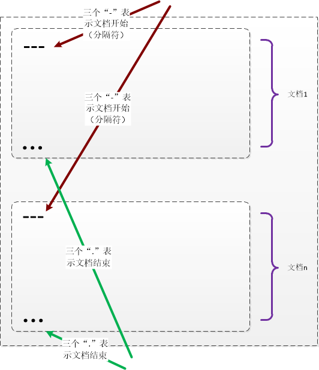
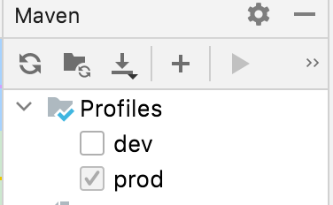

# 一、properties文件和yml文件

一般上来说，当我们创建一个SpringBoot项目时，IDE会默认帮我们创建一个application.properties配置文件。有些朋友习惯把.properties文件改成.yml文件。那么这两种文件类型有什么区别呢？

## 1.1 properties文件格式：

.properties文件，通过.来连接，通过=来赋值，结构上，没有分层的感觉，但比较直接。

application.properties：


```xml
server.port=8081
 
spring.datasource.type=org.apache.tomcat.jdbc.pool.DataSource
spring.datasource.url=jdbc:mysql://aliyuncs.com:3306/database?useUnicode=true&zeroDateTimeBehavior=convertToNull&autoReconnect=true
spring.datasource.username=root
spring.datasource.password=******
spring.datasource.driver-class-name=com.mysql.jdbc.Drive
```

## 1.2 yml文件格式：
 
.yml文件，通过：来分层，结构上，有比较明显的层次感，最后key赋值的：后需要留一个空格

application.yml：

```xml
server:
  port: 8082
  
spring:
    datasource:
        name: test
        url: jdbc:mysql://127.0.0.1:3306/database
        username: root
        password: ******
        type: com.alibaba.druid.pool.DruidDataSource
        driver-class-name: com.mysql.jdbc.Driver
```

## 1.3 两者区别
 
如果工程中同时存在application.properties文件和 application.yml文件，yml文件会先加载，而后加载的properties文件会覆盖yml文件。所以建议工程中，只使用其中一种类型的文件即可。

# 二、yml文件介绍

YAML（发音 /ˈjæməl/）是一个类似 XML、JSON 的数据序列化语言。其强调以数据为中心，旨在方便人类使用；并且适用于日常常见任务的现代编程语言。因而 YAML 本身的定义比较简单，号称“一种人性化的数据格式语言”。

[进入yml 官网](http://www.yaml.org/spec/1.2/spec.html)

## 2.1 YAML 的设计目标：

- 人类容易阅读

- 可用于不同程序间的数据交换

- 适合描述程序所使用的数据结构，特别是脚本语言

- 丰富的表达能力与可扩展性
 
- 易于使用

## 2.2 YAML 与 XML、JSON

**YAML 与 XML**

具有 XML 同样的优点，但比 XML 更加简单、敏捷等

**YAML 与 JSON**

JSON 可以看作是 YAML 的子集，也就是说 JSON 能够做的事情，YAML 也能够做

YAML 能表示得比 JSON 更加简单和阅读，例如“字符串不需要引号”。所以 YAML 容易可以写成 JSON 的格式，但并不建议这种做

YAML 能够描述比 JSON 更加复杂的结构，例如“关系锚点”可以表示数据引用（如重复数据的引用）。

## 2.3 YAML 组织结构

YAML 文件可以由一或多个文档组成（也即相对独立的组织结构组成），文档间使用“---”（三个横线）在每文档开始作为分隔符。同时，文档也可以使用“...”（三个点号）作为结束符（可选）。如下图所示：




如果只是单个文档，分隔符“---”可省略。

每个文档并不需要使用结束符“...”来表示结束，但是对于网络传输或者流来说，作为明确结束的符号，有利于软件处理。（例如不需要知道流关闭就能知道文档结束） 

YAML 认为数据由以下三种结构组成：（每个文档由三种结构混合组成）

* **标量 （相当于数据类型）**

* **序列 （相当于数组和列表）**

* **键值表（相当于 Map 表）**

## 2.4 YAML 编写规范

它的基本语法规则如下：

1）大小写敏感

2）使用缩进表示层级关系

3）缩进时不允许使用Tab键，只允许使用空格。

4）缩进的空格数目不重要，只要相同层级的元素左侧对齐即可

 详尽语法见官网：http://www.yaml.org/spec/1.2/spec.html

### 规范一：文档使用 Unicode 编码作为字符标准编码，例如 UTF-8

### 规范二：使用“#”来表示注释内容

```yml
# 客户订单
date: 2015-02-01
customer:
  - name: Jai
items:
  - no: 1234         # 订单号
  - descript: cpu
```
### 规范三：使用空格作为嵌套缩进工具。通常建议使用两个空格缩进，不建议使用 tab （甚至不支持）

### 规范四：序列表示

* 使用“-”（横线） + 单个空格表示单个列表项

```yml
--- # 文档开始
- 第一章 简介
- 第二章 设计目录
```

* 使用"[]"表示一组数据

```yml 
--- # 文档开始
[blue, red, green]
```

* 组合表示。每个结构都可以嵌套组成复杂的表示结构。
 
```
--- # 文档开始
- [blue, red, green]     # 列表项本身也是一个列表
- [Age, Bag]
- site: {osc:www.oschina.net, baidu: www.baidu.com}  # 这里是同 键值表 组合表示
```

### 规范五：键值表

* 使用 “:”（冒号） + 空格表示单个键值对

```yml
# 客户订单
date: 2015-02-01
customer:
  - name: Jai
items:
  - no: 1234         # 订单号
  - descript: cpu
  - price: ￥800.00
```

* 使用"{}"表示一个键值表

```
# 客户订单
date: 2015-02-01
customer:
  - name: Jai
items: {no: 1234, descript: cpu, price: ￥800.00}
```

"? " 问号+空格表示复杂的键。当键是一个列表或键值表时，就需要使用本符号来标记。

```
 # 使用一个列表作为键
 ? [blue, reg, green]: Color
 # 等价于
 ? - blue
   - reg
   - gree
 : Color
```

组合表示。每个结构都可以嵌套组成复杂的表示结构。 

```
 Color:
    - blue
    - red
    - green

 # 相当于 (也是 JSON 的表示)
 {Color: [blue, red, green]}

 div:
    - border: {color: red, width: 2px}
    - background: {color: green}
    - padding: [0, 10px, 0, 10px]

 # 使用缩进表示的键值表与列表项
 items:
    - item: cpu
      model: i3
      price: ￥800.00
    - item: HD
      model: WD
      price: ￥450.00

 # 上面使用 “-” 前导与缩进来表示多个列表项，相当于下面的JSON表示
 items: [{item:cpu, model:i3, price:￥800.00}, {item:HD, model:WD, price: ￥450.00}]
```

### 规范六：文本块

* 使用 “|” 和文本内容缩进表示的块：保留块中已有的回车换行。相当于段落块

```
yaml: |      # 注意 ":" 与 "|" 之间的空格
   JSON的语法其实是YAML的子集，大部分的JSON文件都可以被YAML的解释器解释。
```  

* 使用 “>” 和文本内容缩进表示的块：将块中回车替换为空格，最终连接成一行。

```
yaml: >      # 注意 ":" 与 ">" 之间的空格，另外可以使用空行来分段落
   JSON的语法其实是YAML的子集，
   大部分的JSON文件都可以被YAML的解释器解释。
```

* 使用定界符“”（双引号）、‘’（单引号）或回车表示的块：最终表示成一行。

```
yaml:     # 使用回车的多行，最终连接成一行。
   JSON的语法其实是YAML的子集，
   大部分的JSON文件都可以被YAML的解释器解释。

yaml:     # 使用了双引号，双引号的好处是可以转义，即在里面可以使用特殊符号
   "JSON的语法其实是YAML的子集，
   大部分的JSON文件都可以被YAML的解释器解释。"
```

### 规范七：数据类型的约定

* 对一些常用数据类型的表示格式进行了约定，包括:

```
 integer: 12345     # 整数标准形式
 octal: 0o34        # 八进制表示，第二个是字母 o
 hex: 0xFF          # 十六进制表示

 float: 1.23e+3     # 浮点数
 fixed: 13.67       # 固定小数
 minmin: -.inf      # 表示负无穷
 notNumber: .NaN    # 无效数字

 null:              # 空值
 boolean: [true, false] # 布尔值
 string: '12345'    # 字符串

 date: 2015-08-23   # 日期
 datetime: 2015-08-23T02:02:00.1z  # 日期时间
 iso8601: 2015-08-23t21:59:43.10-05:00  # iso8601 日期格式
 spaced: 2015-08-23 21:59:43.10 -5      # ?
```

* “!”（叹号）显式指示类型，或自定义类型标识。单叹号通常是自定义类型，双叹号是内置类型

```
 isString: !!str 2015-08-23     # 强调是字符串不是日期数据
 picture: !!binary |            # Base64  图片
     R0lGODlhDAAMAIQAAP//9/X
     17unp5WZmZgAAAOfn515eXv
     Pz7Y6OjuDg4J+fn5OTk6enp
     56enmleECcgggoBADs=
 #下面是内置类型
 !!int               # 整数类型
 !!float             # 浮点类型
 !!bool              # 布尔类型
 !!str               # 字符串类型
 !!binary            # 也是字符串类型
 !!timestamp         # 日期时间类型
 !!null              # 空值
 !!set               # 集合
 !!omap, !!pairs     # 键值列表或对象列表
 !!seq               # 序列，也是列表
 !!map               # 键值表

 #下面是一些例子：
 --- !!omap
 - Mark: 65
 - Sammy: 63
 - Key: 58

 --- !!set           # 注意，“?”表示键为列表，在这里列表为 null
 ? Mark
 ? Sammy
 ? Key

 # 下面是自定义的类型或标识
 %TAG ! tag:clarkevans.com,2002:   # % 是指令符号
 --- !shape
 # Use the ! handle for presenting
 # tag:clarkevans.com,2002:circle
 - !circle
   center: &ORIGIN {x: 73, y: 129}
   radius: 7
 - !line
   start: *ORIGIN
   finish: { x: 89, y: 102 }
 - !label
   start: *ORIGIN
   color: 0xFFEEBB
   text: Pretty vector drawing.
```

## 规范八：锚点与引用，定义数据的复用。

* 第一步：使用 “&” 定义数据锚点（即要复制的数据）

* 第二步：使用 “*” 引用上述锚点数据（即数据的复制目的地）

```
---
 hr:
   - Mark McGwire
   # Following node labeled SS
   - &SS Sammy Sosa            # 定义要复制的数据
 rbi:
   - *SS # Subsequent occurrence   这里是数据复制目标
   - Ken Griffey
```

# 三、bootstrap.yml

bootstrap.yml（bootstrap.properties）用来在程序引导时执行，应用于更加早期配置信息读取，如可以使用来配置application.yml中使用到参数等

application.yml（application.properties) 应用程序特有配置信息，可以用来配置后续各个模块中需使用的公共参数等。

bootstrap.yml 先于 application.yml 加载

典型的应用场景如下：

当使用 Spring Cloud Config Server 的时候，你应该在 bootstrap.yml 里面指定 spring.application.name 和 spring.cloud.config.server.git.uri 和一些加密/解密的信息

技术上，bootstrap.yml 是被一个父级的 Spring ApplicationContext 加载的。这个父级的 Spring ApplicationContext是先加载的，在加载application.yml 的 ApplicationContext之前。

为何需要把 config server 的信息放在 bootstrap.yml 里？

当使用 Spring Cloud 的时候，配置信息一般是从 config server 加载的，为了取得配置信息（比如密码等），你需要一些提早的引导配置。因此，把 config server 信息放在 bootstrap.yml，用来加载在这个时期真正需要的配置信息。

# 四、application.yml、application-xxx.yml文件

Spring boot根据profile来读取yml文件。当profile为default时，只使用application.yaml，将当前profile激活为xxx时, SpringBoot就会额外加载application-xxx.yaml 后合并到application.yaml中，若其中有相同的配置则覆盖掉。

# 五、Spring boot根据profile来配置工程


## 5.1 通过profile来配置不同开发环境

在Spring Boot 程序中，我们通常定义不同 Profiles 的配置文件，如 application-dev.yml用户开发是一个，application_prod用于发布版本使用。

日常开发时，在默认配置文件 application.properties 中设置 spring.profiles.active=dev ，用于平常开发使用，

当需要打包上传服务器时，通过启动参数方式 -Dspring.profiles.active=prod 指定对应环境的 Profile 启动程序来加载对应环境的配置。

如：
application.yml文件
```yml
spring:
  profiles:
    active: dev
```

application-dev.yml文件

```yml
server:
  port: 50011
```

application-prod.yml文件
```yml
server:
  port: 50012
```
则开发时的端口为50011；

## 5.2 如何激活profile

### 5.3.1 在application.yml中使用spring:profiles:avtive:xxx来激活

```yml
spring:
  profiles:
    active: dev
```

### 5.3.2 在代码中设置激活
```java
AnnotationConfigApplicationContext ctx = new AnnotationConfigApplicationContext();
ctx.getEnvironment().setActiveProfiles("development");
ctx.register(SomeConfig.class, StandaloneDataConfig.class, JndiDataConfig.class);
ctx.refresh();
```

### 5.3.3 用maven的profile来激活配置spring profile

maven本身也支持profile，用来控制编译打包等流程。SpringBoot的application.yml文件可以读取pom.xml中定义的profile，从而激活相应的profile。

比如：在maven的pom.xml文件中做如下设置：其中定义了一个属性值profileActive。

```xml
<profiles> 
    <profile> 
        <id>local</id> 
        <properties> 
            <profileActive>local</hello> 
        </properties> 
    </profile> 

    <profile> 
        <id>prod</id> 
        <properties> 
            <profileActive>prod</hello> 
        </properties> 
    </profile> 
</profiles>
```

在application.yaml中读取
```yml
spring:
  profiles:
    active: @profileActive@
```

注意@profileActive@，其中profileActive是我们在pom.xml中的profiles定义的，而前后两个@是SpringBoot 读取maven的profile的语法。



我们建立了dev和prod两个profile，然后将prod作为默认执行的profile。添加完后刷新maven，可以看到IDE右上角maven的窗口出现了一个Profiles的条目。我们可以勾选激活哪一个profile，记得reload。

使用@@语法要注意，添加资源过滤

简单的解决方法：
在terminal中，项目的目录下运行:

mvn--->reload project

也就是直接用mvn命令让spring boot运行一次，然后再通过配置文件获取mvn的配置就不会报错了。


```
<build>
    <resources>
        <resource>
            <directory>src/main/resources</directory>
            <filtering>true</filtering>
        </resource>
    </resources>
    ...
</build>
```

### 5.3.4 执行java程序时用参数来激活profile设置

```shell
java -jar springboot.jar --spring.profiles.active=prod
```

一般我们开发的时候使用maven方式来配置，部署执行的时候采用命令行参数来配置。
