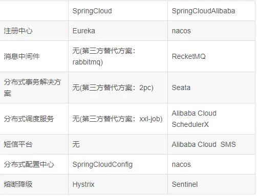

## 一、Spring Cloud Alibaba 和 Spring Cloud 区别

SpringCloudAlibaba实际上对我们的SpringCloud2.x和1.x实现拓展组件功能.

nacos 分布式配置中心+分布式注册中心=Eureka+config

目的是为了推广阿里的产品，如果使用了SpringCloudAlibaba,最好使用alibaba整个体系产品

## 二、使用 Spring Cloud Alibaba 的原因

SpringCloud Alibaba 组建性能更强，良好的可视化界面，搭建简单，学习成本低，社区活跃并且国内很多大厂名企都在使用，并且API都是中文。

Spring Cloud Alibaba 致力于提供微服务开发的一站式解决方案。包含开发分布式应用微服务的必需组件，方便开发者通过 Spring Cloud 编程模型轻松使用这些组件来开发分布式应用服务。依托 Spring Cloud Alibaba，您只需要添加一些注解和少量配置，就可以将 Spring Cloud 应用接入阿里微服务解决方案，通过阿里中间件来迅速搭建分布式应用系统。

作为 Spring Cloud 体系下的新实现，Spring Cloud Alibaba 跟官方的组件或其它的第三方实现如 Netflix, Consul，Zookeeper 等对比，具备了更多的功能和更高的可用性。

## 三、组件介绍

Spring Cloud Alibaba依托于服务注册中心Nacos, 实现Spring Cloud所具备的功能诸如服务调用, 消息订阅, 事务处理, 任务调度, 服务限流熔断等. 而且利用自身云服务的技术优势又提供了文件存储以及短信服务等, 极大的改善了开发人员对Spring Cloud Netflix的( 尤其是Eureka )依赖。

Nacos：一个更易于构建云原生应用的动态服务发现、配置管理和服务管理平台。

Sentinel：把流量作为切入点，从流量控制、熔断降级、系统负载保护等多个维度保护服务的稳定性。

RocketMQ：一款开源的分布式消息系统，基于高可用分布式集群技术，提供低延时的、高可靠的消息发布与订阅服务。

Dubbo：Apache Dubbo™ 是一款高性能 Java RPC 框架。

Oauth2.0 安全认证。

