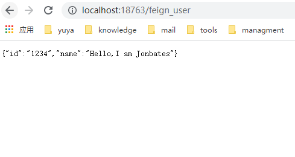

# 一、Spring Cloud介绍 

## Spring Cloud Alibaba 和 Spring Cloud 区别

SpringCloudAlibaba实际上对我们的SpringCloud2.x和1.x实现拓展组件功能.

nacos 分布式配置中心+分布式注册中心=Eureka+config

目的是为了推广阿里的产品，如果使用了SpringCloudAlibaba,最好使用alibaba整个体系产品


## 使用 Spring Cloud Alibaba 的原因

SpringCloud Alibaba 组建性能更强，良好的可视化界面，搭建简单，学习成本低，社区活跃并且国内很多大厂名企都在使用，并且API都是中文。

Spring Cloud Alibaba 致力于提供微服务开发的一站式解决方案。包含开发分布式应用微服务的必需组件，方便开发者通过 Spring Cloud 编程模型轻松使用这些组件来开发分布式应用服务。依托 Spring Cloud Alibaba，您只需要添加一些注解和少量配置，就可以将 Spring Cloud 应用接入阿里微服务解决方案，通过阿里中间件来迅速搭建分布式应用系统。

作为 Spring Cloud 体系下的新实现，Spring Cloud Alibaba 跟官方的组件或其它的第三方实现如 Netflix, Consul，Zookeeper 等对比，具备了更多的功能和更高的可用性。

## 组件介绍

Spring Cloud Alibaba依托于服务注册中心Nacos, 实现Spring Cloud所具备的功能诸如服务调用, 消息订阅, 事务处理, 任务调度, 服务限流熔断等. 而且利用自身云服务的技术优势又提供了文件存储以及短信服务等, 极大的改善了开发人员对Spring Cloud Netflix的( 尤其是Eureka )依赖。

Nacos：一个更易于构建云原生应用的动态服务发现、配置管理和服务管理平台。

Sentinel：把流量作为切入点，从流量控制、熔断降级、系统负载保护等多个维度保护服务的稳定性。

RocketMQ：一款开源的分布式消息系统，基于高可用分布式集群技术，提供低延时的、高可靠的消息发布与订阅服务。

Dubbo：Apache Dubbo™ 是一款高性能 Java RPC 框架。

Oauth2.0 安全认证。


# 二、注册中心和配置中心-nacos

Spring Cloud Alibaba 提供的 Spring Cloud Alibaba Nacos Discovery 组件，基于 Spring Cloud 的编程模型，接入 Nacos 作为注册中心，实现服务的注册与发现。


## 1、Nacos discovery服务注册与发现

服务发现是微服务架构体系中最关键的组件之一。如果尝试着用手动的方式来给每一个客户端来配置所有服务提供者的服务列表是一件非常困难的事，而且也不利于服务的动态扩缩容。

Nacos Discovery 可以帮助您将服务自动注册到 Nacos 服务端并且能够动态感知和刷新某个服务实例的服务列表。

除此之外，Nacos Discovery 也将服务实例自身的一些元数据信息-例如 host，port, 健康检查URL，主页等内容注册到 Nacos。

在使用注册中心时，一共有三种角色：服务提供者（Service Provider）、服务消费者（Service Consumer）、注册中心（Registry）。

>在一些文章中，服务提供者被称为 Server，服务消费者被称为 Client。

**Provider：**

- 启动时，向 Registry 注册自己为一个服务（Service）的实例（Instance）。

- 同时，定期向 Registry 发送心跳，告诉自己还存活。

- 关闭时，向 Registry 取消注册。

**Consumer：**

- 启动时，向 Registry 订阅使用到的服务，并缓存服务的实例列表在内存中。

- 后续，Consumer 向对应服务的 Provider 发起调用时，从内存中的该服务的实例列表选择一个，进行远程调用。

- 关闭时，向 Registry 取消订阅。

**Registry：**

- Provider 超过一定时间未心跳时，从服务的实例列表移除。

- 服务的实例列表发生变化（新增或者移除）时，通知订阅该服务的 Consumer，从而让 Consumer 能够刷新本地缓存。

- 当然，不同的注册中心可能在实现原理上会略有差异。例如说，Eureka 注册中心，并不提供通知功能，而是 Eureka Client 自己定期轮询，实现本地缓存的更新。


另外，Provider 和 Consumer 是角色上的定义，一个服务同时即可以是 Provider 也可以作为 Consumer。例如说，优惠劵服务可以给订单服务提供接口，同时又调用用户服务提供的接口。


## 2、Nacos安装和使用

### 1、环境配置

Nacos 依赖 Java 环境来运行。如果您是从代码开始构建并运行Nacos，还需要为此配置 Maven环境，请确保是在以下版本环境中安装使用:

* 操作系统

64 bit OS，支持 Linux/Unix/Mac/Windows，推荐选用 Linux/Unix/Mac。

* JDK

64 bit JDK 1.8+；下载 & 配置。

* Maven

Maven 3.2.x+；下载 & 配置。


### 2.下载源码或者安装包

你可以通过源码和发行包两种方式来获取 Nacos。


* 下载编译后的压缩包

下载地址： ***https://github.com/alibaba/nacos/releases***

您可以从 最新稳定版本 下载 nacos-server-$version.zip 包。

```
  unzip nacos-server-$version.zip 或者 tar -xvf nacos-server-$version.tar.gz
  cd nacos/bin
```

* 从 Github 上下载源码方式

下载地址： ***https://github.com/alibaba/nacos/releases***

```
git clone https://github.com/alibaba/nacos.git
cd nacos/
mvn -Prelease-nacos -Dmaven.test.skip=true clean install -U  
ls -al distribution/target/

// change the $version to your actual path
cd distribution/target/nacos-server-$version/nacos/bin
```

>版本选择
>您可以在Nacos的release notes及博客中找到每个版本支持的功能的介绍，当前推荐的稳定版本为2.0.3。

### 3.启动服务器

Linux/Unix/Mac

启动命令(standalone代表着单机模式运行，非集群模式):
```shell
sh startup.sh -m standalone
```

如果您使用的是ubuntu系统，或者运行脚本报错提示[[符号找不到，可尝试如下运行：
```shell
bash startup.sh -m standalone
```
Windows
启动命令(standalone代表着单机模式运行，非集群模式):

```
startup.cmd -m standalone
```

>如果直接输入startup命令，可能会出现启动失败的问题，需要根据服务器的配置加上参数 standalone 或者 all

### 4.服务注册&发现和配置管理

Nacos配置页面网址：

* IP地址： http://127.0.0.1:8848/nacos

* 用户名： nacos

* 密码： nacos


服务注册
curl -X POST 'http://127.0.0.1:8848/nacos/v1/ns/instance?serviceName=nacos.naming.serviceName&ip=20.18.7.10&port=8080'

服务发现
curl -X GET 'http://127.0.0.1:8848/nacos/v1/ns/instance/list?serviceName=nacos.naming.serviceName'

发布配置
curl -X POST "http://127.0.0.1:8848/nacos/v1/cs/configs?dataId=nacos.cfg.dataId&group=test&content=HelloWorld"

获取配置
curl -X GET "http://127.0.0.1:8848/nacos/v1/cs/configs?dataId=nacos.cfg.dataId&group=test"

### 5.关闭服务器

Linux/Unix/Mac
```shell
sh shutdown.sh
```

Windows
```cmd
shutdown.cmd
```

或者双击shutdown.cmd运行文件。


# 三、搭建服务提供者，并注册到Nacos中

### 1、引入依赖

spring cloud alibaba和spring cloud之间有依赖关系，要注意版本的对应，防止不兼容

```xml
<dependencyManagement>
        <dependencies>
            <dependency>
                <groupId>org.springframework.cloud</groupId>
                <artifactId>spring-cloud-dependencies</artifactId>
                <version>${spring.cloud.version}</version>
                <type>pom</type>
                <scope>import</scope>
            </dependency>
            <dependency>
                <groupId>com.alibaba.cloud</groupId>
                <artifactId>spring-cloud-alibaba-dependencies</artifactId>
                <version>${spring.cloud.alibaba.version}</version>
                <type>pom</type>
                <scope>import</scope>
            </dependency>
        </dependencies>
    </dependencyManagement>
```

引入 Spring Cloud Alibaba Nacos Discovery 相关依赖，将 Nacos 作为注册中心，并实现对其的自动配置

```xml
<dependency>
    <groupId>com.alibaba.cloud</groupId>
    <artifactId>spring-cloud-starter-alibaba-nacos-discovery</artifactId>
</dependency>
```

因为是一个restful api的测试，所以需要添加web依赖

```xml
<dependency>
            <groupId>org.springframework.boot</groupId>
            <artifactId>spring-boot-starter-web</artifactId>
        </dependency>
```

### 2、配置application.yaml文件，设置discovery
```
spring:
  application:
    name: spring-cloud-provider # Spring 应用名
  cloud:
    nacos:
      # Nacos 作为配置中心的配置项 对应NacosDiscoveryProperties 配置类
      discovery:
        server-addr: 127.0.0.1:8848 # Nacos 服务器地址
        service: ${spring.application.name} # 注册到 Nacos 的服务名，默认 ${spring.application.name}?

server:
  port: 18080 # 服务器端口 18080
```

### 3、在app文件中设置enablediscovery

```
@SpringBootApplication
@EnableDiscoveryClient
public class SpringCloudProviderApplication {

    public static void main(String[] args) {
        SpringApplication.run(SpringCloudProviderApplication.class, args);
    }

}
```
经历以上三步，就可以在nacos的服务中心看到该应用被注册到了nacos的服务中。

### 4、添加一个restful的controller接口作为provider

Controller

```java
package com.ytech.provider.controller;

import com.ytech.provider.service.ProviderService;
import org.springframework.beans.factory.annotation.Autowired;
import org.springframework.web.bind.annotation.GetMapping;
import org.springframework.web.bind.annotation.RequestMapping;
import org.springframework.web.bind.annotation.RestController;

@RestController
@RequestMapping("/provider")
public class ProviderController {

    @Autowired
    ProviderService providerService;

    @GetMapping("/echo")
    public String getEchoString() {
        return providerService.provider_echo();
    }
}
```

Service

```java
package com.ytech.provider.service;

public interface ProviderService {
    String provider_echo();
}
```

ServiceImpl

```java
package com.ytech.provider.service.impl;

import com.ytech.provider.service.ProviderService;
import org.springframework.stereotype.Service;

@Service
public class ProviderServiceImpl implements ProviderService {
    @Override
    public String provider_echo() {
        return "hey,buddy,what's wrong with you ?";
    }
}
```

此时，在浏览器直接调用，就可以得到结果了。

```
http://localhost:50006/provider/echo
```

# 四、GateWay实现路由

## 1、SpringCloud Gateway 简介

SpringCloud Gateway 是 Spring Cloud 的一个全新项目，该项目是基于 Spring 5.0，Spring Boot 2.0 和 Project Reactor 等技术开发的网关，它旨在为微服务架构提供一种简单有效的统一的 API 路由管理方式。

SpringCloud Gateway 作为 Spring Cloud 生态系统中的网关，目标是替代 Zuul，在Spring Cloud 2.0以上版本中，没有对新版本的Zuul 2.0以上最新高性能版本进行集成，仍然还是使用的Zuul 2.0之前的非Reactor模式的老版本。而为了提升网关的性能，SpringCloud Gateway是基于WebFlux框架实现的，而WebFlux框架底层则使用了高性能的Reactor模式通信框架Netty。

Spring Cloud Gateway 的目标，不仅提供统一的路由方式，并且基于 Filter 链的方式提供了网关基本的功能，例如：安全，监控/指标，和限流。

提前声明：Spring Cloud Gateway 底层使用了高性能的通信框架Netty。

## 2、SpringCloud Gateway 特征

SpringCloud官方，对SpringCloud Gateway 特征介绍如下：

（1）基于 Spring Framework 5，Project Reactor 和 Spring Boot 2.0

（2）集成 Hystrix 断路器

（3）集成 Spring Cloud DiscoveryClient

（4）Predicates 和 Filters 作用于特定路由，易于编写的 Predicates 和 Filters

（5）具备一些网关的高级功能：动态路由、限流、路径重写

从以上的特征来说，和Zuul的特征差别不大。SpringCloud Gateway和Zuul主要的区别，还是在底层的通信框架上。

简单说明一下上文中的三个术语：

（1）Filter（过滤器）：

和Zuul的过滤器在概念上类似，可以使用它拦截和修改请求，并且对上游的响应，进行二次处理。过滤器为org.springframework.cloud.gateway.filter.GatewayFilter类的实例。

（2）Route（路由）：

网关配置的基本组成模块，和Zuul的路由配置模块类似。一个Route模块由一个 ID，一个目标 URI，一组断言和一组过滤器定义。如果断言为真，则路由匹配，目标URI会被访问。

（3）Predicate（断言）：

这是一个 Java 8 的 Predicate，可以使用它来匹配来自 HTTP 请求的任何内容，例如 headers 或参数。断言的输入类型是一个 ServerWebExchange。

## 3、在项目中引入Sprint Cloud Gateway

### 3.1 新建一个工程，并引入Gateway的依赖

```
<dependency>
    <groupId>org.springframework.cloud</groupId>
    <artifactId>spring-cloud-starter-gateway</artifactId>
</dependency>

```

### 3.2 将自己注册为一个spring coloud的服务

```
@EnableDiscoveryClient
@SpringBootApplication
public class YychildrenGatewayApplication {

    public static void main(String[] args) {
        SpringApplication.run(YychildrenGatewayApplication.class, args);
    }

}

```

### 3.3 在配置文件中进行配置

```

server:
  port: 10061

spring:

 application:
    name: yychildren-gateway

  cloud:

    nacos:
      discovery:
        server-addr: @nacos-addr@
        service:  ${spring.application.name} 

    gateway:
      - id: yychildren-console
          uri: lb://yychildren-console  #
          predicates:
            - Path=/api/console/**
          filters:
            - SwaggerHeaderFilter
            - StripPrefix=1
            
        - id: yychildren-teacher
          uri: lb://yychildren-teacher
          predicates:
            - Path=/api/teacher/**
          filters:
            - SwaggerHeaderFilter
            - StripPrefix=1


        - id: yychildren-parent
          uri: lb://yychildren-parent
          predicates:
            - Path=/api/parent/**
          filters:
            - SwaggerHeaderFilter
            - StripPrefix=1


        - id: yychildren-core
          uri: lb://yychildren-core
          predicates:
            - Path=/api/core/**
          filters:
            - SwaggerHeaderFilter
            - StripPrefix=1
```

下面对一个路由规则做简单的说明：

```
 - id: yychildren-teacher
          uri: lb://yychildren-teacher
          predicates:
            - Path=/api/teacher/**
          filters:
            - SwaggerHeaderFilter
            - StripPrefix=1

```

* id

路由 id,没有固定规则，但唯一，建议与服务名对应

* uri: lb://yychildren-teacher

lb：uri 的协议，表示开启 Spring Cloud Gateway 的负载均衡功能。

service-name：服务名，Spring Cloud Gateway 会根据它获取到具体的微服务地址。

predicates:
     - Path=/api/teacher/**

条件断言，满足网关网址,例如：http://192.168.3.16：10061/api/teacher/**的所有请求，跳转到服务yychild-teacher下。


# 四、通过Feign创建Consumer来调用Provider

## 1、Feign介绍


Feign是Netflix开发的声明式、模板化的HTTP客户端， Feign可以帮助我们更快捷、优雅地调用HTTP API。

在Spring Cloud中，使用Feign非常简单——创建一个接口，并在接口上添加一些注解，代码就完成了。Feign支持多种注解，例如Feign自带的注解或者JAX-RS注解等。

Spring Cloud对Feign进行了增强，使Feign支持了Spring MVC注解，并整合了Ribbon和Eureka，从而让Feign的使用更加方便。

Spring Cloud Feign是基于Netflix feign实现，整合了Spring Cloud Ribbon和Spring Cloud Hystrix，除了提供这两者的强大功能外，还提供了一种声明式的Web服务客户端定义的方式。

Spring Cloud Feign帮助我们定义和实现依赖服务接口的定义。在Spring Cloud feign的实现下，只需要创建一个接口并用注解方式配置它，即可完成服务提供方的接口绑定，简化了在使用Spring Cloud Ribbon时自行封装服务调用客户端的开发量。

Spring Cloud Feign具备可插拔的注解支持，支持Feign注解、JAX-RS注解和Spring MVC的注解。

## 2、首先同上一步，创建一个服务，注册到Nacos中

## 添加Feign的依赖

* 在Spring boot的基础上添加Spring Feign的依赖

```xml
        <dependency>
            <groupId>com.alibaba.cloud</groupId>
            <artifactId>spring-cloud-starter-alibaba-nacos-discovery</artifactId>
        </dependency>

        <dependency>
            <groupId>org.springframework.cloud</groupId>
            <artifactId>spring-cloud-starter-openfeign</artifactId>
        </dependency>

        <dependency>
            <groupId>org.springframework.cloud</groupId>
            <artifactId>spring-cloud-starter-loadbalancer</artifactId>
        </dependency>
```

>需要注意的是引入openfeign，必须要引入loadbalancer，否则无法启动。


* 配置文件application.yml：

```yml

server:
  port: 18763

spring:
  application:
    name: common

  cloud:
    nacos:
      discovery:
        server-addr: 127.0.0.1:8848
```

* 开启feignClient的功能。

```java
package com.ytech.common;

import org.springframework.boot.SpringApplication;
import org.springframework.boot.autoconfigure.SpringBootApplication;
import org.springframework.cloud.client.discovery.EnableDiscoveryClient;
import org.springframework.cloud.openfeign.EnableFeignClients;

@SpringBootApplication
@EnableDiscoveryClient
@EnableFeignClients
public class CommonApplication {
    public static void main(String[] args) {
        SpringApplication.run(CommonApplication.class, args);
    }
}

```
>此时打开nacos的网页浏览器，已经可以看到wolf_warrior模块已经注册到了nacos服务上。

* 增加一个FeignClient的接口，调用Common模块的user方法

```java

package com.ytech.wolf_warrior;

import org.springframework.cloud.openfeign.FeignClient;
import org.springframework.http.ResponseEntity;
import org.springframework.web.bind.annotation.GetMapping;
import org.springframework.web.bind.annotation.RequestMapping;

@RequestMapping("/api/v1")
@FeignClient(value = "common" )
public interface UserFeignClient {

    @GetMapping(value = "/user")
    public ResponseEntity<Object> getUser();
}

```

* 增加一个restController类，给外界提供该方法

```java

package com.ytech.wolf_warrior;

import org.springframework.beans.factory.annotation.Autowired;
import org.springframework.http.ResponseEntity;
import org.springframework.web.bind.annotation.GetMapping;
import org.springframework.web.bind.annotation.RestController;

@RestController
public class UserController {

    @Autowired
    UserFeignClient userFeignClient;

    @GetMapping("/feign_user")
    public ResponseEntity<Object> getFeignUser(){
        return userFeignClient.getUser();
    }

    @GetMapping("/test")
    public String getFeignUser2(){
        return "hey,buddy,what's wrong with you ?";
    }
}

```

* 在本地浏览器打开***http://localhost:18763/feign_user***
* 




# 五、熔断处理


