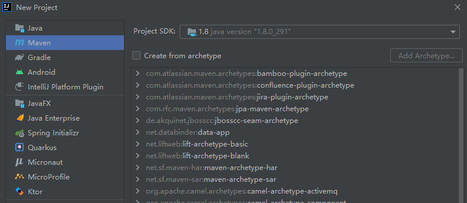
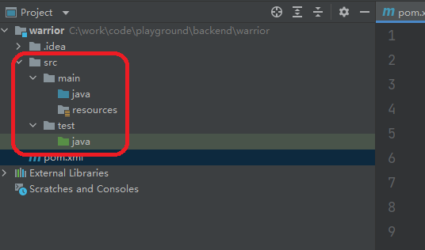

* 创建一个Maven项目，定义groupid和arifactId。



* 创建好后，删除项目的src目录



* 将pom.xml的packaging标签设置为：pom

```xml
<modelVersion>4.0.0</modelVersion>
<groupId>com.ytech</groupId>
<artifactId>warrior</artifactId>
<version>1.0-SNAPSHOT</version>
<packaging>pom</packaging>
<name>warrior</name>
```

