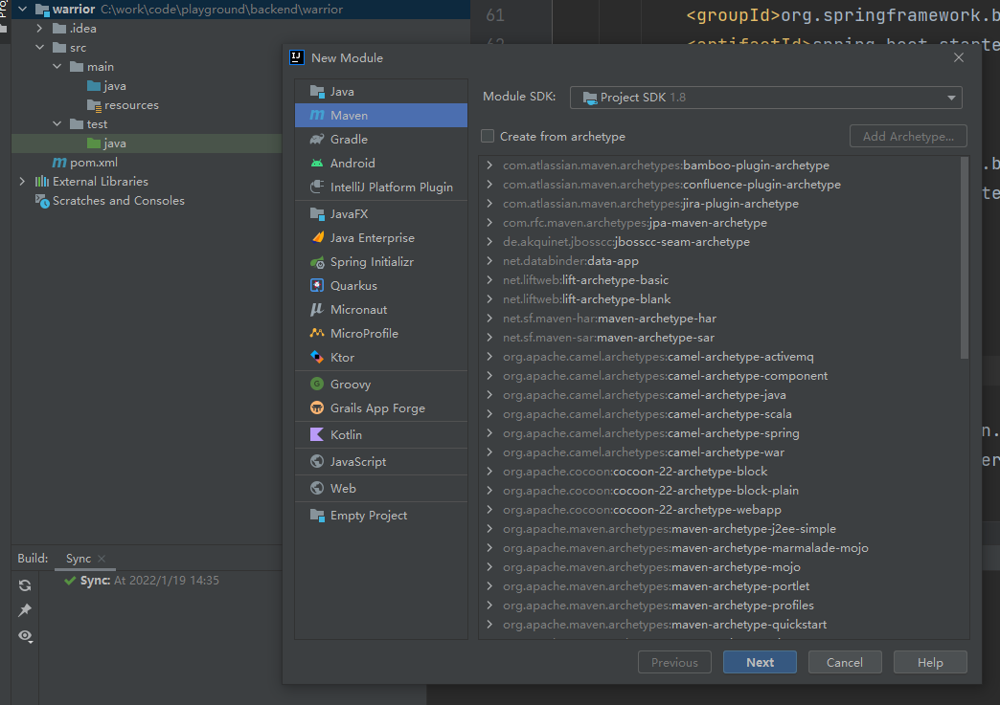
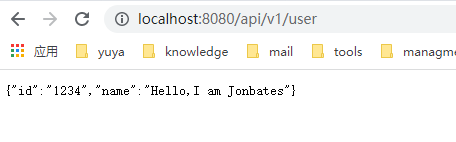
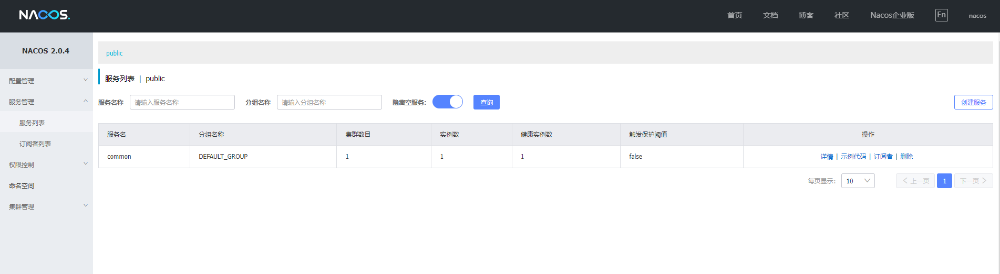

## 一、创建一个Spring Initializer 的子模块，命名为common，对外实现一个restful的接口；





* 修改common的pom.xm文件。

```xml

<?xml version="1.0" encoding="UTF-8"?>
<project xmlns="http://maven.apache.org/POM/4.0.0" xmlns:xsi="http://www.w3.org/2001/XMLSchema-instance"
         xsi:schemaLocation="http://maven.apache.org/POM/4.0.0 https://maven.apache.org/xsd/maven-4.0.0.xsd">
    <modelVersion>4.0.0</modelVersion>

    <parent>
        <artifactId>warrior</artifactId>
        <groupId>com.ytech</groupId>
        <version>1.0-SNAPSHOT</version>
    </parent>

    <groupId>com.ytech</groupId>
    <artifactId>common</artifactId>
    <packaging>jar</packaging>
    <version>0.0.1-SNAPSHOT</version>
    <name>common</name>
    <description>common</description>

    <properties>
        <java.version>1.8</java.version>
    </properties>

    <dependencies>
        <dependency>
            <groupId>org.springframework.boot</groupId>
            <artifactId>spring-boot-starter</artifactId>
        </dependency>

        <dependency> <!--添加Web依赖 -->
            <groupId>org.springframework.boot</groupId>
            <artifactId>spring-boot-starter-web</artifactId>
        </dependency>

        <dependency>
            <groupId>org.springframework.boot</groupId>
            <artifactId>spring-boot-starter-test</artifactId>
            <scope>test</scope>
        </dependency>
    </dependencies>

    <build>
        <plugins>
            <plugin>
                <groupId>org.springframework.boot</groupId>
                <artifactId>spring-boot-maven-plugin</artifactId>
            </plugin>
        </plugins>
    </build>

</project>

```

* 实现一个User类

```java

package com.ytech.common.model;

public class User {
    private String id;
    private String name;

    public String getId() {
        return id;
    }

    public void setId(String id) {
        this.id = id;
    }

    public String getName() {
        return name;
    }

    public void setName(String name) {
        this.name = name;
    }
}


```

* 实现一个Service

```java

package com.ytech.common.service;

import com.ytech.common.model.User;

public interface UserService {
    public User getUser();
}

```

```java

package com.ytech.common.service.impl;

import com.ytech.common.model.User;
import com.ytech.common.service.UserService;
import org.springframework.stereotype.Service;

@Service
public class UserServiceImpl implements UserService {
    public User getUser() {
        User user = new User();
        user.setId("1234");
        user.setName("Hello,I am Jonbates");
        return user;
    }
}

```

* 实现一个Controller

```java

package com.ytech.common.controller;

import com.ytech.common.model.User;
import com.ytech.common.service.UserService;
import org.springframework.beans.factory.annotation.Autowired;
import org.springframework.http.HttpStatus;
import org.springframework.http.ResponseEntity;
import org.springframework.web.bind.annotation.GetMapping;
import org.springframework.web.bind.annotation.RequestMapping;
import org.springframework.web.bind.annotation.RestController;

@RestController
@RequestMapping("/api/v1")
public class UserController {
    @Autowired
    private UserService userService;

    @GetMapping(value = "/user")
    public ResponseEntity<Object> getProduct() {
        User user = userService.getUser();
        return new ResponseEntity<>(user, HttpStatus.OK);
    }
}

```

* 编译后运行，在浏览器输入：***http://localhost:8080/api/v1/user***



## 二、将common模块注册为Nacos的一个服务

* 为common模块添加nacos依赖

```xml

 <dependency>
     <groupId>com.alibaba.cloud</groupId>
     <artifactId>spring-cloud-starter-alibaba-nacos-discovery</artifactId>
 </dependency>

```

完整的pom.xml文件如下所示：

```xml

<?xml version="1.0" encoding="UTF-8"?>
<project xmlns="http://maven.apache.org/POM/4.0.0" xmlns:xsi="http://www.w3.org/2001/XMLSchema-instance"
         xsi:schemaLocation="http://maven.apache.org/POM/4.0.0 https://maven.apache.org/xsd/maven-4.0.0.xsd">
    <modelVersion>4.0.0</modelVersion>

    <parent>
        <artifactId>warrior</artifactId>
        <groupId>com.ytech</groupId>
        <version>1.0-SNAPSHOT</version>
    </parent>

    <groupId>com.ytech</groupId>
    <artifactId>common</artifactId>
    <packaging>jar</packaging>
    <version>0.0.1-SNAPSHOT</version>
    <name>common</name>
    <description>common</description>

    <properties>
        <java.version>1.8</java.version>
    </properties>

    <dependencies>
        <dependency>
            <groupId>org.springframework.boot</groupId>
            <artifactId>spring-boot-starter</artifactId>
        </dependency>

        <dependency> <!--添加Web依赖 -->
            <groupId>org.springframework.boot</groupId>
            <artifactId>spring-boot-starter-web</artifactId>
        </dependency>

        <dependency>
            <groupId>com.alibaba.cloud</groupId>
            <artifactId>spring-cloud-starter-alibaba-nacos-discovery</artifactId>
        </dependency>

        <dependency>
            <groupId>org.springframework.boot</groupId>
            <artifactId>spring-boot-starter-test</artifactId>
            <scope>test</scope>
        </dependency>
    </dependencies>

    <build>
        <plugins>
            <plugin>
                <groupId>org.springframework.boot</groupId>
                <artifactId>spring-boot-maven-plugin</artifactId>
            </plugin>
        </plugins>
    </build>

</project>


```


* 配置文件application.yml：

```yml

server:
  port: 18762

spring:
  application:
    name: common

  cloud:
    nacos:
      discovery:
        server-addr: 127.0.0.1:8848
```

在上述的配置的中，程序的启动端口为18762，应用名为common，向nacos server注册的地址为127.0.0.1:8848。

* 配置application文件，添加@EnableDiscoveryClient的注解

然后在Spring Boot的启动文件Application加上@EnableDiscoveryClient注解，代码如下：

```java

package com.ytech.common;

import org.springframework.boot.SpringApplication;
import org.springframework.boot.autoconfigure.SpringBootApplication;
import org.springframework.cloud.client.discovery.EnableDiscoveryClient;

@SpringBootApplication
@EnableDiscoveryClient
public class CommonApplication {

    public static void main(String[] args) {
        SpringApplication.run(CommonApplication.class, args);
    }

}


```

* 在本地浏览器输入：***http://localhost:8848/nacos***



说明common已经成功添加成为nacos的一个服务。


