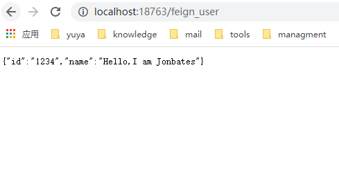

## Feign介绍


Feign是Netflix开发的声明式、模板化的HTTP客户端， Feign可以帮助我们更快捷、优雅地调用HTTP API。

在Spring Cloud中，使用Feign非常简单——创建一个接口，并在接口上添加一些注解，代码就完成了。Feign支持多种注解，例如Feign自带的注解或者JAX-RS注解等。

Spring Cloud对Feign进行了增强，使Feign支持了Spring MVC注解，并整合了Ribbon和Eureka，从而让Feign的使用更加方便。

Spring Cloud Feign是基于Netflix feign实现，整合了Spring Cloud Ribbon和Spring Cloud Hystrix，除了提供这两者的强大功能外，还提供了一种声明式的Web服务客户端定义的方式。

Spring Cloud Feign帮助我们定义和实现依赖服务接口的定义。在Spring Cloud feign的实现下，只需要创建一个接口并用注解方式配置它，即可完成服务提供方的接口绑定，简化了在使用Spring Cloud Ribbon时自行封装服务调用客户端的开发量。

Spring Cloud Feign具备可插拔的注解支持，支持Feign注解、JAX-RS注解和Spring MVC的注解。

## 首先同上一步，创建一个服务，注册到Nacos中

## 添加Feign的依赖


* 在Spring boot的基础上添加Spring Feign的依赖

```xml
        <dependency>
            <groupId>com.alibaba.cloud</groupId>
            <artifactId>spring-cloud-starter-alibaba-nacos-discovery</artifactId>
        </dependency>

        <dependency>
            <groupId>org.springframework.cloud</groupId>
            <artifactId>spring-cloud-starter-openfeign</artifactId>
        </dependency>

        <dependency>
            <groupId>org.springframework.cloud</groupId>
            <artifactId>spring-cloud-starter-loadbalancer</artifactId>
        </dependency>
```

>需要注意的是引入openfeign，必须要引入loadbalancer，否则无法启动。


* 配置文件application.yml：

```yml

server:
  port: 18763

spring:
  application:
    name: common

  cloud:
    nacos:
      discovery:
        server-addr: 127.0.0.1:8848
```

* 开启feignClient的功能。

```java
package com.ytech.common;

import org.springframework.boot.SpringApplication;
import org.springframework.boot.autoconfigure.SpringBootApplication;
import org.springframework.cloud.client.discovery.EnableDiscoveryClient;
import org.springframework.cloud.openfeign.EnableFeignClients;

@SpringBootApplication
@EnableDiscoveryClient
@EnableFeignClients
public class CommonApplication {
    public static void main(String[] args) {
        SpringApplication.run(CommonApplication.class, args);
    }
}

```
>此时打开nacos的网页浏览器，已经可以看到wolf_warrior模块已经注册到了nacos服务上。

* 增加一个FeignClient的接口，调用Common模块的user方法

```java

package com.ytech.wolf_warrior;

import org.springframework.cloud.openfeign.FeignClient;
import org.springframework.http.ResponseEntity;
import org.springframework.web.bind.annotation.GetMapping;
import org.springframework.web.bind.annotation.RequestMapping;

@RequestMapping("/api/v1")
@FeignClient(value = "common" )
public interface UserFeignClient {

    @GetMapping(value = "/user")
    public ResponseEntity<Object> getUser();
}

```

* 增加一个restController类，给外界提供该方法

```java

package com.ytech.wolf_warrior;

import org.springframework.beans.factory.annotation.Autowired;
import org.springframework.http.ResponseEntity;
import org.springframework.web.bind.annotation.GetMapping;
import org.springframework.web.bind.annotation.RestController;

@RestController
public class UserController {

    @Autowired
    UserFeignClient userFeignClient;

    @GetMapping("/feign_user")
    public ResponseEntity<Object> getFeignUser(){
        return userFeignClient.getUser();
    }

    @GetMapping("/test")
    public String getFeignUser2(){
        return "hey,buddy,what's wrong with you ?";
    }
}

```

* 在本地浏览器打开***http://localhost:18763/feign_user***
* 




