## 一、Spring IoC如何实现依赖注入

### 1.1 不使用Spring 依赖注入实现Java web

假设需要通过 RESTFUL 的方式访问用户信息(User)。

用户请求一个UserController获取User信息，UserController会调用UserService，在UserService中处理User的业务逻辑。同时UserService会调用UserDao，UserDao负责调用数据库并返回用户需要的信息。

在不采用依赖注入的情况下，我们直接创建需要依赖的对象。

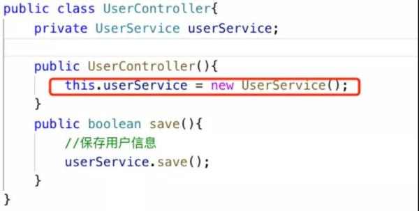

### 1.2 Spring IOC如何实现依赖注入和控制反转

IoC(Inversion of Control)也称为控制反转，也就是对象定义其依赖关系的控制反转。

在不引入IOC的情况下，对象的使用方式为：谁使用谁创建，例如上面的例子中 UserController 需要使用 UserService，于是就由 UserController 创建 UserService 的实例。这样增加了系统对象间的耦合性。

引入 IoC 以后，这个创建过程发生的反转。 Spring IoC引入了SPring容器的概念，即系统中所有被依赖的对象，有Spring容器完成创建。对象只要标注依赖，Spring容器会通过配置决定对象的依赖关系，并创建这些依赖，降低了对象间的耦合程度。

创建依赖对象的控制权从对象的使用者转换为 Spring 容器，就成为控制反转。也就是对象之间的依赖过程发生了变化，由原来的主动创建，变成了现在被动关联(因为 Spring 容器的参与)，这种控制权颠的现象被称为控制反转。

回顾上面的例子，如果采用Spring IoC，我们可以这样做：

**step1：首先，将controller直接创建service的工作，改为通过controller的构造函数的方式进行依赖注入：**

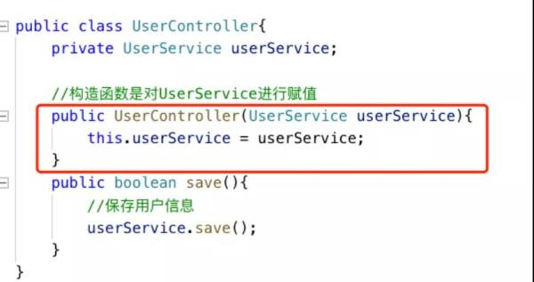

**step2：然后，我们在一个xml文件里，将Controller和Service之间的依赖关系进行描述：**

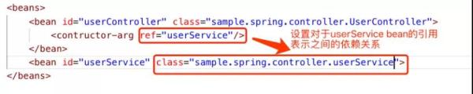

Spring IoC 会通过一个 XML 文件配置对象之间的关系。

如图所示，在 beans 的标签中，定义了两个 bean，分别是 UserController 和 UserService。在 Class 属性中定义了 Class 的全程(包含 Namespace)。

需要注意的是，在 UserController的bean 定义中指定了 contructor-arg 的 ref 为 UserService。

这里的含义是在 UserController 的构造函数中会引入 UserService，从而说明两者之间的依赖关系，也就是 UserController 会依赖 UserService。

**step3：配置好依赖关系后，:Spring容器完成 UserService 的初始化。**

**step4：在 UserController 需要使用的时候直接使用这个 UserService 实体就行了。**

总结：

* Spring 容器会读取 XML 配置文件中的信息，获取 Bean 之间的依赖关系。

* Spring 容器通过反射机制创建对象的实例，由于 Spring 容器管理所有注册 Bean 因此为后续建立它们之间的依赖关系打下基础。

* Spring 容器通过 Bean 之间的依赖关系创建实例，同时保证 Bean 在使用依赖项的时候直接过去对应的实例，而不用自己去创建实例。

简单地说， Spring IoC 做的事情就是管理和创建 Bean 的实例，同时保证 Bean 之间的依赖关系。

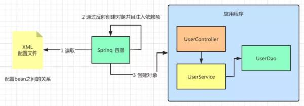

## 二、Spring IoC容器

### 2.1 Spring IoC的定义和作用

Spring IoC 容器将创建对象，通过配置设定它们之间的依赖关系，并管理它们的生命周期(从创建到销毁)。

Spring IoC 容器管理的对象被称为 Spring Beans，也就是上面例子中提到的 UserController 和 UserService。

通过阅读配置文件元数据提供的指令，容器知道对哪些对象进行实例化，配置和组装。

配这里的置元数据就是上面例子的 XML，不过处理 XML 的配置之外还可以通过 Java 注释或 Java 代码来表示，大家可以理解为一种配置对象之间关系的方式。

### 2.2 Spring中的IoC容器 

说了这么多的 Spring IoC 容器的作用，在 Spring 中实现 IoC 容器的实际代表者是谁呢?

这里介绍两类 Spring IoC 容器的代表者，分别是：

#### 2.2.1 Spring BeanFactory 容器

它是最简单的容器，用 org.springframework.beans.factory.BeanFactory 接口来定义。

BeanFactory 或者相关的接口，如 BeanFactoryAware，InitializingBean，DisposableBean，在 Spring 中仍然存在具有大量的与 Spring 整合的第三方框架的反向兼容性的目的。

#### 2.2.2 Spring ApplicationContext 容器

添加了更多的企业特定的功能，例如从一个属性文件中解析文本信息的能力，发布应用程序事件给感兴趣的事件监听器的能力。

该容器是由 org.springframework.context.ApplicationContext 接口定义。

由于 ApplicationContext 容器包括 BeanFactory 容器的所有功能，同时 BeanFactory 适用于轻量级应用。

这里我们将目光放到 ApplicationContext 容器上，看看它是如何实现 Spring IoC 容器的功能的。

由于 ApplicationContext 是一个接口，针对它有几种不同的实现，这些实现会针对不同使用场景，以下列出三种不同实现：

* FileSystemXmlApplicationContext：

实现了从 XML 文件中加载 bean。初始化该类的时候需要提供 XML 文件的完整路径。

* ClassPathXmlApplicationContext：

也实现了 XML 文件中加载 bean，与上面一种方式不同的是：不需要提供 XML 文件的完整路径，只需正确配置 CLASSPATH 环境变量即可，容器会从 CLASSPATH 中搜索 bean 配置文件。

* WebXmlApplicationContext：

实现了在一个 web 应用程序的范围内加载在 XML 文件中已被定义的 bean。

由于篇幅原因，这里我们针对 FileSystemXmlApplicationContext 实现 Spring IoC 容器进行说明。

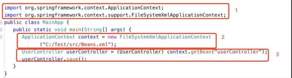

如图所示：

在使用 FileSystemXmlApplicationContext 实现类之前需要引入相关的包，由于其是接口 ApplicationContext 的实现类，因此需要引入 ApplicationContext 的包，以及自身 FileSystemXmlApplicationContext 的包。

在进行 FileSystemXmlApplicationContext 实例化时传入 XML 文件的地址，也就是上文中配置 bean 对象的 XML 文件地址，这里是“C:/Test/src/Beans.xml”。

最后通过 FileSystemXmlApplicationContext 所带的 getBean 方法，通过传入 bean id 的方式获取 bean 对象的实例，这里传入“userController”，从而调用 userController 中的 save 方法完成业务。

## 三、Spring IoC的依赖配置和自动装载

### 3.1 依赖配置

* 通过构造函数来注入依赖

通过构造函数来注入依赖的例子可以参加上面的举例。

* 通过set方法来注入依赖

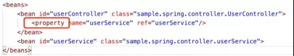

与构造函数注入方式不同的是，在 UserController 中加入了一个 setUserService 的方法来设置 UserService 的属性，传入的参数依旧是 UserService。

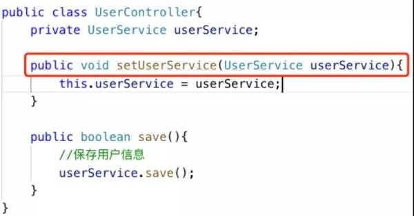

### 3.2 依赖注入的自动装载

为了减少 XML 配置的数量，Spring 容器可以在不使用 和 <:property>元素的情况下配置 bean 之间的关系， 这种注入的方式称为自动装配。

下面我们来看看几种自动装配的方式：

* byType

这种方式由属性数据类型自动装配。 

如果在类中定义了与其他类的依赖关系，那么 Spring 容器在 XML 配置文件中会通过类型寻找对应依赖关系的 bean，然后与之关联。这个过程容器会尝试匹配和连接属性的类型。

例如 bean A 定义了 X 类型的属性， Spring 会在 ApplicationContext 中寻找一个类型为 X 的 bean，并将其注入 bean A。

如果还是觉得抽象，我们看下面的例子，如图 11 所示，UserController 设置 UserService 属性时定义了与 UserService 的依赖关系。

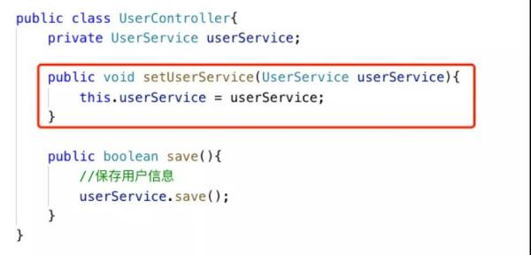

在 XML 配置文件中 UserController 就不需要使用 property 属性定义与 UserService 之间的关系，取而代之的是使用 autowire=“byType” 的方法。

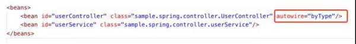

容器通过类中 setUserService 传入的 UserService 类型自动在配置文件中寻找 UserService 对应的类型，从而完成 UserController 和 UserService 依赖关系，也就是依赖注入，这种方式也是基于类型的自动装载。

* constructor

用于构造函数参数类型的自动加载

有了 byType 的基础这个很好理解，例如 bean A 的构造函数接受 X 类型的参数，容器会在 XML 寻找 X 类型的 bean，并将其注入到 bean A 的构造函数中。

如图 所示，UserController 在构造函数中定义 UserService 作为初始化参数，确定了 UserController 对 UserService 的依赖。

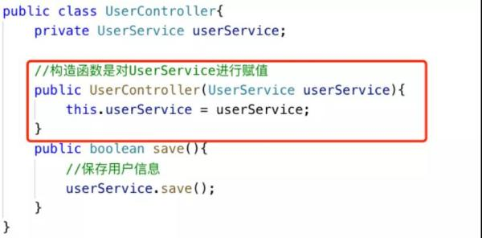

在 XML 配置文件中 UserController 只需要设置 autowire=“constructor”。

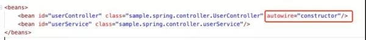

告诉容器通过 UserController 类中的构造方法将 UserService 注入到 UserController 中，完成 UserController 和 UserService 依赖关系，这种方式也是基于构造器的自动装载。

* byName

通过指定特定的 bean 名称，容器根据名称自动选择 bean 属性，完成依赖注入

例如：bean A 定义了一个名为 X 的属性，容器会在 XML 寻找一个名为 X 的 bean，将其注入到 bean A 中。

如图所示，UserController 中定义了一个名为 myUserService 的成员属性，其类型是 UserService。

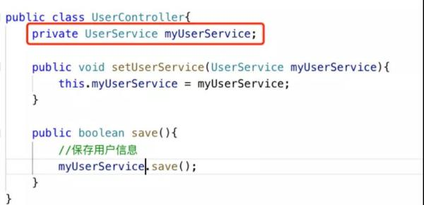

在 XML 的配置中 UserController 的 autowire 配置了“byName”。

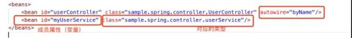

此时容器会根据类中定义的 myUserService 成员属性(变量)自动关联到 UserService，在 UserController 中 setUserService 时自动装载 UserService 的实例。

