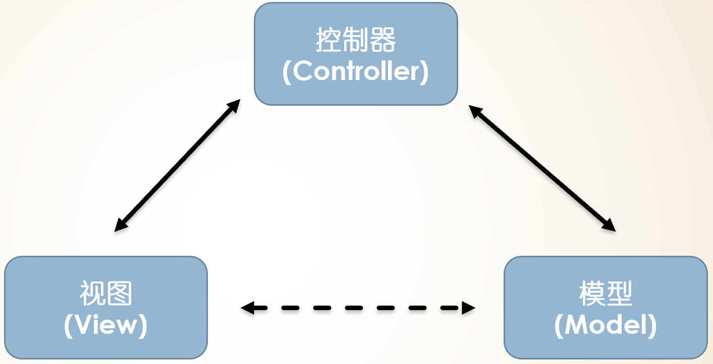

## 一、创建一个SpringBoot的Web项目

建立一个Spring Starter Project项目，将Spring Boot Starter Web依赖项添加到构建配置文件pom.xml(使用Marven构建)中：

```xml
<dependency>
    <groupId>org.springframework.boot</groupId>
    <artifactId>spring-boot-starter-web</artifactId>
</dependency>
```

## 二、根据MVC的架构思想创建model和controller


在MVC/Model 中， 将Web 应用划分为模型、视图与控制器三个部分：

### 控制器（Controller）的职责，桥梁

  * 接受请求

  * 验证请求

  * 判断要转发请求给哪个模型

 * 判断要转发请求给哪个视图

### 模型（Model）的职责

  * 保存应用程式状态

  * 执行应用程序业务逻辑（Business logic）

### 视图（View）的职责

  * 提取模型状态

  * 执行呈现回应画面



创建一个实体类

```java


public class User {
    private String id;
    private String name;

    public String getId() {
        return id;
    }

    public void setId(String id) {
        this.id = id;
    }

    public String getName() {
        return name;
    }

    public void setName(String name) {
        this.name = name;
    }
}


```

创建一个controller类

```java
package com.xiaobaiai;

import java.util.HashMap;
import java.util.Map;

import org.springframework.http.HttpStatus;
import org.springframework.http.ResponseEntity;
import org.springframework.web.bind.annotation.GetMapping;
import org.springframework.web.bind.annotation.PathVariable;
import org.springframework.web.bind.annotation.RequestBody;
import org.springframework.web.bind.annotation.RequestMapping;
import org.springframework.web.bind.annotation.RequestMethod;
import org.springframework.web.bind.annotation.RestController;

@RestController
@RequestMapping("/api/v1")
public class UserServiceController {
    private static Map<String, User> userRepo = new HashMap<>();
    static {
        User ethan = new User();
        ethan.setId("1");
        ethan.setName("Ethan");
        userRepo.put(ethan.getId(), ethan);

        User xiaoming = new User();
        xiaoming.setId("2");
        xiaoming.setName("Xiaoming");
        userRepo.put(xiaoming.getId(), xiaoming);
    }

    @RequestMapping(value = "/users/{id}", method = RequestMethod.DELETE)
    public ResponseEntity<Object> delete(@PathVariable("id") String id) {
        userRepo.remove(id);
        return new ResponseEntity<>("User is deleted successsfully", HttpStatus.OK);
    }

    @RequestMapping(value = "/users/{id}", method = RequestMethod.PUT)
    public ResponseEntity<Object> updateProduct(@PathVariable("id") String id, @RequestBody User user) {
        userRepo.remove(id);
        user.setId(id);
        userRepo.put(id, user);
        return new ResponseEntity<>("User is updated successsfully", HttpStatus.OK);
    }

    @RequestMapping(value = "/users", method = RequestMethod.POST)
    public ResponseEntity<Object> createProduct(@RequestBody User user) {
        userRepo.put(user.getId(), user);
        return new ResponseEntity<>("User is created successfully", HttpStatus.CREATED);
    }

    @GetMapping(value = "/users")
    public ResponseEntity<Object> getProduct() {
        return new ResponseEntity<>(userRepo.values(), HttpStatus.OK);
    }
}

```

添加应用类

```java

ackage com.xiaobaiai;

import org.springframework.boot.SpringApplication;
import org.springframework.boot.autoconfigure.SpringBootApplication;

@SpringBootApplication
public class Test05HelloworldApplication {

    public static void main(String[] args) {
        SpringApplication.run(Test05HelloworldApplication.class, args);
    }

}


```


### 2.1 @RestControl注解
```java

@Target(value=TYPE)  
 @Retention(value=RUNTIME)  
 @Documented  
 @Controller  
 @ResponseBody  
public @interface RestController  

```

@Controller来标识当前类是一个控制器servlet。

@ResponseBody用于将Controller的方法返回的对象，通过适当的HttpMessageConverter转换为指定格式后，写入到Response对象的body数据区。

### 2.2 @RequestMapping、@GetMapping、@PostMapping

@RequestMapping 配置url映射

@RequestMapping此注解即可以作用在控制器的某个方法上，也可以作用在此控制器类上。

当控制器在类级别上添加@RequestMapping注解时，这个注解会应用到控制器的所有处理器方法上。处理器方法上的@RequestMapping注解会对类级别上的@RequestMapping的声明进行补充。

例子一：@RequestMapping仅作用在处理器方法上

```java
@RestController
public class HelloController {

    @RequestMapping(value="/hello",method= RequestMethod.GET)
    public String sayHello(){
        return "hello";
    }
}
```

以上代码sayHello所响应的url=localhost:8080/hello。

例子二：@RequestMapping仅作用在类级别上


```java
@Controller
@RequestMapping("/hello")
public class HelloController {

    @RequestMapping(method= RequestMethod.GET)
    public String sayHello(){
        return "hello";
    }
}
```

以上代码sayHello所响应的url=localhost:8080/hello,效果与例子一一样，没有改变任何功能。

例子三：@RequestMapping作用在类级别和处理器方法上

```java
@RestController
@RequestMapping("/hello")
public class HelloController {

    @RequestMapping(value="/sayHello",method= RequestMethod.GET)
    public String sayHello(){
        return "hello";
    }
    @RequestMapping(value="/sayHi",method= RequestMethod.GET)
    public String sayHi(){
        return "hi";
    }
}
```
这样，以上代码中的sayHello所响应的url=localhost:8080/hello/sayHello。

sayHi所响应的url=localhost:8080/hello/sayHi。

@GetMapping 是在 @RequestMapping 基础上的封装

```java
@Target({ java.lang.annotation.ElementType.METHOD })
@Retention(RetentionPolicy.RUNTIME)
@Documented
@RequestMapping(method = { RequestMethod.GET })
public @interface GetMapping {
 // abstract codes
 ...
}
```
Spring4.3中引进了｛@GetMapping、@PostMapping、@PutMapping、@DeleteMapping、@PatchMapping｝，来帮助简化常用的HTTP方法的映射，并更好地表达被注解方法的语义。


### 测试

```xml

# 获取所有用户信息
GET http://localhost:8080/api/v1/users
# 新增一个用户，参数通过body传递
POST http://localhost:8080/api/v1/users
# 更新一个用户信息
PUT http://localhost:8080/api/v1/users/{id}
# 删除指定用户
DELETE http://localhost:8080/api/v1/users/{id}


```


### 2.2 SpringBoot 工程目录

根目录：src.main.java

* 1.工程启动类(Application.java)：置于com.cy.project包下或者com.cy.project.app包下

* 2.实体类(domain)：置于com.cy.project.domain

* 3.数据访问层(Dao)：置于com.cy.project.repository（dao）

* 4.数据服务层(Service)：置于com.cy.project.service 

* 5.数据服务接口的实现(serviceImpl)：同样置于com.cy.project.service或者置于com.cy.project.service.impl

* 6.前端控制器(Controller)：置于com.cy.project.controller

* 7.工具类(utils)：置于com.cy.project.utils

* 8.常量接口类(constant)：置于com.cy.project.constant

* 9.配置信息类(config)：置于com.cy.project.config

资源文件：src.main.resources

* 1.页面以及js/css/image等置于static文件夹下的各自文件下

* 2.使用模版相关页面等置于templates文件夹下的各自文件下

