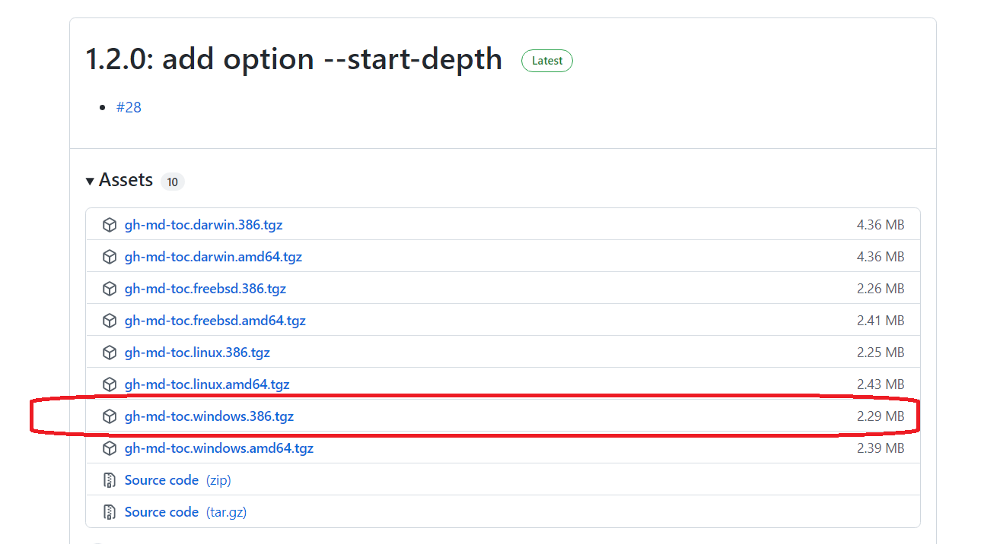
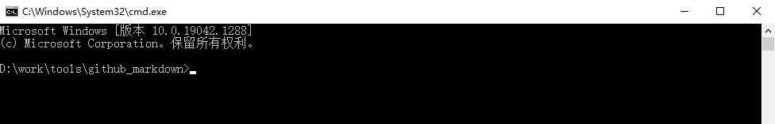
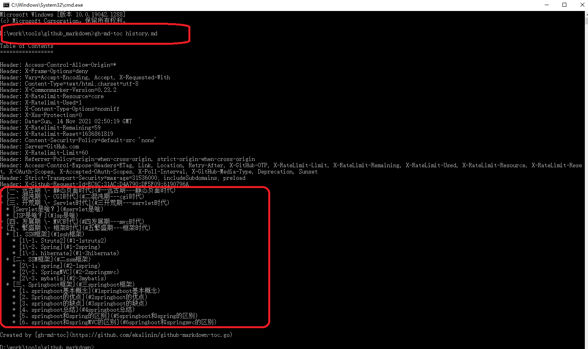

## 如何在github中创建目录

github下生成目录不太方便，多方搜索后，发现可以使用[gh-md-toc](https://github.com/ekalinin/github-markdown-toc)工具来实现生成目录。

## Windows 环境中如何使用

该工具在windows下面不太友好，但是提供了go语言的包，可以直接下载go语言的二进制文件，然后使用即可。

go语言的二进制包下面目录如下：

https://github.com/ekalinin/github-markdown-toc.go/releases

使用步骤：

* 1、 下载windows的压缩包

* 2、用解压工具解压缩windows工具包，得到一个文件

解压缩后目录下有一个名称为gh-md-toc的文件

将该文件添加后缀，重命名为：  gh-md-toc.exe

* 3、使用命令可以创建toc目录

在该工具所在的文件夹菜单输入框中输入cmd，打开powershell界面

输入
./gh-md-toc.exe README.md

* 4、将创建的toc目录复制到文档中

接下来只需将这段话复制粘贴到README.md里面即可。

## MacOS环境下如何使用

mac OS需要下载 dawin 和amd64的版本

GOOS=darwin GOARCH=amd64 go build -o  http -v ./main.go

安装 github-md-toc

从官网下载工具，并解压缩

tar zxvf gh-md-toc.linux.386.tgz -C ./

上述命令将该工具解压

$ chmod a+x gh-md-toc

上述命令给该工具添加执行权限

然后将需要生成的文件放入该目录中，即可生成目录

./gh-md-toc README.md

