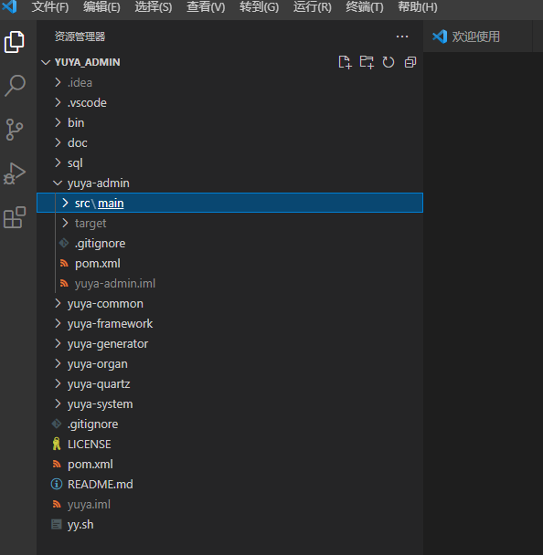
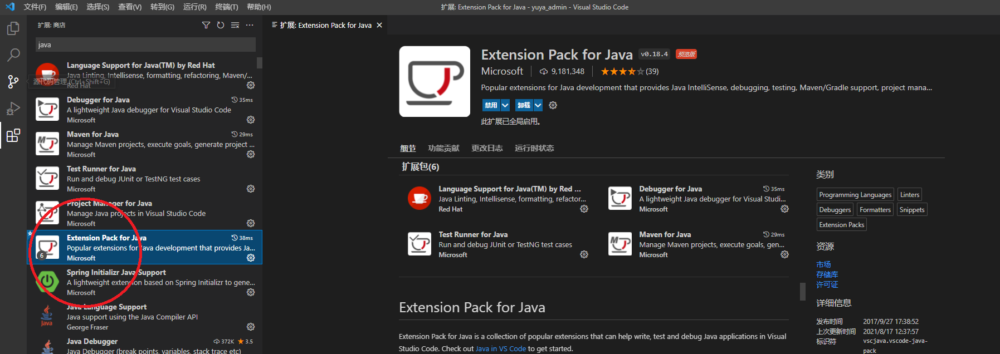
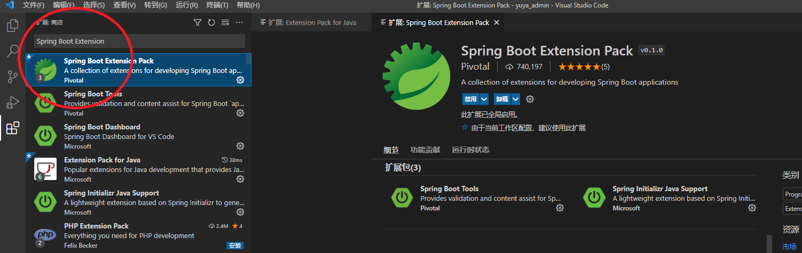
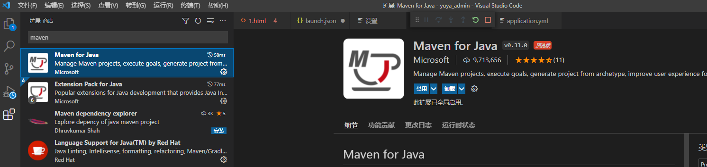
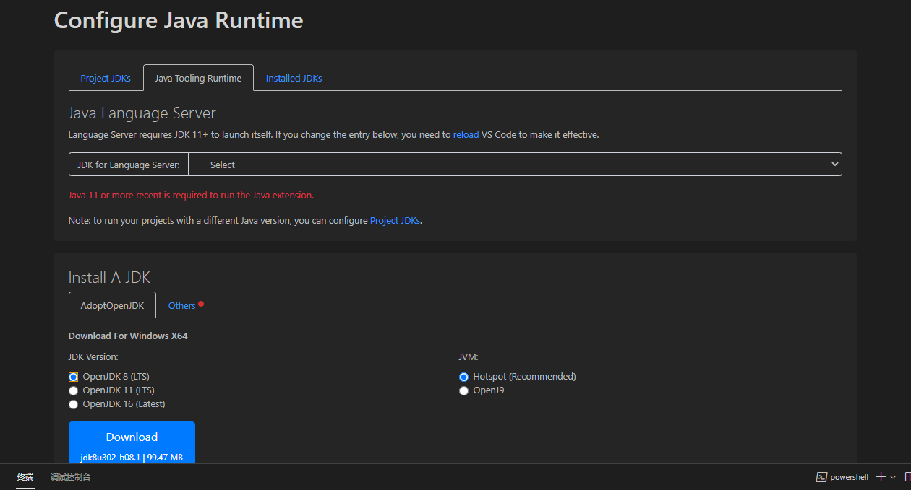

## 若依服务器文档信息
 
[若依服务器文档](http://doc.ruoyi.vip/ruoyi/)

## yuya后台管理系统的编译和运行

### VSCODE开发（前端开发工程师）

* **step1： 打开vscode，将yuya_admin目录导入**

* **step2：安装扩展**

用vscode编译项目，需要安装三个扩展：

* Java Extension Pack

* Spring Boot Extension

* maven for java

在 Visual Studio Code 中打开扩展视图(Ctrl+Shift+X)。

输入“java”搜索商店扩展插件。

找到并安装 Extension Pack for Java (Java 扩展包)，如果你已经安装了 Language Support for Java(TM) by Red Hat，也可以单独找到并安装 Java Debugger for Visual Studio Code 扩展。

输入“Spring Boot Extension”搜索商店扩展插件。

找到并安装 “Spring Boot Extension Pack”。安装过程中可能会比较慢，耐心等待即可。

最后，安装maven for java 扩展

* **step3：配置JDK**

如果没有安装和配置JDK，需要首先安装和配置JDK，然后将java路径配置到系统中。

（项目使用jdk1.8）

JDK安装和配置的教程参见：[jdk安装和配置教程](http://www.51gjie.com/java/43.html)

也可以在vscode的提示下安装JSDK，选择jdk1.8

step1： 用代码管理工具从服务器下载代码到本地。

step2： 在idea中打开yuya_admin目录，编译代码

如果出现下面图片，则育伢编译成功

step3： 本地打开http://localhost:8077,育伢后台启动成功。

## 项目配置：

yuya_admin/src/resources目录下的yml文件：

## 项目结构

